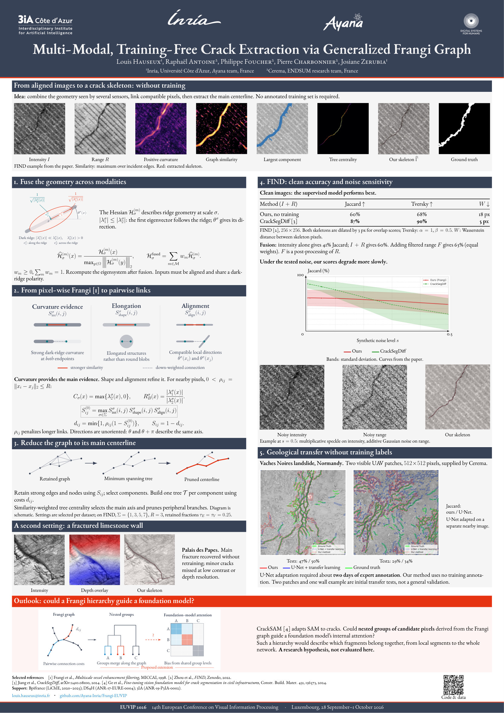

# Poster EUVIP 2026

[**PDF A0 portrait — prêt à imprimer**](Poster_EUVIP_2026_Hauseux_A0.pdf)
· [Source LaTeX](poster.tex)

[](Poster_EUVIP_2026_Hauseux_A0.pdf)

Poster en anglais, au format **841 × 1189 mm**, adapté du template Inria / 3IA /
DS4H fourni dans `../Template_beamer_Inria_Poster_NEO_team.zip`. Il conserve
la palette, les bandeaux et la typographie EB Garamond. Les logos Inria, Ayana,
3IA et DS4H viennent du template ; les auteurs et affiliations sont ceux du
papier final. Imprimer à **100 %**, sans ajustement à la page.

## Contenu et sources

Le contenu scientifique suit exclusivement [le papier final](../LaTeX/main.tex)
et sa [camera-ready](../EUVIP_2026_Generalized_Frangi_Multimodality_camera-ready.pdf).
Les illustrations montrent la fusion hessienne, les trois contraintes de la
similarité, la réduction du graphe, FIND propre/bruité et les cas géologiques.
Les images expérimentales sont copiées sans modification depuis `../LaTeX/`.
La courbe de bruit est celle du papier, avec des axes et une légende lisibles ;
les bandes représentent l'écart-type. Aucun résultat nouveau n'est ajouté.

Deux dessins vectoriels sont adaptés des TikZ de la soutenance de Louis Hauseux :

- [frangi-hessian.tex](figures/frangi-hessian.tex) reprend
  [`frangi_hessienne.tex`](https://github.com/Ludwig-H/Manuscrit-de-th-se/blob/8ddbae760c5a337c4e033c45e5f60c16ca58cc67/Soutenance/soutenance/figs/frangi_hessienne.tex).
- [frangi-terms.tex](figures/frangi-terms.tex) reprend
  [`frangi_termes.tex`](https://github.com/Ludwig-H/Manuscrit-de-th-se/blob/8ddbae760c5a337c4e033c45e5f60c16ca58cc67/Soutenance/soutenance/figs/frangi_termes.tex).

Les légendes sont traduites en anglais, avec les notations du papier. Les
connexions défavorables sont affaiblies, conformément aux pénalités souples.
Le petit schéma de réduction du graphe dans `poster.tex` est illustratif.
[foundation-hierarchy.tex](figures/foundation-hierarchy.tex) illustre uniquement
une perspective : construire des groupes emboîtés depuis le graphe Frangi pour
guider l'attention d'un modèle de fondation. CrackSAM adapte SAM ; aucun gain
de cette proposition hiérarchique n'est revendiqué.

## Consignes EUVIP vérifiées

Consultation le **5 septembre 2026** du [site EUVIP](https://euvip2026.github.io/),
du [programme](https://euvip2026.github.io/program/) et des
[instructions auteurs](https://euvip2026.github.io/information/paper-kit-guidelines/).
Aucune consigne publique spécifique à la taille ou à l'orientation des posters
n'a été trouvée. Le format A0 portrait suit donc la demande et le template
fourni. La consigne A4 du « Paper Kit » concerne les articles, pas les posters.

## Modifier et compiler

Dépendances : XeLaTeX, Beamer/beamerposter, TikZ, `qrcode`, `unicode-math`,
polices EB Garamond et Latin Modern. Sur Debian/Ubuntu :

```bash
sudo apt-get install texlive-xetex texlive-latex-extra texlive-fonts-recommended fonts-ebgaramond
cd EUVIP/poster
make
```

`make` recompile les trois TikZ, puis le poster en deux passes. Les fichiers
temporaires restent dans `build/`, ignoré par Git ; `make clean` les supprime.
Le PDF final et les PDF vectoriels sont conservés comme livrables du poster.
Contrôler après modification : une seule page A0, polices incorporées,
aucun débordement, légendes visibles et QR code lisible.

Livraison contrôlée : une page A0, toutes les polices incorporées, aucun
avertissement ni débordement LaTeX, QR code décodé vers le dépôt attendu,
revue visuelle de la page et des détails. Les images expérimentales sont
identiques octet par octet aux sources du papier.
