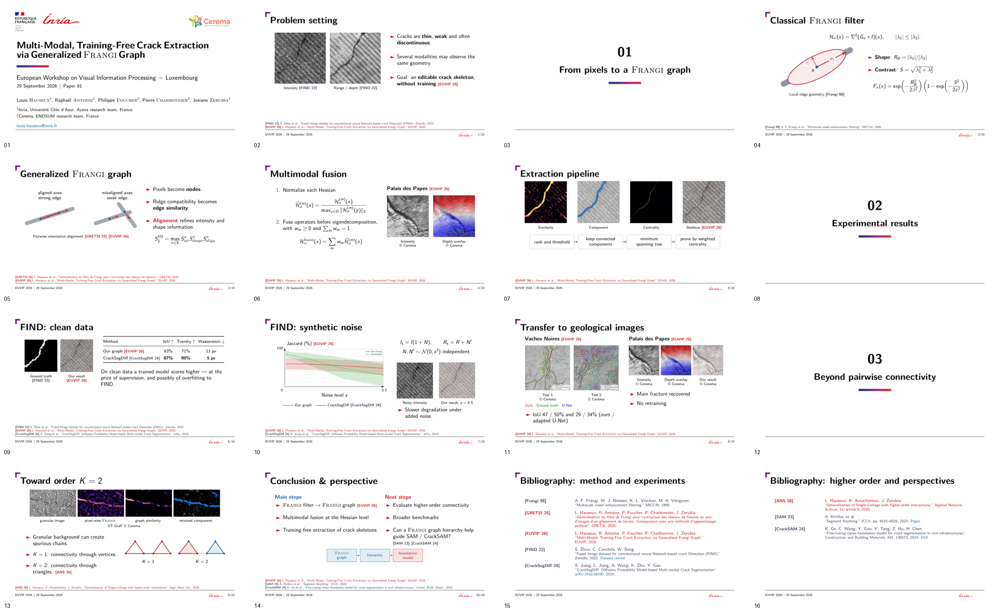

# EUVIP 2026 oral presentation

[**Presentation PDF**](Presentation_EUVIP_2026_Hauseux.pdf) · [Beamer source](main.tex)

[](Presentation_EUVIP_2026_Hauseux.pdf)

English, 16:9, **10 content slides**, plus the title, three section dividers and two bibliography pages: **16 PDF pages in total**. Prepared for the 10-minute oral presentation of paper 81, with 2 minutes of questions, on 29 September 2026.

## Content

1. Crack networks and the training-free extraction problem.
2. Hessian geometry and the classical Frangi filter.
3. Pairwise orientation alignment: the Frangi graph.
4. Multimodal fusion of normalized Hessians.
5. Graph reduction, minimum spanning trees and weighted centrality.
6. Clean FIND results and a separate modality ablation.
7. FIND under controlled synthetic noise.
8. Geological transfer: Vaches Noires and Palais des Papes.
9. Granular backgrounds and higher-order connectivity, K=2.
10. Conclusion and perspectives, including the open question of hierarchy-guided SAM/CrackSAM.

The scientific baseline is [the EUVIP camera-ready source](../LaTeX/main.tex). The Hessian, alignment and granular-background explanations follow slides 47–49 of the [thesis defense](https://github.com/Ludwig-H/Manuscrit-de-th-se/tree/3593fbf25434c4715b37537eae1287bf49239fa7/Soutenance/soutenance). The K=2 illustration is identified as an exploratory extension beyond the EUVIP experiments. Foundation-model guidance is a research question, not a measured improvement.

The main FIND comparison uses intensity + range for both methods. The result with intensity + range + filtered range is shown separately, not substituted into that comparison. Figures and numerical results are taken from the paper and poster, not regenerated experiments.

## Template and assets

The `theme/` folder is the Inria 2024 Beamer theme used for the defense. The Cerema mark is the vector artwork already used in [the poster](../poster/README.md): a local white adaptation of the Cerema website's SVG, not an official white variant. Its original paths are preserved in `assets/cerema-white.svg` and its vector PDF is used on the title slide. It replaces the provisional text-only cartouche of the earlier local draft.

Experimental images are copied unchanged from `EUVIP/LaTeX/`; the VT-GraF illustration comes from the defense and is credited to Cerema. `bootstrap_assets.py` can restore missing defense assets from the pinned commit above, checking their Git blob hashes. The build workflow commits those assets locally alongside the PDF, so the completed folder is self-contained. No font files are distributed; standard Latin Modern fonts are used.

## Build locally

Requires LuaLaTeX, latexmk, Beamer, TikZ, babel (English), lmodern and the LaTeX extra packages. Debian/Ubuntu packages:

```bash
sudo apt-get install latexmk texlive-luatex texlive-latex-extra texlive-fonts-recommended lmodern
cd EUVIP/presentation
make
```

The output is `Presentation_EUVIP_2026_Hauseux.pdf`. Auxiliary files stay in ignored `build/`. No shell escape is enabled.

Optional checks, page renders, overview and a complete source archive:

```bash
sudo apt-get install python3-fitz python3-pil
make check PYTHON=/usr/bin/python3
```

`verify.py` checks the page/slide counts, aspect ratio, missing glyphs and unresolved references. It reports box-overflow warnings and renders every page for visual inspection. The complete editable archive is written to `build/Presentation_EUVIP_2026_sources.zip`.

## GitHub build

[The dedicated workflow](../../.github/workflows/euvip-presentation.yml) builds changes to this presentation on `main` and can also be launched manually. It publishes only the generated presentation PDF, overview and restored presentation dependencies back to `main`, without force-pushing or creating a branch. If presentation sources changed during compilation, publication stops rather than replacing them with a stale build. The PDF, page renders, checks and source archive are also uploaded as a workflow artifact.

Paper/poster sources and research code are not modified by this workflow.
