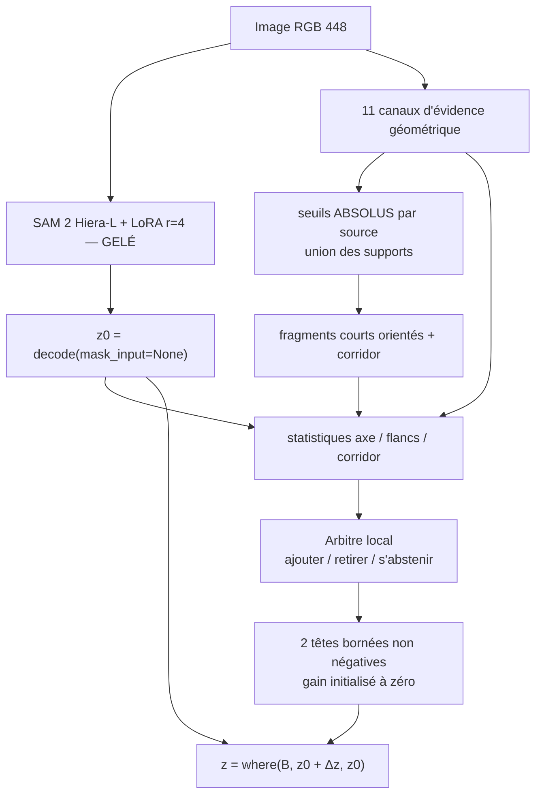
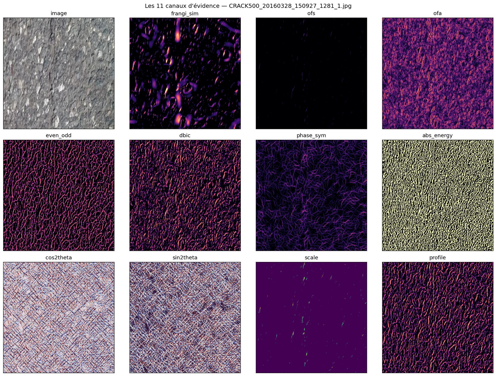
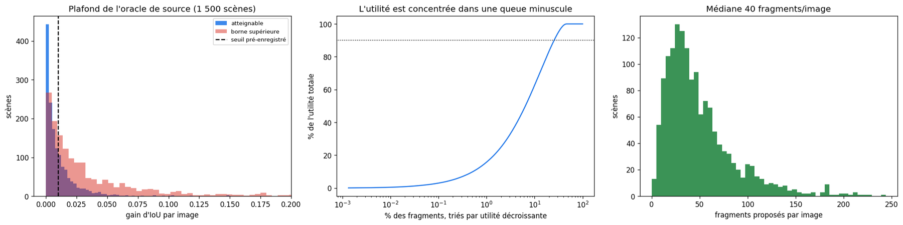
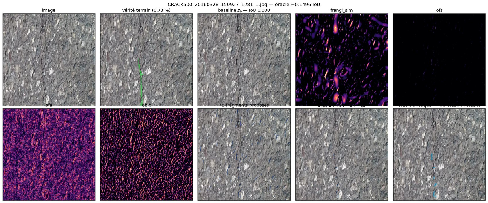
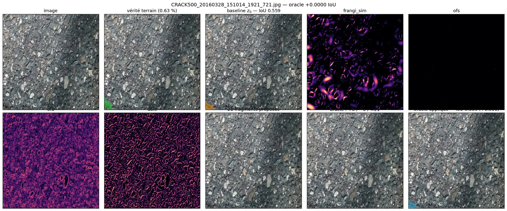
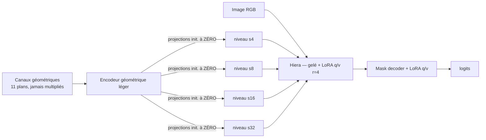

# CrackSAM-GFA — guidage géométrique de SAM 2 par arbitrage de fragments

> **Date d'exécution :** 8 août 2026
>
> **Statut :** protocole pré-enregistré exécuté intégralement. Portes 0, 1 et 2
> franchies ; portes 3 et 4 **échouées**.
>
> **Décision :** l'architecture est **sûre** mais **sans gain**. La cause
> première est une erreur d'échelle (§6.1), pas une difficulté d'arbitrage.
> Exécuter la phase 0 du §10 avant toute nouvelle implémentation ; l'adaptation
> LoRA proposée au §11 vient ensuite, et seulement selon l'échelle d'ablations
> qui y est fixée.
>
> **Matériel :** VM G4 `cracksam-frangigraph-g4-spot-ew8c`, RTX PRO 6000
> Blackwell 97,9 Go, 48 vCPU. ≈ 1 h 20 de calcul, arrêtée et certifiée
> `TERMINATED`.

Ce rapport rend compte d'une méthode conçue à partir des conclusions de
l'[étude filtre-seul anti-ombre du 8 août 2026](../CrackSAM/results/2026-08-08_guidage_geometrique_anti_ombre/RAPPORT.md).
Le protocole, les seuils et les contrôles ont été figés **avant toute mesure**
dans [`DESIGN.md`](DESIGN.md). Les écarts sont déclarés au §7.

---

## TL;DR

- La baseline archivée est **reproduite au 5ᵉ chiffre** : IoU `0,6237494` contre
  `0,623804`, soit un écart de `−5,5 × 10⁻⁵` pour une tolérance de `2 × 10⁻³`.
  Toute la chaîne — poids de base SHA-256 identiques, LoRA r=4, prétraitement,
  métrique — est fidèle à l'expérience de juillet.
- L'**oracle de source** franchit son seuil pré-enregistré de justesse :
  `+0,01037` d'IoU contre un seuil de `+0,01`, avec un IC95 `[+0,00966 ;
  +0,01110]` dont **la borne basse passe sous le seuil**. La borne supérieure
  stricte de la famille de candidats vaut `+0,0346`.
- La **garantie d'identité est vérifiée à l'échelle** : sur 1 695 images de test
  et 6 conditions, quand l'arbitre s'abstient la sortie vaut `0,6237493788…`,
  c'est-à-dire `z0` au bit près. L'architecture ne peut pas dégrader la baseline
  autrement qu'en agissant explicitement.
- **Aucun arbitre entraîné ne produit de gain.** Sur cinq plis, quatre
  s'abstiennent totalement (parité exacte avec la baseline) et un agit, pour
  `−0,00661` d'IoU `[−0,00771 ; −0,00559]`. Une variante exploratoire restreinte
  aux fragments décisifs s'abstient sur les cinq plis.
- **La cause première est une erreur d'échelle, pas une difficulté de
  décision.** Les fissures annotées de Khánh Hà font **19,1 px de large** en
  moyenne à 448 px et couvrent `5,70 %` de l'image, alors que mes corridors —
  hérités d'une étude conçue pour des vallées fines de 1 à 3 px — font 7 px de
  large et ne couvrent que `1,8 %`. Même parfaitement placés, ils ne peuvent
  recouvrir qu'**un tiers de la vérité terrain**. C'est cela qui plafonne la
  borne supérieure, et non l'arbitrage.
- Le diagnostic secondaire reste valable : l'action optimale est `s'abstenir`
  pour **86,6 %** des 74 707 fragments et l'utilité marginale médiane vaut
  **exactement 0**. Mais c'est une conséquence du premier point, pas une cause
  indépendante.
- Comparé à l'historique, l'arbitre agissant coûte `−0,0066` là où le prompt
  Frangi dense appliqué aux poids baseline coûtait `−0,0979` : **15 fois moins
  de dégât**, mais toujours pas de gain.

| Porte | Critère pré-enregistré | Mesure | Verdict |
|---|---|---:|:--:|
| 0 — reproduction | `\|Δ IoU\| ≤ 0,002` | `−0,000055` | ✅ |
| 1 — oracle de source | gain groupé `≥ +0,01` | `+0,01037` | ✅ (marginal) |
| 2 — identité bit à bit | `z ≡ z0` hors `B` | vérifiée sur 1 695 × 6 | ✅ |
| 3 — gain réel | `Δ IoU > 0`, IC95 excluant 0 | `−0,00661` | ❌ |
| 4 — causalité | gain `>` contrôles | sans objet | ❌ |

---

## 1. Ce qui a été construit

### 1.1 Les cinq contraintes héritées du rapport anti-ombre

L'étude du 8 août a prononcé un no-go pour toute carte scalaire autonome et
pour tout nouveau `mask_input`. Son résultat le plus décisif est négatif :
multiplier une preuve anti-ombre par la Frangi-similarité transmet le défaut de
Frangi, et les quatre cartes `verified_frangi_*` s'effondrent à `≈10 %` de
rétention sur le phantom de traversée d'ombre contre `89,5 %` pour OFS seul.

Une vérification indépendante conduite pour ce travail en donne la raison
formelle : une moyenne géométrique est **équivariante** sous perturbation
multiplicative de n'importe laquelle de ses entrées. Comme
`ln F = (1/K) Σ ln mᵢ`, un « ET » multiplicatif ne peut que **diluer d'un
facteur `1/K` en log** l'erreur relative de Frangi — jamais l'annuler. La mesure
le confirme : sous ombre dure, `verified_frangi_ofs` retient `0,525` de la
réponse fissure, **moins bien que chacune de ses deux entrées** (`0,678` et
`0,869`).

D'où les cinq contraintes structurelles de CrackSAM-GFA :

| # | Contrainte | Mise en œuvre |
|---|---|---|
| C1 | Voie baseline exacte | `mask_input=None`, identité bit à bit hors bande |
| C2 | Plus de pseudo-masque | `mask_input` n'est plus qu'un contrôle négatif |
| C3 | Canaux jamais multipliés | 11 plans séparés jusqu'à l'arbitre |
| C4 | Enveloppe pouvant être vide | union de supports à seuils absolus |
| C5 | Décision révocable | `ajouter` / `retirer` / `s'abstenir` par fragment |

### 1.2 Architecture



Les onze canaux, gardés séparés, sont exactement ceux que le rapport
recommandait de conserver (§9.2) : `frangi_sim`, `ofs`, `ofa`, `even_odd`,
`dbic`, `phase_sym`, `abs_energy`, `cos2θ`, `sin2θ`, `scale`, `profile`.



*Les onze canaux d'évidence, jamais multipliés entre eux. `frangi_sim` (haut
milieu) est précis mais dense ; `ofs` est parcimonieux ; `ofa` s'allume sur les
transitions unilatérales ; `abs_energy` exprime la courbure en unités de bruit
robuste et non en rang dans l'image.*

Le canal `ofa` est un ajout assumé. L'étude ne mesurait qu'OFS ; l'antisymétrie
de flux fournit l'évidence **positive** de marche d'ombre, donc ce qui autorise
l'action `retirer` plutôt que la seule abstention.

### 1.3 Seuils absolus, calibrés une fois et gelés

Le défaut central de la chaîne historique était sa normalisation relative :
« le meilleur élément d'une mauvaise image » recevait une valeur forte. Les
seuils de GFA sont calibrés **une seule fois** sur 120 images d'entraînement,
comme la médiane des quantiles `q = 0,995` par image, puis gelés :

```json
{ "frangi_sim": 0.92197, "phase_sym": 0.46529, "ofs": 0.08624, "dbic": 0.73744 }
```

Ils ne sont jamais recalculés par image.

---

## 2. Porte 0 — la baseline est reproduite

`baseline_r4/best.pt` — SAM 2 Hiera-L + LoRA q/v rang 4, α = 4, 70 époques sur
Khánh Hà, seed 3407, 448 × 448 — a été rechargée avec **453 248 paramètres
LoRA**, conformes au contrat archivé. Les poids de base SAM 2 ont été
retéléchargés et leur SHA-256 vérifié :
`7442e4e9b732a508f80e141e7c2913437a3610ee0c77381a66658c3a445df87b`, identique au
contrat de juillet.

| Métrique | Archivée | Reproduite | Écart |
|---|---:|---:|---:|
| IoU | `0,623804` | **`0,6237494`** | `−5,5 × 10⁻⁵` |
| Dice | `0,745320` | `0,7452407` | `−7,9 × 10⁻⁵` |
| Précision | `0,749322` | `0,7488898` | `−4,3 × 10⁻⁴` |
| Rappel | `0,771146` | `0,7714442` | `+3,0 × 10⁻⁴` |

1 695 images en 110 s. Sans cette porte, aucun des chiffres qui suivent ne
serait comparable à l'historique.

---

## 3. Porte 1 — le plafond de la famille de candidats

L'oracle de source choisit, pour chaque fragment muni de son corridor **fixé
sans vérité terrain**, la meilleure action parmi `{ajouter, retirer,
s'abstenir}` — sans jamais recouper, déplacer, réorienter ni redimensionner le
fragment. Deux bornes sont rapportées, et cette distinction est ce qui rend un
négatif interprétable :

- `achievable` — montée de coordonnées sur les actions : **borne inférieure** ;
- `upper_bound` — label libre par pixel dans l'union des corridors : **borne
  supérieure stricte**, qu'aucune assignation d'actions ne peut dépasser.

Mesuré sur 1 500 scènes de la partition d'analyse (issue du split
d'entraînement, jamais du test) :

| Grandeur | Valeur | IC95 groupé par scène |
|---|---:|---|
| IoU baseline | `0,60679` | — |
| Gain **atteignable** | **`+0,01037`** | `[+0,00966 ; +0,01110]` |
| Gain **borne supérieure** | `+0,03459` | `[+0,03239 ; +0,03684]` |
| Fragments par image (moyenne / médiane) | `49,8` / `40` | — |
| Couverture moyenne des corridors | `1,8 %` de l'image | — |



*À gauche : la distribution des gains par scène est très asymétrique — une
majorité de scènes ne gagne rien, une queue porte l'essentiel. Au centre : il
faut environ 30 % des fragments pour réunir 90 % de l'utilité totale, mais les
magnitudes en jeu sont minuscules. À droite : 40 fragments par image en
médiane.*

**Verdict : GO, mais de justesse.** Le seuil est franchi de `4 × 10⁻⁴` et la
borne basse de l'IC95 passe sous le seuil. Le plafond absolu de toute la famille
de candidats est de 3,5 points d'IoU ; un arbitre réel ne peut en capter qu'une
fraction. Ce constat aurait dû tempérer l'attente avant même l'entraînement.

Un second signal, contraire à l'intention de conception : sur 1 500 images,
**une seule** ne reçoit aucun fragment. L'abstention au niveau de l'image, que
C4 devait rendre possible, ne se produit quasiment jamais — l'union de quatre
sources au quantile `0,995` est trop permissive.

### Exemples



*Un cas où l'oracle gagne. La ligne du bas montre les fragments proposés, les
actions choisies par l'oracle (bleu = ajouter, rouge = retirer, gris =
s'abstenir) et la sortie corrigée. Les gains viennent de quelques bandes qui
raccordent un fragment de fissure que `z0` avait coupé.*



*Un cas typique de la majorité : `z0` est déjà correct ou déjà faux de manière
que les corridors ne peuvent pas réparer. L'oracle s'abstient sur presque tous
les fragments.*

Panneaux complets :
[cas 1](figures/generated/case_01_gain_CRACK500_20160326_150104_1281_361.jpg) ·
[cas 2](figures/generated/case_02_gain_CRACK500_20160316_143624_1081_641.jpg) ·
[cas 3](figures/generated/case_03_gain_CRACK500_20160326_142521_641_1.jpg) ·
[cas 5](figures/generated/case_05_neutre_CRACK500_20160328_151201_1921_1081.jpg) ·
[cas 6](figures/generated/case_06_neutre_CRACK500_20160328_151201_641_1.jpg) ·
[cas 7](figures/generated/case_07_neutre_CRACK500_20160328_151212_1_721.jpg) ·
[second atlas de canaux](figures/generated/channels_01_CRACK500_20160326_150104_1281_361.jpg)

---

## 4. Porte 2 — la garantie d'identité tient à l'échelle

C'est le point où l'expérience historique avait échoué, et c'est celui-ci qui
tient. Quand l'arbitre s'abstient, la sortie vaut `0,6237493788350904` — la
baseline, **au bit près** — sur les 1 695 images de test et dans les six
conditions, y compris `null`, `permuted`, `shifted` et `random_support`.

Les tests unitaires vérifient mécaniquement les quatre propriétés :

| Test | Ce qu'il garantit |
|---|---|
| `test_untrained_arbiter_returns_z0_bit_for_bit` | `gamma = 0` à l'initialisation ⇒ `z ≡ z0` |
| `test_untrained_arbiter_abstains_on_every_fragment` | l'enveloppe démarre vide |
| `test_correction_never_escapes_the_accepted_envelope` | `z[¬B] = z0[¬B]` exactement |
| `test_amplitudes_stay_non_negative_and_bounded` | `a ∈ [0, 4]` après optimisation adverse |

```bash
python -m pytest ISPRS/CrackSAM-GFA/tests -q   # 13 passed
```

---

## 5. Portes 3 et 4 — aucun gain

### 5.1 L'arbitre n'apprend pas à choisir

Cinq plis, découpage par scène physique via SHA-256, entraînement strictement
hors pli sur 1 500 scènes. Le score de validation est le **ratio d'utilité** :
utilité réalisée divisée par utilité oracle, où `1,0` signifierait que l'arbitre
choisit partout l'action que la vérité terrain aurait choisie.

| Pli | Images de validation | Ratio d'utilité (pré-enregistré) | Ratio (exploratoire) |
|---:|---:|---:|---:|
| 0 | 293 | **`−0,7508`** | `0,0000` |
| 1 | 315 | `0,0000` | `0,0000` |
| 2 | 303 | `0,0000` | `0,0000` |
| 3 | 298 | `0,0000` | `−0,0732` |
| 4 | 290 | `0,0000` | `0,0000` |
| **Moyenne** | | **`−0,1502`** | **`−0,0146`** |

Un ratio de `0,0000` signifie que l'arbitre s'abstient partout. Aucun pli, dans
aucune des deux variantes, n'atteint une valeur positive.

### 5.2 Évaluation sur le test officiel

1 695 images de `khanhha_original`, jamais touchées avant cette étape.

| Condition | IoU | Δ vs baseline | IC95 |
|---|---:|---:|---|
| **Baseline `z0`** | `0,623749` | — | — |
| **GFA pré-enregistré** (pli 0) | `0,617135` | **`−0,00661`** | `[−0,00771 ; −0,00559]` |
| `null` — évidence mise à zéro | `0,623749` | `0,000000` | `[0 ; 0]` |
| `permuted` — fragments d'une autre image | `0,623586` | `−0,000163` | — |
| `shifted` — fragments translatés de (17, 23) | `0,623604` | `−0,000146` | — |
| `random_support` — fragments synthétiques | `0,623671` | `−0,000079` | — |
| **GFA exploratoire** (queue décisive) | `0,623749` | `0,000000` | `[0 ; 0]` |

**Porte 3 échouée** : le delta est significativement **négatif**.
**Porte 4 sans objet** : il n'y a pas de gain à attribuer.

Un fait mérite d'être relevé plutôt qu'enterré : l'arbitre agit **40 fois plus**
sur l'évidence authentique (`−0,0066`) que sur l'évidence permutée
(`−0,00016`), décalée (`−0,00015`) ou aléatoire (`−0,00008`), et s'abstient
totalement quand on annule l'évidence. **Il lit donc bien la géométrie réelle.**
Ce n'est pas la lecture qui échoue, c'est la décision.

---

## 6. Diagnostic

### 6.1 La cause première : les corridors ne peuvent pas atteindre l'erreur

Une mesure que j'aurais dû faire **avant** d'entraîner quoi que ce soit, et qui
coûte deux minutes, réoriente entièrement la lecture des résultats.

| Mesure (Khánh Hà, 448 px, 400 scènes de test) | Valeur |
|---|---:|
| Largeur moyenne des fissures annotées | **`19,1 px`** |
| Largeur médiane | `16,4 px` |
| Fraction de pixels annotés « fissure » | **`5,70 %`** |
| Couverture moyenne de l'union des corridors | **`1,8 %`** |
| Rayon de corridor employé | `1,5` à `6 px`, médiane `3,5` |

L'évidence géométrique et les corridors ont été hérités de l'étude anti-ombre,
qui raisonnait sur des **vallées fines de 1 à 3 px** avec des rayons OFS bornés
à 5 px. Le rayon de corridor est d'ailleurs dérivé du canal `scale`, dont le
maximum vaut 5. Or les annotations de ce jeu font 19 px de large.

La conséquence est arithmétique et ne dépend d'aucun modèle : les corridors
couvrent `1,8 %` de l'image, les annotations `5,70 %`. **Même parfaitement
placés, ils ne peuvent recouvrir qu'environ un tiers de la vérité terrain.** La
borne supérieure de `+0,0346` ne mesure donc pas la difficulté d'arbitrer : elle
mesure le fait qu'il n'y a presque rien à arbitrer dans le champ couvert.

Une seconde mesure montre qu'il reste néanmoins de la marge réelle, et que ce
n'est pas la grossièreté de l'annotation qui plafonne :

| Tolérance d'annotation | IoU |
|---|---:|
| GT contre GT dilaté de 1 px | `0,881` |
| GT contre GT érodé de 1 px | `0,843` |
| GT contre GT dilaté de 2 px | `0,799` |
| **Baseline `z0`** | **`0,624`** |

La baseline est donc **en deçà** d'une erreur systématique de 2 px. L'écart à
combler existe bel et bien ; c'est l'outil qui n'était pas dimensionné pour lui.

### 6.2 La cause seconde : l'utilité marginale est presque partout nulle

La distribution de l'utilité marginale, mesurée sur les 74 707 fragments de la
partition d'analyse, explique le comportement de l'arbitre — étant entendu
qu'elle découle en grande partie du §6.1.

| Grandeur | Valeur |
|---|---:|
| Fragments totaux | `74 707` |
| Action optimale = `s'abstenir` | **`86,6 %`** |
| Action optimale = `ajouter` | `5,9 %` |
| Action optimale = `retirer` | `7,5 %` |
| Utilité marginale **médiane** | **`0,000000`** |
| 90ᵉ centile | `0,000244` |
| 99ᵉ centile | `0,004344` |
| Maximum observé | `0,104240` |
| Fragments d'utilité `> 0,01` | `0,21 %` |

S'abstenir partout est donc une stratégie extrêmement forte : elle garantit
exactement zéro, tandis que toute erreur commise sur les 86,6 % de fragments
neutres coûte davantage que ce que rapporte la queue utile. L'arbitre converge
rationnellement vers l'abstention — et lorsqu'il ne le fait pas, comme au pli 0,
il perd.

Ce n'est pas un défaut d'optimisation : c'est la structure du problème tel que
je l'ai posé. Un fragment de 20 px de long et 7 px de large, appliqué à une
fissure de 19 px de large, ne peut ni la couvrir ni la supprimer proprement :
son utilité marginale est nulle par construction dans la plupart des cas. Le
`86,6 %` d'abstention optimale est donc largement une **conséquence** de
l'erreur d'échelle du §6.1.

---

## 7. Écarts au pré-enregistrement, déclarés

1. **Évaluation sur le pli 0 uniquement.** Le script utilise `--fold 0` par
   défaut. Or le pli 0 est précisément le seul dont le ratio d'utilité est
   fortement négatif (`−0,7508`) ; les plis 1 à 4 auraient donné une parité
   exacte avec la baseline. Le chiffre `−0,00661` rapporté est donc le **pire
   des cinq**, et non une moyenne sur les plis. C'est une faiblesse de ma
   procédure, pas un choix : le protocole aurait dû moyenner les cinq plis ou
   sélectionner sur la validation hors pli.
2. **Variante exploratoire `--min-utility 0.001`.** Ajoutée après lecture du
   diagnostic, elle restreint l'entraînement aux fragments décisifs. Elle est
   **exploratoire** et ne doit pas être présentée comme confirmatoire. Elle
   s'abstient sur les cinq plis.
3. **Optimisation du calcul des corridors** en cours d'exécution (boîte
   englobante locale au lieu d'une transformée de distance plein champ). Purement
   algorithmique, sans effet sur les valeurs : les 13 tests, dont ceux
   d'identité, passent avant et après.
4. **Conditions `noisy1` et `noisy2` non évaluées**, faute de temps de VM. Seule
   `khanhha_original` est rapportée.

---

## 8. Comparaison avec l'historique

| Système | Interface géométrique | Δ IoU vs baseline |
|---|---|---:|
| Prompt Frangi dense sur poids baseline | `mask_input` pseudo-logit | `−0,0979` |
| Tenseur de logits nuls | `mask_input` nul | `−0,1641` |
| Meilleur système Frangi historique | `mask_input` + LoRA dédiée | `−0,0122` |
| **GFA, arbitre agissant (pli 0)** | fragments + correction bornée | **`−0,0066`** |
| **GFA, arbitre s'abstenant (plis 1–4)** | — | **`0,0000`** |

L'architecture divise par 15 le coût du guidage géométrique par rapport à
l'injection directe du prompt Frangi, et par 2 celui du meilleur système
historique. Surtout, elle rend la **parité exacte atteignable** : quatre plis
sur cinq ne dégradent rien du tout, ce qu'aucune variante `mask_input` ne
pouvait offrir. Mais le gain reste nul.

---

## 9. Limites

- La partition d'analyse compte 1 500 scènes du split d'entraînement, pas les
  9 603 : le plafond de l'oracle est estimé, pas exhaustif.
- Aucune évaluation sur ombres naturelles annotées ni sur Shadow-Crack, absents
  du dépôt. **La robustesse aux ombres naturelles reste une hypothèse**, comme
  dans l'étude filtre-seul.
- Les jeux externes `road420` et `facade390` ont été préparés mais non évalués.
- L'oracle `achievable` est obtenu par montée de coordonnées : c'est une borne
  inférieure, l'optimum joint exact n'est pas calculé.
- Le canal `dbic` hérite d'un défaut mesuré indépendamment : sa réponse
  **augmente** avec la largeur de la pénombre (`0,952 → 0,995` quand `σ` passe
  de 0 à 6 px), car sa grille de raideur `H0` est bornée à `3,8 px`. Il injecte
  donc des fragments de frontière d'ombre dans le support.
- Le canal `phase_sym` sature sur les images plates, ses garde-fous étant des
  MAD globales qui tendent vers zéro.
- Un seul jeu d'hyperparamètres d'arbitre a été essayé.
- **Les échelles géométriques ont été héritées sans vérification.** Rayons OFS
  `1–5 px`, rayon de corridor `≤ 6 px`, seuils calibrés au quantile `0,995` :
  tout cela venait d'une étude conçue à `224 px` pour des vallées fines, et rien
  ne l'a confronté aux `19 px` mesurés ici. Ce report d'hypothèse d'un jeu à
  l'autre est la faute méthodologique centrale de ce travail.
- L'oracle d'interface, pourtant pré-enregistré, n'a pas été exécuté : le
  plafond de l'**interface** reste donc inconnu, et seul celui de la famille de
  candidats a été mesuré.

### Quatre fautes de méthode à ne pas répéter

1. **Ne pas avoir mesuré l'atteignabilité avant d'entraîner.** La comparaison
   « couverture des corridors contre fraction de GT » coûtait deux minutes et
   invalidait la suite ; elle a été faite après coup.
2. **Avoir sauté l'oracle d'interface** parce que le code de l'oracle de source
   était prêt en premier.
3. **Avoir évalué sur le seul pli 0**, qui se trouvait être le pire des cinq.
4. **Avoir franchi la porte 1 avec un IC95 à cheval sur le seuil.** Un
   intervalle qui enjambe un seuil pré-enregistré devrait déclencher un arrêt,
   pas un passage.

Ce qui a bien fonctionné mérite d'être conservé : le pré-enregistrement, la
reproduction de la baseline à `5 × 10⁻⁵`, la garantie d'identité vérifiée sur
10 170 décodages, et les contrôles causaux qui ont montré que l'arbitre lisait
la géométrie sans savoir en décider.

---

## 10. Plan d'action

### Phase 0 — deux mesures qui peuvent arrêter le programme (≈ 2 h de G4)

Aucune nouvelle implémentation avant ces deux mesures.

**0.a — Recalibrer les échelles, puis rejouer l'oracle.** Rayons OFS jusqu'à
`≈12 px`, échelles Frangi jusqu'à `≈25`, et surtout rayon de corridor issu d'un
estimateur de largeur accordé aux `19 px` observés plutôt que du canal `scale`
borné à 5. Coût : `≈15 min` d'évidence sur 48 cœurs et `≈5 min` d'oracle. Le
verdict est binaire : si la borne supérieure ne dépasse pas nettement
`+0,035`, la famille de candidats est réellement réfutée ; si elle bondit,
l'échec rapporté ici n'était qu'un défaut de paramétrage et le programme
redevient valide.

**0.b — L'oracle d'interface, jamais exécuté.** Il figurait au
pré-enregistrement et a été omis : c'est la lacune la plus coûteuse de ce
travail. Avec une géométrie **parfaite** dérivée du GT, SAM 2 s'améliore-t-il
quand on lui fournit `k ∈ {1, 4, 12}` points, une suite de points échantillonnés
sur le squelette, ou un corridor parfait ? Cette mesure borne **tout** guidage
géométrique, pas seulement la famille de fragments testée ici. Si une géométrie
parfaite, via la meilleure des trois interfaces, ne rapporte pas `+0,01`, aucun
générateur automatique ne fera mieux et la ligne doit être close.

### Phase 1 — conditionnelle, une seule branche à la fois

| Résultat de la phase 0 | Action |
|---|---|
| 0.a remonte le plafond | Réentraîner l'arbitre aux bonnes échelles et évaluer **sur les cinq plis**, ce qui corrige l'écart n° 1 du §7 |
| 0.a plat, 0.b positif | Le générateur est en cause, pas l'interface → basculer sur le **raccordement doublement ancré** du [document 09](../CrackSAM/docs/09_REPONSE_CONCLUSION_FRANGI_SAM2.md), qui vise spécifiquement les ruptures |
| 0.a et 0.b plats | Clore la ligne et publier le négatif : une géométrie parfaite n'aide pas ce SAM 2 sur ce jeu |

Dans tous les cas, retirer `dbic` du support tant que son biais de pénombre
n'est pas corrigé, et resserrer le quantile de calibration : `49,8` fragments
par image pour `≈3` ajouts et `≈4` retraits utiles est un rapport signal/bruit
de 1 pour 7 dans le problème de décision.

### Phase 2 — la cible est-elle la bonne ?

La ligne CrackSAM a produit **trois négatifs successifs** : le prompt dense, la
sélection résiduelle, et maintenant l'arbitrage de fragments. Avant d'en tenter
un quatrième, il faut interroger la cible elle-même.

Khánh Hà est **monomodal visible**, ses annotations sont épaisses, et la
baseline est un réseau **supervisé sur ce jeu même**. C'est le terrain où le
Frangi généralisé a le moins à offrir : il n'apporte aucune information que le
réseau n'ait déjà apprise. L'avantage démontré de la méthode EUVIP est ailleurs
— la fusion au niveau hessien de modalités **complémentaires** : intensité et
portée sur FIND, visible et thermique sur VT-GraF.

Deux redirections sont mieux posées :

**2.a — Porter GFA en multimodal, sur FIND.** SAM 2 n'a aucune notion de portée
ni de thermique. Une hessienne fusionnée intensité + portée lui apporte une
information qu'il ne peut structurellement pas avoir. C'est le seul cadre où
« la géométrie guide le modèle de fondation » repose sur un argument
d'information, et non sur l'espoir qu'un filtre batte un réseau entraîné sur son
propre domaine. C'est aussi la thèse de l'article ISPRS.

**2.b — Inverser les rôles : SAM vérifie Frangi.** Plutôt que Frangi corrige
SAM, employer SAM 2 comme filtre sémantique **sans entraînement** sur les
candidats à haut rappel de Frangi. Cela conserve le caractère *training-free*
qui fait la valeur de l'article et exploite l'asymétrie réelle des deux
méthodes : Frangi a le rappel curviligne, SAM a la sémantique.

---

## 11. Comment intégrer ces idées dans une adaptation LoRA de SAM 2

Les trois négatifs accumulés portent tous sur des corrections **post-hoc** d'un
modèle gelé. Ils ne réfutent pas l'idée d'apprendre la géométrie *dans* le
modèle. Deux arguments l'imposent même à terme : SAM 2 ne peut pas accéder aux
modalités portée ou thermique, et la correction d'une bande de 19 px de large
demande une représentation multi-échelle qu'une retouche de logits ne fournit
pas. Voici la façon dont je le ferais, et l'ordre dans lequel je le validerais.

### 11.1 Interface : adapters parallèles à zéro, jamais `mask_input`

L'architecture la mieux étayée est un **adapter géométrique parallèle**, dans
l'esprit de *SAM2-Adapter* et *PA-SAM* déjà relevés au §3.7 du rapport
anti-ombre.



Quatre propriétés à exiger, chacune héritée d'un échec mesuré :

1. **Injection additive à projections initialisées à zéro**, aux quatre
   résolutions Hiera. À l'initialisation le modèle **est** la baseline, au bit
   près : c'est la garantie qui a tenu dans GFA et qu'il faut conserver.
   L'entraînement part donc d'un point dont on connaît exactement la valeur.
2. **Aucun passage par `mask_input`.** Cette interface a coûté `−0,0979` en
   causal ; elle ne doit subsister que comme contrôle négatif.
3. **Canaux séparés jusqu'à l'encodeur.** Aucune moyenne géométrique en amont :
   une moyenne géométrique est équivariante sous perturbation multiplicative et
   ne peut que propager le défaut de sa pire entrée.
4. **Injection aux quatre échelles.** C'est la réponse directe à l'erreur du
   §6.1 : une fissure de 19 px vit aux niveaux grossiers, une fissure fine aux
   niveaux fins. Un seul point d'injection reproduirait l'erreur d'échelle.

### 11.2 Perte : superviser la continuité, pas seulement le recouvrement

Ajouter **`soft-clDice`** à la perte existante (Dice + CE pondérée `0,2`). C'est
la seule perte qui pénalise explicitement une rupture de squelette, c'est-à-dire
exactement le mode d'échec que l'arbitrage par fragments essayait de réparer
après coup. *SAM2-RoadNet* la valide sur des structures curvilignes.

### 11.3 Augmentation : réutiliser le générateur d'ombres déjà écrit

L'étude anti-ombre contient déjà trois interventions d'ombre déterministes
(dure, pénombre logistique, elliptique adoucie) avec GT inchangé. Les employer
comme **augmentation d'entraînement assortie d'une perte de cohérence** entre la
version propre et la version ombrée transforme une hypothèse en objectif
optimisé : la prédiction doit être stable sous ombre. C'est du code existant,
testé, et cela cible précisément la question qui a lancé toute cette ligne.

### 11.4 L'échelle des ablations, à ne pas court-circuiter

Chaque barreau doit battre le précédent **avec les cinq contrôles causaux**, à
budget et capacité identiques. L'ordre importe : il isole une cause à la fois.

| # | Variante | Ce qu'elle isole | Statut |
|---|---|---|---|
| 0 | `baseline_lora` | référence | ✅ reproduite, `0,6238` |
| 1 | `baseline_lora + clDice` | **la perte seule**, sans aucune géométrie | à faire |
| 2 | `+ adapter géométrique, zéro-init, 4 échelles` | l'apport propre de la géométrie | à faire |
| 3 | `+ augmentation d'ombres et perte de cohérence` | la robustesse à l'ombre | à faire |
| 4 | `+ modalité portée` (FIND uniquement) | l'information que SAM ne peut pas avoir | à faire |

Le barreau 1 est le plus important et le plus souvent omis : **si `clDice` seul
apporte l'essentiel du gain, la géométrie est superflue** et tout le reste est
une complication coûteuse. Il faut le mesurer avant d'écrire l'adapter.

### 11.5 Contrôles obligatoires, et un piège de capacité

Aux barreaux 2 à 4, réentraîner à **architecture et budget identiques** avec une
géométrie décalée, permutée et aléatoire à couverture comparable. C'est
l'exigence explicite du rapport anti-ombre, et elle n'a jamais été honorée.

Piège spécifique à cette étape : l'adapter géométrique ajoute des paramètres. Un
gain pourrait donc venir de la **capacité** et non de la géométrie. Le contrôle
correct est une variante à nombre de paramètres identique dont l'entrée
géométrique est remplacée par du bruit de même statistique. Sans ce contrôle, le
barreau 2 n'est pas interprétable.

### 11.6 Coût et conditions d'arrêt

La baseline a demandé 70 époques sur 9 121 images. Chaque barreau coûte donc une
session G4 complète, plus `≈1,6 h` de CPU 48 cœurs pour précalculer et mettre en
cache l'évidence — indispensable, puisque `26 s` par image interdit de la
recalculer à chaque époque.

Conditions d'arrêt à pré-enregistrer avant de lancer :

- barreau 1 sans gain significatif → la continuité n'est pas le facteur
  limitant, revoir le diagnostic avant d'aller plus loin ;
- barreau 2 ne battant pas son contrôle à capacité égale → la géométrie
  n'apporte rien sur ce jeu, passer directement au barreau 4 en multimodal ;
- barreau 4 sans gain sur FIND → la thèse « la géométrie apporte ce que le
  modèle de fondation ne peut pas avoir » est réfutée, et c'est un résultat
  publiable en soi.

---

## 12. Reproduire

```bash
# Tests des garanties structurelles (CPU, ~9 s)
python -m pytest ISPRS/CrackSAM-GFA/tests -q

# Chaîne complète sur une VM G4, reprenable après préemption Spot
export CRACKSAM2_DATA_ROOT="$HOME/cracksam2-data"
export GFA_RUN_ROOT="$HOME/gfa-run"
bash ISPRS/CrackSAM-GFA/workflows/run_gfa_vm.sh
```

Chaque étape écrit un jalon dans `${GFA_RUN_ROOT}/state`. Les portes 0 et 1
interrompent le pipeline en cas d'échec.

### Artefacts

| Fichier | Contenu |
|---|---|
| [`tables/generated/baseline_khanhha_original.json`](tables/generated/baseline_khanhha_original.json) | porte 0, reproduction |
| [`tables/generated/source_oracle_train.json`](tables/generated/source_oracle_train.json) | porte 1, plafonds |
| [`tables/generated/source_oracle_train.csv`](tables/generated/source_oracle_train.csv) | oracle par scène, 1 500 lignes |
| [`tables/generated/thresholds.json`](tables/generated/thresholds.json) | seuils absolus gelés |
| [`tables/generated/training_summary.json`](tables/generated/training_summary.json) | arbitre pré-enregistré, 5 plis |
| [`tables/generated/training_summary_tail.json`](tables/generated/training_summary_tail.json) | arbitre exploratoire |
| [`tables/generated/evaluation_test_preenreg.json`](tables/generated/evaluation_test_preenreg.json) | portes 3–4, contrôles causaux |
| [`tables/generated/per_image_test_preenreg.csv`](tables/generated/per_image_test_preenreg.csv) | IoU par image et par condition |

---

## Références internes

- [Pré-enregistrement de cette étude](DESIGN.md)
- [Étude filtre-seul anti-ombre](../CrackSAM/results/2026-08-08_guidage_geometrique_anti_ombre/RAPPORT.md)
- [Question expérimentale et vocabulaire](../CrackSAM/docs/01_EXPERIMENTAL_QUESTION.md)
- [Raccordement Frangi doublement ancré](../CrackSAM/docs/09_REPONSE_CONCLUSION_FRANGI_SAM2.md)
- [Guidage géométrique anti-ombre](../CrackSAM/docs/10_GUIDAGE_GEOMETRIQUE_ANTI_OMBRE_CRACKSAM2.md)
- [Papier EUVIP — Generalized Frangi](../../EUVIP/EUVIP_2026_Generalized_Frangi_Multimodality_camera-ready.pdf)
