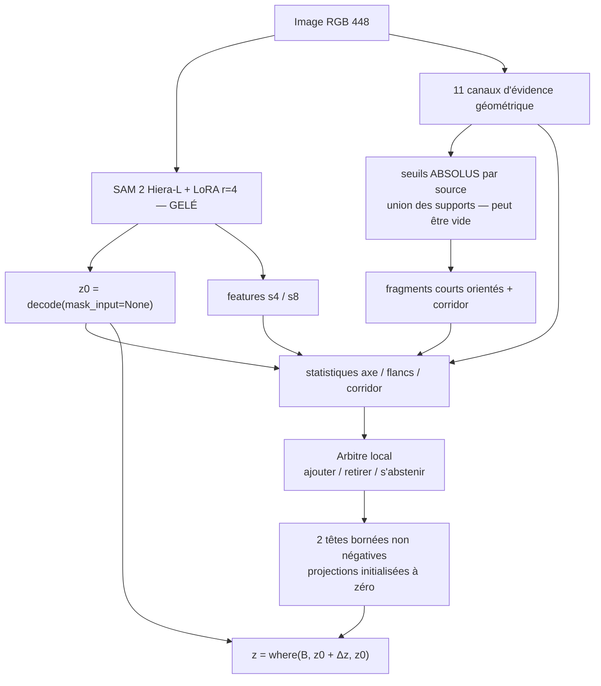

# CrackSAM-GFA — guidage géométrique de SAM 2 par arbitrage de fragments

> **GFA** = *Geometric Fragment Arbitration*.
>
> Successeur direct de l'expérience `frangi_dense_prompt_sam2_lora`, conçu à
> partir des conclusions de l'[étude filtre-seul anti-ombre du 8 août 2026](../CrackSAM/results/2026-08-08_guidage_geometrique_anti_ombre/RAPPORT.md).

## Le problème que cette version corrige

L'expérience historique injectait la carte `node_sim_max` — une affinité locale
relative — comme pseudo-masque dense dans `mask_input`. Elle a coûté `−0,0122`
d'IoU macro face à la baseline, et la matrice causale du 20 juillet 2026 a
montré que le prompt Frangi retirait `0,0979` d'IoU aux poids baseline.

L'étude filtre-seul a ensuite établi le mécanisme et prononcé un **no-go pour
toute carte scalaire autonome et pour tout nouveau `mask_input`**. Son résultat
le plus décisif est négatif : multiplier une preuve anti-ombre par la
Frangi-similarité transmet le défaut de Frangi, et les quatre cartes
`verified_frangi_*` s'effondrent à `≈10 %` de rétention sur le phantom de
traversée d'ombre, contre `89,5 %` pour OFS seul.

CrackSAM-GFA en tire cinq contraintes structurelles, toutes vérifiées par les
tests :

| Contrainte | Mise en œuvre |
|---|---|
| Voie baseline exacte | `mask_input=None`, identité **bit à bit** hors bande acceptée |
| Plus de pseudo-masque | `mask_input` n'existe plus que comme contrôle négatif |
| Canaux jamais multipliés | 11 plans séparés jusqu'à l'arbitre |
| Enveloppe candidate pouvant être vide | union de supports à seuils **absolus**, jamais le seul support Frangi |
| Décision révocable | `ajouter` / `retirer` / **`s'abstenir`** par fragment |

## Architecture



Points clés :

- l'unité de décision est le **fragment**, seule entité qui possède une
  tangente, une longueur et une cohérence d'orientation — donc la seule à
  laquelle « s'abstenir » soit vérifiable ;
- l'**asymétrie de flancs** de chaque canal, mesurée au même rayon, est le
  discriminant vallée-contre-marche ; c'est la leçon de Steger ;
- un canal **OFA** (antisymétrie de flux) fournit l'évidence *positive* de
  marche d'ombre, ce qui autorise l'action `retirer` plutôt que la seule
  abstention ;
- une attention entre fragments de la même image permet de distinguer une
  frontière d'ombre — longue, cohérente, fragmentée en bandes alignées — d'un
  réseau de fissures connecté mais d'orientation variable.

## Ordre d'exécution imposé

Le [pré-enregistrement](DESIGN.md) fige cinq portes. Les deux premières sont
bloquantes.

| Porte | Critère | Mesure | Verdict |
|---|---|---:|:--:|
| 0 — reproduction baseline | `\|Δ IoU\| ≤ 0,002` vs `0,623804` | `−0,000055` | ✅ |
| 1 — oracle de source | gain IoU groupé `≥ +0,01` | `+0,01037` | ✅ marginal |
| 2 — identité | `z ≡ z0` bit à bit hors `B` | 1 695 × 6 conditions | ✅ |
| 3 — gain réel | `Δ IoU > 0`, IC95 excluant `0`, hors pli | `−0,00661` | ❌ |
| 4 — causalité | gain `>` `permuted`, `shifted`, `random_support` | sans objet | ❌ |

**Conclusion : architecture sûre, sans gain.** Quatre plis sur cinq
s'abstiennent et rendent `z0` au bit près ; le cinquième agit et perd
`0,0066` d'IoU. Le diagnostic complet est dans [`RAPPORT.md`](RAPPORT.md).

**L'oracle de source est la porte décisive.** Il majore ce qu'un arbitre peut
atteindre avec cette famille de fragments et ce corridor. Deux bornes sont
rapportées : `achievable` (montée de coordonnées, borne inférieure) et
`upper_bound` (label libre par pixel dans l'union des corridors, borne
supérieure stricte). Si la borne supérieure est sous le seuil, la famille de
candidats est réfutée sans réserve et l'arbitre n'est pas entraîné — ce résultat
négatif est alors le livrable.

## Utilisation

```bash
# Tests des garanties structurelles (CPU, rapide)
python -m pytest ISPRS/CrackSAM-GFA/tests -q

# Chaîne complète sur une VM G4, reprenable après préemption Spot
export CRACKSAM2_DATA_ROOT="$HOME/cracksam2-data"
export GFA_RUN_ROOT="$HOME/gfa-run"
bash ISPRS/CrackSAM-GFA/workflows/run_gfa_vm.sh
```

Chaque étape écrit un jalon dans `${GFA_RUN_ROOT}/state` et est sautée si le
jalon existe. Les portes 0 et 1 interrompent le pipeline en cas d'échec.

## Organisation

```text
CrackSAM-GFA/
├── DESIGN.md            pré-enregistrement : méthode, seuils, contrôles
├── RAPPORT.md           rapport illustré (écrit après exécution)
├── gfa/
│   ├── evidence.py      11 canaux, aucun produit
│   ├── fragments.py     support absolu, squelette, fragments, corridors
│   ├── features.py      statistiques axe / flancs / corridor
│   ├── arbiter.py       arbitre + têtes bornées + composition where()
│   └── oracles.py       oracle de source et oracle d'interface
├── scripts/             CLI numérotées, une par étape
├── workflows/           orchestration VM reprenable
└── tests/               garanties structurelles
```

Les filtres géométriques ne sont pas réécrits : `gfa/evidence.py` importe
`anti_shadow_filters` de l'étude du 8 août, dont le port CPU avait été contrôlé
contre l'implémentation Torch d'origine (corrélation de rang > 0,9999999999).

## Ce que cette étude ne fera pas

- aucune nouvelle LoRA et aucun GNN tant que l'arbitre n'a pas battu `z0` et ses
  contrôles ;
- aucune suppression d'ombre irréversible en prétraitement ;
- aucune évaluation sur ombres naturelles annotées ni sur Shadow-Crack, absents
  du dépôt : la robustesse aux ombres naturelles restera une **hypothèse** ;
- aucun réglage de seuil sur le jeu de test.
