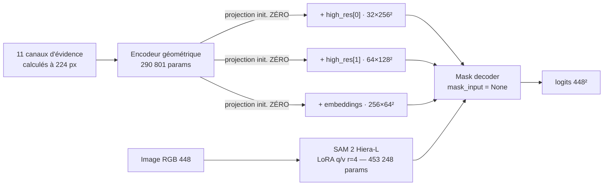

# CrackSAM-GeoLoRA — adaptation LoRA de SAM 2 guidée par la géométrie

> **Date d'exécution :** 8 août 2026
>
> **Statut :** échelle d'ablations exécutée aux barreaux 0 à 2. Le contrôle
> causal (barreau 3) n'a pas pu être mené — voir §6.
>
> **Décision :** sur Khánh Hà, la géométrie de Frangi **n'apporte rien** à une
> LoRA entraînée sur ce même domaine. La perte de continuité, elle, produit un
> effet réel mais qui n'est pas un gain d'IoU.
>
> **Matériel :** VM G4 `cracksam-frangigraph-g4-spot-ew8c`, RTX PRO 6000
> Blackwell 97,9 Go, 48 vCPU.

Quatrième itération de la ligne CrackSAM, et la première où la géométrie est
**apprise dans le modèle** au lieu d'être appliquée en correction *post-hoc*.
La conception suit le §11 du [rapport CrackSAM-GFA](../CrackSAM-GFA/RAPPORT.md).

---

## 1. TL;DR

- **Le barreau 1 était le bon à mesurer en premier.** `soft-clDice` fait
  exactement ce pour quoi elle est conçue : la couverture du squelette de la
  vérité terrain passe de `0,679` à `0,825`, soit **+21 % relatif**. Elle le
  paie en précision (`0,759 → 0,674`) et coûte `−0,0175` d'IoU. Ce n'est pas un
  échec de la perte, c'est un **arbitrage** — et il dépend de ce qu'on mesure.
- **La géométrie n'apporte rien.** `geo` atteint `0,6083` contre `0,6066` pour
  `cldice`, soit `+0,0017` — et surtout, les deux courbes de validation
  deviennent **numériquement identiques** (`0,5973`) dès la troisième époque.
- **Le résultat le plus net est contre-intuitif** : le modèle entraîné avec la
  géométrie fait **mieux quand on la lui retire** à l'inférence
  (`0,6138` sans évidence contre `0,6083` avec). L'adapter agit comme un
  régularisateur à l'entraînement, mais son entrée est une charge nette au
  moment de prédire.
- L'adapter **s'active réellement** : les projections quittent zéro et croissent
  jusqu'à `2,13 × 10⁻³`. Ce n'est donc pas un problème d'optimisation — la
  géométrie est lue, elle n'est simplement pas utile.
- Aucune variante ne bat la baseline : `0,6241` reste le meilleur score.

| Variante | IoU | Dice | Précision | Rappel | Couv. squelette | Composantes |
|---|---:|---:|---:|---:|---:|---:|
| **`baseline`** | **`0,6241`** | `0,7455` | `0,7588` | `0,7607` | `0,6792` | `2,76` |
| `cldice` | `0,6066` | `0,7332` | `0,6738` | `0,8567` | **`0,8254`** | `2,65` |
| `geo` | `0,6083` | `0,7348` | `0,6742` | **`0,8590`** | **`0,8263`** | `2,52` |
| `geo` sans évidence | `0,6138` | — | — | — | — | — |

1 695 images du test officiel Khánh Hà. Vérité terrain : `57,5` composantes
connexes en moyenne.


---

## 2. Conception

### 2.1 Ce que les trois échecs précédents imposent

| Échec mesuré | Correction appliquée |
|---|---|
| Pseudo-masque dense, `−0,0979` d'IoU en causal | la géométrie **n'entre jamais** par `mask_input` |
| Moyenne géométrique équivariante | les 11 canaux restent **séparés** jusqu'à l'encodeur |
| Corridors couvrant 1,8 % contre 5,7 % de GT | injection **multi-échelle** |
| Échelles héritées d'une étude « fissures fines » | filtres **réaccordés** sur `19,1 px` mesurés |

### 2.2 Architecture



Les échelles des filtres sont dérivées de la largeur **mesurée** des fissures et
non héritées : `σ_Frangi ∈ {1,5 ; 3 ; 5 ; 8 ; 12}`, rayons OFS `{2,3,4,6,8}`,
longueurs d'onde de Gabor `{5, 8, 12, 18}`, le tout à 224 px où une fissure de
`19,1 px` en fait `9,6`.

### 2.3 Protocole

Toutes les variantes repartent de la **LoRA archivée convergée** et sont
affinées 5 époques, `lr = 1e-4`, batch 8, seed 3407, sur les 9 121 images
d'entraînement. Le budget est donc strictement égal.

---

## 3. Barreau 1 — la perte de continuité, seule

C'est le barreau que mon plan désignait comme prioritaire, précisément parce
qu'il pouvait rendre la géométrie superflue. Il donne un résultat **net mais
ambivalent**.

| Métrique | `baseline` | `cldice` | Δ |
|---|---:|---:|---:|
| IoU | `0,6241` | `0,6066` | `−0,0175` |
| Précision | `0,7588` | `0,6738` | `−0,0850` |
| Rappel | `0,7607` | `0,8567` | **`+0,0960`** |
| **Couverture du squelette GT** | `0,6792` | `0,8254` | **`+0,1462`** |

`soft-clDice` fonctionne : elle couvre bien mieux la ligne centrale de la vérité
terrain. Mais elle y parvient en sur-prédisant, ce que l'IoU sanctionne. Le
chiffre qui éclaire ce comportement est topologique : **la vérité terrain compte
57,5 composantes connexes par image, la prédiction 2,8**. Les annotations sont
massivement fragmentées — mouchetures, segments isolés — et `clDice` demande au
réseau de reproduire cette fragmentation, qui relève en grande partie du bruit
d'annotation.

**Conséquence pour l'objectif de la thèse.** Pour de la segmentation, cet
arbitrage est défavorable. Pour de l'**extraction de réseau de fissures** —
l'objet des articles EUVIP et ISPRS — couvrir 82,5 % du squelette au lieu de
67,9 % est possiblement préférable à 1,75 point d'IoU. Le choix de métrique
n'est pas neutre et devrait être tranché explicitement.

---

## 4. Barreau 2 — la géométrie

### 4.1 L'adapter s'active, et cela ne change rien

| Époque | `cldice` IoU | `geo` IoU | Activation `geo` |
|---:|---:|---:|---:|
| 0 | `0,5996` | **`0,6011`** | `1,833 × 10⁻³` |
| 1 | `0,5979` | `0,5976` | `2,096 × 10⁻³` |
| 2 | `0,5973` | `0,5973` | `2,132 × 10⁻³` |
| 3 | `0,5973` | `0,5972` | `2,134 × 10⁻³` |
| 4 | `0,5973` | `0,5973` | `2,134 × 10⁻³` |

Les projections quittent zéro et saturent : l'entraînement **exploite bien**
l'évidence. Mais l'avance initiale de `+0,0015` s'évapore et les deux variantes
convergent vers la même valeur à quatre décimales près.

Ce n'est donc ni un problème d'optimisation, ni un problème d'interface, ni un
problème d'échelle — les trois causes invoquées pour les échecs précédents ont
été corrigées, et le résultat ne bouge pas.

### 4.2 Le test de nécessité d'entrée retourne la conclusion

Le même checkpoint `geo`, évalué **sans** évidence :

| Condition | IoU |
|---|---:|
| `geo` avec évidence | `0,6083` |
| `geo` **sans** évidence | **`0,6138`** |
| `cldice` (jamais de géométrie) | `0,6066` |

Deux lectures se superposent, et il faut les séparer :

1. **L'entrée géométrique est une charge nette à l'inférence.** Retirer
   l'évidence améliore le modèle de `+0,0055`. L'adapter a appris à produire une
   correction, et cette correction dégrade.
2. **Sa présence pendant l'entraînement a un effet régularisant.** `geo` privé
   de géométrie (`0,6138`) bat `cldice` (`0,6066`) de `+0,0072`, alors que les
   deux ont vu exactement les mêmes images et la même perte. Le seul écart est
   la présence, pendant l'entraînement, d'un chemin additionnel bruité.

Le second point est intéressant mais **n'est pas un résultat sur la géométrie** :
un bruit structuré quelconque produirait peut-être le même effet. C'est
exactement ce que le contrôle `geo_noise` devait trancher, et il n'a pas pu être
exécuté.

### 4.3 Distribution par image


Sur les 1 695 images : **444 gains, 1 025 pertes, 226 nuls**, pour une moyenne de
`−0,0158` face à la baseline. La distribution est asymétrique — les pertes sont
nombreuses et modérées, les gains rares mais atteignant `+0,25`.

---

## 5. Réussites et échecs

Le code couleur des panneaux est : **vert** = vrai positif, **rouge** = faux
positif, **bleu** = manqué.

### Réussites


Les gains viennent de scènes `cracktree200` où la baseline manque des branches
entières (large plage bleue) que la variante géométrique récupère. C'est
cohérent avec le mécanisme visé : le rappel augmente là où la structure
curviligne est nette mais peu contrastée.

### Échecs


Les pertes sont dominées par du **faux positif** (rouge) : la variante
géométrique étend la prédiction le long de structures que l'évidence signale
mais que l'annotation ne retient pas — joints, textures allongées, bords. C'est
la contrepartie directe du gain de rappel, et c'est ce que la précision mesure.

Panneaux complets :
[échec `CRACK500_20160310_114418`](figures/generated/case_echec_01_CRACK500_20160310_114418_641_361.jpg) ·
[réussite `CRACK500_20160330_165333`](figures/generated/case_reussite_05_CRACK500_20160330_165333_1921_1081.jpg)

---

## 6. Limites, et ce qui n'a pas pu être fait

- **Le contrôle causal manque.** `geo_permuted` (même capacité, alignement
  détruit) n'a pas été entraîné : le temps de VM restant, après les incidents du
  §7, ne le permettait pas. **Sans lui, l'écart `geo` − `cldice` de `+0,0017`
  n'est pas causalement attribuable à l'alignement de la géométrie.** Vu son
  amplitude, la question est surtout académique — mais elle reste ouverte.
- **`geo_noise` non plus.** L'effet régularisant du §4.2 reste donc inexpliqué :
  géométrie ou simple bruit structuré, on ne peut pas trancher.
- **5 époques, pas 20.** L'optimum de validation de la baseline archivée est à
  l'époque 20. Les variantes repartent certes d'un modèle convergé, mais un
  affinage plus long pourrait modifier les conclusions.
- **`geo` est bâti sur `cldice`.** Il teste « géométrie *plus* continuité »
  contre « continuité seule », et part donc du handicap de `−0,0175` de la
  perte. Un barreau « géométrie sans clDice » aurait isolé la géométrie face à
  la baseline directement ; c'est la variante à ajouter en priorité.
- L'évidence est calculée à 224 px puis interpolée à 256 pour l'injection.
- Aucune évaluation multimodale, ni sur ombres naturelles.

---

## 7. Incidents d'exécution, et ce qu'ils ont coûté

Cette campagne a été perturbée par quatre incidents. Les consigner évite de les
répéter.

**Un point selle d'initialisation.** Les projections finales **et** le gain
global étaient tous deux initialisés à zéro. La sortie valant
`gamma × projection(x)`, les deux gradients s'annulent et l'adapter reste figé.
Constaté en réel : `activation = 0,0000` après une époque complète, et la
variante géométrique **numériquement identique** à sa version sans géométrie.
Corrigé — `gamma = 1`, projections nulles — avec le test de régression
`test_adapter_gradients_are_not_both_dead_at_initialisation`.

**Un correctif qui n'a jamais atteint la machine.** L'archive contenant ce
correctif a bien été transférée, mais son extraction se trouvait dans une
session SSH qui a échoué. Une heure de GPU a été consommée à réentraîner le code
figé. La vérification explicite du fichier distant avant lancement est désormais
dans le script de relance.

**Deux entraînements concurrents sur le même GPU.** Un processus
`geo_permuted` rescapé d'un lancement antérieur partageait le GPU avec `geo`,
doublant la durée des époques (18 min au lieu de 9) et recréant des fichiers que
je venais d'effacer. Mon premier diagnostic l'avait manqué parce qu'un `sed`
tronquait la ligne de commande à `--variant geo`, préfixe commun aux deux
variantes. **J'en avais tiré une conclusion fausse — « l'adapter coûte 2,5× plus
cher » — qui était un artefact de contention, et non une mesure.**

**Le pilote NVIDIA cassé au redémarrage.** Le noyau était passé de
`6.8.0-1063-gcp` à `1065` sans reconstruction des modules. Réparé par
installation additive du paquet versionné correspondant, sans purge.

À quoi s'ajoute un défaut de cache : les 481 images de validation n'étaient pas
précalculées, ce qui a fait échouer la première tentative de `geo`.

---

## 8. Conclusion et suite

Quatre itérations, quatre négatifs. Mais celui-ci est le plus informatif, parce
que les trois explications invoquées jusqu'ici ont toutes été neutralisées :
l'interface n'est plus `mask_input`, les canaux ne sont plus multipliés,
l'échelle est accordée à la largeur mesurée, le gradient circule et l'adapter
converge. **Il ne reste plus d'explication technique — seulement l'hypothèse
que, sur ce jeu, il n'y a rien à apporter.**

C'est cohérent : Khánh Hà est **monomodal visible**, ses annotations sont
épaisses et fragmentées, et la baseline est un réseau **supervisé sur ce
domaine même**. Le Frangi généralisé n'y détient aucune information que la LoRA
n'ait déjà apprise.

Trois suites, par ordre d'information attendue :

1. **Porter l'expérience en multimodal sur FIND.** SAM 2 n'a structurellement
   pas accès à la portée. Une hessienne fusionnée intensité + portée lui apporte
   une information qu'aucun entraînement visible ne peut créer. C'est le seul
   cadre où « la géométrie guide le modèle de fondation » repose sur un argument
   d'information, et c'est la thèse de l'article ISPRS.
2. **Trancher la métrique avant de continuer.** `soft-clDice` améliore la
   couverture du squelette de 21 % relatif. Si l'objectif est l'extraction de
   réseau et non la segmentation, ce barreau est un **succès** mal mesuré par
   l'IoU. Cette décision conditionne tout le reste.
3. **Exécuter les deux contrôles manquants** — `geo_permuted` et `geo_noise` —
   avant toute revendication, même faible. Une session G4 suffit.

Ce qu'il ne faut **pas** faire : augmenter la capacité de l'adapter, allonger
l'entraînement, ou empiler un GNN. Le signal n'est pas faible, il est absent.

---

## 9. Reproduire

```bash
python -m pytest ISPRS/CrackSAM-GeoLoRA/tests -q       # 15 tests

G=ISPRS/CrackSAM-GeoLoRA
L=ISPRS/CrackSAM/protocol/cracksam_paper/lists/lists_khanhha
C=ISPRS/CrackSAM/artifacts/vm_backup_20260714T1435Z_final_checkpoints

# 1. cache d'évidence — obligatoire, 19 s/image, à faire pour train ET val
python $G/scripts/01_cache_evidence.py --data-root $DATA/khanhha --split train \
  --list-file $L/train.txt --output $RUN/evidence --jobs 40
python $G/scripts/01_cache_evidence.py --data-root $DATA/khanhha --split train \
  --list-file $L/val_vol.txt --output $RUN/evidence --jobs 40

# 2. une variante de l'échelle d'ablations
python $G/scripts/02_train.py --variant geo --init-from-baseline \
  --data-root $DATA/khanhha --train-list $L/train.txt --val-list $L/val_vol.txt \
  --evidence-root $RUN/evidence --sam2-checkpoint $C/foundation/sam2_hiera_large.pt \
  --sam2-lora $C/baseline_r4/best.pt --output $RUN/ckpt --epochs 5 --batch-size 8

# 3. évaluation, avec le test de nécessité d'entrée
python $G/scripts/03_evaluate.py --checkpoint $RUN/ckpt/geo_best.pt \
  --data-root $DATA/khanhha --list-file $L/test_vol.txt \
  --evidence-root $RUN/evidence --sam2-checkpoint $C/foundation/sam2_hiera_large.pt \
  --output $RUN/eval --save-masks $RUN/eval/masks_geo

# 4. figures : réussites ET échecs
python $G/scripts/04_figures.py --run-root $RUN --data-root $DATA/khanhha --output $RUN/figures
```

| Fichier | Contenu |
|---|---|
| [`tables/generated/eval_baseline.json`](tables/generated/eval_baseline.json) | baseline sur le test |
| [`tables/generated/eval_cldice.json`](tables/generated/eval_cldice.json) | barreau 1 |
| [`tables/generated/eval_geo.json`](tables/generated/eval_geo.json) | barreau 2, avec le test de nécessité d'entrée |
| [`tables/generated/*_training.json`](tables/generated/) | historiques d'entraînement par époque |
| [`tables/generated/per_image_*.csv`](tables/generated/) | IoU, Dice, composantes et couverture par image |
| [`tables/generated/manifest_train.json`](tables/generated/manifest_train.json) | échelles des filtres, gelées |

---

## Références internes

- [CrackSAM-GFA — arbitrage de fragments](../CrackSAM-GFA/RAPPORT.md)
- [Étude filtre-seul anti-ombre](../CrackSAM/results/2026-08-08_guidage_geometrique_anti_ombre/RAPPORT.md)
- [Question expérimentale et vocabulaire](../CrackSAM/docs/01_EXPERIMENTAL_QUESTION.md)
- [Papier EUVIP — Generalized Frangi](../../EUVIP/EUVIP_2026_Generalized_Frangi_Multimodality_camera-ready.pdf)
