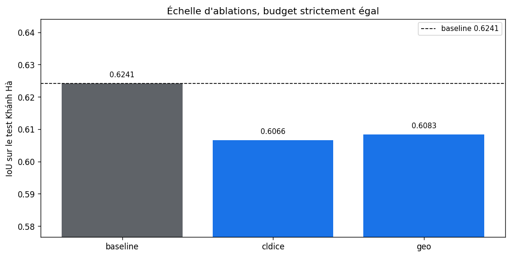
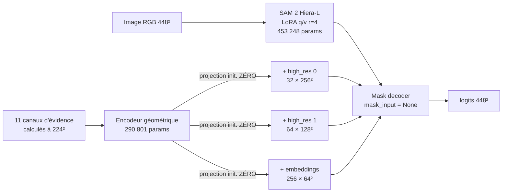
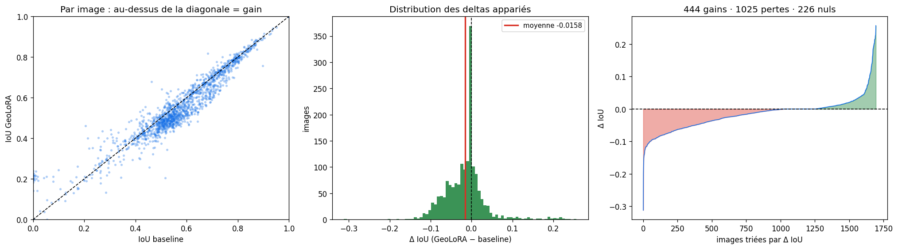
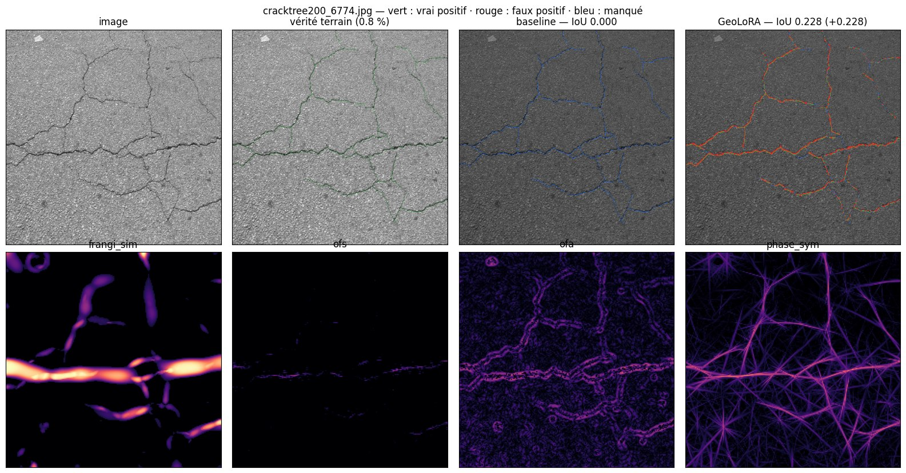
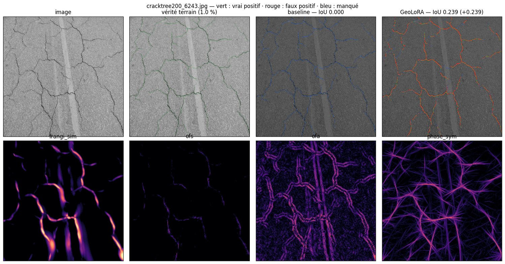
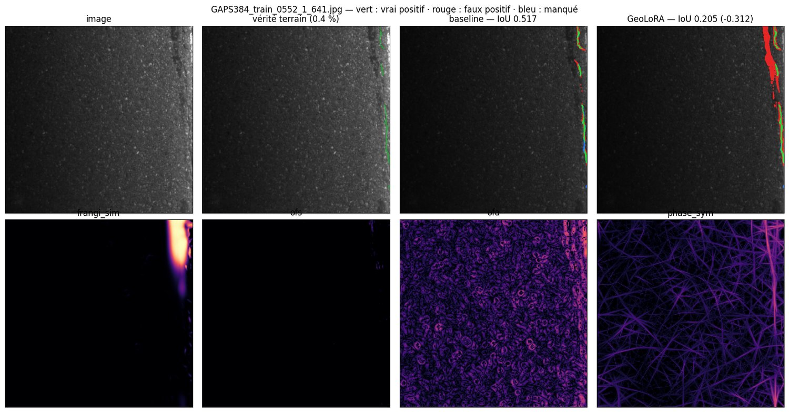
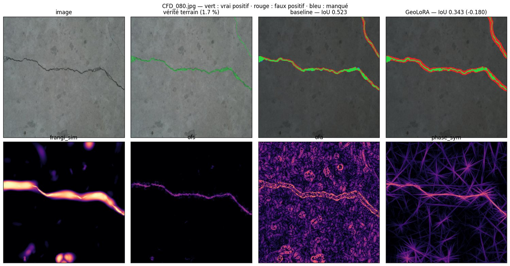

# CrackSAM-GeoLoRA — adaptation LoRA de SAM 2 guidée par la géométrie

**Quatrième itération de la ligne CrackSAM.** Première où la géométrie de Frangi
est *apprise dans* le modèle plutôt qu'appliquée en correction après coup.

<div align="center">

| Exécution | Matériel | Corpus | Code |
|:--:|:--:|:--:|:--:|
| 8 août 2026 | RTX PRO 6000 Blackwell · 97,9 Go | Khánh Hà · 9 121 / 1 695 | [`geolora/`](geolora/) · 15 tests |

</div>

> [!IMPORTANT]
> **Conclusion.** Sur Khánh Hà, la géométrie de Frangi n'apporte **rien** à une
> LoRA déjà entraînée sur ce domaine. La perte de continuité `soft-clDice`, elle,
> produit un effet réel et important — mais qui n'est pas un gain d'IoU. Aucune
> variante ne bat la baseline.
>
> **Réserve majeure :** tout ce rapport mesure en IoU **stricte**, inadaptée à
> des structures aussi fines. Deux pixels de tolérance font gagner `+48 %`
> relatif à la baseline, et les écarts entre variantes sont du même ordre que le
> bruit de placement. Voir [§9](#9-mesure-et-entraînement-tolérants--priorité-1).

---

## Sommaire

1. [Résultats en un coup d'œil](#1-résultats-en-un-coup-dœil)
2. [Conception](#2-conception)
3. [Barreau 1 — la perte de continuité seule](#3-barreau-1--la-perte-de-continuité-seule)
4. [Barreau 2 — la géométrie](#4-barreau-2--la-géométrie)
5. [Réussites et échecs, en images](#5-réussites-et-échecs-en-images)
6. [Limites](#6-limites)
7. [Incidents d'exécution](#7-incidents-dexécution)
8. [Suite](#8-suite)
9. [Mesure et entraînement tolérants — priorité 1](#9-mesure-et-entraînement-tolérants--priorité-1)

---

## 1. Résultats en un coup d'œil

<div align="center">



</div>

Les 1 695 images du test officiel Khánh Hà. Toutes les variantes repartent de la
LoRA archivée convergée et sont affinées **5 époques à budget strictement égal**.

| Variante | IoU | Dice | Précision | Rappel | Couv. squelette | Composantes |
|:---|---:|---:|---:|---:|---:|---:|
| **`baseline`** | **0,6241** | 0,7455 | **0,7588** | 0,7607 | 0,6792 | 2,76 |
| `cldice` | 0,6066 | 0,7332 | 0,6738 | 0,8567 | **0,8254** | 2,65 |
| `geo` | 0,6083 | 0,7348 | 0,6742 | **0,8590** | **0,8263** | 2,52 |
| `geo` *sans évidence* | 0,6138 | — | — | — | — | — |

> [!NOTE]
> La vérité terrain compte **57,5 composantes connexes** par image contre 2,8
> prédites. Cet écart topologique explique une grande partie de ce qui suit.

### Les trois faits à retenir

> [!TIP]
> **`soft-clDice` fonctionne — mais l'IoU ne le voit pas.**
> La couverture du squelette de la vérité terrain passe de `0,679` à `0,825`,
> soit **+21 % relatif**, au prix de la précision (`0,759 → 0,674`). Pour de la
> segmentation c'est un mauvais échange ; pour de l'**extraction de réseau**,
> objet des articles EUVIP et ISPRS, ce n'en est peut-être pas un.

> [!WARNING]
> **La géométrie n'apporte rien.** L'adapter s'active pourtant réellement — ses
> projections quittent zéro et saturent à `2,13 × 10⁻³` — mais `geo` et `cldice`
> convergent vers la **même IoU de validation à quatre décimales** (`0,5973`).

> [!CAUTION]
> **Retirer la géométrie améliore le modèle qui l'a apprise.** Le checkpoint
> `geo` évalué *sans* évidence obtient `0,6138`, contre `0,6083` avec. L'entrée
> géométrique est une charge nette au moment de prédire.

---

## 2. Conception

### 2.1 Ce que les trois échecs précédents imposent

| Échec mesuré | Correction appliquée ici |
|:---|:---|
| Pseudo-masque dense, `−0,0979` d'IoU en causal | la géométrie **n'entre jamais** par `mask_input` |
| Moyenne géométrique équivariante sous perturbation | les 11 canaux restent **séparés** jusqu'à l'encodeur |
| Corridors couvrant 1,8 % de l'image contre 5,7 % de GT | injection **multi-échelle** |
| Échelles héritées d'une étude « fissures fines » | filtres **réaccordés** sur les `19,1 px` mesurés |

### 2.2 Architecture



À l'initialisation les projections sont nulles : le modèle **est** exactement la
baseline gelée, et `evidence=None` restitue cette voie au bit près.

<details>
<summary><b>Échelles des filtres, dérivées de la mesure et non héritées</b></summary>

<br>

Une fissure Khánh Hà fait `19,1 px` de large à 448, donc `9,6 px` à la
résolution de calcul de 224.

| Filtre | Paramètre | Valeur |
|:---|:---|:---|
| Frangi historique | `σ` | `{1,5 ; 3 ; 5 ; 8 ; 12}` |
| Oriented Flux Symmetry | rayons | `{2, 3, 4, 6, 8}` |
| Symétrie de phase | longueurs d'onde | `{5, 8, 12, 18}` |
| Profil / paire-impair / ΔBIC | `σ` | `{1,2 ; 2 ; 3 ; 4,5 ; 6}` |

Calculer à 448 imposerait des noyaux de Gabor de `143 × 143` px pour couvrir la
même structure : deux ordres de grandeur de coût, sans information nouvelle sur
des objets aussi épais.

</details>

---

## 3. Barreau 1 — la perte de continuité seule

C'est le barreau que le plan désignait comme prioritaire, précisément parce
qu'il pouvait rendre la géométrie superflue.

| Métrique | `baseline` | `cldice` | Δ |
|:---|---:|---:|---:|
| IoU | 0,6241 | 0,6066 | `−0,0175` |
| Précision | 0,7588 | 0,6738 | `−0,0850` |
| Rappel | 0,7607 | 0,8567 | **`+0,0960`** |
| **Couverture du squelette GT** | 0,6792 | 0,8254 | **`+0,1462`** |

`soft-clDice` fait ce pour quoi elle est conçue : elle couvre bien mieux la ligne
centrale de la vérité terrain. Elle y parvient en sur-prédisant, ce que l'IoU
sanctionne lourdement.

Le chiffre qui éclaire ce comportement est topologique : **57,5 composantes
connexes annotées contre 2,8 prédites**. Les annotations sont massivement
fragmentées — mouchetures, segments isolés — et `clDice` demande au réseau de
reproduire cette fragmentation, qui relève en bonne part du bruit d'annotation.

> [!IMPORTANT]
> **Le choix de métrique n'est pas neutre et devrait être tranché explicitement.**
> Couvrir 82,5 % du squelette au lieu de 67,9 % vaut-il 1,75 point d'IoU ? Pour
> un travail sur l'*extraction de réseau de fissures*, probablement oui.

---

## 4. Barreau 2 — la géométrie

### 4.1 L'adapter s'active, et cela ne change rien

| Époque | `cldice` IoU | `geo` IoU | Activation `geo` |
|---:|---:|---:|---:|
| 0 | 0,5996 | **0,6011** | `1,833 × 10⁻³` |
| 1 | 0,5979 | 0,5976 | `2,096 × 10⁻³` |
| 2 | 0,5973 | 0,5973 | `2,132 × 10⁻³` |
| 3 | 0,5973 | 0,5972 | `2,134 × 10⁻³` |
| 4 | 0,5973 | 0,5973 | `2,134 × 10⁻³` |

Les projections quittent zéro et saturent : l'entraînement **exploite** bien
l'évidence. Mais l'avance initiale de `+0,0015` s'évapore, et les deux variantes
deviennent indistinguables.

Ce n'est donc **ni** un problème d'optimisation, **ni** d'interface, **ni**
d'échelle. Les trois causes invoquées pour les échecs précédents ont toutes été
corrigées, et le résultat ne bouge pas.

### 4.2 Le test de nécessité d'entrée retourne la lecture

Le même checkpoint `geo`, évalué avec puis sans évidence :

| Condition | IoU | |
|:---|---:|:---|
| `geo` **avec** évidence | 0,6083 | |
| `geo` **sans** évidence | **0,6138** | `+0,0055` |
| `cldice` — jamais de géométrie | 0,6066 | référence |

Deux effets se superposent et doivent être séparés :

1. **À l'inférence, l'entrée géométrique nuit.** La retirer gagne `+0,0055`.
   L'adapter a appris à produire une correction, et cette correction dégrade.
2. **À l'entraînement, sa présence régularise.** `geo` privé de géométrie
   (`0,6138`) bat `cldice` (`0,6066`) de `+0,0072`, alors que les deux ont vu
   les mêmes images et la même perte.

> [!WARNING]
> Le second point **n'est pas un résultat sur la géométrie**. Un bruit structuré
> quelconque produirait peut-être le même effet régularisant. C'est précisément
> ce que le contrôle `geo_noise` devait trancher — et il n'a pas pu être exécuté.

### 4.3 Distribution par image

<div align="center">



</div>

**444 gains · 1 025 pertes · 226 nuls**, moyenne `−0,0158`. La distribution est
asymétrique : les pertes sont nombreuses et modérées, les gains rares mais
atteignant `+0,25`. Le nuage de gauche montre que l'écart se creuse surtout dans
la zone `IoU ∈ [0,4 ; 0,7]`.

---

## 5. Réussites et échecs, en images

Dans les panneaux : **🟩 vert** = vrai positif · **🟥 rouge** = faux positif ·
**🟦 bleu** = manqué. La ligne du bas montre quatre des onze canaux d'évidence.

### ✅ Là où la géométrie sauve la mise



**`cracktree200_6774` · baseline `0,000` → GeoLoRA `0,228`.** La baseline manque
**intégralement** le réseau : tout est bleu. GeoLoRA le retrouve. Regardez la
ligne du bas : c'est le canal **`ofa`** — l'antisymétrie de flux — qui trace le
réseau avec netteté, tandis que `frangi_sim` ne produit que des taches
grossières. Le canal ajouté pour détecter les marches d'ombre s'avère être le
meilleur détecteur de réseau fin de tout le banc.



Même mécanisme sur une autre scène `cracktree200`. Les gains se concentrent sur
ce sous-ensemble, où les fissures sont **fines et peu contrastées** — exactement
le régime que la baseline traite mal.

### ❌ Là où elle coûte cher



**`GAPS384_0552` · baseline `0,517` → GeoLoRA `0,205`, soit `−0,312`.** La
fissure est un mince trait le long du bord droit. GeoLoRA sur-prédit massivement
(rouge) le long de la bordure claire. La cause est lisible dans l'évidence :
`frangi_sim` place une **tache énorme** sur ce bord, `ofa` sature de texture
granulaire, `phase_sym` n'est qu'un entrelacs d'artefacts en étoile.



C'est le mode d'échec classique de Frangi documenté par l'étude anti-ombre :
**la texture, pas l'ombre**. Sur les surfaces granulaires sombres, les canaux
géométriques répondent partout et l'adapter les suit.

<details>
<summary>Deux panneaux supplémentaires</summary>

<br>

- [Échec `CRACK500_20160310_114418`](figures/generated/case_echec_01_CRACK500_20160310_114418_641_361.jpg)
- [Réussite `CRACK500_20160330_165333`](figures/generated/case_reussite_05_CRACK500_20160330_165333_1921_1081.jpg)

</details>

### Ce que ces images révèlent et que les moyennes cachaient

> [!IMPORTANT]
> **La largeur de `19,1 px` est une moyenne trompeuse.** Les scènes
> `cracktree200` et `GAPS384` montrent des vérités terrain à `0,4–0,8 %` de
> pixels, c'est-à-dire des fissures **fines**, alors que la moyenne est dominée
> par les sous-ensembles à annotations épaisses. En réaccordant les filtres sur
> `19,1 px`, j'ai sur-corrigé pour toute une partie du corpus — visible
> directement dans les taches informes de `frangi_sim`.

Le corollaire est encourageant : GeoLoRA gagne **quand même** `+0,228` sur ces
scènes fines, et c'est `ofa` qui porte le signal. Une évidence multi-échelle,
plutôt qu'accordée à une largeur unique, est la piste la plus concrète issue de
cette campagne.

---

## 6. Limites

- [ ] **Le contrôle causal manque.** `geo_permuted` — même capacité, alignement
      détruit — n'a pas été entraîné faute de temps de VM. **Sans lui, l'écart
      `geo − cldice` de `+0,0017` n'est pas causalement attribuable.**
- [ ] **`geo_noise` non plus**, donc l'effet régularisant du §4.2 reste
      inexpliqué.
- [ ] **5 époques, pas 20.** L'optimum de validation de la baseline archivée est
      à l'époque 20 ; les variantes repartent certes d'un modèle convergé.
- [ ] **`geo` est bâti sur `cldice`**, donc il teste « géométrie *plus*
      continuité » contre « continuité seule », en partant du handicap de
      `−0,0175`. Un barreau « géométrie sans clDice » manque.
- [ ] **Évidence mono-échelle** accordée à une largeur moyenne peu
      représentative (§5).
- [ ] Aucune évaluation multimodale, ni sur ombres naturelles.

---

## 7. Incidents d'exécution

<details>
<summary><b>Quatre incidents, et ce qu'ils ont coûté</b> — à lire avant de relancer une campagne</summary>

<br>

**Un point selle d'initialisation.** Les projections finales *et* le gain global
étaient tous deux initialisés à zéro. La sortie valant `gamma × projection(x)`,
les deux gradients s'annulent : l'adapter reste figé. Constaté en réel —
`activation = 0,0000` après une époque complète, et la variante géométrique
numériquement identique à sa version sans géométrie. Corrigé (`gamma = 1`,
projections nulles), avec le test de régression
`test_adapter_gradients_are_not_both_dead_at_initialisation`.

**Un correctif qui n'a jamais atteint la machine.** L'archive le contenant a été
transférée, mais son extraction se trouvait dans une session SSH qui a échoué.
Une heure de GPU consommée à réentraîner le code figé. Le script de relance
vérifie désormais le fichier distant avant de démarrer.

**Deux entraînements concurrents sur le même GPU.** Un processus `geo_permuted`
rescapé d'un lancement antérieur partageait le GPU avec `geo`, doublant la durée
des époques et recréant des fichiers effacés. Mon premier diagnostic l'avait
manqué parce qu'un `sed` tronquait la ligne de commande à `--variant geo`,
préfixe commun aux deux. **J'en avais tiré une conclusion fausse — « l'adapter
coûte 2,5× plus cher » — qui n'était qu'un artefact de contention.**

**Le pilote NVIDIA cassé au redémarrage.** Le noyau était passé de
`6.8.0-1063-gcp` à `1065` sans reconstruction des modules. Réparé par
installation additive du paquet versionné, sans purge.

S'y ajoute un défaut de cache : les 481 images de validation n'étaient pas
précalculées, ce qui a fait échouer la première tentative de `geo`.

</details>

---

## 8. Suite

Quatre itérations, quatre négatifs — mais celui-ci est le plus informatif, parce
que toutes les explications techniques ont été neutralisées : l'interface n'est
plus `mask_input`, les canaux ne sont plus multipliés, l'échelle est accordée à
la mesure, le gradient circule, l'adapter converge. **Il ne reste plus que
l'hypothèse que, sur ce jeu, il n'y a rien à apporter.**

C'est cohérent : Khánh Hà est **monomodal visible**, ses annotations sont
épaisses et fragmentées, et la baseline est un réseau **supervisé sur ce domaine
même**.

| Priorité | Action | Coût |
|:--:|:---|:--|
| **1** | **Mesurer ET entraîner à tolérance 3 px et 5 px** — voir [§9](#9-mesure-et-entraînement-tolérants--priorité-1). Conditionne l'interprétation de tout ce qui précède. | 1 session G4 |
| 2 | **Porter l'expérience en multimodal sur FIND.** SAM 2 n'a structurellement pas accès à la portée ; une hessienne fusionnée intensité + portée lui apporte une information qu'aucun entraînement visible ne peut créer. C'est la thèse de l'article ISPRS. | 1 session G4 |
| 3 | **Rendre l'évidence multi-échelle** au lieu de l'accorder à une largeur moyenne non représentative (§5), et exploiter `ofa`, le meilleur détecteur du banc. | 1 session G4 |
| 4 | **Exécuter `geo_permuted` et `geo_noise`** avant toute revendication, même faible. | 1 session G4 |

> [!CAUTION]
> Ce qu'il ne faut **pas** faire : augmenter la capacité de l'adapter, allonger
> l'entraînement, ou empiler un GNN. Le signal n'est pas faible, il est absent.

---

## 9. Mesure et entraînement tolérants — priorité 1

> [!IMPORTANT]
> **Toutes les conclusions de ce rapport reposent sur une IoU stricte, et cette
> métrique est inadaptée à des structures aussi fines.** Les écarts déclarés —
> `−0,0175` pour `cldice`, `+0,0017` pour `geo` — sont du même ordre de grandeur
> que le bruit de placement de frontière. Le classement des variantes peut
> changer à tolérance 3 px ou 5 px.

### 9.1 Pourquoi c'est décisif

Deux mesures, faites sur ce corpus, le montrent sans ambiguïté.

**La vérité terrain ne se ressemble pas à elle-même.** Dilatée d'un seul pixel,
elle obtient `0,881` d'IoU contre sa version d'origine ; de deux pixels, `0,799`.
Un décalage d'un pixel coûte donc déjà douze points.

**Mesure préliminaire sur 36 images de test, baseline** — les masques des trois
variantes étant restés sur la VM, ce tableau ne porte que sur la baseline et sur
un échantillon :

| Tolérance | IoU masques dilatés | **IoU tampon** | Précision | Rappel |
|---:|---:|---:|---:|---:|
| 0 px | 0,5071 | **0,5071** | 0,5704 | 0,8665 |
| 1 px | 0,5770 | **0,6475** | 0,7018 | 0,9055 |
| **2 px** | 0,6235 | **0,7491** | 0,7971 | 0,9267 |
| **3 px** | 0,6639 | **0,8278** | 0,8715 | 0,9405 |
| **5 px** | 0,7214 | **0,8983** | 0,9384 | 0,9523 |
| 8 px | 0,7698 | 0,9284 | 0,9655 | 0,9585 |

Deux pixels de tolérance font passer l'IoU de `0,51` à `0,75`, soit **+48 %
relatif**. Surtout, la précision grimpe bien plus vite que le rappel
(`0,570 → 0,797` contre `0,867 → 0,927`) : **l'essentiel des « faux positifs » se
situe à moins de deux pixels de la vérité terrain.** Ce ne sont pas de fausses
détections, c'est du débordement de frontière — précisément ce que l'IoU stricte
sanctionne le plus lourdement et ce qui importe le moins pour extraire un réseau.

### 9.2 Les deux définitions, et laquelle privilégier

| Définition | Formule | Comportement |
|:---|:---|:---|
| `dilate_both` | `IoU(dil(P,k), dil(G,k))` | convention EUVIP du dépôt (`thicken(sk, 6)`). Sature lentement, mais épaissit tout : à `k=8` un décalage de 2 px vaut encore `0,80` |
| **`buffered`** | `P_k = \|P ∩ dil(G,k)\|/\|P\|`, `R_k = \|G ∩ dil(P,k)\|/\|G\|`, puis `F1_k` et `IoU = F1/(2−F1)` | mesure une **distance d'appariement**. À privilégier pour conclure |

Validation sur cas synthétiques — la tolérance doit pardonner le placement,
**jamais** la topologie :

| Cas | `k=0` | `k=1` | `k=2` | `k=5` |
|:---|---:|---:|---:|---:|
| prédiction parfaite | 1,000 | 1,000 | 1,000 | 1,000 |
| décalée de 2 px | 0,200 | 0,500 | **1,000** | 1,000 |
| deux fois trop large | 0,429 | 0,714 | **1,000** | 1,000 |
| **rompue en son milieu** | 0,875 | 0,887 | 0,900 | **0,938** |

Une rupture reste pénalisée à toutes les tolérances : c'est ce qui rend la
mesure utilisable pour juger de la continuité.

### 9.3 Entraîner avec la tolérance, pas seulement mesurer

Si l'erreur dominante est un débordement de frontière, la faire payer à
l'entraînement détourne la capacité du réseau de ce qui compte — les branches
manquées et les ruptures. D'où une **perte tolérante**, version douce et
différentiable de la métrique `buffered` du §9.2 :

```text
G_k = maxpool(G, 2k+1)      dilatation douce de la vérité
P_k = maxpool(P, 2k+1)      dilatation douce de la prédiction

précision_tol = Σ(P · G_k) / ΣP        un pixel prédit à moins de k compte
rappel_tol    = Σ(G · P_k) / ΣG        un pixel vrai couvert à moins de k compte
L_tol = 1 − 2·précision_tol·rappel_tol / (précision_tol + rappel_tol)
```

La dilatation par `maxpool` est exactement la machinerie morphologique déjà
employée par `soft_skeleton` dans [`geolora/losses.py`](geolora/losses.py) : le
gradient passe, et l'implémentation réutilise du code testé.

> [!NOTE]
> Cette perte est le **complément naturel de `soft-clDice`**, pas son
> concurrent. `clDice` supervise la topologie, la perte tolérante cesse de
> pénaliser le placement. Le §3 montre que `clDice` échange 8,5 points de
> précision contre 9,6 points de rappel — sous tolérance, une grande part de
> cette « perte de précision » devrait disparaître, puisqu'elle est faite de
> pixels à moins de deux pixels de la cible.

### 9.4 Protocole à exécuter

**Mesures** — rejouer les trois variantes déjà entraînées à `k ∈ {0,1,2,3,5,8}`,
avec les deux définitions. Purement CPU, quelques minutes, une fois les masques
récupérés. Le script existe :
[`scripts/05_tolerant_iou.py`](scripts/05_tolerant_iou.py).

**Entraînements** — deux nouvelles variantes, à budget identique aux
précédentes :

| Variante | Perte | Ce qu'elle isole |
|:---|:---|:---|
| `tol3` | Dice + CE + perte tolérante `k=3` | l'effet de la tolérance seule |
| `tol5` | Dice + CE + perte tolérante `k=5` | sa sensibilité au rayon |
| `geo_tol3` | idem `tol3` + adapter géométrique | la géométrie **sous** une métrique adaptée |

Le troisième est le plus important : il rejoue le barreau 2 dans un régime où
l'erreur de placement ne masque plus le signal. **Si la géométrie doit servir à
quelque chose, c'est là qu'on le verra.**

Critère de succès pré-enregistré : `IoU tampon k=3` supérieure à celle de la
baseline mesurée à la même tolérance, avec IC95 excluant zéro. Comparer à
tolérance égale, jamais une variante tolérante à une baseline stricte.

---

## Reproduire

```bash
python -m pytest ISPRS/CrackSAM-GeoLoRA/tests -q       # 15 tests

G=ISPRS/CrackSAM-GeoLoRA
L=ISPRS/CrackSAM/protocol/cracksam_paper/lists/lists_khanhha
C=ISPRS/CrackSAM/artifacts/vm_backup_20260714T1435Z_final_checkpoints

# 1. cache d'évidence — obligatoire, ~19 s/image, pour train ET val
python $G/scripts/01_cache_evidence.py --data-root $DATA/khanhha --split train \
  --list-file $L/train.txt --output $RUN/evidence --jobs 40
python $G/scripts/01_cache_evidence.py --data-root $DATA/khanhha --split train \
  --list-file $L/val_vol.txt --output $RUN/evidence --jobs 40

# 2. une variante de l'échelle d'ablations
python $G/scripts/02_train.py --variant geo --init-from-baseline \
  --data-root $DATA/khanhha --train-list $L/train.txt --val-list $L/val_vol.txt \
  --evidence-root $RUN/evidence --sam2-checkpoint $C/foundation/sam2_hiera_large.pt \
  --sam2-lora $C/baseline_r4/best.pt --output $RUN/ckpt --epochs 5 --batch-size 8

# 3. évaluation, avec le test de nécessité d'entrée
python $G/scripts/03_evaluate.py --checkpoint $RUN/ckpt/geo_best.pt \
  --data-root $DATA/khanhha --list-file $L/test_vol.txt \
  --evidence-root $RUN/evidence --sam2-checkpoint $C/foundation/sam2_hiera_large.pt \
  --output $RUN/eval --save-masks $RUN/eval/masks_geo

# 4. figures : réussites ET échecs
python $G/scripts/04_figures.py --run-root $RUN --data-root $DATA/khanhha --output $RUN/figures
```

Chaque époque écrit un `*_latest.pt` complet, état de l'optimiseur compris : la
reprise après préemption Spot repart à l'époque suivante.

<details>
<summary><b>Artefacts</b></summary>

<br>

| Fichier | Contenu |
|:---|:---|
| [`eval_baseline.json`](tables/generated/eval_baseline.json) | baseline sur le test |
| [`eval_cldice.json`](tables/generated/eval_cldice.json) | barreau 1 |
| [`eval_geo.json`](tables/generated/eval_geo.json) | barreau 2 + test de nécessité d'entrée |
| [`baseline_training.json`](tables/generated/baseline_training.json) · [`cldice`](tables/generated/cldice_training.json) · [`geo`](tables/generated/geo_training.json) | historiques par époque, activation comprise |
| [`per_image_baseline.csv`](tables/generated/per_image_baseline.csv) · [`per_image_geo.csv`](tables/generated/per_image_geo.csv) | IoU, Dice, composantes, couverture par image |
| [`manifest_train.json`](tables/generated/manifest_train.json) | échelles des filtres, gelées |

</details>

---

## Références internes

- [CrackSAM-GFA — arbitrage de fragments](../CrackSAM-GFA/RAPPORT.md)
- [Étude filtre-seul anti-ombre](../CrackSAM/results/2026-08-08_guidage_geometrique_anti_ombre/RAPPORT.md)
- [Question expérimentale et vocabulaire](../CrackSAM/docs/01_EXPERIMENTAL_QUESTION.md)
- [Papier EUVIP — Generalized Frangi](../../EUVIP/EUVIP_2026_Generalized_Frangi_Multimodality_camera-ready.pdf)
