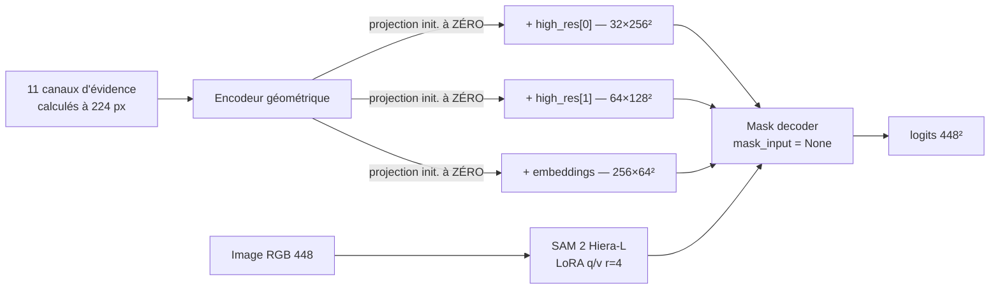

# CrackSAM-GeoLoRA — adaptation LoRA de SAM 2 guidée par la géométrie

> Quatrième itération de la ligne CrackSAM, et la première où la géométrie est
> **apprise dans le modèle** au lieu d'être appliquée en correction *post-hoc*.
>
> Conçue selon le §11 du [rapport CrackSAM-GFA](../CrackSAM-GFA/RAPPORT.md).
> Résultats et diagnostic complets dans [`RAPPORT.md`](RAPPORT.md), version
> exposée dans
> [`presentations/2026-08-09-cracksam-geolora/`](presentations/2026-08-09-cracksam-geolora/).

## Pourquoi apprendre la géométrie plutôt que la plaquer après coup

Les trois tentatives précédentes corrigeaient un modèle **gelé** : pseudo-masque
dense (`−0,0979` d'IoU en causal), résidu sélectif, puis arbitrage de fragments
(`−0,0066`, ou parité exacte selon le pli). Aucune n'a produit de gain.

Deux arguments imposent malgré tout de tenter l'apprentissage :

1. SAM 2 ne peut structurellement pas accéder aux modalités portée ou
   thermique ; aucune correction en aval ne créera cette information ;
2. corriger une bande de `19 px` de large demande une représentation
   multi-échelle qu'une retouche de logits ne fournit pas.

## Ce que la conception corrige explicitement

| Échec mesuré | Correction appliquée ici |
|---|---|
| `mask_input` nuisible (`−0,0979`) | la géométrie **n'y entre jamais** ; c'est un contrôle négatif |
| Moyenne géométrique équivariante | les 11 canaux restent **séparés** jusqu'à l'encodeur |
| Corridors trop étroits (1,8 % contre 5,7 % de GT) | injection **multi-échelle** à 256², 128² et 64² |
| Échelles héritées d'une étude « fissures fines » | filtres **réaccordés** sur la largeur mesurée de `19,1 px` |

## Architecture



À l'initialisation les projections sont nulles, donc le modèle **est** la
baseline gelée. `evidence=None` restitue cette voie exactement, ce qui rend le
contrôle « sans évidence » gratuit et vérifiable.

> [!WARNING]
> Le gain global `gamma` **ne doit pas** être initialisé à zéro en même temps que
> les projections. La sortie valant `gamma × projection(x)`, deux facteurs nuls
> annulent les deux gradients et figent l'adapter. Cette erreur a été commise,
> mesurée — `gamma` restait à `0,0000` et la variante géométrique était
> numériquement identique à sa version sans géométrie — puis corrigée. Le test
> `test_adapter_gradients_are_not_both_dead_at_initialisation` en garde trace.

## Échelle d'ablations

Chaque barreau est entraîné à **budget strictement égal** : mêmes données, même
nombre d'époques, même graine, même ordonnancement, en repartant de la LoRA
archivée convergée.

| # | Variante | Ce qu'elle isole | IoU test |
|---|---|---|---:|
| 0 | `baseline` | ancre à budget égal | 0,6241 |
| 1 | `cldice` | la perte de continuité seule | 0,6066 |
| 2 | `geo` | `cldice` + géométrie | 0,6083 |
| 3 | **`tol3`** | **la perte tolérante 3 px seule** | **0,6276** |
| 4 | `geo_tol3` | `tol3` + géométrie | 0,6270 |
| 5 | `geo_tol3_permuted` | même capacité, **alignement détruit** | 0,6265 |

**Résultat.** `tol3` bat la baseline en IoU stricte ; sous tolérance `k ≥ 1`,
toute la famille la dépasse. Mais `geo_tol3` et son contrôle permuté sont
indiscernables à toutes les tolérances — **le modèle est indifférent à
l'alignement de la géométrie**. Détail complet dans [`RAPPORT.md`](RAPPORT.md).

## Utilisation

```bash
python -m pytest ISPRS/CrackSAM-GeoLoRA/tests -q     # 15 tests

# 1. cache d'évidence (CPU, ~19 s/image, indispensable avant l'entraînement)
python ISPRS/CrackSAM-GeoLoRA/scripts/01_cache_evidence.py --data-root ... --split train ...

# 2. une variante
python ISPRS/CrackSAM-GeoLoRA/scripts/02_train.py --variant geo --init-from-baseline ...

# 3. évaluation sur le test officiel, avec la condition « sans évidence »
python ISPRS/CrackSAM-GeoLoRA/scripts/03_evaluate.py --checkpoint ... 

# 4. figures : réussites ET échecs
python ISPRS/CrackSAM-GeoLoRA/scripts/04_figures.py --run-root ...
```

Chaque époque écrit un `*_latest.pt` complet, état de l'optimiseur compris : la
reprise après préemption Spot repart à l'époque suivante, et non avec des
moments nuls.
