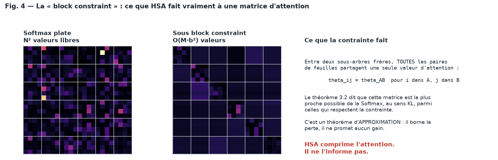
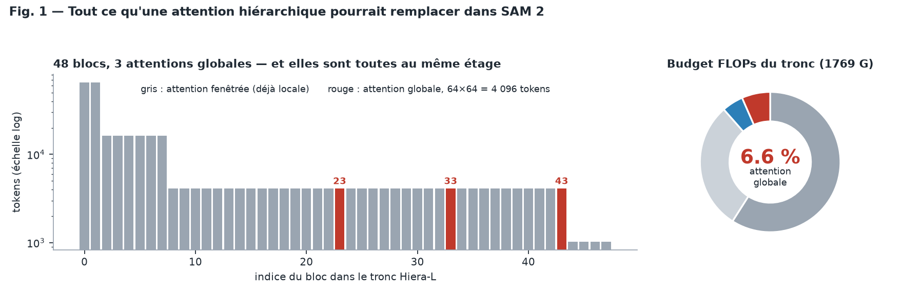
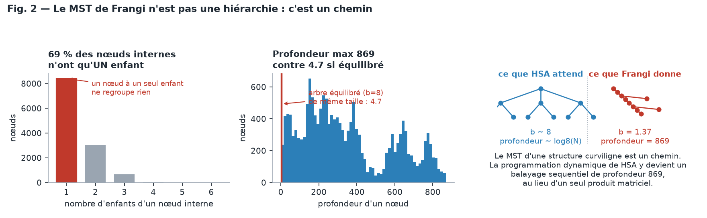
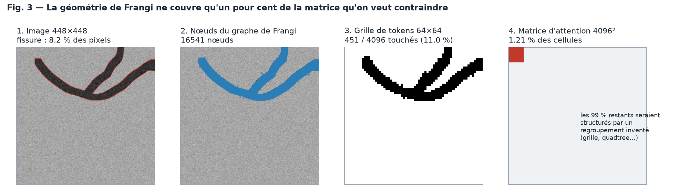
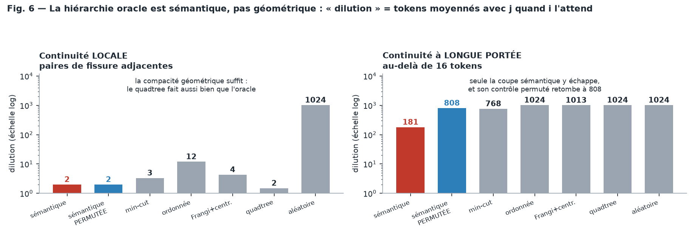

# Audit de faisabilité — contraindre l'attention de SAM 2 par la hiérarchie Frangi-Graphe

> **Date :** 14 août 2026
> **Statut :** audit de conception. **Aucun entraînement n'a été lancé.** Les seuls chiffres
> nouveaux produits ici sont des mesures d'architecture et de géométrie, reproductibles en
> quelques minutes de CPU (§7).
> **Question posée :** peut-on gagner sur CrackSAM / la baseline SAM 2 en contraignant la
> matrice d'attention selon la hiérarchie produite par le MST et la centralité de
> betweenness pondérée du Frangi-Graphe, selon la mécanique HSA de NeurIPS 2025 ?

**Réponse courte : non, pas sous cette forme.** Les obstacles sont *mesurés* et non
spéculatifs ; deux d'entre eux sont arithmétiques et ne dépendent d'aucun modèle. Mais
l'intuition qui sous-tend la question est juste, et une version de cette idée mérite d'être
testée — pour un coût de deux jours, pas de deux mois. Le §6 la détaille.

Le §3.5 traite séparément l'objection la plus sérieuse qu'on puisse opposer à cet audit :
retirer l'élagage qui précède le MST, pour obtenir une hiérarchie *complète*. Elle est
fondée, elle règle bien un des obstacles, et elle en aggrave un autre.

> [!TIP]
> **Première lecture : [`docs/00_COMPRENDRE.md`](docs/00_COMPRENDRE.md)**, qui présente le
> problème en dix minutes, sans supposer connus HSA, SAM 2 ni le Frangi-Graphe. Le présent
> document en est la version chiffrée et argumentée.

---

## Sommaire

- [1. L'intuition est bonne, et il faut le dire d'abord](#1-lintuition-est-bonne-et-il-faut-le-dire-dabord)
- [2. Ce que HSA fait réellement](#2-ce-que-hsa-fait-réellement)
- [3. Les obstacles mesurés](#3-les-obstacles-mesurés) — dont [§3.5](#35-retirer-lélagage-avant-le-mst--ce-que-cela-règle-et-ce-que-cela-aggrave) et [§3.6](#36-à-quoi-ressemblerait-la-hiérarchie-oracle--et-ce-quelle-demande-vraiment), les deux objections
- [4. Ce que cinq itérations ont déjà établi](#4-ce-que-cinq-itérations-ont-déjà-établi)
- [5. Verdict](#5-verdict)
- [6. Ce que je propose à la place, par ordre de valeur attendue](#6-ce-que-je-propose-à-la-place-par-ordre-de-valeur-attendue)
- [7. Reproduire les mesures de cet audit](#7-reproduire-les-mesures-de-cet-audit)
- [8. Ce qui rendrait ce verdict faux](#8-ce-qui-rendrait-ce-verdict-faux)

---

## 1. L'intuition est bonne, et il faut le dire d'abord

Avant les objections, l'argument favorable, dans sa version la plus forte — parce qu'il est
réel et qu'aucune des cinq itérations précédentes ne l'a réfuté :

1. **L'attention est le bon endroit.** Ce qui définit une fissure n'est pas sa couleur mais
   sa **connexité** : un chapelet de pixels sombres n'est une fissure que s'il est *relié*.
   La Softmax n'a aucun prior de connexité — c'est une affinité par produit scalaire, sans
   notion de chemin. Mettre un prior topologique dans l'attention est conceptuellement plus
   direct que le mettre dans un prompt ou dans une carte additive. C'est le meilleur argument
   de tout le dossier, et il est meilleur que ceux des itérations 1 à 5.

2. **Le graphe complet n'a jamais été utilisé.** Fait vérifié dans le code :
   `ISPRS/src/graph_extraction.py:263-265` porte le commentaire *« CrackSAM consumes only
   `node_sim_max`. Avoid the MST/betweenness branch when callers do not request centrality »*
   et la branche `compute_centrality=False` retourne avant le MST. **Aucune expérience
   CrackSAM n'a jamais vu ni MST, ni composantes, ni centralité.** Tous les échecs portent
   sur des cartes raster. Le rapport IRT du 12 août le redit explicitement : *« Que le graphe
   a été testé. MST, composantes et centralité restent hors périmètre. »*

3. **SAM *lit* la géométrie.** La matrice causale du 20 juillet mesure `+0,2473` d'IoU entre
   un prompt Frangi correct et le même prompt permuté. L'information passe ; c'est son usage
   qui échoue. Un échec d'interface autorise à chercher une meilleure interface.

4. **HSA est un cadre propre.** Dérivation par minimisation d'entropie, optimalité KL sous
   contrainte de blocs, algorithme en `O(M·b²)`. Ce n'est pas une heuristique de plus.

Ces quatre points justifiaient d'ouvrir ce dossier. Ce sont les mesures qui le referment.

---

## 2. Ce que HSA fait réellement

Le détail est dans [`docs/01_RESUME_HSA.md`](docs/01_RESUME_HSA.md). Trois faits suffisent
ici, tous tirés du papier lui-même.

### 2.1 HSA retire de l'information, il n'en ajoute pas



Le mécanisme central est la **block constraint** : pour deux sous-arbres frères `A` et `B`,

```
θ_{i,j} = θ_{A,B}   pour tout i ∈ ℓ(A), j ∈ ℓ(B)
```

Toutes les paires de tokens entre deux sous-arbres frères partagent **une seule valeur
d'attention**, calculée sur les moyennes de leurs `q`, `k`, `v`. Le théorème 3.2 établit que
la matrice obtenue est **la plus proche de la Softmax plate au sens KL** parmi celles qui
respectent cette contrainte.

C'est un théorème d'**approximation**. Il borne la perte ; il ne promet aucun gain. HSA est
un schéma de **compression** de la matrice d'attention — une matrice hiérarchique au sens de
Hackbusch — pas un mécanisme d'injection de prior.

> Formulé autrement : la question « et si on contraignait l'attention selon la hiérarchie ? »
> suppose que contraindre ajoute de la connaissance. Sous HSA, contraindre **égalise des
> coefficients**. Le seul « prior » transmis est *« les feuilles d'un même sous-arbre sont
> interchangeables »*. Pour une fissure de 19 px de large, dont l'identité tient précisément
> au contraste entre son intérieur et ses épaules, « interchangeable » est une hypothèse
> hostile.

### 2.2 HSA n'ajoute aucun paramètre apprenable

Annexe M du papier, dans sa propre section *Limitations* :

> « our proposed framework does not introduce any additional learnable parameter across the
> hierarchy on top of the standard self-attention parameters. […] in some other scenarios,
> this would introduce a limitation in terms of the learning capacity of our framework. »

Dans un régime LoRA sur modèle pré-entraîné, HSA ne peut donc que **soustraire** des degrés
de liberté. Il n'y a rien à apprendre de la hiérarchie ; il n'y a qu'à s'y soumettre.

### 2.3 Les résultats du papier ne soutiennent pas l'usage envisagé

| Régime | Résultat |
|---|---|
| Entraînement **de zéro**, 1,2 M paramètres, séquences longues tronquées par la Softmax | HSA **gagne** (IMDB 0,6739 → 0,7469) |
| Remplacement **zero-shot** dans un modèle **pré-entraîné** | HSA **perd sur 7 benchmarks / 7** (jusqu'à −0,42 sur QNLI) |

Notre cas — SAM 2 Hiera-L pré-entraîné, affiné en LoRA, séquence de 4 096 tokens jamais
tronquée — est le second régime, pas le premier.

Et l'ablation d'hiérarchies (annexe L) est le résultat le plus gênant du papier pour
l'hypothèse « une meilleure hiérarchie donnera un meilleur modèle » : les auteurs utilisent
délibérément des **fenêtres glissantes arbitraires** plutôt que la structure sémantique du
texte, et concluent que le choix de hiérarchie est *« relatively inconsequential »* (SST-2),
*« similar behavior »* (RTE), *« no significant difference »* (QNLI). Les deux tâches qui
montrent une différence (MRPC, CoLA) la montrent **en sens opposé**. Dans le papier
lui-même, une hiérarchie arbitraire fait aussi bien qu'une hiérarchie porteuse de sens.

---

## 3. Les obstacles mesurés

### 3.1 SAM 2 n'a que trois matrices d'attention à contraindre, et elles pèsent 6,6 % du calcul



Mesuré en instanciant Hiera-L
([`experiments/00_sam2_attention_budget.py`](experiments/00_sam2_attention_budget.py)) :

| | |
|---|---:|
| Blocs du tronc | **48** |
| Blocs à attention **globale** | **3** (indices 23, 33, 43) |
| Résolution de ces blocs | **64 × 64 = 4 096 tokens**, dim 576, 8 têtes |
| Part des 3 attentions globales dans les FLOPs du tronc | **6,56 %** |
| Part des MLP | 59,0 % |
| Part des projections linéaires | 29,5 % |

Les 45 autres blocs utilisent une attention **fenêtrée** : blocs 0–2 en fenêtres de 8 sur la
grille 256², blocs 3–8 en fenêtres de 4 sur 128², blocs 9–22/24–32/34–42/44 en fenêtres de 16
sur 64², blocs 45–47 en fenêtres de 8 sur 32². Leur matrice d'attention est déjà locale et
bloc-diagonale, donc déjà « contrainte géométriquement », par une grille.

Le décodeur de masques n'a **aucune** auto-attention image→image : son `TwoWayTransformer`
(profondeur 2, `embedding_dim` 256, 8 têtes) ne fait que token→token (6 × 6), token→image
(6 × 4 096) et image→token (4 096 × 6). Dans la voie sans prompt du dépôt, les tokens de
requête sont exactement six : `obj_score`, `iou` et quatre `mask_tokens`.

Enfin, les deux implémentations d'attention appellent `F.scaled_dot_product_attention(q, k, v)`
**sans argument `attn_mask`** : il n'existe aujourd'hui aucun point d'accroche pour une
contrainte, ni masque, ni biais. Toute intervention passe par un remplacement de `forward`
— c'est ce que fait [`experiments/02_attention_oracle.py`](experiments/02_attention_oracle.py).

**Conséquences directes.**

- La surface d'attaque totale est de 3 matrices `4096 × 4096`, pas d'un réseau d'attention.
- L'argument de performance de HSA — sa seule contribution *démontrée* — vaut ici **au plus
  6,56 %** du tronc, et seulement si l'on rend l'attention globale littéralement gratuite.
  Un gain qui ne survivrait pas au surcoût de construction des arbres et à la latence de la
  passe descendante (§3.3).

L'angle « monter en résolution pour que l'attention globale devienne dominante » ne sauve pas
la mise :

| Entrée | Tokens à l'étage 3 | px natifs/token (image 448) | FLOPs tronc | Part attention globale | Coût vs 1024 | Coût si HSA **gratuit** |
|---:|---:|---:|---:|---:|---:|---:|
| 1024 | 4 096 | 7,0 | 1 769 G | 6,6 % | 1,0× | 0,9× |
| 2048 | 16 384 | 3,5 | 8 466 G | 21,9 % | 4,8× | 3,7× |
| 4096 | 65 536 | 1,8 | 56 129 G | 52,9 % | **31,7×** | **15,0×** |

Rendre l'attention globale **totalement gratuite** à 4096 px laisse encore un coût 15 fois
supérieur à celui de 1024. HSA n'ouvre pas la haute résolution ; il en réduit la facture d'un
facteur 2 au mieux. Le pavage (*tiling*) la réduit d'un facteur ~30, pour un coût
d'ingénierie d'une journée.

### 3.2 Le MST de Frangi n'est pas une `signal hierarchy`, et il n'en produit pas une

C'est une erreur de catégorie, et c'est l'obstacle le plus fondamental.

| | HSA exige | Le Frangi-Graphe fournit |
|---|---|---|
| Nature | arbre **laminaire** de regroupements | arbre de recouvrement minimal (MST) |
| Position des tokens | aux **feuilles** uniquement | **les nœuds *sont* les pixels** |
| Nœuds internes | groupes, sans contenu propre | des pixels comme les autres |
| Couverture | **tous** les tokens | seulement les candidats retenus |
| Sortie de la centralité | — | un **scalaire par nœud**, pas une partition |

`extract_backbone_centrality` (`src/frangi_fusion/mst_kcenters.py:79`) enracine bien l'arbre
au maximum de centralité et élague de haut en bas — donc une famille laminaire *est*
dérivable, en prenant les sous-arbres. Mais elle retourne
`(backbone_nodes, skeleton_graph)` : un ensemble d'indices et un sous-graphe. Aucune
hiérarchie emboîtée n'est exportée. Et la version GPU
(`ISPRS/src/graph_extraction.py:359-408`) calcule le MST puis le **rastérise immédiatement**
en traits `cv2.line` : l'arbre ne quitte jamais la fonction.

Plus important encore : la « hiérarchie » invoquée par la centralité de betweenness n'en est
pas une. Sur un arbre, la betweenness pondérée `C(v) = m_v (M − m_v)` est **indépendante de
la racine** : c'est un champ scalaire sur l'arbre, un *classement* de pixels. Pour en tirer
une famille laminaire il faut choisir une racine et découper — un choix de conception
supplémentaire, dont les paramètres domineraient le résultat, et non une structure que la
méthode fournit.

> **Note utile.** Le seul objet du dépôt qui soit une signal hierarchy au sens de HSA — arbre
> laminaire, feuilles = pixels — est le **dendrogramme de single-linkage** de
> `src/frangi_fusion/clustering_sparse.py:78` (`_build_tree_single_linkage`, avec
> `parent_to_children`, tailles et stabilités). Il est binaire, et le single-linkage
> *chaîne* notoirement, donc il souffrira du §3.3 ; mais si l'on veut absolument une
> hiérarchie issue de notre pipeline, c'est celui-là, pas le MST.

### 3.3 L'arbre mesuré est un chemin, pas une hiérarchie



Mesuré sur des fissures synthétiques calibrées sur la géométrie réelle du jeu Khánh Hà
(448 px, largeur 19 px, couverture GT 5,4 % contre 5,70 % mesurés), avec les paramètres FIND
du papier EUVIP — [`experiments/01_frangi_tree_shape.py`](experiments/01_frangi_tree_shape.py) :

| Grandeur | Mesuré | Ce qu'il faudrait |
|---|---:|---:|
| Nœuds de l'arbre | 11 102 | — |
| **Profondeur** | **358** | **4,5** (arbre équilibré `b = 8` de même taille) |
| **Facteur de branchement moyen** | **1,34** | 4 à 16 |
| **Nœuds internes à un seul enfant** | **72 %** | ≈ 0 % |
| Valeurs d'attention distinctes par token sous HSA | 350 | 11 102 (Softmax plate) |

Les mêmes mesures sur deux autres configurations — fissure fine et fissure épaisse à 256 px,
couverture 3,0 % et 6,1 % — donnent `b = 1,21` et `1,22`, 85 % et 83 % de nœuds à un seul
enfant, profondeurs 282 et 331 contre 4,3 : les statistiques de forme ne dépendent ni de la
résolution ni de l'épaisseur de la fissure (`results/frangi_tree_shape_{thin,default}.json`).

Un arbre dont 72 à 85 % des nœuds internes n'ont **qu'un enfant** et dont la profondeur est
**80 fois** celle d'un arbre équilibré de même taille n'est pas une hiérarchie : c'est une
chenille — un chemin avec de courtes pattes. C'est exactement ce qu'on doit attendre du MST
d'une structure curviligne, et ce n'est pas un défaut d'implémentation : c'est la géométrie
de l'objet. Le §3.5 montre que **retirer l'élagage n'y change rien** : le branchement est
fixé par la fraction de feuilles, pas par les seuils.

Trois conséquences, toutes fatales :

1. **La complexité annoncée devient trompeuse.** `O(M·b²)` avec `b ≈ 1,3` vaut `O(N)`, ce qui
   *semble* excellent — mais c'est excellent parce que la matrice d'attention est devenue
   quasi tridiagonale. Chaque token ne voit plus que **350 valeurs d'attention distinctes**
   au lieu de 11 102, et elles sont réparties le long d'une chaîne de **171 ancêtres en
   moyenne** (358 au plus), à raison d'environ deux par niveau. Ce n'est plus de l'attention :
   c'est un balayage séquentiel. Un RNN, avec les mots d'un transformeur.

2. **La parallélisation GPU s'effondre.** L'annexe E.3 du papier ne parallélise `ϕ(·)` et
   `ϑ(·)` que **par niveau de profondeur** : il faut `D` produits creux **séquentiels**. Avec
   `D = 358`, cela fait 358 lancements de noyau séquentiels par bloc d'attention, par image,
   contre un `bmm` unique aujourd'hui. Les 6,56 % de FLOPs économisés sont perdus plusieurs
   fois.

3. **C'est précisément la structure que le papier mesure comme la pire.** L'annexe L teste
   quatre hiérarchies ; celle à faible branchement partout, `(2,2,2,2)`, est la seule à
   ressortir explicitement comme moins bonne sur SST-2. Notre arbre a `b ≈ 1,3`, soit encore
   au-dessous.

### 3.4 Sous l'élagage actuel, la géométrie ne couvre qu'une fraction infime de la matrice

Cet obstacle est **le seul des quatre que l'on sache lever** : le §3.5 mesure ce qui se passe
quand on retire l'élagage. Il vaut d'être chiffré d'abord, parce qu'il décrit le pipeline tel
qu'il existe aujourd'hui.



| Configuration | Tokens SAM 2 touchés (sur 4 096) | Cellules de la matrice `4096²` couvertes |
|---|---:|---:|
| 448 px, type Khánh Hà (GT 5,4 %) | 302 — **7,4 %** | **0,58 %** |
| 256 px, fissure fine (GT 3,0 %) | 594 — 14,5 % | 2,15 % |
| 256 px, fissure épaisse (GT 6,1 %) | 680 — 16,6 % | 2,78 % |

Ce n'est pas une question de seuil trop sévère, bien au contraire. Le seuil de candidature
de l'implémentation GPU est **relatif au maximum de l'image** — `τ₁ = max_S.max() × 0.01`,
`ISPRS/src/graph_extraction.py:150` — et retient donc **75,6 %** de tous les pixels. La
sélectivité vient ensuite de `τ = 0,25` sur les arêtes puis sur les nœuds, et enfin de la
plus grande composante connexe : 200 704 pixels → 151 735 candidats → 37 934 nœuds de
graphe → **11 102 nœuds d'arbre**. Élargir le graphe pour couvrir plus de tokens revient
donc à revenir en arrière dans une chaîne conçue pour élaguer.

Sur le jeu réellement utilisé, **moins de 1 % des cellules de la matrice d'attention**
contiennent de la géométrie de Frangi. Les 99,4 % restants — fond contre fond, fond contre
fissure — devraient être structurés par un regroupement **inventé** : une grille, un
quadtree, une fenêtre glissante. Or c'est ce regroupement arbitraire qui dominerait
numériquement le comportement de la couche.

> Le projet s'appellerait « attention hiérarchique guidée par Frangi », et à plus de 99 % ce
> serait « attention hiérarchique guidée par un quadtree ». Il faudrait le contrôle
> correspondant — quadtree seul, sans Frangi — et il y a tout lieu de penser qu'il ferait
> jeu égal, comme les fenêtres glissantes du papier font jeu égal avec les hiérarchies
> sémantiques.

### 3.5 Retirer l'élagage avant le MST : ce que cela règle, et ce que cela aggrave

> Objection soulevée par Louis Hauseux le 14 août 2026, après la première version de cet
> audit : *« pour obtenir une hiérarchie complète, il faudra bien sûr enlever l'élagage avant
> calcul du MST. »* Elle est fondée, et cette section la mesure au lieu de l'argumenter.

En retirant les trois étapes d'élagage qui précèdent le MST — le seuil de candidature `τ₁`,
puis `τ = 0,25` sur les arêtes et sur les nœuds — l'arbre couvre bien la totalité de l'image
(option `--no-prune` de [`experiments/01_frangi_tree_shape.py`](experiments/01_frangi_tree_shape.py)) :

| Configuration | Nœuds | Couverture | Feuilles | `b` | 1 enfant | Profondeur | Équilibré `b=8` |
|---|---:|---:|---:|---:|---:|---:|---:|
| élagué, 448 px (pipeline actuel) | 11 102 | 5,5 % | 25 % | 1,34 | 72 % | 358 | 4,5 |
| **non élagué, 448 px** | 200 704 | **100 %** | 25 % | **1,33** | 72 % | **2 414** | 5,9 |
| **non élagué, grille de tokens 64×64** | 4 096 | **100 %** | 13 % | **1,15** | 86 % | **157** | 4,0 |

**Ce que cela règle.** Le §3.4 disparaît complètement : la couverture passe de 0,58 % à
100 % des cellules de la matrice. C'est un vrai gain, et l'objection était nécessaire.

**Ce que cela ne règle pas — et pourquoi c'est structurel.** Le facteur de branchement ne
bouge pas : `1,33` contre `1,34`. Ce n'est pas une coïncidence, c'est une identité. Dans
**tout** arbre à `N` nœuds, la somme des nombres d'enfants vaut `N − 1` ; si `L` est le
nombre de feuilles, le branchement moyen sur les nœuds internes vaut

$$b = \frac{N-1}{N-L}$$

Obtenir `b = 8` exige donc `L/N = 87,5 %` de feuilles. Nos arbres en ont **13 à 25 %**, et
l'élagage n'y change rien. **`b` n'est pas un paramètre du pipeline : c'est la fraction de
feuilles**, et un arbre couvrant d'un graphe de voisinage géométrique — dont le degré moyen
vaut mécaniquement ≈ 2 — n'en produit pas davantage. Aucun réglage de `τ`, `R` ou `Σ` ne
franchit cette borne.

**Ce que cela aggrave.** La profondeur passe de `358` à **`2 414`** à pleine résolution. Le
mécanisme est clair : dans le fond de l'image la similarité `S ≈ 0`, donc
`d_ij = (1 − S)·ρ_ij ≈ ρ_ij`. Les poids deviennent quasi uniformes, et le MST erre. L'élagage
retenait précisément les arêtes de forte similarité, c'est-à-dire les segments courts et
cohérents ; le retirer rend l'arbre *plus* filiforme, pas moins. Or la passe descendante de
HSA coûte `D` produits creux **séquentiels** (§3.3) : on passe de 358 à 2 414 lancements de
noyau enchaînés par bloc d'attention et par image.

**Et la couverture gagnée n'est pas une couverture par Frangi.** Sur ~95 % de l'image
`S ≈ 0` : la structure de l'arbre y est dictée par la distance en pixels et le bruit de
texture, pas par l'opérateur de Hesse. L'obstacle du §3.4 ne disparaît donc pas, il **change
de forme** — de « la hiérarchie ne couvre pas la matrice » à « la hiérarchie couvre la
matrice, mais 99 % de sa structure ne porte aucun signal de Frangi ». C'est exactement ce
que mesurerait le contrôle permuté, et c'est le contrôle qui a dit non quatre fois.

**La meilleure version de l'idée, si l'on va au bout.** C'est la troisième ligne du tableau :
non élagué, **construit directement sur la grille 64 × 64**, puisque c'est la seule
résolution où une attention globale existe. Elle atteint 100 % de couverture pour 4 096
nœuds seulement, et une profondeur de 157 au lieu de 2 414. Elle laisse néanmoins `b = 1,15`,
86 % de nœuds internes à un seul enfant, et une profondeur 39 fois celle d'un arbre équilibré
de même taille — donc les §3.1, §3.2 et §3.3 tiennent, et le §2 (HSA comprime, sans paramètre
apprenable) n'est pas touché.

Pour obtenir un arbre réellement large il faudrait **décomposer** le MST — décomposition en
centroïdes, qui donne `O(log N)` de profondeur, ou un quadtree raffiné là où Frangi répond.
C'est un objet de conception à part entière, dont le Frangi-Graphe ne fournirait que
l'ossature, et c'est la quatrième condition de réfutation du §8.

### 3.6 À quoi ressemblerait la hiérarchie oracle — et ce qu'elle demande vraiment

> Deuxième objection de Louis Hauseux, le 14 août 2026 : *« réfléchis aussi à ce que pourrait
> être la hiérarchie oracle, et comment la calculer à partir de la vérité terrain. »* Elle
> sépare « la hiérarchie de Frangi est-elle assez bonne ? » de « **une** hiérarchie
> aiderait-elle ? ». Le détail est dans [`docs/02_HIERARCHIE_ORACLE.md`](docs/02_HIERARCHIE_ORACLE.md) ;
> voici le résultat.



La mesure comparable entre hiérarchies de profondeurs et d'arités différentes est la
**dilution** : quand `i` attend `j`, la clé et la valeur de `j` sont moyennées avec les
`|B′| − 1` autres feuilles de son plus haut ancêtre distinct. `1` = attention intacte.
Sept hiérarchies, toutes laminaires, toutes complètes sur la grille 64 × 64 :

| hiérarchie | prof. | arité | dilution **locale** | dilution **longue portée** |
|---|---:|---:|---:|---:|
| **`semantic` — {fissure, fond} au sommet** | 10,3 | 3,17 | **2** | **181** |
| `semantic_permuted` — contrôle causal | 10,0 | 3,23 | 2 | **808** |
| `spatial_mincut` — équilibré, évitant la fissure | 9,3 | 2,75 | 3 | 768 |
| `crack_ordered` — ordonné le long du squelette | 10,0 | 2,66 | 12 | 1 024 |
| `frangi_centroid` — MST de Frangi rééquilibré | 12,0 | 2,82 | 4 | 1 013 |
| `quadtree` — aucune connaissance de la fissure | 7,0 | 4,00 | **2** | 1 024 |
| `random` | 7,0 | 4,00 | 1 024 | 1 024 |

**Aucune hiérarchie équilibrée ne peut préserver la continuité à longue portée.** Toutes
plafonnent entre 768 et 1 024, y compris celle qui *cherche* explicitement à éviter la
fissure. C'est forcé : une coupe équilibrée au niveau 1 partage l'image en deux moitiés, donc
coupe toute fissure qui la traverse. Or l'équilibre est exactement ce que HSA exige pour son
`O(M·b²)`. **L'efficacité et la continuité s'opposent frontalement.**

**La seule échappatoire abandonne l'équilibre au sommet** : mettre la fissure entière dans un
sous-arbre. La dilution à longue portée tombe à `|fissure|/arité ≈ 181`, sans rien coûter en
local. Et le contrôle permuté donne `808` : le gain est causalement dû au **bon masque** —
c'est la séparation aligné-contre-permuté la plus nette de tout le dossier CrackSAM.

**Pour le local, la compacité géométrique suffit.** Le quadtree, qui ne sait rien de la
fissure, égale l'oracle (dilution 2) ; `spatial_mincut`, qui essaie explicitement, fait moins
bien, parce qu'il échange de la compacité contre du contournement. C'est la re-dérivation,
depuis les premiers principes et dans notre cadre, de l'annexe L du papier HSA.

> [!IMPORTANT]
> **Ce que l'oracle demande réellement : une carte binaire fissure/fond.** Ni MST, ni
> composantes, ni centralité — donc *pas* la partie du Frangi-Graphe qui n'avait jamais été
> testée et qui motivait ce dossier. Ce qu'il faut, c'est `node_sim_max` seuillé : la carte
> même qui a échoué comme prompt dense en juillet. La question devient donc précise et
> ouverte : **la même carte, injectée comme structure de blocs de l'attention au lieu
> d'hypothèse de masque, aide-t-elle ?** C'est exactement le bras `block` du §P0.

Note constructive au passage : la **décomposition en centroïdes** répare le défaut du §3.3.
Elle transforme la chenille de Frangi (`b ≈ 1,15`, profondeur 157) en un arbre de profondeur
12 et d'arité 2,82, pleinement compatible avec HSA. Le correctif que le §8 mentionnait sans
le construire tient en trente lignes et il est dans
[`04_oracle_hierarchy.py`](experiments/04_oracle_hierarchy.py). Il ne sauve pas la méthode —
dilution 4 en local, 1 013 en longue portée — mais il retire un argument de l'audit.

---

## 4. Ce que cinq itérations ont déjà établi

Ces résultats sont dans le dépôt ; ils contraignent toute sixième tentative.

| Itération | Mécanisme | Résultat mesuré |
|---|---|---:|
| 1. `frangi_dense_prompt_sam2_lora` | similarité → pseudo-logits → `mask_input` | **−0,00985** IoU macro, IC95 `[−0,01198 ; −0,00779]` |
| — matrice causale (20/07) | prompt Frangi sur poids baseline | **−0,0979** ; logits nuls **−0,1641** ; correct vs permuté **+0,2473** |
| 2. `frangi_graph_residual` | résidu sélectif + porte d'abstention | pas de gain démontré |
| 3. **CrackSAM-GFA** | arbitrage de fragments, identité bit à bit garantie | oracle `+0,01037` (seuil `+0,01`, borne basse sous le seuil) ; arbitre entraîné **−0,00661** ; 4 plis sur 5 s'abstiennent |
| 4. **CrackSAM-GeoLoRA** | 11 canaux appris, injection multi-échelle 256²/128²/64² | `geo_tol3` **0,6270** vs contrôle **permuté 0,6265** — indiscernables à toutes les tolérances |
| 5. **CrackSAM-IRT** (multimodal) | correcteur signé sur évidence thermique | `A7 − A8 = +0,0041`, IC95 `[+0,0016 ; +0,0067]` — **premier écart aligné/permuté significatif de la ligne** |

> [!WARNING]
> Les IoU **absolues** de ces lignes ne sont pas comparables entre elles : `0,5675` est une
> macro sur six conditions de bruit, `0,6237` et `0,6241` sont des baselines à budget
> d'entraînement différent, et IRT change de jeu de données. **Seuls les deltas appariés,
> à l'intérieur d'une ligne, ont un sens.** C'est d'ailleurs la discipline que chaque rapport
> applique.

Trois enseignements structurent la suite.

**(a) Le contrôle permuté est le juge, et il n'a dit oui qu'une fois — hors du visible.** Là
où il a été exécuté sur Khánh Hà, il n'a jamais séparé la variante géométrique de son
contrôle ; il n'a tranché en faveur de la géométrie que sur IRT-Crack, en multimodal.
GeoLoRA le formule sans détour : *« Le contrôle permuté montre que le modèle est indifférent à l'alignement de la
géométrie. Ce n'est pas un signal faible mal exploité, c'est l'absence de signal. »* Et sa
mise en garde vise nommément ce genre de projet : *« Ce qu'il ne faut pas faire : augmenter
la capacité de l'adapter, allonger l'entraînement, ou empiler un GNN. »*

**(b) L'échelle, pas l'architecture, a plafonné GFA.** Les fissures annotées font **19,1 px**
de large en moyenne et couvrent **5,70 %** de l'image ; les corridors géométriques, hérités
d'une étude sur des vallées de 1 à 3 px, font 7 px et couvrent **1,8 %**. *Même parfaitement
placés*, ils ne peuvent recouvrir qu'un tiers de la vérité terrain. La borne supérieure de
`+0,0346` mesure cette erreur de dimensionnement, pas la difficulté du problème. **Aucune
architecture ne répare une erreur d'échelle**, et HSA moins que toute autre, puisqu'il opère
sur des tokens de 7 px natifs.

**(c) Le seul signal causal de la ligne vient du multimodal.** `A7 − A8 = +0,0041` sur
IRT-Crack est le premier écart aligné-contre-permuté significatif en cinq itérations. Il
apparaît là où SAM **n'a structurellement pas accès à la modalité**. C'est cohérent avec
(a) : sur Khánh Hà, monomodal visible, avec une baseline supervisée sur ce domaine même, la
géométrie de Frangi ne dit rien que la LoRA n'ait déjà appris. Sur une modalité que SAM ne
voit pas, elle dit quelque chose.

> Et le verrou identifié par IRT n'est pas un verrou d'attention : c'est **une porte qui
> décide *où* corriger**. Appliquée au seul tiers difficile, la correction vaudrait
> `+0,0044` sans aucune des pertes. C'est un problème d'estimation de fiabilité, pas de
> mécanique d'attention.

---

## 5. Verdict

**Ne pas implémenter HSA sur SAM 2.** Sept faits, tous vérifiables — étant entendu que
l'objection du §3.5 en a fait tomber un huitième, et qu'elle avait raison :

1. HSA **comprime** l'attention, il ne l'informe pas (théorème 3.2 : KL-optimal *sous*
   contrainte, donc au mieux égal à la Softmax).
2. Il n'ajoute **aucun paramètre apprenable** — limitation revendiquée par ses auteurs.
3. Dans son propre régime *modèle pré-entraîné*, il perd sur **7 benchmarks sur 7**.
4. Sa propre ablation conclut que le **contenu** de la hiérarchie est le plus souvent sans
   effet.
5. SAM 2 n'offre que **3 matrices d'attention globale**, pesant **6,56 %** des FLOPs.
6. Le MST de Frangi est une **chenille** (`b ≈ 1,3`, profondeur 358 contre 4,5), et non une
   hiérarchie : la DP dégénère en balayage séquentiel de profondeur 358.
7. Le branchement **ne se règle pas** : `b = (N−1)/(N−L)` est fixé par la fraction de
   feuilles, qui vaut 13 à 25 % là où `b = 8` en exigerait 87,5 %. Ni `τ`, ni `R`, ni `Σ`,
   ni la suppression complète de l'élagage n'y changent quoi que ce soit (§3.5).

> [!NOTE]
> **Ce qui est tombé — deux fois.** Le §3.6 retire un second argument : la
> **décomposition en centroïdes** rend le MST de Frangi pleinement compatible avec HSA
> (profondeur 12, arité 2,82). Le fait 6 ne vaut donc que pour le MST *brut*, pas pour ce
> qu'on peut en faire. Et la couverture — quatrième obstacle de la première version de cet
> audit — **n'en est plus un** : retirer l'élagage avant le MST porte la couverture de
> 0,58 % à 100 % des cellules de la matrice. L'objection est de Louis Hauseux et elle était
> juste. Elle a un prix, mesuré au §3.5 : la profondeur passe de 358 à 2 414 à pleine
> résolution (157 sur la grille de tokens, la bonne résolution), et la structure ajoutée est
> dictée par la distance en pixels, pas par l'opérateur de Frangi. Les six autres faits
> tiennent, et les quatre premiers — qui portent sur HSA lui-même — ne sont pas touchés.

Coût estimé si l'on passait outre : **6 à 10 semaines** — réimplémentation intégrale des
algorithmes 1–3 (aucun code public : *« code is not being released at the moment »*),
parallélisation par profondeur en tenseurs creux, concaténation en largeur pour le batch,
intégration dans `hieradet.Hiera`, construction et mise en cache d'un arbre par image,
puis la campagne d'ablations et ses contrôles. Pour un mécanisme dont le meilleur cas
documenté est *« la même exactitude, moins de FLOPs »*, sur les 6,56 % de FLOPs disponibles.

**Ce que ce verdict ne dit pas.** Il ne dit pas que l'attention est le mauvais endroit — le
§1 maintient que c'est le meilleur endroit restant. Il dit que **HSA est le mauvais outil**
pour y mettre un prior : c'est un compresseur, et on cherche un injecteur.

---

## 6. Ce que je propose à la place, par ordre de valeur attendue

Chaque étape a un critère d'arrêt. L'ordre est celui du rapport information/coût, pas celui
de l'intérêt scientifique.

### P0 — L'oracle d'attention. **2 heures de GPU. À faire avant toute décision.**

C'est l'expérience que cet audit recommande le plus fermement, et elle est **spécifique à
votre idée** : elle en mesure directement le plafond.

Sur la baseline `tol3` **gelée**, poser un *hook* sur les blocs 23, 33 et 43 et ajouter aux
logits d'attention un biais dérivé de la **vérité terrain** :

```
logits[i, j] += β  si i et j appartiennent tous deux à la même composante GT (dilatée)
logits[i, j] −= β  si l'un des deux seulement y appartient
```

Balayer `β ∈ {0, 1, 2, 4, 8}`, mesurer l'IoU. Aucun entraînement, aucun paramètre.

**Ce que ça tranche.** Cette contrainte est l'**oracle parfait** de tout guidage
d'attention : elle connaît la vraie topologie, sans bruit et sans erreur d'échelle. Une
contrainte issue de Frangi ne peut pas faire mieux, seulement pire.

- Si `max_β ΔIoU < +0,01` → **toute la famille est morte**, HSA compris, et vous l'aurez
  su en une matinée.
- Si `ΔIoU > +0,03` → il y a du gras, et le §P2 devient légitime.

> [!TIP]
> Le §3.6 établit que ce second bras **est** l'oracle : la meilleure hiérarchie possible pour
> une fissure est `{fissure, fond}` au sommet, et il n'y a pas de structure plus riche à
> chercher avant de l'avoir lancée.

**Le second bras, qui teste votre mécanisme directement.** Le même script applique la
**vraie block constraint de HSA** — terme `log |ℓ(B)|` de l'algorithme 3 compris — avec la
partition **parfaite** {fissure, fond}. Il isole la question que cet audit juge décisive :
*lier* les coefficients d'attention en blocs coûte-t-il quelque chose **même quand la
partition est parfaite** ? Si oui, une hiérarchie bruitée et déséquilibrée — `b = 1,15`,
86 % de nœuds à un seul enfant, même dans sa meilleure variante non élaguée du §3.5 — ne
peut que faire pire, et le §5 devient démontré expérimentalement au lieu d'être seulement
argumenté.

Cet oracle manque à la lignée : GFA a mesuré un oracle de *sélection de fragments*, GeoLoRA
un oracle d'*évidence*, tous deux prescrits par `docs/09` et `docs/10`. **L'oracle
d'*attention* n'a jamais été posé.** Il coûte moins qu'une réunion.

Le script est écrit, commenté et auto-testé :
[`experiments/02_attention_oracle.py`](experiments/02_attention_oracle.py). Il branche les
deux bras en remplaçant le `forward` des blocs 23/33/43 — nécessaire, puisque les attentions
de Hiera appellent `scaled_dot_product_attention` sans `attn_mask`. Sa mécanique se vérifie
sans GPU ni poids :

```bash
python ISPRS/CrackSAM-HierarchicalSelfAttention/experiments/02_attention_oracle.py --self-test
```

> [!CAUTION]
> Les deux bras consomment la **vérité terrain à l'inférence**. Ce sont des bornes
> supérieures, jamais des résultats publiables — la même discipline que l'oracle de source
> de GFA.

### P0b — Réaccorder Frangi sur 19 px. **2 heures de CPU. Rend tout le reste plus probable.**

Le diagnostic de GFA §6.1 est chiffré et n'a jamais été appliqué : `Σ = {1,3,5,7}` et `R = 3`
sont accordés sur des vallées de 1 à 3 px, alors que les fissures du jeu font 19,1 px. Passer
à `Σ = {4, 8, 12, 16}` et `R` à l'avenant, puis remesurer la couverture des corridors (`1,8 %`
aujourd'hui, cible `5,70 %`) et la borne supérieure de la famille de candidats
(`+0,0346` aujourd'hui).

C'est deux lignes de configuration. Tant que ce n'est pas fait, **toute conclusion négative
sur la géométrie est confondue avec une erreur de dimensionnement**, et cela vaut aussi pour
le présent audit.

### P1 — La première vraie utilisation du graphe : des prompts natifs issus de la centralité. **2 à 3 jours de GPU.**

Le graphe n'a jamais été testé ; l'interface dense a échoué ; mais SAM 2 possède une
interface **conçue** pour des indices ponctuels, jamais utilisée ici. Et la centralité de
betweenness est exactement ce qu'il faut pour l'alimenter : un **classement** de pixels par
importance topologique.

- Élaguer le MST par `extract_backbone_centrality`, échantillonner `k` points positifs le
  long du backbone **par centralité décroissante**, plus des points négatifs sur les
  composantes rejetées ;
- les fournir comme `point_coords` / `point_labels`, jamais comme `mask_input` ;
- la hiérarchie sert de **calendrier grossier-à-fin** : `k = 1, 3, 5, 10` en raffinement
  itératif — c'est le mode de fonctionnement natif de SAM.

Contrôles obligatoires, tels que la ligne les a établis : points permutés entre images,
points décalés, points aléatoires à même effectif, et une condition sans prompt.

C'est la seule proposition qui utilise **réellement** MST + composantes + centralité, pour
un coût d'ingénierie de quelques jours et zéro chirurgie d'architecture.

### P2 — Si et seulement si P0 montre du plafond : un biais structurel additif, pas HSA. **1 semaine.**

La bonne façon de mettre un prior topologique dans l'attention n'est pas de **lier** des
coefficients, c'est d'en **décaler** :

```
logits[i, j] += b_h[ bucket( d_graphe(i, j) ) ]
```

où `d_graphe` est la distance géodésique dans le graphe de Frangi (∞ hors graphe, seau
dédié) et `b_h` un vecteur de ~8 scalaires appris **par tête**. Soit `3 blocs × 8 têtes × 8
seaux = 192` paramètres — à comparer aux **453 248** paramètres entraînables de la LoRA
actuelle (rang 4, `alpha` 4, soit 0,20 % des 224,9 M du modèle). Le contrôle de capacité est
donc gratuit : un bras à `b_h` gelé à zéro est exactement la baseline.

Contre HSA : préserve la résolution de l'attention, **ajoute** de la capacité au lieu d'en
retirer, s'entraîne avec la LoRA existante, s'ablate proprement (mettre `b_h = 0`), et se
teste contre un graphe permuté. C'est la mécanique de Graphormer et du biais relatif de T5 —
ni original ni publiable seul, mais c'est la version *qui a un mécanisme*.

### P3 — La direction que le dépôt recommande déjà : le multimodal sur FIND. **Hors périmètre de cet audit, mais c'est là qu'est le signal.**

`A7 − A8 = +0,0041` est le seul écart aligné/permuté significatif de cinq itérations, et il
vient d'une modalité que SAM ne voit pas. FIND a l'avantage décisif que le rapport IRT
identifie : **son range laser est co-recalé par construction du capteur**, là où la thermique
d'IRT-Crack est décalée de 10,1 px et plafonne le gain. Et le verrou nommé — une porte qui
décide *où* corriger, valant `+0,0044` — est un problème d'estimation de fiabilité, pas
d'attention.

### Coût réel, et garde-fous que ces pistes doivent respecter

Le seul GPU du projet est un `g4-standard-48` Spot (RTX PRO 6000 Blackwell 96 Go), **un seul
à la fois pour tout le projet**, avec `maxRunDuration` plafonné à **8 h**. Débits mesurés sur
les journaux réels :

| Opération | Coût mesuré |
|---|---:|
| Une passe d'évaluation complète, 6 conditions, 8 895 images | **3,9 min** (0,0250 s/image) |
| Un entraînement SAM 2 + LoRA, 70 époques | 9,3 GPU-h |
| Un pilote FrangiGraph résiduel, 30 époques × 5 plis | 7,9 GPU-h / graine |
| **Une nouvelle variante × 3 graines** | **24 à 28 GPU-h, ≥ 6 sessions Spot** |

Le **P0 tient donc largement dans une session** : le bras `bias` est de l'inférence pure
(cinq `β` ≈ 20 min de forward), le bras `block` paie une boucle Python par image et reste
sous les deux heures sur un sous-ensemble d'analyse. C'est le meilleur rapport
information/coût de tout le dossier.

Quatre garde-fous, hérités des rapports précédents, s'appliquent à P1 et P2 :

1. **Le test Khánh Hà n'est pas indépendant** : 730 groupes physiques sont partagés entre
   `train` et `test`, 325 entre `train` et `val`, 248 entre `val` et `test`
   (`protocol/frangigraph_v1/manifest.json`). Tout résultat y est **exploratoire** ; le
   holdout confirmatoire dédoublonné *n'existe pas encore*.
2. **Les IC historiques sont trop étroits** : ils rééchantillonnent les crops, pas les images
   physiques (`docs/08` §5.4). Tout nouveau bootstrap doit être groupé par image physique —
   `analyze_frangigraph_pilot_bootstrap.py`, pas la version au niveau crop.
3. **Un gain sur « sans Frangi » ne prouve rien.** `docs/08` §8.1 exige des contrôles
   réentraînés **à capacité égale** — décalé, permuté, aléatoire à couverture appariée —
   avant toute affirmation sur la valeur du contenu géométrique.
4. **Pré-enregistrer les critères** avant de toucher aux données, et **geler le code** avant
   de lancer une graine : `train_sam2.py` refuse de reprendre si le sha256 du contrat de run
   change, donc toute retouche invalide les points de reprise en vol.

### Et si vous voulez tout de même écrire quelque chose autour de HSA

Le rapprochement intellectuellement honnête n'est pas « HSA dans SAM », c'est **HSA dans
notre propre pipeline** : rendre différentiable la chaîne graphe → MST → centralité, en
remplaçant l'élagage dur par une attention hiérarchique sur le dendrogramme de
`clustering_sparse.py` (§3.2). On y a les jeux (FIND, CrackForest, VT-GraF, Vaches Noires),
les baselines, les métriques et les implémentations GPU. La hiérarchie y est *centrale* au
lieu d'être plaquée, et la contribution est la nôtre.

C'est un vrai programme de recherche, pas un correctif. Il ne faut l'ouvrir qu'après P0 et
P0b, et en sachant que le chaînage du single-linkage y reproduira le problème du §3.3.

---

## 7. Reproduire les mesures de cet audit

Aucune donnée, aucun *checkpoint*, aucun GPU. Compter dix minutes pour le premier script,
une vingtaine de minutes pour le second.

```bash
# §3.1 — budget d'attention de SAM 2 Hiera-L et balayage en résolution
python ISPRS/CrackSAM-HierarchicalSelfAttention/experiments/00_sam2_attention_budget.py

# §3.3 et §3.4 — forme de l'arbre de Frangi, calibré sur la géométrie de Khánh Hà
python ISPRS/CrackSAM-HierarchicalSelfAttention/experiments/01_frangi_tree_shape.py \
    --size 448 --width 9 --branches 1 --trunk-scale 0.8 --n-images 3 --tag khanhha

# §3.6 — les sept hiérarchies candidates et leurs dilutions
python ISPRS/CrackSAM-HierarchicalSelfAttention/experiments/04_oracle_hierarchy.py --n-images 3

# les six figures de ce document
python ISPRS/CrackSAM-HierarchicalSelfAttention/experiments/03_figures.py

# la mécanique de l'oracle recommandé au §P0, sans GPU ni poids
python ISPRS/CrackSAM-HierarchicalSelfAttention/experiments/02_attention_oracle.py --self-test

# §3.5 — sans élagage, à pleine résolution puis sur la grille de tokens
python ISPRS/CrackSAM-HierarchicalSelfAttention/experiments/01_frangi_tree_shape.py \
    --size 448 --width 9 --branches 1 --trunk-scale 0.8 --n-images 2 \
    --no-prune --tag khanhha_noprune
python ISPRS/CrackSAM-HierarchicalSelfAttention/experiments/01_frangi_tree_shape.py \
    --size 448 --width 9 --branches 1 --trunk-scale 0.8 --n-images 3 \
    --no-prune --downsample-to 64 --sigma 1 2 3 --tag tokengrid_noprune

# variantes fines et épaisses à 256 px
python ISPRS/CrackSAM-HierarchicalSelfAttention/experiments/01_frangi_tree_shape.py \
    --width 0.5 --branches 2 --tag thin
python ISPRS/CrackSAM-HierarchicalSelfAttention/experiments/01_frangi_tree_shape.py \
    --tag default
```

Les sorties sont dans [`results/`](results/).

> [!IMPORTANT]
> **Limite assumée.** Les fissures du §3.3–3.4 sont **synthétiques**, calibrées sur trois
> grandeurs mesurées du jeu Khánh Hà (448 px, largeur 19 px, couverture 5,70 % — obtenue
> ici à 5,4 %). Les statistiques de forme d'arbre — `b ≈ 1,2–1,34`, 72–85 % de nœuds à un
> seul enfant, profondeur 80× celle d'un arbre équilibré — sont stables sur les cinq
> configurations testées et découlent de la nature curviligne de l'objet ; je les tiens pour
> robustes. Le taux de couverture en tokens (7,4 %) dépend en revanche de l'**étalement
> spatial** de la fissure et varie de 7 à 17 % selon la configuration : à rejouer sur les
> vraies images avant d'être cité comme définitif. `frangi_mst()` prend n'importe quel
> tableau `float32` en entrée ; il suffit de lui donner les images du jeu.

---

## 8. Ce qui rendrait ce verdict faux

Par honnêteté, les conditions sous lesquelles je me trompe :

1. **Si l'oracle d'attention (P0) donne plus de `+0,03`.** Alors contraindre l'attention a
   une marge réelle, et il devient rationnel de chercher le bon injecteur — P2 d'abord, HSA
   ensuite si l'on tient à la formulation par blocs.
2. **Si les fissures visées deviennent fines.** Tout le §3 est calibré sur des annotations de
   19 px. Sur FIND (256 px, fissures de 1 à 3 px) ou sur les fissures géologiques, le rapport
   entre la largeur de l'objet et le token de 16 px change de nature — mais dans le sens
   *défavorable* : la fissure passe sous la résolution du token, et l'attention globale cesse
   d'être le bon niveau. L'erreur serait alors que le §3.4 est **optimiste**.
3. **Si l'on quitte le régime pré-entraîné + LoRA.** Le seul régime où HSA gagne dans son
   papier est l'entraînement de zéro d'un petit modèle. Un segmenteur de fissures léger,
   entraîné de zéro, avec une hiérarchie multi-échelle *équilibrée* (quadtree raffiné là où
   Frangi répond), est un objet où HSA garde tout son sens. Ce n'est plus SAM 2, et ce n'est
   plus le projet CrackSAM.
4. **Si une hiérarchie équilibrée est construite au lieu du MST.** Le §3.5 montre que ni le
   réglage de `τ`, ni la suppression complète de l'élagage n'y suffisent : `b` est fixé par
   la fraction de feuilles, invariante autour de 13–25 %. Il faudrait **décomposer** l'arbre
   — décomposition en centroïdes, profondeur `O(log N)` —, ce qui lèverait le §3.3 et, avec
   le non-élagage, le §3.4. Resteraient le §3.1, le §3.2 et tout le §2 ; et l'objet obtenu
   serait une conception à part entière dont Frangi ne fournirait que l'ossature.

---

## Références internes

- [Résumé technique de HSA](docs/01_RESUME_HSA.md) — le papier NeurIPS en 8 points.
- [La hiérarchie oracle](docs/02_HIERARCHIE_ORACLE.md) — construction, mesure et conséquences des sept hiérarchies candidates.
- [Question expérimentale de la ligne CrackSAM](../CrackSAM/docs/01_EXPERIMENTAL_QUESTION.md)
- [Guidage géométrique anti-ombre](../CrackSAM/docs/10_GUIDAGE_GEOMETRIQUE_ANTI_OMBRE_CRACKSAM2.md) — §6.1 « étape zéro : plafond oracle ».
- [Rapport CrackSAM-GFA](../CrackSAM-GFA/RAPPORT.md) — §6.1, l'erreur d'échelle à 19,1 px.
- [Rapport CrackSAM-GeoLoRA](../CrackSAM-GeoLoRA/RAPPORT.md) — §8, le contrôle permuté et ce qu'il interdit.
- [Synthèse CrackSAM-IRT](../CrackSAM-MultiModal/IRT-Signed-Abstention/SYNTHESE.md) — le premier écart aligné/permuté significatif.
- [Papier EUVIP 2026](../../EUVIP/EUVIP_2026_Generalized_Frangi_Multimodality_camera-ready.pdf) — la méthode Frangi-Graphe.

## Références externes

1. S. Amizadeh, S. Abdali, Y. Li, K. Koishida, *Hierarchical Self-Attention: Generalizing
   Neural Attention Mechanics to Multi-Scale Problems*, NeurIPS 2025.
   ([PDF local](NeurIPS-2025-hierarchical-self-attention-generalizing-neural-attention-mechanics-to-multi-scale-problems-Paper-Conference.pdf))
2. N. Ravi *et al.*, *SAM 2: Segment Anything in Images and Videos*, arXiv:2408.00714, 2024.
3. C. Ying *et al.*, *Do Transformers Really Perform Bad for Graph Representation?*
   (Graphormer), NeurIPS 2021 — le biais structurel additif du §P2.
4. W. Hackbusch, *Hierarchical Matrices: Algorithms and Analysis*, Springer, 2015 — la
   famille de matrices dont relève la block constraint.
5. K. Ge *et al.*, *Fine-tuning vision foundation model for crack segmentation in civil
   infrastructures* (CrackSAM), Construction and Building Materials, 2024.
