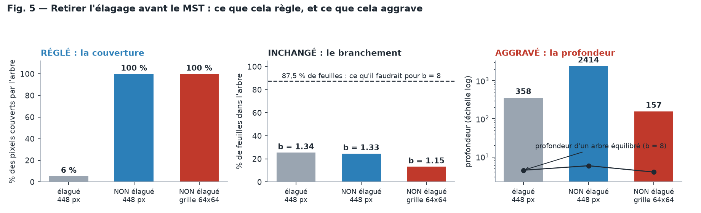

# CrackSAM-HierarchicalSelfAttention

> **Étude de faisabilité, close sur un no-go — sans une seconde de GPU.**
>
> Peut-on gagner sur la baseline SAM 2 en contraignant sa matrice d'attention par la
> hiérarchie du Frangi-Graphe, selon la mécanique *Hierarchical Self-Attention*
> (NeurIPS 2025) ?

| | |
|---|---|
| 🎓 **Pour comprendre** | [`docs/00_COMPRENDRE.md`](docs/00_COMPRENDRE.md) — le problème en dix minutes, sans prérequis |
| 📐 **Pour décider** | [`AUDIT.md`](AUDIT.md) — l'argumentaire chiffré, les contre-propositions, et ce qui rendrait le verdict faux |
| 📄 **Pour vérifier HSA** | [`docs/01_RESUME_HSA.md`](docs/01_RESUME_HSA.md) — le papier NeurIPS en huit points |
| ⚙️ **Pour agir** | [`experiments/02_attention_oracle.py`](experiments/02_attention_oracle.py) — l'oracle à lancer avant toute décision, 2 h de GPU |

---

## L'idée, et pourquoi elle méritait d'être examinée

Une fissure n'est pas définie par sa couleur mais par sa **connexité**. Or l'attention
Softmax de SAM 2 compare des vecteurs deux à deux : **elle n'a aucun prior de chemin**. Nous
avons précisément cela — un graphe, un MST, une centralité de betweenness. Mettre cette
structure dans l'attention est l'idée la plus directe de toute la lignée CrackSAM, et
meilleure que les cinq précédentes, qui injectaient la géométrie *à côté* du raisonnement
du modèle plutôt que dedans.

Et le graphe complet **n'a jamais été testé** : tous les échecs portent sur des cartes
raster, `compute_centrality=False` partout (`ISPRS/src/graph_extraction.py:263`).

**Le no-go ne porte donc pas sur l'endroit, mais sur l'outil : HSA est un compresseur
d'attention, et on cherche un injecteur de prior.**

## Le verdict en un tableau

| Ce qu'il faudrait | Ce qu'on a | Mesuré par |
|---|---|---|
| Beaucoup de matrices d'attention à contraindre | **3 blocs sur 48** dans Hiera-L, `64×64`, **6,56 %** des FLOPs du tronc | [`00`](experiments/00_sam2_attention_budget.py) |
| Un arbre **laminaire**, tokens aux **feuilles** | un **MST**, dont les nœuds *sont* les pixels ; la centralité rend un **scalaire**, pas une partition | `src/frangi_fusion/mst_kcenters.py:79` |
| Un arbre **équilibré**, profondeur `log_b N` | une **chenille** : `b ≈ 1,3`, **72 %** de nœuds à un seul enfant, profondeur **358** contre **4,5** | [`01`](experiments/01_frangi_tree_shape.py) |
| Un branchement réglable | `b = (N−1)/(N−L)` est **fixé par la fraction de feuilles** : 13 à 25 %, là où `b = 8` en exigerait 87,5 % | [`01`](experiments/01_frangi_tree_shape.py) |
| Un mécanisme qui **injecte** un prior | HSA **comprime** : KL-optimal *sous* contrainte, **zéro paramètre apprenable**, **7 dégradations sur 7** en zero-shot | [`docs/01`](docs/01_RESUME_HSA.md) |


### L'objection à laquelle le dossier répond par la mesure

> *« Pour obtenir une hiérarchie complète, il faudra bien sûr enlever l'élagage avant calcul
> du MST. »* — Louis Hauseux, 14 août 2026

Elle est juste, et elle **lève un des obstacles mesurés** : la couverture passe de 0,58 % à
100 % des cellules. Mais le branchement ne bouge pas — c'est une identité, pas un réglage —
et la profondeur passe de 358 à 2 414. Détail au [§3.5 de l'audit](AUDIT.md#35-retirer-lélagage-avant-le-mst--ce-que-cela-règle-et-ce-que-cela-aggrave).



La meilleure version de l'idée est donc : **non élaguée, construite directement sur la grille
64 × 64** — 100 % de couverture pour 4 096 nœuds et une profondeur de 157 au lieu de 2 414.
Elle reste à `b = 1,15` et 86 % de nœuds internes à un seul enfant.

## Ce que l'audit recommande à la place

| | Action | Coût | Ce que ça tranche |
|:--:|---|---|---|
| **P0** | **Oracle d'attention** : biaiser les 3 blocs globaux avec la vérité terrain, sans entraînement | **2 h GPU** | le plafond de *tout* guidage d'attention. **Jamais posé** par la lignée. Script prêt. |
| **P0b** | **Réaccorder Frangi sur 19 px** (`Σ={1,3,5,7}` est réglé pour 1–3 px) | **2 h CPU** | l'erreur d'échelle diagnostiquée par GFA §6.1 et jamais corrigée |
| **P1** | **Prompts natifs** : points le long du backbone, par centralité décroissante | 2–3 j GPU | la **première vraie utilisation** de MST + composantes + centralité |
| **P2** | **Biais structurel additif** (Graphormer), ~192 paramètres — *si et seulement si* P0 montre du plafond | 1 semaine | met un prior topologique dans l'attention **sans** perdre de résolution |
| **P3** | **Multimodal sur FIND** — la direction que le dépôt recommande déjà | — | `A7 − A8 = +0,0041` est le seul écart aligné/permuté significatif de 5 itérations |

L'oracle P0 comporte deux bras, et le second est le test direct de l'idée : il applique la
**vraie block constraint de HSA avec la partition parfaite**. Si lier les coefficients coûte
de l'IoU même avec une hiérarchie parfaite, une hiérarchie bruitée ne peut que faire pire.

Pour situer le coût : une évaluation complète des 6 conditions (8 895 images) prend **3,9 min**
de forward sur le G4 du projet, quand une nouvelle variante × 3 graines en demande
**24 à 28 GPU-h** réparties sur au moins six sessions Spot. P0 tient dans une session ; P1 et
P2 sont des campagnes.

## Contenu

```
docs/00_COMPRENDRE.md                 le problème en dix minutes, avec les figures
docs/01_RESUME_HSA.md                 le papier NeurIPS 2025 en 8 points, limitations comprises
AUDIT.md                              l'audit : raisonnement, mesures, contre-propositions, conditions de réfutation
experiments/00_sam2_attention_budget.py   où sont les matrices d'attention de SAM 2, et ce qu'elles coûtent
experiments/01_frangi_tree_shape.py       forme de l'arbre de Frangi vs. exigences de HSA
experiments/02_attention_oracle.py        l'oracle P0, prêt à lancer (+ auto-test sans GPU)
experiments/03_figures.py                 les cinq figures, engendrées depuis les mesures
figures/                              fig1 à fig5, engendrées, jamais dessinées à la main
results/                              sorties JSON des mesures :
                                        sam2_attention_budget         — §3.1
                                        frangi_tree_shape_khanhha     — §3.3 et §3.4, référence
                                        ..._thin / ..._default        — robustesse à 256 px
                                        ..._khanhha_noprune           — §3.5, sans élagage
                                        ..._tokengrid_noprune         — §3.5, grille 64x64
NeurIPS-2025-...-Paper-Conference.pdf le papier source
```

## Reproduire

Aucune donnée, aucun *checkpoint*, aucun GPU. Une demi-heure de CPU en tout.

```bash
python ISPRS/CrackSAM-HierarchicalSelfAttention/experiments/00_sam2_attention_budget.py

python ISPRS/CrackSAM-HierarchicalSelfAttention/experiments/01_frangi_tree_shape.py \
    --size 448 --width 9 --branches 1 --trunk-scale 0.8 --n-images 3 --tag khanhha

# la même chose sans élagage, à pleine résolution puis sur la grille de tokens
python ISPRS/CrackSAM-HierarchicalSelfAttention/experiments/01_frangi_tree_shape.py \
    --size 448 --width 9 --branches 1 --trunk-scale 0.8 --n-images 2 \
    --no-prune --tag khanhha_noprune
python ISPRS/CrackSAM-HierarchicalSelfAttention/experiments/01_frangi_tree_shape.py \
    --size 448 --width 9 --branches 1 --trunk-scale 0.8 --n-images 3 \
    --no-prune --downsample-to 64 --sigma 1 2 3 --tag tokengrid_noprune

python ISPRS/CrackSAM-HierarchicalSelfAttention/experiments/03_figures.py

# la mécanique de l'oracle, vérifiée sans GPU ni poids
python ISPRS/CrackSAM-HierarchicalSelfAttention/experiments/02_attention_oracle.py --self-test
```

Le premier script n'a besoin que de `sam2` installé (pas de poids) ; le second réutilise
`ISPRS/src/frangi_hessian.py` et synthétise ses images.

> [!NOTE]
> **Limite assumée.** Les fissures des scripts `01` et `03` sont **synthétiques**, calibrées
> sur trois grandeurs mesurées du jeu Khánh Hà (448 px, largeur 19,1 px, couverture 5,70 %).
> Les statistiques de forme d'arbre sont stables sur cinq configurations et découlent de la
> nature curviligne de l'objet. Le taux de couverture en tokens dépend en revanche de
> l'étalement spatial de la fissure et varie de 7 à 17 % : à rejouer sur les vraies images
> avant d'être cité comme définitif. `frangi_mst()` accepte n'importe quel tableau
> `float32`.

## Place dans la lignée CrackSAM

| Dossier | Mécanisme | Verdict |
|---|---|---|
| [`CrackSAM/`](../CrackSAM/) | prompt dense `mask_input` | négatif, `−0,00985` IoU appariée |
| [`CrackSAM-GFA/`](../CrackSAM-GFA/) | arbitrage de fragments | pas de gain ; **erreur d'échelle** diagnostiquée (19,1 px) |
| [`CrackSAM-GeoLoRA/`](../CrackSAM-GeoLoRA/) | 11 canaux appris, injection multi-échelle | aligné et **permuté indiscernables** |
| [`CrackSAM-MultiModal/`](../CrackSAM-MultiModal/) | évidence thermique, correction signée | **premier signal causal** de la lignée |
| **`CrackSAM-HierarchicalSelfAttention/`** | contrainte hiérarchique sur l'attention | **no-go de conception**, sans dépense GPU |
