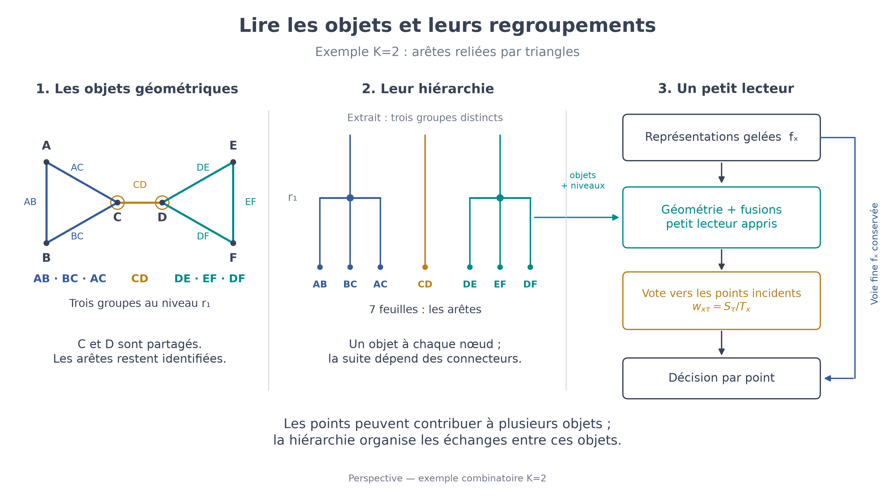

# Lire la hiérarchie géométrique avec un modèle de fondation gelé

**Pour prolonger la voie polyèdres de la soutenance LiDAR 3D, la piste principale est un petit lecteur appris sur des représentations gelées.** Il reçoit les éléments géométriques, leurs incidences et leurs événements de fusion. Lire la [proposition approfondie](VOIE_POLYEDRES.md) pour les définitions, les références et les expériences décisives.

Le [premier mécanisme à tester](LECTURE_MULTIECHELLE.md) conserve les différences enfant–parent et apprend leur importance à chaque regroupement. L’attention entre enfants reste une variante plus expressive.

## Le principe

L’encodeur fournit les caractéristiques ; notre construction géométrique fournit les objets et leur organisation. Un petit module apprend à exploiter les deux, sans réentraîner l’encodeur.

- Décrire les éléments et les groupes à chaque niveau.
- Conserver les moyennes des groupes et les écarts de leurs enfants.
- Apprendre, selon la géométrie et le niveau, quels écarts restituer aux éléments fins.
- Conserver les points partagés et leurs appartenances pondérées jusqu’à la prédiction finale.

Le même petit réseau calcule les gains des événements. Un gain identique partout réduit le calcul à un mélange local–global : il faut vérifier l’utilité des niveaux intermédiaires. La voie fine conserve les caractéristiques originales.

## Ce que la thèse impose de distinguer

En K = 2, les atomes sont des **arêtes reliées par des triangles**. En K = 3, ce sont des **facettes triangulaires reliées par des 4-uplets**. Un point partagé ne suffit pas à fusionner deux groupes. La dimension des cellules et le niveau du dendrogramme restent deux structures distinctes.

Le vote du §9.1 fournit une interface vers les points : `w_xτ = S_τ / T_x` pour `x∈τ` et `T_x>0`, zéro sinon. **S_τ est un score des connecteurs, pas une aire.** La tokenisation exacte et les attributs de surface restent des choix à construire et vérifier.

## Deux terrains d’étude

**LiDAR 3D :** caractéristiques d’un encodeur 3D gelé, lecteur géométrique, sortie fine. Superpoint Transformer fournit le précédent 3D le plus proche ; les attentions cellulaires éclairent les incidences. Commencer en K = 2, puis qualifier K = 3.

**EUVIP :** geler la [baseline locale SAM 2 + LoRA](../CrackSAM/README.md), distincte du CrackSAM publié sur SAM 1 ; prendre le graphe Frangi comme cas K = 1. Le [biais dans l’attention et les autres pistes](PISTES_SANS_REENTRAINEMENT.md) restent des comparateurs pour un guidage interne. Ce cas 2D ne démontre pas encore le programme surfacique.

## Pour préparer la soutenance

Les [formulations courtes](SOUTENANCE.md) présentent le lecteur ; les [recherches antérieures](RECHERCHES.md) documentent les résultats négatifs des descripteurs locaux. Aucun gain de segmentation n’est annoncé. Les deux schémas se régénèrent avec les scripts `figures/make_figure.py` et `figures/make_polyhedra_figure.py`.
