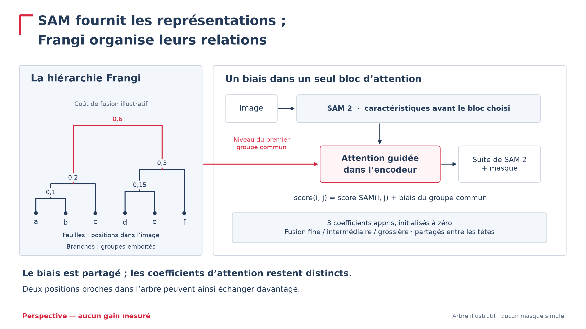

# Donner à SAM 2 la hiérarchie du graphe de Frangi

**Perspective de recherche pour la soutenance — aucun gain de segmentation démontré.**

SAM possède déjà de riches représentations visuelles. Notre proposition est de lui transmettre **quels morceaux se regroupent, et à quel niveau**, pour moduler leurs échanges dans l’attention.

Lire d’abord les [résultats négatifs et les recherches associées](RECHERCHES.md), puis les [formulations pour la soutenance](SOUTENANCE.md).

## Ce que nous voulons ajouter

Une carte de gradient ou de Frangi décrit chaque emplacement. Une hiérarchie décrit les relations entre emplacements : deux morceaux peuvent appartenir au même petit groupe, à deux sous-groupes d’un même ensemble, ou à des ensembles distincts.

Cette organisation est précisément ce que les essais GeoLoRA n’ont pas transmis. En monomodal, elle reste calculée à partir de la même image : nous proposons une **organisation explicite du calcul**, sans prétendre apporter une observation supplémentaire ni une vérité sur les fissures.

## Construire la bonne hiérarchie

Commencer avec le graphe ordinaire, **K = 1**, et ses dissimilarités Frangi. Fixer une fois les pixels candidats, les arêtes et leurs poids. Sur chaque composante, conserver l’arbre couvrant minimum **avant l’élagage final par centralité**.

Faire ensuite varier le seuil des coûts d’arêtes : les petits groupes fusionnent progressivement. Enregistrer ces fusions donne un dendrogramme, c’est-à-dire un arbre de groupes emboîtés. C’est le lien classique entre arbre couvrant et Single-Linkage, déjà présent dans le fil de la thèse. Les fusions de même coût sont simultanées ; aucune racine de parcours arbitraire ne définit les niveaux.

Pour deux feuilles, leur niveau de réunion est le plus grand coût sur le chemin qui les relie dans l’arbre. **La centralité est un score ; elle n’est pas cette hiérarchie.** Les composantes séparées restent séparées. L’extension triangle-connexe viendra ensuite, avec sa propre définition des feuilles et des fusions.

## La transmettre directement à l’attention

Pour deux positions d’image représentées par les jetons `i` et `j`, noter `r(i,j)` le niveau de leur premier groupe commun. Ajouter au score visuel un coefficient appris dépendant de ce niveau :

$$
\operatorname{Attention}_T(Q,K,V)
=\operatorname{softmax}_j\!\left(
\frac{q_i^\top k_j}{\sqrt d}+b_{r(i,j)}
\right)V.
$$

**Version minimale : trois classes de niveaux de fusion, trois coefficients appris**, partagés entre les têtes d’un seul bloc. Les seuils de ces classes sont fixés sur l’entraînement/validation. L’arbre complet est conservé ; cette première interface en donne une lecture simplifiée.

Les coefficients commencent à zéro : on retrouve alors le modèle de référence. Chaque paire conserve son propre score visuel, même lorsqu’elle partage un biais avec d’autres. Le modèle peut apprendre à renforcer, atténuer ou ignorer la relation proposée.

### Un premier montage concret

- Garder les poids de SAM 2 **et de son adaptation aux fissures existante** gelés ; apprendre seulement les trois coefficients, avec la même perte et les mêmes entrées que la référence.
- Intervenir dans le dernier bloc d’attention globale de Hiera-L : `trunk.blocks[43].attn` dans la configuration vérifiée. Pour une entrée 1024², il traite une grille 64².
- Reporter les groupes sur cette grille avec exactement les mêmes transformations spatiales que l’image. Un jeton reçoit l’appartenance d’un représentant Frangi ; s’il mélange des branches incompatibles, le déclarer ambigu.
- Mettre le biais à zéro sur la diagonale et pour toute paire impliquant un jeton ambigu, hors graphe ou une autre composante. Le contexte visuel reste accessible.

Il faut exporter l’arbre depuis l’extracteur actuel, qui rend surtout des cartes, puis modifier l’attention et utiliser un parcours d’entraînement différentiable. Le prédicteur interactif standard désactive les gradients. **Trois paramètres ne signifient pas un calcul gratuit** : le biais dense partagé occupe déjà 32 Mio en FP16 à 4096 jetons, hors gradients et autres tenseurs. Ce montage reste à implémenter.

## Le test qui rendrait l’idée convaincante

Comparer la référence, une seule partition, la hiérarchie Frangi, un arbre spatial sur les mêmes feuilles et le même arbre Frangi aux feuilles permutées. Pour les variantes structurées, conserver architecture, table de coefficients et budget. Permuter uniquement l’association arbre–positions au sein de chaque composante, en conservant couverture et ambiguïtés ; l’image reste fixe.

Mesurer sur les mêmes images l’IoU, la continuité et les faux raccordements, avec plusieurs graines, des intervalles sur les écarts appariés et un test séparé par scène. Un gain face à la partition et aux arbres témoins soutiendrait l’apport des regroupements emboîtés. Un gain face à SAM seul ne suffirait pas.

Les points faibles sont identifiés : mauvais raccordements du graphe, branches absentes, perte de détails sur la grille des jetons. La hiérarchie propose des relations ; elle ne garantit pas leur justesse.

Le [schéma vectoriel](figures/guidage_hierarchique.svg) se régénère avec `python figures/make_figure.py` depuis ce dossier (Matplotlib). L’ancien dossier reste consultable dans [l’historique Git](https://github.com/Ludwig-H/Generalized-Frangi-for-Automatic-Crack-Extraction-on-FIND-dataset/tree/e1dcec669b8ec216733c37335f7a57e0176967e5/ISPRS/CrackSAM-HierarchicalSelfAttention).
