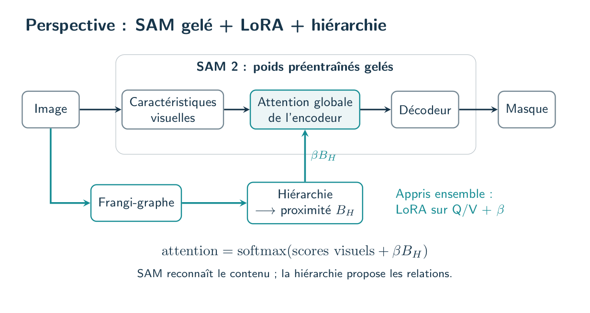

# Une slide : SAM gelé + LoRA + hiérarchie Frangi-graphe

**Titre : « Perspective : relier les fragments grâce à la hiérarchie »**

## Trois messages

- **SAM reconnaît** les fissures et le fond.
- **L’arbre rapproche** des fragments reliés par une chaîne compatible.
- **LoRA apprend avec ce guidage**, pondéré par un seul coefficient.

$$\text{attention}=\mathrm{softmax}(\text{scores visuels}+\beta B_H).$$

## À dire en trente secondes

> Frangi surdétecte les ombres et les textures. Mais deux fragments d’une fissure peuvent rester proches dans sa hiérarchie, même loin dans l’image. Nous proposons de favoriser leurs échanges dans SAM, tout en conservant ses scores visuels. Les poids préentraînés restent gelés ; LoRA apprend avec un seul poids de guidage. L’objectif est de réduire les ruptures sans multiplier les faux raccords.

## Références à afficher

**Ying et al., Graphormer, NeurIPS 2021** : biais relationnel dans l’attention. **Turaga et al., MALIS, NIPS 2009** : proximité fondée sur les chemins et la connexité. [Titres, liens et limites](REFERENCES.md).

Choisir le [TikZ 3](figures/03_sam_lora.tikz) pour la slide principale ; les deux autres figures expliquent l’arbre et le biais si nécessaire.
