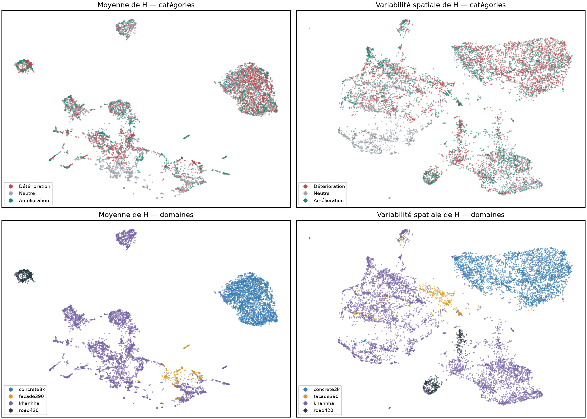
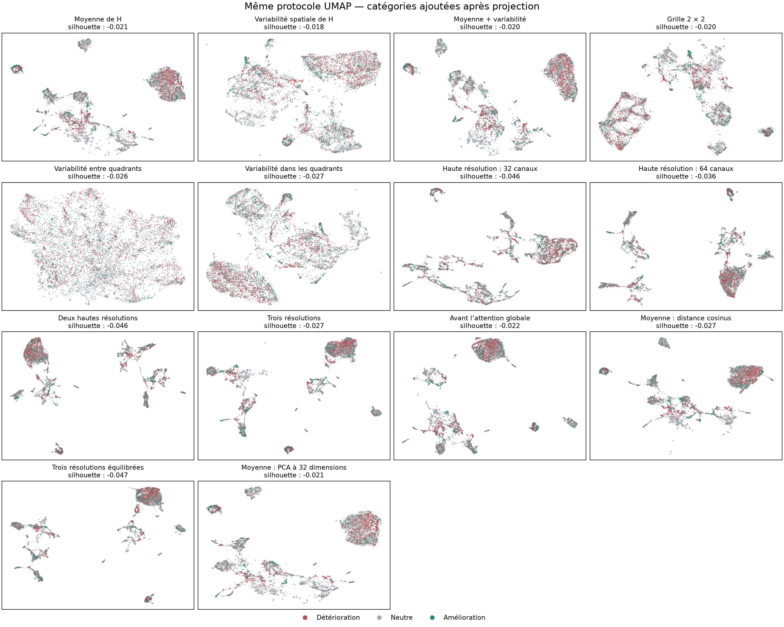
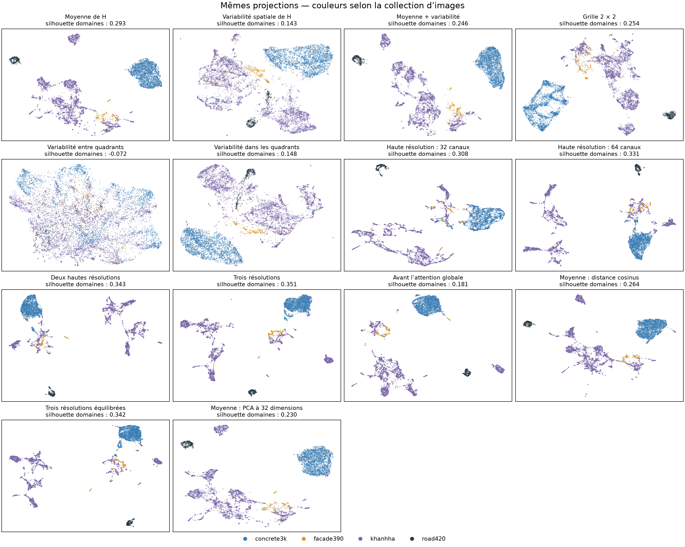
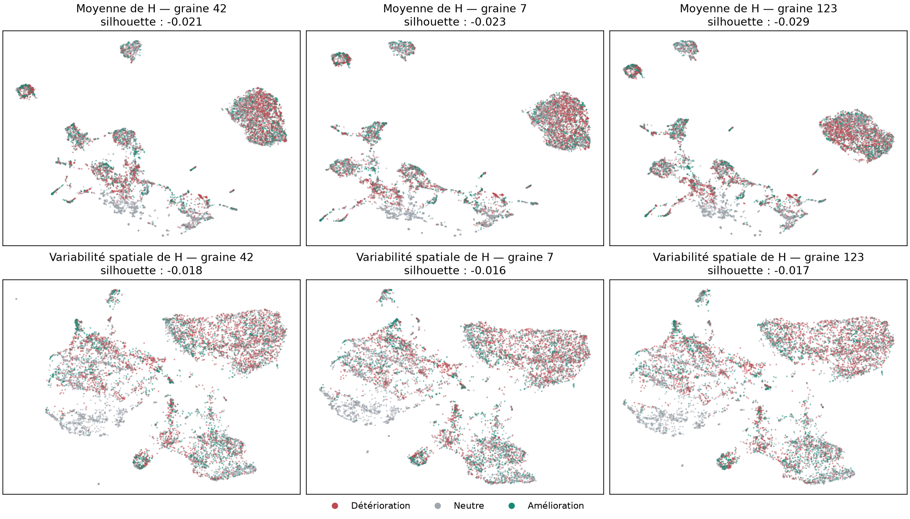
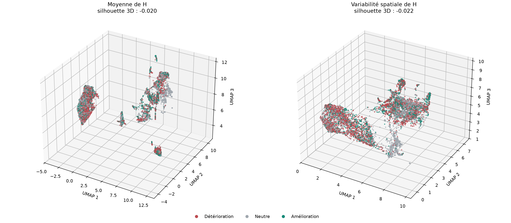

# Quelles features séparent le mieux les trois catégories avec UMAP ?

Comparaison du 10 septembre 2026 — **14 représentations**, mêmes 8 895 images et catégories que le [rapport initial](RAPPORT.md). Les features SAM sont réutilisées ; aucun nouveau calcul GCP ni entraînement de SAM.

**Aucune des 14 variantes ne fait apparaître trois catégories nettement séparées.** Les silhouettes UMAP sont toutes négatives. Certains amas changent de forme ou de position, mais les cas améliorés et détériorés restent fortement mélangés.

La meilleure silhouette 2D est obtenue avec **variabilité spatiale de H** : **-0,018**, contre **-0,021** pour la moyenne de H. La sélection est exploratoire : les quatorze variantes sont publiées, y compris celles qui fonctionnent moins bien.

Le faible avantage visuel des écarts-types ne correspond pas à une meilleure prédiction : **50,6 %** de balanced accuracy, contre **53,6 %** pour la moyenne. Avec ces features et ces réglages, je ne retiendrais donc pas les écarts-types comme une amélioration convaincante.



## Ce qui a été testé

Moyenne, variabilité spatiale, moyenne + variabilité, grille 2 × 2, variabilité entre et dans les quadrants, cartes de haute résolution séparées ou réunies, trois résolutions, features avant attention globale. Trois variantes de prétraitement complètent la comparaison : distance cosinus, poids égaux par résolution et PCA à 32 dimensions.

La variabilité **entre quadrants** décrit les différences entre quatre grandes zones de l’image. La variabilité **dans les quadrants** conserve le reste de la variance spatiale. Cette décomposition utilise les moments déjà extraits ; elle ne désigne pas directement les ombres ou les fissures.

**Protocole identique :** UMAP non supervisée, 30 voisins, `min_dist=0.1`, graine 42. Les canaux sont standardisés ; seule la variante cosinus utilise les vecteurs bruts normalisés en norme L2. L’équilibrage divise chaque bloc standardisé par la racine de son nombre de canaux. Les catégories ne participent ni au calcul des features, ni à PCA, ni à UMAP. L’ordre de dessin des points est mélangé indépendamment des catégories et identique entre figures.



<details>
<summary>Mêmes projections, colorées par domaine</summary>



</details>

Les hautes résolutions séparent surtout les collections d’images. À l’inverse, la variabilité entre quadrants atténue fortement ces regroupements, sans révéler les trois catégories. Atténuer l’effet de provenance ne suffit donc pas à faire apparaître une séparation.

## Comparaison chiffrée

La silhouette compare la compacité des catégories à leur éloignement : une valeur proche de zéro indique un fort recouvrement. Elle est calculée avant et après UMAP sur **une image par scène physique**, soit 2 122 représentants déterministes, version propre préférée. Les figures montrent les 8 895 observations.

La **balanced accuracy** mesure la prédiction des catégories dans les features, avec les cinq folds historiques regroupés par scène. Normalisation et PCA sont ajustées uniquement sur l’entraînement de chaque fold. Le ΔIoU choisit le modèle Frangi lorsque la sonde prédit « amélioration ». Les sondes utilisent une régression logistique L2, `C=1`, sans réglage par variante ; le changement d’échelle modifie donc aussi la régularisation effective. L’écart-type et la normalisation L2 ne sont pas linéaires dans H.

Toutes les sondes, référence comprise, sont recalculées dans l’environnement CPU documenté ; de faibles écarts numériques avec le rapport initial sont possibles.

| Représentation | Dim. | Silhouette features | Silhouette UMAP 2D | BA | ΔIoU sélection (points) |
| --- | ---: | ---: | ---: | ---: | ---: |
| Moyenne de H | 256 | -0,008 | -0,021 | 53,6 % | 0,37 |
| **Variabilité spatiale de H** | 256 | -0,007 | -0,018 | 50,6 % | 0,21 |
| Moyenne + variabilité | 512 | -0,005 | -0,020 | 53,5 % | 0,34 |
| Grille 2 × 2 | 1024 | -0,005 | -0,020 | 50,1 % | 0,22 |
| Variabilité entre quadrants | 256 | -0,003 | -0,026 | 46,8 % | -0,07 |
| Variabilité dans les quadrants | 256 | -0,009 | -0,027 | 50,5 % | 0,14 |
| Haute résolution : 32 canaux | 32 | -0,025 | -0,046 | 43,4 % | -0,00 |
| Haute résolution : 64 canaux | 64 | -0,010 | -0,036 | 47,0 % | 0,08 |
| Deux hautes résolutions | 96 | -0,014 | -0,046 | 47,9 % | 0,12 |
| Trois résolutions | 352 | -0,007 | -0,027 | 54,2 % | 0,42 |
| Avant l’attention globale | 576 | -0,006 | -0,022 | 52,3 % | 0,31 |
| Moyenne : distance cosinus | 256 | -0,023 | -0,027 | 47,2 % | -0,00 |
| Trois résolutions équilibrées | 352 | -0,010 | -0,047 | 52,6 % | 0,26 |
| Moyenne : PCA à 32 dimensions | 32 | -0,008 | -0,021 | 48,1 % | 0,01 |

La meilleure BA descriptive est celle de **trois résolutions** (54,2 %). L’apparence de la carte et la prédiction sur de nouvelles scènes sont donc évaluées séparément.

[Toutes les mesures](feature_comparison/comparison_metrics.csv) incluent aussi la silhouette des domaines, la fidélité des voisinages et l’accord de catégorie parmi les 15 voisins, avec ou sans restriction au même domaine. Pour ce dernier contrôle, l’accord macro attendu par tirage aléatoire au sein du domaine est d’environ **39,8 %**, à cause des proportions différentes des catégories entre domaines.

## Vérification avec d’autres graines et en 3D

La référence et la variante retenue sont recalculées avec les graines 7 et 123, sans changer les paramètres.



| Représentation | Graine 42 | Graine 7 | Graine 123 | 3D, graine 42 |
| --- | ---: | ---: | ---: | ---: |
| Moyenne de H | -0,021 | -0,023 | -0,029 | -0,020 |
| Variabilité spatiale de H | -0,018 | -0,016 | -0,017 | -0,022 |



Le petit avantage de l’écart-type se retrouve sur les trois graines en 2D, mais disparaît en 3D. Dans tous les cas, les silhouettes restent négatives et les catégories mélangées.

[Vue 3D interactive autonome](feature_comparison/comparison_3d.html) : télécharger le fichier HTML et utiliser son menu pour changer de représentation.

## Limites et reproduction

Cette recherche compare des résumés des features disponibles, pas tous les tokens ni toutes les couches de SAM. Découper un gain continu d’IoU en trois catégories ne garantit pas trois groupes géométriques dans les features. La sélection de la meilleure carte ne constitue pas un nouveau test indépendant. Les catégories restent une comparaison entre deux checkpoints historiques ; les chevauchements antérieurs entre scènes d’entraînement et de test restent ceux documentés dans le rapport initial. Aucun gain du futur biais hiérarchique n’est démontré ici.

Depuis ce sous-dossier, avec les dépendances de `requirements-analysis.txt` :

```bash
python compare_feature_umaps.py
python build_feature_comparison_report.py
python -m pytest test_feature_variants.py test_compare_feature_umaps.py -q
```

[Contrat, versions et SHA-256](feature_comparison/contract.json) · [Définition des représentations](feature_variants.py) · [Résultats complets](feature_comparison/summary.json). Le calcul reprend les variantes terminées seulement si le contrat est inchangé.
