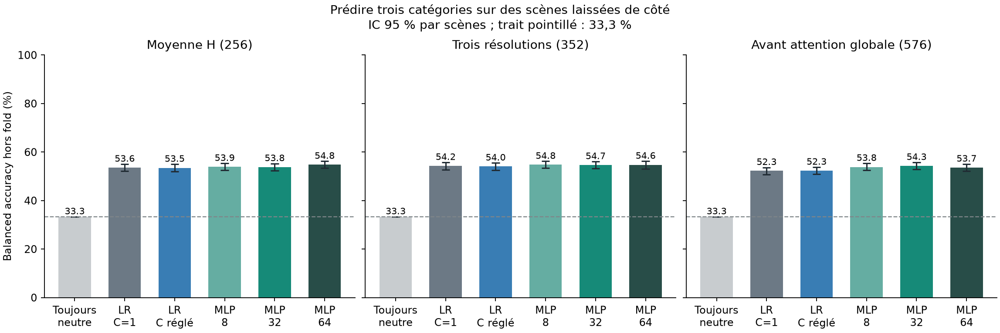
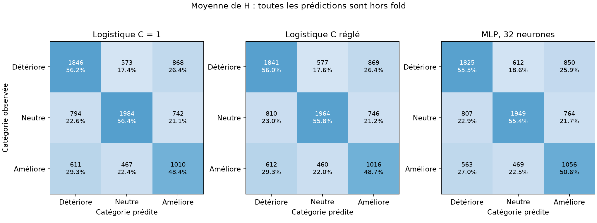

# Un petit réseau peut-il prédire le bénéfice de Frangi ?

Tests du 10 septembre 2026 — mêmes **8 895 observations**, **2 122 scènes** et features SAM que le [rapport initial](RAPPORT.md). Calcul CPU local, sans réentraînement de SAM ni GCP.

**Le signal est réel, mais la performance reste faible pour décider de faire confiance à Frangi.** Les meilleurs résultats restent autour de 55 % de balanced accuracy ; beaucoup de choix du modèle Frangi sont défavorables.

**Sur la comparaison principale, la couche cachée n’apporte pas d’avantage établi sur la logistique réglée.** Sur la moyenne de H, la balanced accuracy atteint **53,8 %** avec 32 neurones, contre **53,5 %** avec la logistique réglée. Les matrices ci-dessous montrent les erreurs qui subsistent entre les trois catégories.

**Une seule couche affine suivie d’un softmax est déjà une régression logistique multinomiale.** Nous testons donc aussi une **couche cachée ReLU**, suivie de trois sorties softmax, pour ajouter une non-linéarité.

$p(y\mid h)=\mathrm{softmax}(Wh+b)$ pour la logistique ; $p(y\mid h)=\mathrm{softmax}(W_2\,\mathrm{ReLU}(W_1h+b_1)+b_2)$ pour le petit réseau.

## Le témoin indispensable : toujours prédire « neutre »

L’**accuracy classique** est la proportion totale de bonnes réponses. La **balanced accuracy (BA)** donne le même poids aux trois catégories : leur rappel moyen. Prédire toujours « neutre » donne 100 % de rappel aux neutres, 0 % aux deux autres catégories, soit **33,3 % de BA**.

| Ensemble | Accuracy toujours neutre | Accuracy MLP 32 | BA toujours neutre | BA MLP 32 |
| --- | ---: | ---: | ---: | ---: |
| Toutes les observations | 39,6 % | 54,3 % | 33,3 % | 53,8 % |
| Khanhha, trois conditions | 50,0 % | 54,7 % | 33,3 % | 51,9 % |
| Khanhha propre | 63,2 % | 57,1 % | 33,3 % | 42,2 % |

**Sur Khanhha propre, toujours prédire neutre obtient même davantage de bonnes réponses globales que le réseau.** La BA indique que le réseau reconnaît aussi les améliorations et détériorations ; elle ne rend pas ses décisions suffisamment fiables. [Contrôles détaillés par jeu](simple_models/neutral_control.csv).

## Résultats sur de nouvelles scènes

Les modèles voient les features originales, sans UMAP. La balanced accuracy moyenne les rappels des trois classes (hasard : 33,3 %). La colonne entraînement permet de repérer la mémorisation. Le ΔIoU choisit le checkpoint Frangi uniquement lorsque la classe prédite est « amélioration ».



| Features | Modèle | BA entraînement | BA hors fold | Macro-F1 | ΔIoU sélection (points) |
| --- | --- | ---: | ---: | ---: | ---: |
| Moyenne H (256) | Logistique C = 1 | 58,7 % | 53,6 % | 0,533 | +0,37 |
| Moyenne H (256) | Logistique C réglé | 58,5 % | 53,5 % | 0,532 | +0,36 |
| Moyenne H (256) | MLP, 8 neurones | 59,0 % | 53,9 % | 0,536 | +0,39 |
| Moyenne H (256) | MLP, 32 neurones | 64,5 % | 53,8 % | 0,534 | +0,39 |
| Moyenne H (256) | MLP, 64 neurones | 65,0 % | 54,8 % | 0,544 | +0,52 |
| Trois résolutions (352) | Logistique C = 1 | 60,1 % | 54,2 % | 0,539 | +0,42 |
| Trois résolutions (352) | Logistique C réglé | 59,2 % | 54,0 % | 0,537 | +0,41 |
| Trois résolutions (352) | MLP, 8 neurones | 60,7 % | 54,8 % | 0,544 | +0,46 |
| Trois résolutions (352) | MLP, 32 neurones | 64,8 % | 54,7 % | 0,542 | +0,47 |
| Trois résolutions (352) | MLP, 64 neurones | 66,9 % | 54,6 % | 0,540 | +0,42 |
| Avant attention globale (576) | Logistique C = 1 | 63,6 % | 52,3 % | 0,520 | +0,31 |
| Avant attention globale (576) | Logistique C réglé | 60,4 % | 52,3 % | 0,520 | +0,32 |
| Avant attention globale (576) | MLP, 8 neurones | 61,4 % | 53,8 % | 0,535 | +0,46 |
| Avant attention globale (576) | MLP, 32 neurones | 65,3 % | 54,3 % | 0,538 | +0,46 |
| Avant attention globale (576) | MLP, 64 neurones | 68,8 % | 53,7 % | 0,533 | +0,38 |

Sur les features **avant attention globale**, le réseau à 32 neurones atteint 54,3 %, contre 52,3 % pour la logistique réglée. C’est un résultat secondaire intéressant pour le futur guidage, à confirmer. Augmenter la largeur améliore surtout la performance d’entraînement ; le gain sur de nouvelles scènes reste limité.

## Comparaison principale : 32 neurones contre logistique réglée

Différence de balanced accuracy : **+0,33 points**, IC 95 % **[-0,71 ; 1,33]**. Différence de gain IoU entre les deux politiques de sélection : **+0,03 point**, IC 95 % **[-0,06 ; 0,13]**. Ce sont des différences appariées : chaque rééchantillonnage utilise les mêmes scènes pour les deux modèles.

**Autre initialisation, mêmes scènes :** avec la graine 123, le réseau à 32 neurones atteint 54,4 % et +0,45 point d’IoU de sélection. Les deux exécutions sont conservées ; aucune graine n’est choisie pour améliorer le score publié.

Avec le réseau à 32 neurones, Frangi est choisi pour **30,0 %** des images. Parmi ces choix, **39,6 %** améliorent l’IoU de plus d’un point ; **850** le détériorent de plus d’un point.



## Transfert vers un domaine absent de l’entraînement

Chaque domaine est entièrement exclu, y compris les trois versions Khanhha ensemble. Les réglages restent choisis dans les domaines d’entraînement. Résultats sur la moyenne de H :

| Domaine exclu | BA logistique réglée | BA MLP 32 | ΔIoU logistique (points) | ΔIoU MLP 32 (points) |
| --- | ---: | ---: | ---: | ---: |
| khanhha | 32,9 % | 36,5 % | -0,56 | -0,21 |
| road420 | 37,3 % | 36,6 % | -0,80 | -0,37 |
| facade390 | 41,2 % | 39,8 % | +0,06 | +0,06 |
| concrete3k | 33,4 % | 30,1 % | -0,48 | -0,86 |

**Le transfert reste insuffisant :** sur un domaine inconnu, le réseau à 32 neurones perd de l’IoU sur Khanhha, Road420 et Concrete3k ; le gain sur Façade390 est presque nul.

## Protocole et portée

**Cinq folds externes identiques à l’analyse précédente**, groupés par scène ; recadrages et versions bruitées restent ensemble. Chaque entraînement réserve environ 20 % de ses scènes à une validation interne. Normalisation et poids équilibrant les classes sont calculés uniquement sur l’entraînement concerné.

La logistique utilise C = 1, ou choisit C parmi 0,01 ; 0,1 ; 1 ; 10 sur la validation interne. Les réseaux comportent 8, 32 ou 64 neurones ; Adam, taux d’apprentissage 0,001, pénalisation des poids 0,001, au plus 300 époques. L’époque retenue vient de la validation interne, puis le modèle est réentraîné sur tout l’entraînement externe pendant ce nombre d’époques. La couche de 32 neurones sur 256 features contient **8 323 paramètres**.

La comparaison principale est fixée à l’avance : moyenne H, MLP 32 contre logistique réglée. Les autres largeurs et représentations sont secondaires. Les IC rééchantillonnent 1 000 fois les scènes par domaine, conditionnellement aux prédictions hors fold ; ils ne mesurent pas la variabilité d’un nouvel entraînement de SAM.

Les classes décrivent toujours **la différence entre deux checkpoints historiques** : amélioration au-delà de +1 point d’IoU, détérioration sous −1 point, neutralité sinon. Les chevauchements historiques entre scènes d’entraînement de SAM et de test subsistent. Une meilleure classification préparerait une porte de confiance ; elle ne validerait pas encore un biais d’attention hiérarchique Frangi-graphe.

Les classes sont équilibrées pendant l’apprentissage : les sorties softmax ne sont pas des probabilités de fiabilité calibrées.

Depuis ce sous-dossier, avec PyTorch et les dépendances de `requirements-analysis.txt` :

```bash
python compare_simple_classifiers.py
python check_simple_model_seed.py
python build_simple_classifier_report.py
python -m pytest test_simple_models.py -q
```

[Mesures et intervalles complets](simple_models/summary.json) · [Prédictions hors fold](simple_models/predictions.csv) · [Réglages et époques par entraînement](simple_models/training_runs.csv) · [Réplication avec une autre initialisation](simple_models/replication_seed123.json) · [Contrat et versions](simple_models/contract.json).
