# Les features de SAM 2 prédisent-elles le bénéfice de Frangi ?

Analyse du 10 septembre 2026 — SAM 2 + LoRA historique, sans nouvel entraînement de SAM.

[Complément : comparaison de 14 représentations des features avec UMAP](COMPARAISON_FEATURES.md).

**Oui, partiellement : H contient un signal prédictif, mais les trois catégories ne sont pas facilement séparables.** Les projections mélangent amélioration et détérioration ; leurs amas reflètent surtout les collections d’images. Le signal suffit à un petit gain de sélection dans les domaines représentés à l’entraînement de la sonde. Son transfert à un domaine entièrement nouveau échoue généralement.

**Résultat de la sonde principale : balanced accuracy 53,6 % (IC 95 % [52,3 ; 55,0]), contre 47,2 % avec le seul domaine et la famille source.** Sélectionner le modèle Frangi lorsque cette sonde prédit « amélioration » donne +0,37 point d’IoU en moyenne hors fold (IC 95 % [0,22 ; 0,53]). Ces nombres évaluent une sélection entre deux modèles historiques ; ils ne valident pas encore le guidage hiérarchique.

## 1. Comparaison et catégories

Nous reprenons **baseline best, époque 20**, contre **Frangi-similarité best, époque 25**, tous deux choisis par le Dice de validation. Frangi entrait comme **prompt de masque dense**, après conversion de la similarité en pseudo-logits. Il ne s’agissait pas d’un biais d’attention.

Les 8 895 observations proviennent de 2 122 scènes regroupées par le parseur historique. Les recadrages et les trois versions Khanhha restent dans le même fold. Les moyennes ci-dessous pondèrent également les observations, pas les jeux de données.

$\Delta_i=\mathrm{IoU}_{\mathrm{Frangi},i}-\mathrm{IoU}_{\mathrm{baseline},i}$.

**Amélioration** si ΔIoU > 0,01 ; **détérioration** si ΔIoU < −0,01 ; **neutre** sinon. Cette marge d’un point d’IoU est une tolérance pratique, pas un seuil de significativité.

| Jeu | Observations | Améliore | Neutre | Détériore |
| --- | --- | --- | --- | --- |
| Khanhha propre | 1 695 | 300 | 1 071 | 324 |
| Khanhha bruit 1 | 1 695 | 474 | 683 | 538 |
| Khanhha bruit 2 | 1 695 | 330 | 788 | 577 |
| Road420 | 420 | 180 | 39 | 201 |
| Façade390 | 390 | 144 | 42 | 204 |
| Concrete3k | 3 000 | 660 | 897 | 1 443 |
| **Total** | 8 895 | 2 088 | 3 520 | 3 287 |

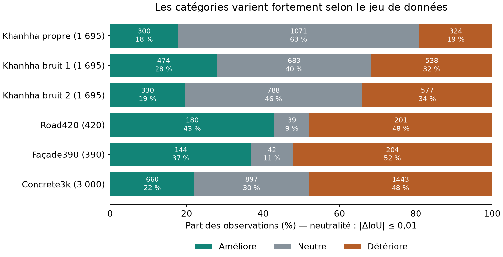

Sensibilité à la marge de neutralité :

| Marge (points d’IoU) | Améliore | Neutre | Détériore |
| --- | --- | --- | --- |
| ±0,5 | 2 574 | 2 409 | 3 912 |
| ±1,0 | 2 088 | 3 520 | 3 287 |
| ±2,0 | 1 504 | 4 984 | 2 407 |

Distribution complète des écarts

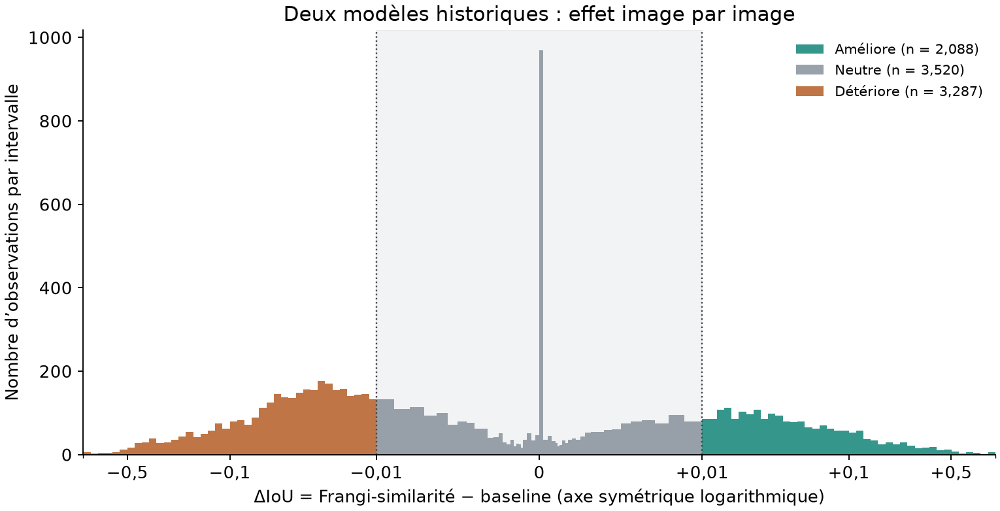

## 2. Six illustrations vérifiées

Les panneaux sont repris à l’identique de l’expérience archivée. Les gains et pertes sont ses exemples extrêmes ; les neutres sont ses cas médians. Ils illustrent les catégories sans constituer un échantillon aléatoire. Leur choix ne dépend ni de H ni d’UMAP.

**Amélioration — Khanhha propre** : `Sylvie_Chambon_319.jpg`, IoU 0,2756 → 0,5916, Δ = +31,60 points.

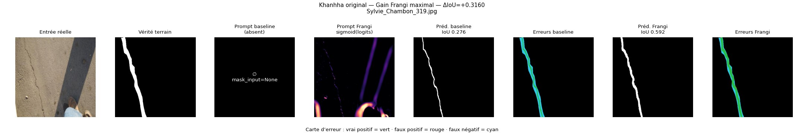

Second exemple : amélioration

**Amélioration — Road420** : `2023_11_01_20_33_IMG_6353.jpg`, IoU 0,1898 → 0,6852, Δ = +49,54 points.

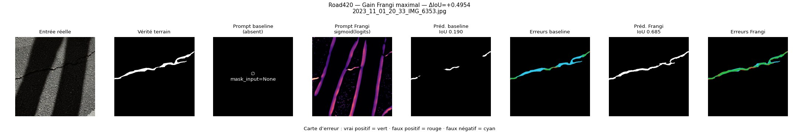

**Neutre — Khanhha propre** : `CRACK500_20160329_094010_1281_361.jpg`, IoU 0,8318 → 0,8318, Δ = -0,00 points.

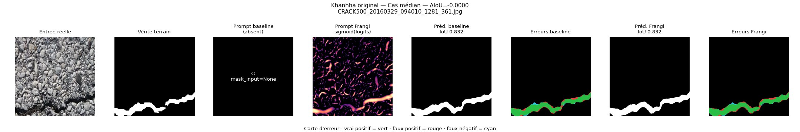

Second exemple : neutre

**Neutre — Road420** : `2023_10_30_16_00_IMG_5928.jpg`, IoU 0,5695 → 0,5634, Δ = -0,62 points.

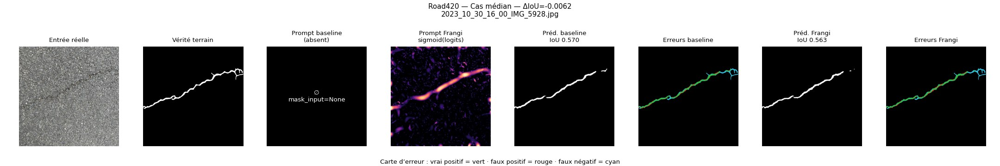

**Détérioration — Khanhha propre** : `cracktree200_6266.jpg`, IoU 0,1968 → 0,0272, Δ = -16,97 points.

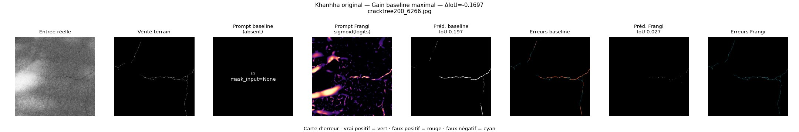

Second exemple : détérioration

**Détérioration — Road420** : `2023_10_30_16_44_IMG_6033.jpg`, IoU 0,7203 → 0,0400, Δ = -68,03 points.

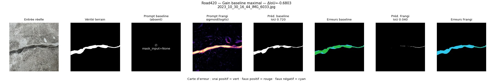

## 3. UMAP en deux et trois dimensions

H est extrait de la **baseline SAM 2 + LoRA, avant tout prompt Frangi**. La représentation principale moyenne spatialement ses 256 canaux ; aucune annotation ni statistique de performance n’entre dans ces features. UMAP utilise les features standardisées et ne reçoit pas les catégories.

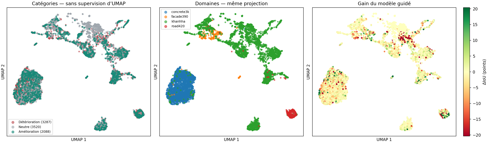

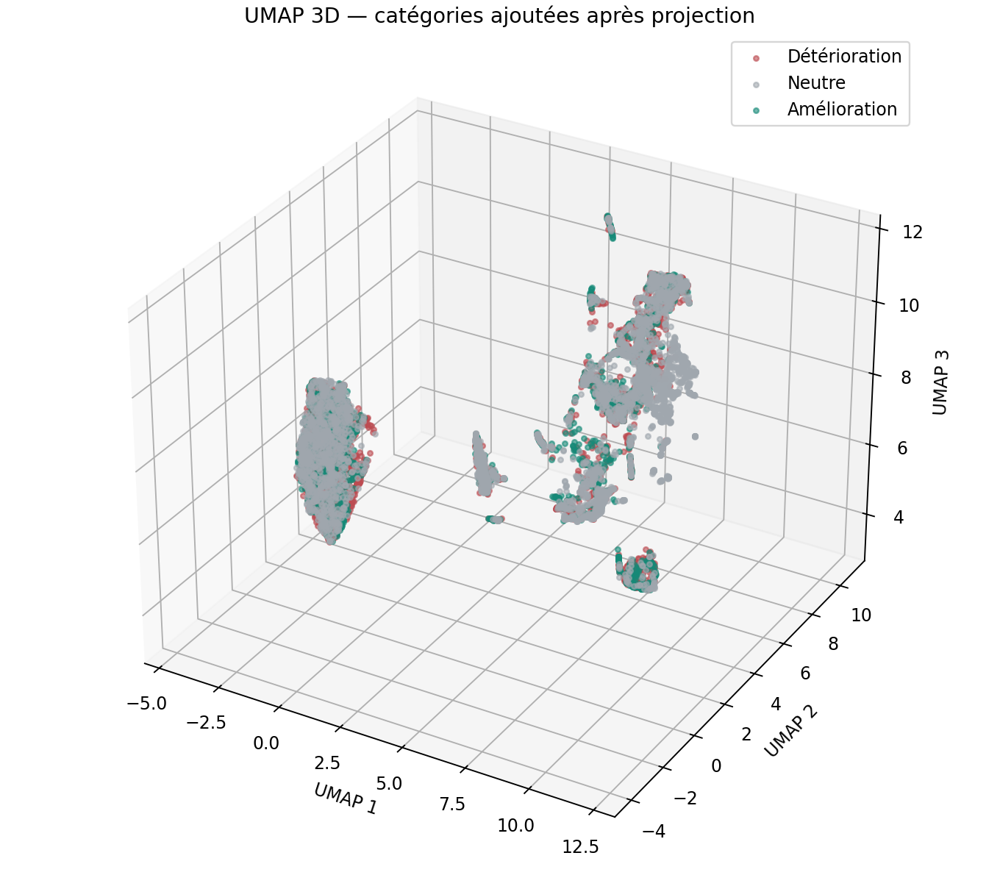

[Ouvrir la vue 3D interactive, autonome](results/umap_3d.html). Télécharger le fichier HTML pour le consulter depuis GitHub.

Fidélité locale (*trustworthiness*, 2 000 observations) : **0,971 en 2D**, **0,982 en 3D**. Silhouette des catégories dans les features originales standardisées : **-0,008**. Cette silhouette proche de zéro ne montre pas trois amas compacts distincts. La fidélité mesure la conservation des voisinages ; elle ne mesure pas la séparabilité des catégories. Une séparation visuelle après UMAP ne démontre pas une séparation linéaire dans H.

Comparaison avec une projection linéaire PCA

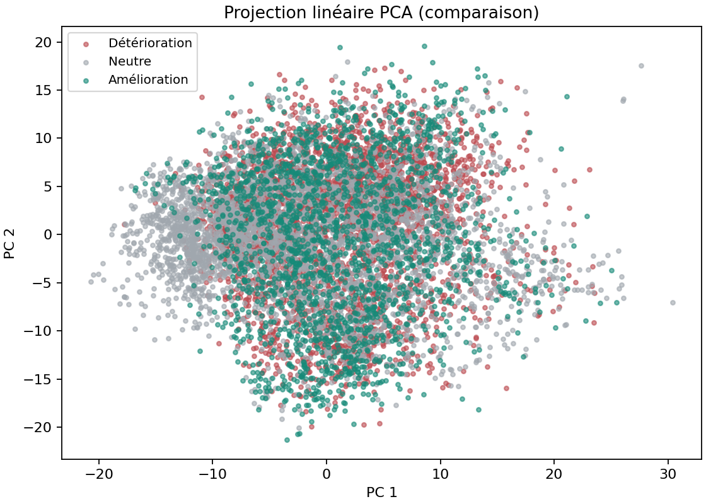

UMAP : stabilité selon la graine

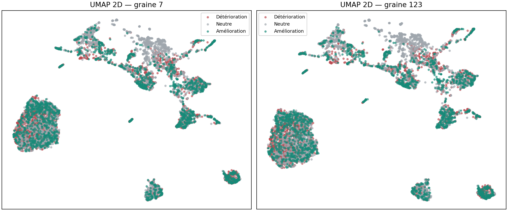

## 4. Séparabilité dans les features originales

Régression logistique L2, classes équilibrées, C = 1, 5 folds groupés. Normalisation et sélection des canaux utilisent exclusivement l’entraînement de chaque fold. La balanced accuracy est la moyenne des rappels des trois classes ; elle vaut 33,3 % au hasard. Le ΔIoU mesure la politique fixe : utiliser Frangi seulement lorsque la catégorie prédite est « amélioration ». L’ajout de l’écart-type est une variante secondaire, non linéaire dans H.

| Sonde | Dimensions | Balanced accuracy | Macro-F1 | AUROC amélioration | ΔIoU sélection (points) |
| --- | --- | --- | --- | --- | --- |
| Moyenne de H | 256 | 53,6 % | 0,533 | 0,690 | +0,37 |
| Moyenne avant la dernière attention globale | 576 | 52,3 % | 0,520 | 0,683 | +0,31 |
| Moyennes par grille 2 × 2 | 1024 | 50,1 % | 0,499 | 0,656 | +0,21 |
| Moyennes aux trois résolutions | 352 | 54,2 % | 0,539 | 0,699 | +0,42 |
| Moyenne + écart-type | 512 | 53,4 % | 0,532 | 0,682 | +0,34 |
| 1 canal, sélection dans chaque entraînement | 1 | 38,9 % | 0,363 | 0,501 | -0,16 |
| 5 canaux, sélection dans chaque entraînement | 5 | 42,2 % | 0,422 | 0,586 | -0,19 |
| 10 canaux, sélection dans chaque entraînement | 10 | 43,5 % | 0,434 | 0,597 | -0,04 |
| 25 canaux, sélection dans chaque entraînement | 25 | 47,7 % | 0,475 | 0,634 | +0,00 |
| Témoin : domaine seul | Catégoriel | 43,9 % | 0,424 | 0,532 | -0,14 |
| Témoin : domaine + famille source | Catégoriel | 47,2 % | 0,463 | 0,636 | -0,17 |
| Témoin : classe majoritaire | Constant | 33,3 % | 0,189 | 0,500 | +0,00 |

Pour la moyenne de H, l’AUROC « amélioration contre reste » est 0,690, IC 95 % [0,674 ; 0,707]. Frangi est choisi pour 29,4 % des observations. Les IC rééchantillonnent 1 000 fois les scènes au sein des domaines, conditionnellement aux prédictions hors fold déjà calculées.

**La décision image par image reste incertaine :** sur les 2 613 sélections de Frangi, 1 007 améliorent de plus d’un point, 740 sont neutres et 866 détériorent de plus d’un point. Seules 38,5 % des sélections appartiennent donc à la catégorie amélioration, malgré le gain moyen positif.

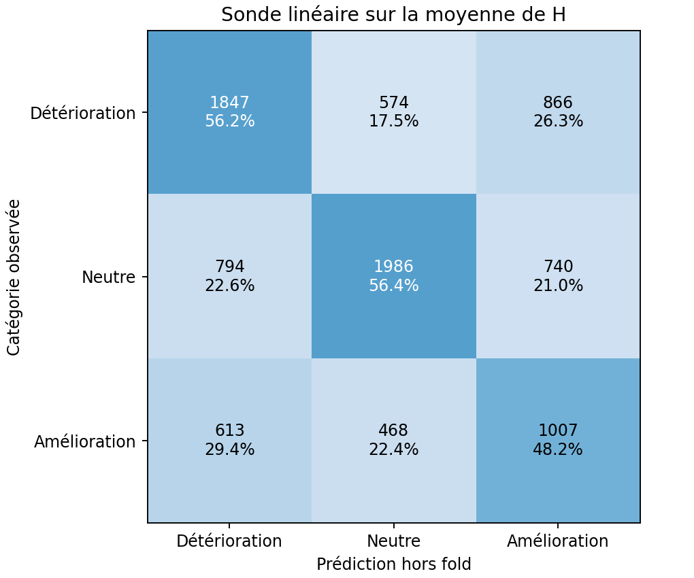

**Permutation contrôlant domaine et famille source** : p = 0,0050 sur 199 permutations, avec une image déterministe par scène (2 122 représentants, dont 2 122 dans des strates où la catégorie varie). La balanced accuracy observée sur ce sous-échantillon vaut 55,5 %. La p-valeur atteint la résolution minimale de ces 199 permutations. Ce test contrôle l’association aux collections ; il ne mesure pas le gain d’une future porte hiérarchique.

Distribution sous permutation

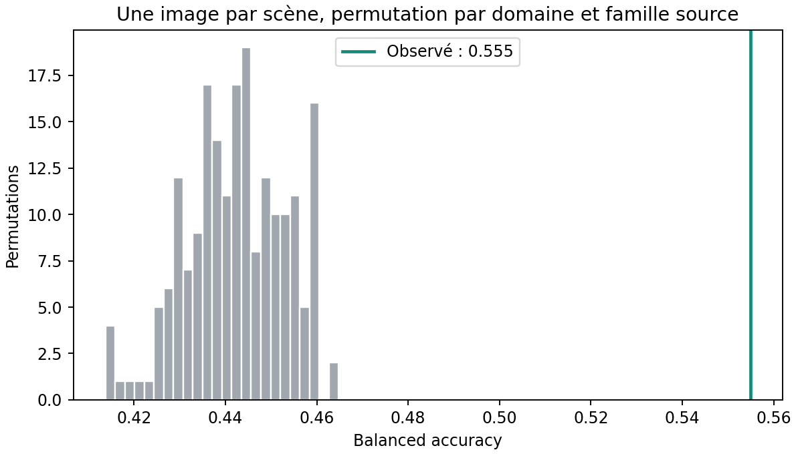

### Généralisation entre domaines

« Domaine exclu » entraîne la sonde uniquement sur les trois autres domaines. Cette mesure distingue la prédiction de nouvelles scènes du transfert à une nouvelle collection.

| Domaine testé | BA, CV groupée | BA, domaine exclu | ΔIoU, CV groupée (points) | ΔIoU, domaine exclu (points) |
| --- | --- | --- | --- | --- |
| Khanhha, trois conditions | 51,3 % | 34,2 % | +0,20 | -0,50 |
| Road420 | 48,0 % | 36,1 % | +1,69 | -0,70 |
| Façade390 | 51,6 % | 40,0 % | +1,62 | +0,00 |
| Concrete3k | 47,0 % | 33,8 % | +0,33 | -0,43 |

**Le changement de domaine est le principal échec :** sans exemples de la collection cible pour entraîner la sonde, la sélection perd de l’IoU sur Khanhha, Road420 et Concrete3k ; elle est presque neutre sur Façade390. Le résultat global positif ne justifie donc pas une confiance universelle prédite par H.

Sur les **126 images Khanhha propres de scènes absentes du train et de la validation historiques**, la sonde hors fold atteint 43,3 % de balanced accuracy et +0,72 point d’IoU de sélection.

### Plafond d’une sélection parfaite

| Politique | IoU moyenne | ΔIoU contre baseline (points) |
| --- | --- | --- |
| Baseline pour toutes les images | 0,6064 | 0,00 |
| Frangi pour toutes les images | 0,5965 | -0,98 |
| Sélection par moyenne de H, hors fold | 0,6101 | +0,37 |
| Oracle utilisant la vérité terrain | 0,6245 | +1,81 |

L’oracle prend, pour chaque observation, la meilleure des deux sorties déjà disponibles. Il indique une réserve de gain pour cette sélection particulière ; il n’est pas utilisable en pratique.

## 5. Certains canaux sont-ils plus informatifs ?

Les cinq premiers canaux selon le classement ANOVA global sont donnés ci-dessous. ρ désigne la corrélation de Spearman avec ΔIoU ; le coefficient compare les classes amélioration et détérioration dans la régression standardisée. La fréquence indique la présence parmi les dix premiers canaux sélectionnés dans les entraînements des folds.

| Canal (index à partir de 0) | ρ avec ΔIoU | Coefficient descriptif | Fréquence top 10 |
| --- | --- | --- | --- |
| 120 | -0,119 | 1,142 | 100 % |
| 85 | 0,022 | -0,312 | 100 % |
| 152 | -0,043 | -0,581 | 100 % |
| 19 | -0,031 | 0,078 | 100 % |
| 5 | 0,048 | 0,426 | 100 % |

Ces rangs globaux sont descriptifs. Les canaux sont corrélés et ne correspondent pas nécessairement à une propriété nommable, comme « ombre ». Les performances top-k du tableau précédent utilisent leur propre sélection dans chaque entraînement ; elles ne réutilisent pas ce classement global.

**Pas de canal isolé suffisant :** un canal atteint seulement 38,9 % de balanced accuracy ; 25 canaux atteignent 47,7 %, avec un gain d’IoU presque nul. L’information utile paraît distribuée entre plusieurs canaux.

## 6. Portée pour le guidage hiérarchique

La comparaison renseigne la préférence entre **deux checkpoints distincts** : elle mélange l’effet du prompt et celui de l’apprentissage LoRA. Elle ne donne pas directement la confiance optimale dans la hiérarchie Frangi-graphe. **730 groupes Khanhha** du test historique apparaissent aussi dans le train ; la CV de la sonde ne supprime pas cette exposition antérieure de SAM. Les groupes reposent sur les noms d’origine, sans garantie contre tous les doublons visuels.

Une porte calculée avec la moyenne finale de H est disponible après l’encodage. Pour modifier une attention durant cette même passe, la variante extraite **avant la dernière attention globale** est plus directement utilisable : ses 576 canaux atteignent 52,3 % de balanced accuracy et +0,31 point d’IoU de sélection. C’est un indice favorable à l’essai d’un petit module de confiance, pas une validation de ce module. La faible séparation des moyennes ne prouve pas l’absence d’information dans toutes les features spatiales.

**Suite proposée :** calculer un coefficient de confiance à partir des features disponibles avant l’attention guidée, et apprendre ce coefficient avec LoRA via la perte de segmentation. Comparer au même biais hiérarchique avec un coefficient global, puis à SAM gelé + LoRA seul, sur des scènes séparées dès l’entraînement de SAM. Les étiquettes historiques de cette analyse servent au diagnostic ; elles ne sont pas une vérité terrain de fiabilité de la hiérarchie.

## Traçabilité et reproduction

Les SHA-256 des poids historiques et des entrées sont contrôlés. Les logits baseline ont été décodés et confrontés aux IoU archivées pour **8 895 observations** ; erreur absolue maximale : **0,000000 IoU**, sous la tolérance 0,005. Extraction sur NVIDIA RTX PRO 6000 Blackwell Server Edition, précision bfloat16.

[Commandes](README.md) · [Protocole et références](methods.md) · [Catégories image par image](tables/categories.csv) · [Statistiques complètes](results/statistics.json) · [Métadonnées d’extraction](results/extraction_metadata.json) · [Classement des 256 canaux](results/channel_ranking.csv) · [Calcul G4 et arrêt vérifié](results/gcp_execution.json)
