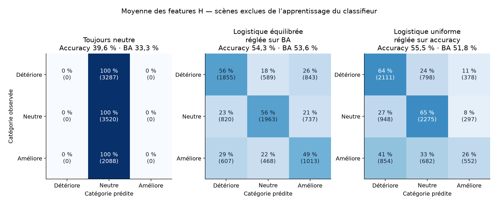

# Classer les trois catégories par régression logistique

10 septembre 2026 — **8 895 observations, 2 122 scènes**. Features du SAM 2 + LoRA de référence, calcul CPU local.

**La logistique obtient 55,5 % de bonnes classifications sur la moyenne de H**, contre 39,6 % en prédisant toujours « neutre ». Avec équilibrage des classes, le rappel moyen atteint **53,6 %**. Les erreurs restent nombreuses : ces features ne permettent pas une séparation nette des trois catégories avec les logistiques testées.

La variante uniforme ne retrouve que **26,4 % des améliorations**, contre 48,5 % avec équilibrage. Le score global doit se lire avec ces rappels.

## Modèle utilisé

**Régression logistique multinomiale** : une combinaison linéaire des canaux pour chaque catégorie, puis softmax. Entraînement avec `sklearn.linear_model.LogisticRegression`, solveur L-BFGS, pénalisation L2. [Documentation de l’implémentation](https://scikit-learn.org/stable/modules/generated/sklearn.linear_model.LogisticRegression.html).

$p(y=c\mid h)=\frac{\exp(w_c^T h+b_c)}{\sum_{r=1}^{3}\exp(w_r^T h+b_r)}$.

Les trois classes sont **détérioration**, **neutralité** et **amélioration**, avec une zone neutre de ±1 point d’IoU. Les features originales sont utilisées directement, avant toute UMAP.

## Deux objectifs à distinguer

L’**accuracy** compte toutes les bonnes réponses ; la **BA** moyenne les rappels des trois catégories. Trois réglages sont évalués : poids équilibrés et choix par BA ; poids uniformes et choix par BA ; poids uniformes et choix par accuracy. La variante intermédiaire distingue l’effet des poids de celui du critère de sélection.

| Features | Poids / critère de réglage | Accuracy | BA | Rappel détériore | Rappel neutre | Rappel améliore |
| --- | --- | ---: | ---: | ---: | ---: | ---: |
| Témoin | Toujours neutre | 39,6 % | 33,3 % | 0 % | 100 % | 0 % |
| Moyenne H (256) | Équilibrée / BA | 54,3 % | 53,6 % | 56,4 % | 55,8 % | 48,5 % |
| Moyenne H (256) | Uniforme / BA | 55,8 % | 52,4 % | 63,9 % | 64,1 % | 29,1 % |
| Moyenne H (256) | Uniforme / accuracy | 55,5 % | 51,8 % | 64,2 % | 64,6 % | 26,4 % |
| Trois résolutions (352) | Équilibrée / BA | 54,6 % | 53,9 % | 56,3 % | 56,8 % | 48,6 % |
| Trois résolutions (352) | Uniforme / BA | 56,1 % | 52,9 % | 63,0 % | 64,4 % | 31,3 % |
| Trois résolutions (352) | Uniforme / accuracy | 56,0 % | 52,7 % | 63,6 % | 64,5 % | 29,8 % |
| Avant attention (576) | Équilibrée / BA | 54,1 % | 53,4 % | 56,1 % | 55,5 % | 48,6 % |
| Avant attention (576) | Uniforme / BA | 55,2 % | 51,8 % | 62,9 % | 64,1 % | 28,4 % |
| Avant attention (576) | Uniforme / accuracy | 55,2 % | 51,6 % | 64,0 % | 63,6 % | 27,3 % |



Les cellules indiquent le pourcentage de chaque catégorie réelle et le nombre d’images. Pondérer les classes change le compromis entre les trois rappels ; cela ne garantit pas des probabilités calibrées.

## Le témoin neutre dépend du jeu

| Ensemble | N | Accuracy toujours neutre | Accuracy logistique uniforme | BA logistique uniforme |
| --- | ---: | ---: | ---: | ---: |
| Toutes les observations | 8895 | 39,6 % | 55,5 % | 51,8 % |
| Khanhha, trois conditions | 5085 | 50,0 % | 56,1 % | 48,9 % |
| Khanhha propre | 1695 | 63,2 % | 60,8 % | 42,0 % |

Sur Khanhha propre, la logistique uniforme obtient 60,8 %, contre 63,2 % pour le témoin. Les résultats globaux mélangent plusieurs domaines et niveaux de bruit. [Tous les modèles par sous-ensemble](logistic_regression/cohort_metrics.csv).

## Ce qu’apporte ce nouveau réglage

Sur H moyen, différence de BA entre la nouvelle logistique équilibrée et la logistique équilibrée précédemment réglée : **+0,08 point**, IC 95 % **[-0,36 ; 0,54]**. Cet intervalle compare les mêmes scènes et inclut zéro : **aucun gain établi avec ce nouveau réglage**.

Le nombre de canaux est lui aussi choisi en validation interne : 32, 128 ou tous. Canaux retenus dans les cinq folds externes, pour la logistique équilibrée :

| Features | Nombre de canaux retenus, folds 0 à 4 |
| --- | --- |
| Moyenne H (256) | 256, 256, 256, 256, 256 |
| Trois résolutions (352) | 352, 352, 352, 352, 352 |
| Avant attention (576) | 576, 576, 576, 576, 576 |

La validation retient **tous les canaux** pour les trois représentations avec équilibrage des classes. Les [réglages](logistic_regression/selected_settings.csv), numéros des canaux, poids appris et normalisations sont enregistrés dans [les fits](logistic_regression/fits/). Ils ne donnent pas, à eux seuls, une interprétation physique des canaux.

## Domaine entièrement absent de l’apprentissage de la logistique

Test complémentaire sur H moyen ; les trois conditions Khanhha sont exclues ensemble.

| Domaine exclu | BA équilibrée | Accuracy toujours neutre | Accuracy uniforme | BA uniforme | ΔIoU sélection uniforme (points) |
| --- | ---: | ---: | ---: | ---: | ---: |
| concrete3k | 33,8 % | 29,9 % | 33,8 % | 34,6 % | -0,23 |
| facade390 | 41,2 % | 10,8 % | 25,1 % | 41,7 % | +0,36 |
| khanhha | 32,8 % | 50,0 % | 31,1 % | 33,1 % | -0,40 |
| road420 | 35,9 % | 9,3 % | 17,6 % | 33,3 % | -0,29 |

La sélection utilise le checkpoint Frangi lorsque la classe prédite est « amélioration ». Les scores de domaines exclus évaluent le transfert du classifieur, au-delà de la reconnaissance de nouvelles scènes dans des domaines déjà présents.

## Protocole et limites

Cinq folds externes identiques aux analyses précédentes, séparés par scène : recadrages et versions bruitées restent ensemble. À l’intérieur de chaque entraînement, trois folds groupés règlent C ∈ {0,001 ; 0,01 ; 0,1 ; 1 ; 10} et le nombre de canaux. Classement ANOVA des canaux, normalisation et poids des classes sont recalculés sur chaque entraînement interne, puis sur l’entraînement externe complet. Les scènes externes ne servent jamais au réglage.

Les IC rééchantillonnent 1 000 fois les scènes par domaine, avec les mêmes tirages pour tous les modèles. Ils sont conditionnels aux prédictions sauvegardées. Les comparaisons principales portent sur H moyen. Ces analyses successives explorent les mêmes données ; une évaluation indépendante reste nécessaire.

Les classes comparent **deux checkpoints historiques distincts**. Les chevauchements historiques entre scènes d’entraînement de SAM et scènes évaluées subsistent ; séparer les scènes pour la logistique ne les efface pas. L’essai ancien utilise un prompt Frangi-similarité : il ne mesure pas encore l’intérêt d’une hiérarchie Frangi-graphe. H final est disponible après l’encodeur ; les 576 features préattention sont disponibles avant l’insertion envisagée.

## Reproduire

Depuis ce sous-dossier, avec `requirements-analysis.txt` et le cache de features :

```bash
OMP_NUM_THREADS=1 OPENBLAS_NUM_THREADS=1 MKL_NUM_THREADS=1 python compare_logistic_regression.py
python build_logistic_report.py
python -m pytest test_logistic_regression.py -q
```

[Mesures et intervalles](logistic_regression/summary.json) · [Prédictions](logistic_regression/predictions.csv) · [Contrat et versions](logistic_regression/contract.json) · [Étude précédente](MODELES_SIMPLES.md).
