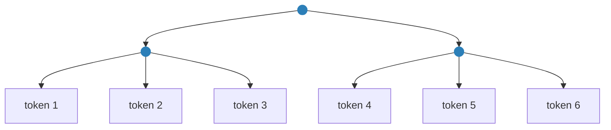
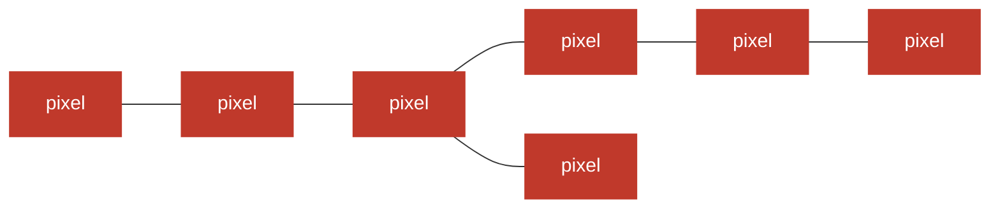
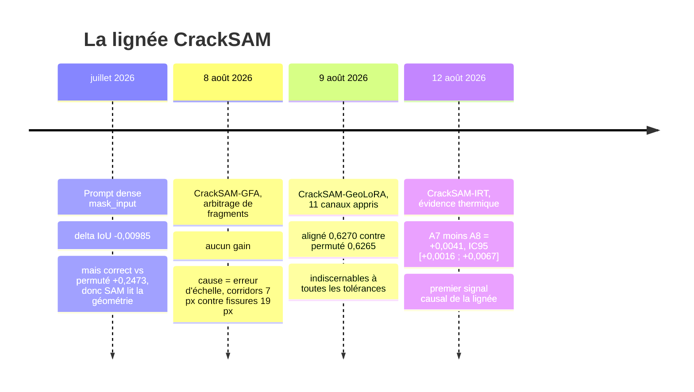
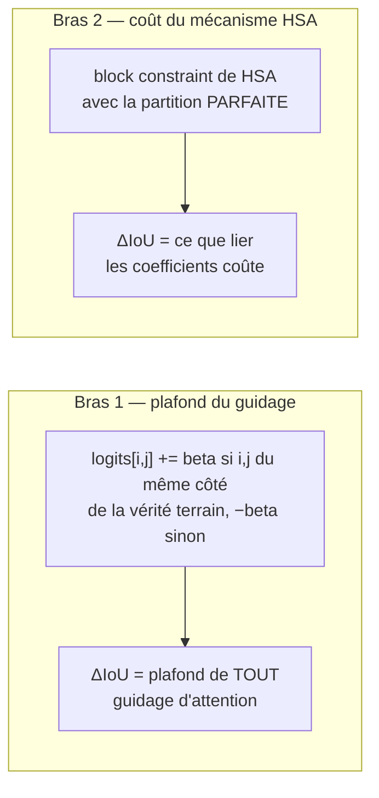

# Comprendre le problème en dix minutes

> Ce document est la porte d'entrée pédagogique du dossier. Il n'exige de connaître ni HSA,
> ni SAM 2, ni le Frangi-Graphe : il les présente. Il se lit avant
> [`../AUDIT.md`](../AUDIT.md), qui en donne la version chiffrée et argumentée.

---

## 1. L'idée de départ, et pourquoi elle est bonne

Une fissure n'est pas un objet coloré. Deux pixels sombres côte à côte peuvent appartenir à
une fissure, à une ombre, à une tache d'huile ou à un joint. Ce qui distingue la fissure,
c'est qu'elle est **connexe et allongée** : ses pixels forment un chemin.

Or un transformeur comme SAM 2 décide « ces pixels vont ensemble » au moyen de son
**attention** — et l'attention Softmax n'a aucune notion de chemin. Elle compare des
vecteurs deux à deux :

$$\text{attention}(i, j) \propto \exp\left(\frac{q_i \cdot k_j}{\sqrt d}\right)$$

Deux pixels aux extrémités d'une même fissure peuvent parfaitement s'ignorer, et deux pixels
sombres sans rapport peuvent parfaitement se répondre. **Aucun prior de connexité.**

Et nous, nous avons exactement cela : le Frangi-Graphe (papier EUVIP 2026) produit un graphe
de similarité, en extrait un arbre couvrant minimal (MST) et le hiérarchise par centralité
de betweenness pondérée. **Mettre cette structure dans l'attention** est donc, sur le papier,
la plus directe des idées de la lignée CrackSAM.

C'est même une meilleure idée que les cinq précédentes, qui injectaient toutes de la
géométrie *à côté* du raisonnement du modèle (un prompt, une carte additive, une correction
a posteriori) plutôt que *dans* ce raisonnement.

**Cet audit conclut pourtant à un no-go.** Non parce que l'endroit est mauvais, mais parce
que l'outil proposé — la *Hierarchical Self-Attention* de NeurIPS 2025 — fait l'inverse de ce
qu'on attend de lui. Les sections qui suivent expliquent pourquoi, et quatre figures le
montrent.

---

## 2. Ce qu'est une « hiérarchie » pour HSA — et ce n'est pas ce qu'on croit

Le mot « hiérarchie » recouvre deux objets très différents. Toute la difficulté est là.

### La hiérarchie qu'exige HSA

Un arbre où **les tokens sont les feuilles** et où les nœuds internes sont de purs
**regroupements**, sans contenu propre :



Trois propriétés comptent : les feuilles couvrent **tous** les tokens ; les nœuds internes
regroupent ; l'arbre est **peu profond et large** (idéalement `profondeur ≈ log_b N`).

### La « hiérarchie » que produit le Frangi-Graphe

Un MST, où **chaque nœud est un pixel**. Il n'y a pas de nœud de regroupement, et la
centralité de betweenness ne rend pas une partition mais **un score par pixel** :



C'est une **erreur de catégorie**, pas un détail d'implémentation. On peut certes fabriquer
une famille emboîtée en enracinant le MST et en prenant ses sous-arbres — c'est ce que fait
`extract_backbone_centrality` en interne. Mais l'objet obtenu est un **chemin**, pas une
hiérarchie, et la §4 le mesure.

> **À retenir.** La phrase « notre méthode produit une hiérarchie » est vraie au sens courant
> (il y a un ordre d'importance) et fausse au sens de HSA (il n'y a pas de partition
> emboîtée des tokens).

---

## 3. Ce que fait HSA — et pourquoi ce n'est pas ce qu'on veut


Le mécanisme unique de HSA s'appelle la **block constraint**. Pour deux sous-arbres frères
`A` et `B`, **toutes** les paires de feuilles entre eux partagent **une seule valeur
d'attention** :

$$\theta_{i,j} = \theta_{A,B} \qquad \forall\, i \in \ell(A),\ j \in \ell(B)$$

La figure le montre : à gauche, la Softmax libre ; à droite, la même matrice une fois les
blocs liés. Les diagonales gardent du détail, tout le reste s'aplatit.

Le théorème 3.2 du papier établit que cette matrice est **la plus proche possible de la
Softmax, au sens de la divergence KL**, parmi celles qui respectent la contrainte.

**Lisez bien ce théorème.** C'est un résultat d'*approximation* : il garantit qu'on perd le
moins possible. **Il ne promet aucun gain.** HSA n'ajoute rien à l'attention : il en tie des
coefficients pour en réduire le coût. C'est une compression — techniquement, une *matrice
hiérarchique* au sens de Hackbusch.

Deux conséquences que le papier assume lui-même :

- **HSA n'introduit aucun paramètre apprenable** (annexe M, section *Limitations*). Dans un
  régime LoRA, il ne peut donc que **retirer** des degrés de liberté.
- **En remplacement dans un modèle pré-entraîné, HSA dégrade** : 7 benchmarks sur 7, de
  −0,005 (IMDB) à −0,42 (QNLI). Sa contrepartie annoncée est un gain de FLOPs, pas
  d'exactitude.

Le seul régime où HSA *gagne* est l'entraînement **de zéro** d'un petit modèle (1,2 M
paramètres) sur des séquences si longues que la Softmax devait les tronquer. Ce n'est pas
notre situation.

> **À retenir.** On cherche un **injecteur** de prior topologique. HSA est un
> **compresseur**. Ce sont deux métiers opposés.

---

## 4. Les mesures qui ferment le dossier

Toutes reproductibles en une demi-heure de CPU, sans données ni GPU (§6).

### 4.1 Il n'y a presque rien à contraindre dans SAM 2


Le tronc Hiera-L de SAM 2 compte **48 blocs**. Quarante-cinq utilisent une attention
**fenêtrée** — leur matrice est déjà locale, déjà « contrainte géométriquement », par une
grille. Seuls **trois blocs** (23, 33, 43) ont une attention **globale**, et ils sont tous au
même étage : **64 × 64 = 4 096 tokens**.

Le décodeur de masques, lui, n'a **aucune** auto-attention image→image : son
`TwoWayTransformer` ne fait circuler l'information qu'entre ~8 tokens de requête et l'image.

Ces trois matrices pèsent **6,56 %** des FLOPs du tronc. Le camembert de droite le dit : les
MLP en consomment 59 %, les projections linéaires 29,5 %. **L'argument de performance de
HSA — sa seule contribution démontrée — porte donc sur 6,56 % du calcul.**

### 4.2 L'arbre de Frangi est un chemin


Mesuré sur des fissures synthétiques calibrées sur la géométrie réelle du jeu Khánh Hà
(448 px, fissures de 19 px, couverture 5,7 %) :

| | mesuré | ce qu'il faudrait |
|---|---:|---:|
| Facteur de branchement moyen | **1,2 – 1,34** | 4 à 16 |
| Nœuds internes à **un seul** enfant | **72 – 85 %** | ~0 % |
| Profondeur | **282 – 591** | `log_b N` ≈ 4,5 |

Un nœud à un seul enfant ne regroupe rien. Un arbre dont 73 % des nœuds internes sont dans ce
cas, et dont la profondeur est 80 fois celle d'un arbre équilibré de même taille, n'est pas
une hiérarchie : c'est une **chenille**, un chemin avec de courtes pattes.

Ce n'est pas un défaut de code, et ce n'est pas non plus un réglage malheureux. C'est ce
qu'on doit attendre du MST d'un objet curviligne : une fissure *est* un chemin. Le §4.4 le
démontre : le branchement `b` d'un arbre est **entièrement déterminé** par sa fraction de
feuilles, et aucun seuil du pipeline ne la déplace.

Et cela ruine l'algorithme. La programmation dynamique de HSA se parallélise sur GPU **par
niveau de profondeur** (annexe E.3) : il faut `D` produits creux **séquentiels**. Avec
`D = 358`, c'est 358 lancements de noyau enchaînés par bloc d'attention et par image, là où
il y a aujourd'hui un seul produit matriciel. Chaque token ne verrait plus que ~350 valeurs
d'attention distinctes au lieu de 11 102, réparties le long d'une chaîne de 171 ancêtres en
moyenne : **ce n'est plus de l'attention, c'est un balayage séquentiel.**

### 4.3 Sous l'élagage actuel, la géométrie ne couvre qu'un pour cent de la matrice


Le chiffre qui tranche, et il est purement arithmétique. En suivant une fissure de l'image
jusqu'à la matrice d'attention :

1. la fissure occupe ~5 à 8 % des **pixels** ;
2. le graphe de Frangi en fait ~16 000 nœuds ;
3. projetés sur la grille de **64 × 64 tokens**, cela touche **7 à 11 %** des 4 096 tokens ;
4. dans la matrice `4096 × 4096`, les paires *fissure × fissure* représentent
   **0,6 à 1,2 %** des cellules.

Les 99 % restants — fond contre fond, fond contre fissure — devraient être structurés par un
regroupement **inventé** : une grille, un quadtree, une fenêtre glissante. C'est donc ce
regroupement arbitraire qui dominerait numériquement le comportement de la couche.

> Le projet s'appellerait « attention hiérarchique guidée par Frangi » et serait, à plus de
> 99 %, une « attention hiérarchique guidée par un quadtree ». Il faudrait le contrôle
> correspondant — quadtree seul — et le papier HSA lui-même donne toutes les raisons de
> penser qu'il ferait jeu égal : son annexe L conclut que le choix de la hiérarchie est
> *« relatively inconsequential »*.

### 4.4 « Il suffit d'enlever l'élagage » — l'objection, et sa mesure

C'est la première objection que soulève quiconque connaît le pipeline, et elle est fondée :
si l'arbre ne couvre que 5 % de l'image, c'est parce qu'on a élagué **avant** de calculer le
MST — un seuil de candidature, puis `τ = 0,25` sur les arêtes et sur les nœuds. Retirons-les,
et l'arbre couvrira tout.


C'est exactement ce qui arrive, et il faut le dire franchement : **la couverture passe de
5,5 % à 100 %.** L'obstacle du §4.3 disparaît.

Mais deux choses ne suivent pas.

**Le branchement ne bouge pas — et c'est une identité, pas un hasard.** Dans *tout* arbre à
`N` nœuds, la somme des nombres d'enfants vaut exactement `N − 1`. Si `L` est le nombre de
feuilles, le branchement moyen sur les nœuds internes vaut

$$b = \frac{N-1}{N-L}$$

Donc `b = 8` **exige** `L/N = 87,5 %` de feuilles. Nos arbres en ont 13 à 25 %, élagués ou
non. Autrement dit : **`b` n'est pas un réglage du pipeline, c'est la fraction de feuilles**,
et un arbre couvrant d'un graphe de voisinage — dont le degré moyen vaut mécaniquement 2 —
n'en produit pas davantage. Aucune valeur de `τ`, `R` ou `Σ` ne franchit cette borne.

**La profondeur empire.** De 358 à **2 414** à pleine résolution. La raison est simple : dans
le fond de l'image la similarité `S ≈ 0`, donc la dissimilarité `d = (1 − S)·ρ ≈ ρ` — les
poids deviennent quasi uniformes et le MST erre. L'élagage retenait justement les arêtes de
forte similarité, c'est-à-dire les segments courts et cohérents. Or la passe descendante de
HSA coûte une opération séquentielle **par niveau de profondeur**.

**Et la couverture gagnée n'est pas une couverture par Frangi.** Sur ~95 % de l'image
`S ≈ 0` : la structure de l'arbre y est dictée par la distance en pixels et le bruit de
texture. L'obstacle change de forme plutôt qu'il ne disparaît — de « la hiérarchie ne couvre
pas la matrice » à « la hiérarchie couvre la matrice, mais 99 % de sa structure ne porte
aucun signal de Frangi ». C'est précisément ce que mesure le contrôle permuté, celui qui a
dit non quatre fois.

> **La meilleure version de l'idée** est la troisième barre de chaque panneau : non élaguée,
> et construite **directement sur la grille 64 × 64**, puisque c'est la seule résolution où
> une attention globale existe. 100 % de couverture pour 4 096 nœuds, profondeur 157 au lieu
> de 2 414. Elle reste à `b = 1,15`, avec 86 % de nœuds internes à un seul enfant et une
> profondeur 39 fois celle d'un arbre équilibré. Si l'on va au bout de l'idée, c'est de
> celle-là qu'il faut partir.

### 4.5 Et si la hiérarchie était parfaite ? — la hiérarchie oracle

Les deux sections précédentes disent que *notre* hiérarchie est mauvaise. Elles ne disent pas
qu'une bonne hiérarchie aiderait. C'est une question distincte, et on peut y répondre en
construisant la meilleure hiérarchie possible **à partir de la vérité terrain**.

La mesure qui compte est la **dilution** : quand `i` attend `j`, la clé et la valeur de `j`
sont moyennées avec tous les autres tokens de son bloc. `1` = attention intacte, `1 024` =
`j` est noyé dans un quart de l'image.


Sept hiérarchies ont été construites et notées ([`02_HIERARCHIE_ORACLE.md`](02_HIERARCHIE_ORACLE.md)).
Deux enseignements.

**Aucune hiérarchie *équilibrée* ne préserve la continuité à longue portée.** Quadtree,
bipartition à coupe minimale qui cherche pourtant à éviter la fissure, ordonnancement le long
du squelette, MST de Frangi rééquilibré : toutes plafonnent entre 768 et 1 024. C'est forcé.
Une coupe équilibrée au niveau 1 partage l'image en deux moitiés, donc **coupe toute fissure
qui la traverse** — et deux tokens de fissure éloignés se retrouvent reliés par une unique
valeur partagée avec un quart de l'image. Or l'équilibre est exactement ce que HSA exige pour
sa complexité et sa profondeur logarithmique : **l'efficacité et la continuité s'opposent
frontalement.**

**La seule échappatoire abandonne l'équilibre au sommet** : mettre la fissure entière dans un
sous-arbre, le fond dans l'autre. La dilution à longue portée tombe à **181**, sans rien
coûter en local. Et le contrôle permuté — la même construction avec la fissure d'une *autre*
image — remonte à **808**. Le gain vient donc bien du bon masque.

> Mais regardez ce que cette hiérarchie oracle demande : **une carte binaire fissure/fond.**
> Ni MST, ni composantes, ni centralité de betweenness. C'est-à-dire : *pas* la partie du
> Frangi-Graphe qui n'avait jamais été testée, et qui motivait ce dossier. C'est
> `node_sim_max` seuillé — la carte même qui a échoué comme prompt dense en juillet.
>
> La question devient donc précise, et elle reste ouverte : **la même carte, injectée comme
> structure de blocs de l'attention au lieu d'hypothèse de masque, aide-t-elle ?** C'est
> exactement le bras `block` de l'oracle du §6.

Une bonne nouvelle au passage : la **décomposition en centroïdes** répare le défaut du §4.2.
Elle transforme la chenille de Frangi en un arbre de profondeur 12 et d'arité 2,82, pleinement
compatible avec HSA. Ce défaut-là était réparable ; il ne l'était pas dans le pipeline actuel,
il l'est en trente lignes.

---

## 5. Ce que cinq itérations ont déjà appris, et qu'il faut respecter



Trois leçons gouvernent toute suite :

**(a) Le contrôle permuté est le juge.** GeoLoRA a entraîné une variante géométrique et la
même variante avec la géométrie **permutée entre images**. Elles sont indiscernables à toutes
les tolérances. Son rapport le formule sans détour : *« Ce n'est pas un signal faible mal
exploité, c'est l'absence de signal »*, et met en garde : *« Ce qu'il ne faut pas faire :
augmenter la capacité de l'adapter, allonger l'entraînement, ou empiler un GNN. »*

**(b) L'échelle plafonne tout, et n'a jamais été corrigée.** Les fissures annotées font
**19,1 px** de large et couvrent **5,70 %** de l'image ; les corridors géométriques, hérités
d'une étude sur des vallées de 1 à 3 px, font 7 px et couvrent **1,8 %**. Même parfaitement
placés, ils ne peuvent recouvrir qu'un tiers de la vérité terrain. **Aucune architecture ne
répare une erreur d'échelle.**

**(c) Le seul signal causal vient du multimodal.** Sur IRT-Crack, une évidence calculée sur
la **thermique** — que SAM ne voit jamais — bat son propre contrôle permuté de `+0,0041`,
IC95 excluant zéro. C'est cohérent : sur du visible monomodal avec une baseline supervisée
dans le domaine, la géométrie de Frangi ne dit rien que la LoRA n'ait déjà appris.

---

## 6. Ce qu'il faut faire à la place

L'audit propose cinq pistes classées ([`../AUDIT.md` §6](../AUDIT.md#6-ce-que-je-propose-à-la-place-par-ordre-de-valeur-attendue)).
La première est la seule qui soit **bloquante**, et elle est écrite, testée et prête à
lancer : [`../experiments/02_attention_oracle.py`](../experiments/02_attention_oracle.py).

### L'oracle d'attention — deux heures de GPU, et le dossier est tranché

Sur la baseline **gelée**, on branche un *hook* sur les blocs 23, 33 et 43 et on mesure deux
bras :



- Le **bras 1** est l'oracle parfait : il connaît la vraie topologie, sans bruit, sans erreur
  d'échelle. Aucune contrainte issue de Frangi ne peut faire mieux. Si `ΔIoU < +0,01`, toute
  la famille est close — HSA compris.
- Le **bras 2** applique la vraie mécanique HSA (terme `log|ℓ(B)|` de l'algorithme 3 compris)
  avec la partition parfaite. Il isole la question décisive : **lier les coefficients
  d'attention coûte-t-il quelque chose, même avec une hiérarchie parfaite ?** Si oui, une
  hiérarchie bruitée ne peut que faire pire.

C'est l'oracle qui manque à la lignée. GFA a mesuré un oracle de *sélection*, GeoLoRA un
oracle d'*évidence* — tous deux prescrits par `docs/09` et `docs/10` de CrackSAM. **L'oracle
d'*attention* n'a jamais été posé.**

```bash
# la mécanique se vérifie sans GPU ni poids
python ISPRS/CrackSAM-HierarchicalSelfAttention/experiments/02_attention_oracle.py --self-test
```

### Et les quatre autres

| | Action | Coût |
|:--:|---|---|
| **P0b** | Réaccorder Frangi sur 19 px (`Σ={1,3,5,7}` est réglé pour 1–3 px) | 2 h CPU |
| **P1** | Prompts natifs : points le long du backbone, par centralité décroissante — la **première vraie utilisation** de MST + composantes + centralité | 2–3 j GPU |
| **P2** | Biais structurel additif (Graphormer), ~192 paramètres — *si et seulement si* P0 montre du plafond | 1 semaine |
| **P3** | Multimodal sur FIND, dont le range laser est co-recalé par construction | — |

---

## 7. Reproduire

```bash
# les mesures
python ISPRS/CrackSAM-HierarchicalSelfAttention/experiments/00_sam2_attention_budget.py
python ISPRS/CrackSAM-HierarchicalSelfAttention/experiments/01_frangi_tree_shape.py \
    --size 448 --width 9 --branches 1 --trunk-scale 0.8 --n-images 3 --tag khanhha

# les figures de ce document
python ISPRS/CrackSAM-HierarchicalSelfAttention/experiments/03_figures.py

# les sept hiérarchies candidates, construites et notées
python ISPRS/CrackSAM-HierarchicalSelfAttention/experiments/04_oracle_hierarchy.py --n-images 3

# la mécanique de l'oracle, sans GPU
python ISPRS/CrackSAM-HierarchicalSelfAttention/experiments/02_attention_oracle.py --self-test
```

> [!NOTE]
> Les fissures des §4.2 et §4.3 sont **synthétiques**, calibrées sur trois grandeurs mesurées
> du jeu Khánh Hà. Les statistiques de forme d'arbre sont stables sur cinq configurations et
> découlent de la nature curviligne de l'objet. Le taux de couverture en tokens dépend en
> revanche de l'étalement spatial de la fissure et varie de 7 à 17 % : à rejouer sur les
> vraies images avant d'être cité comme définitif. La fonction `frangi_mst()` accepte
> n'importe quel tableau `float32`.

---

## 8. En une phrase

> L'attention est le bon endroit où mettre un prior de connexité ; HSA est le mauvais outil,
> parce qu'il **comprime** l'attention au lieu de l'informer, que SAM 2 n'offre que trois
> matrices à contraindre pesant 6,6 % du calcul, et que le MST de Frangi est un **chemin**
> dont le branchement ne se règle pas. Retirer l'élagage lui fait bien couvrir toute la
> matrice — c'est acquis — mais triple sa profondeur sans toucher à son branchement. Avant
> d'écrire quoi que ce soit, poser l'oracle d'attention : deux heures, et l'on saura s'il
> existe un plafond à atteindre. Et l'on sait désormais que ce test **est** l'oracle : la
> meilleure hiérarchie possible pour une fissure est `{fissure, fond}` au sommet, et elle ne
> demande qu'une carte binaire — ni MST, ni centralité.

---

**Suite de lecture :** [`../AUDIT.md`](../AUDIT.md) pour l'argumentaire complet et les
conditions sous lesquelles ce verdict serait faux ; [`01_RESUME_HSA.md`](01_RESUME_HSA.md)
pour le papier NeurIPS en huit points ; [`02_HIERARCHIE_ORACLE.md`](02_HIERARCHIE_ORACLE.md)
pour la construction et la notation des sept hiérarchies candidates.
