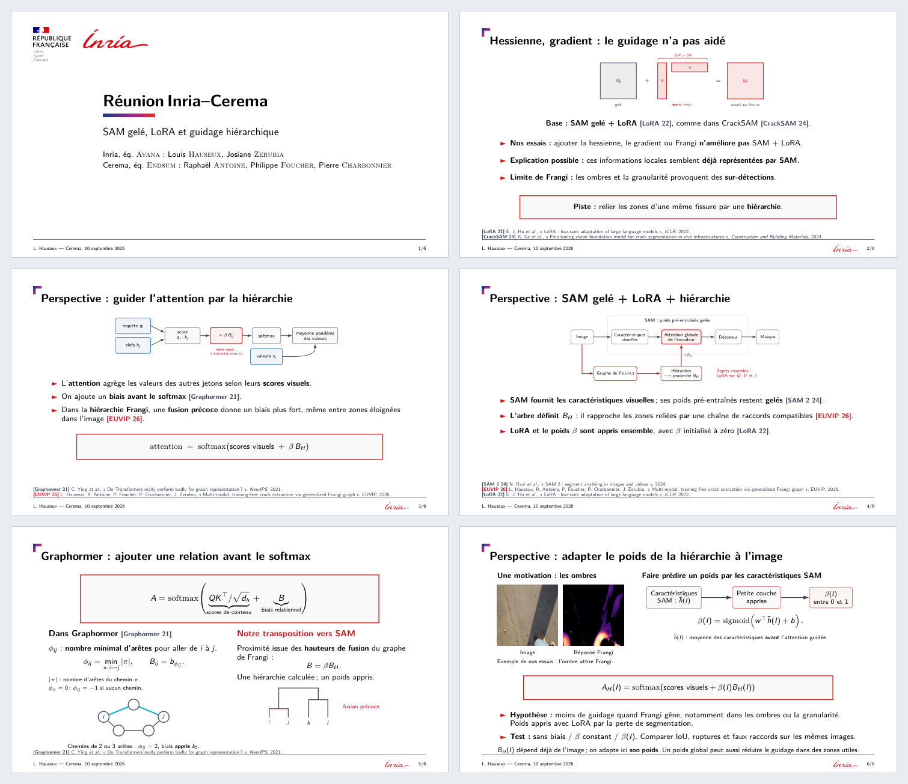

# Cerema — 10 septembre 2026

[**Présentation : page de titre + 5 slides**](Cerema_2026-09-10_Hauseux_SAM_Hierarchie.pdf) · [Source LaTeX](main.tex) · [Article Graphormer](articles/Graphormer_NeurIPS_2021.pdf)

[](Cerema_2026-09-10_Hauseux_SAM_Hierarchie.pdf)

## Contenu et provenance

La page de titre reprend celle des [réunions Inria–Cerema](../../../CrackSAM/reference/presentations/2026-07-10-inria-cerema/source/main.tex), avec les équipes et auteurs habituels. Elle précède cinq slides :

1. **Constat : le guidage local n’a pas aidé** — slide 55 simplifiée ; redondance envisagée des descripteurs, sensibilité de Frangi aux ombres et textures.
2. **Guider l’attention** — slide 56, texte raccourci.
3. **SAM gelé + LoRA + hiérarchie** — slide 90, dans les compléments, texte raccourci.
4. **Graphormer** — le biais avant softmax ; la hiérarchie Frangi dans SAM reste notre proposition.
5. **Poids dépendant de l’image** — hypothèse d’un petit module prédisant le poids du guidage.

Les trois premières slides adaptent les textes et TikZ de la [soutenance du 8 septembre](https://github.com/Ludwig-H/Manuscrit-de-th-se/blob/3593fbf25434c4715b37537eae1287bf49239fa7/Soutenance/soutenance/main.tex), au commit `3593fbf`. Les pages originales **64**, **65 et 101** sont conservées : [slide 55](sources/Soutenance_extrait_55.pdf), [slides 56 et 90](sources/Soutenance_extraits_56_90.pdf). Les formulations et annotations sont allégées. Le thème Inria vient de la même source. Les images d’ombres proviennent de [nos essais du 9 août](../../../CrackSAM-GeoLoRA/presentations/2026-08-09-cracksam-geolora/README.md).

Graphormer : Ying et al., NeurIPS 2021, §3.1.2, équation (6), page 4. Le [PDF officiel complet](https://proceedings.neurips.cc/paper_files/paper/2021/file/f1c1592588411002af340cbaedd6fc33-Paper.pdf) est fourni dans `articles/`, sans modification. Sa distance $\phi_{ij}$ compte le minimum d’arêtes entre deux nœuds : zéro pour un même nœud, valeur spéciale −1 sans chemin. La distance est calculée ; le biais associé est appris et partagé entre les couches. Ce n’est ni une hiérarchie ni SAM. Les références sont générées par **BibTeX**, avec les libellés et pieds de slide habituels ; aucune citation dans les titres.

## Variante à étudier

La hiérarchie dépend déjà de l’image. Nous proposons d’en adapter **le poids**, prédit à partir de la moyenne des caractéristiques SAM avant l’attention guidée. Une seule couche et une sigmoïde suffisent ; elle apprend avec LoRA par la perte de segmentation, sans annotation d’ombre. Les poids préentraînés restent gelés.

Il s’agit d’un poids utile à la tâche, **pas d’une confiance calibrée**. Une ombre peut contenir une fissure ; un coefficient global peut affaiblir aussi des relations utiles. Le gain reste à mesurer. [Notes pour le premier test](NOTES.md).

## Compiler

```bash
cd ISPRS/CrackSAM-HierarchicalSelfAttention/presentations/2026-09-10-cerema
make
```

Dépendances : LuaLaTeX, BibTeX, Babel français et Beamer/TikZ (`texlive-luatex`, `texlive-lang-french`, `texlive-latex-extra` sous Debian). Le thème utilise ici Latin Modern, comme le PDF de soutenance, faute de fontes Inria installées ; son avertissement à ce sujet est attendu. Les auxiliaires restent dans `build/`. L’aperçu accompagne le PDF compilé.
