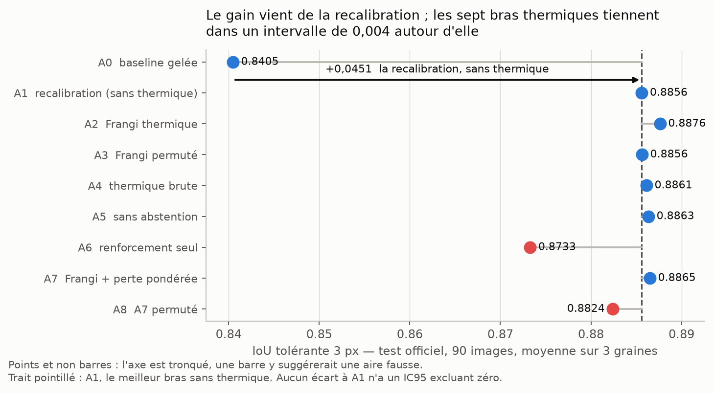
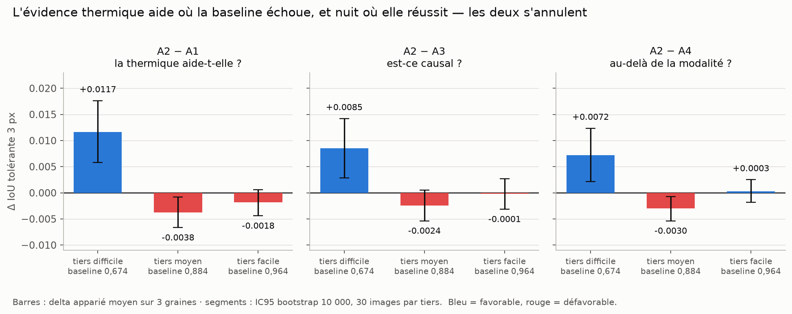
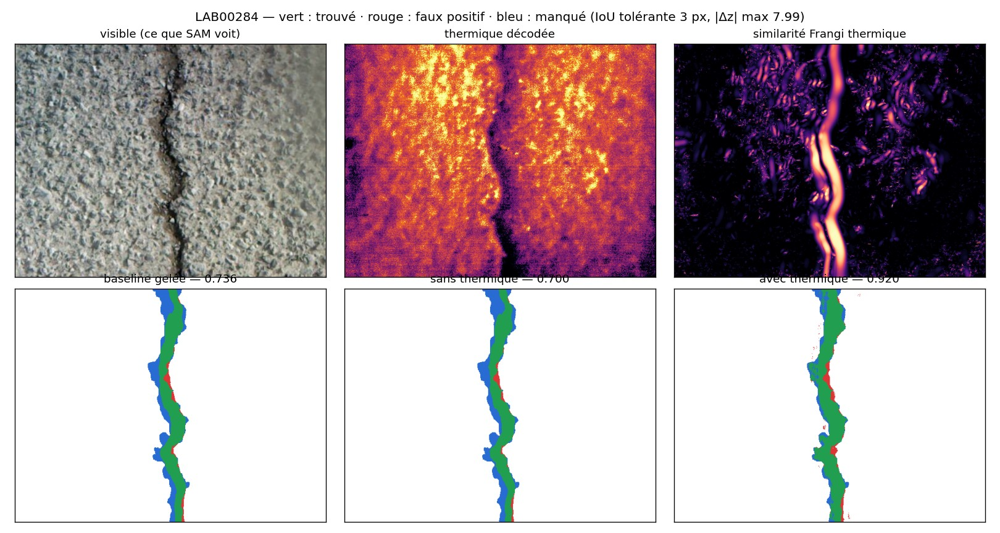
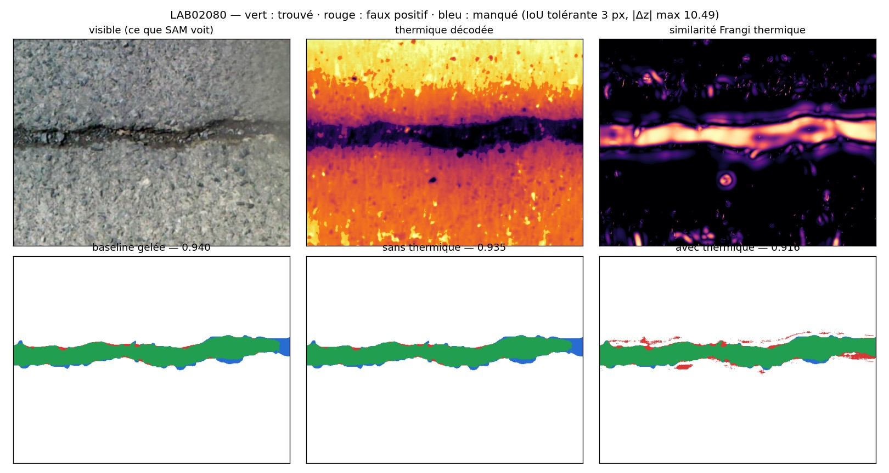
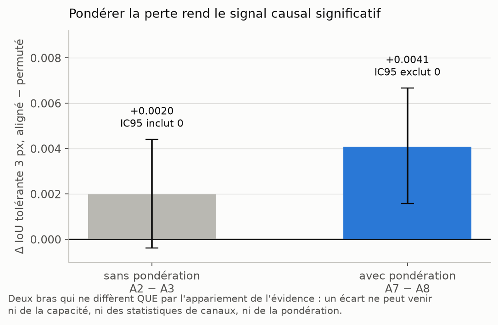
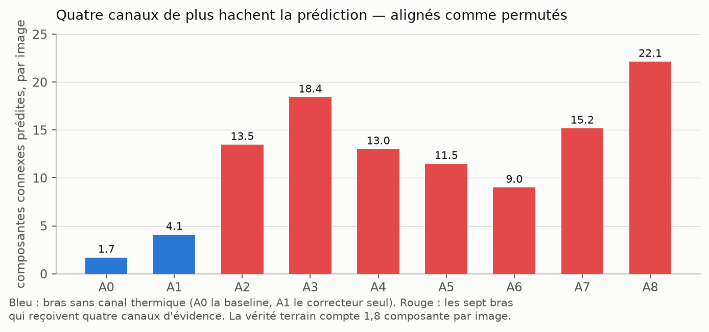
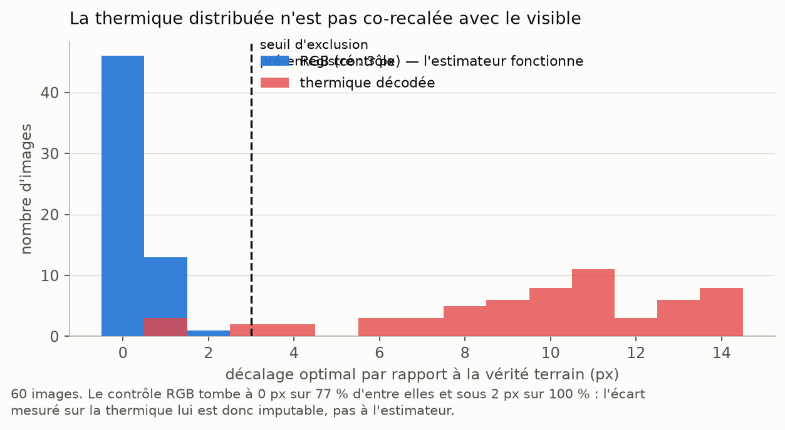

# CrackSAM-IRT en une page

*Campagne du 12 août 2026 · 25 exécutions sur RTX PRO 6000 · IRT-Crack, 448 paires,
split officiel 358/90 · baseline CrackSAM 2 + LoRA `tol3` **gelée**.*
Le détail est dans [`RAPPORT.md`](RAPPORT.md).

| | |
|:--|:--|
| **La question** | une évidence Frangi calculée sur la **thermique** — que SAM ne voit jamais — corrige-t-elle ses erreurs ? |
| **La réponse courte** | le signal existe et il est causal, mais il s'annule contre lui-même |
| **Le chiffre qui compte** | `+0,0131` là où la baseline échoue, `−0,0058` et `−0,0046` ailleurs |
| **Ce qui manque** | une porte qui décide **où** corriger — elle vaudrait `+0,0044` |

---

## 1. Neuf bras, un seul gain

Un correcteur de **20 835 paramètres** lit les logits gelés et quatre canaux
d'évidence, puis choisit par pixel entre *renforcer*, *supprimer* et
*s'abstenir*. Neuf bras isolent chaque ingrédient.

Tout le gain mesurable vient de **A1** — un correcteur qui ne voit *aucune*
thermique et se contente de recalibrer les logits sur le nouveau domaine :
`+0,0451` d'IoU tolérante, IC95 `[+0,0360 ; +0,0550]`. Les sept bras thermiques
se tiennent ensuite dans un mouchoir de `0,004`, et **aucun** n'a d'écart à A1
dont l'IC95 exclue zéro.

Lu comme ça, le verdict serait « la thermique n'apporte rien ». C'est faux.

## 2. Le problème : un effet réel, à double signe

Le plan multimodal avait pré-enregistré exactement ce qu'il fallait regarder —
« *le gain doit se concentrer sur le tiers où la fissure est invisible ; un gain
uniforme est un indice d'artefact* ». On stratifie donc le test par la
performance de la **baseline gelée**, critère indépendant des bras comparés.

> **Sur le tiers difficile, les trois conditions du critère pré-enregistré sont
> remplies simultanément** — `A2 > A1`, `A2 > A3` (le contrôle permuté) et
> surtout `A2 > A4` : à capacité et protocole identiques, **l'abstraction
> géométrique de Frangi bat la thermique brute**. C'est le contrôle décisif
> autour duquel tout le plan était bâti.
>
> Et l'effet **s'inverse** sur le tiers moyen, IC95 excluant zéro lui aussi.

Les deux régimes, en images. À gauche du diagnostic, ce que la thermique répare :

`LAB00284` : la fissure est un trait sombre peu contrasté sur un enrobé
texturé ; la thermique la montre comme un sillon **froid** net, et la similarité
Frangi en fait une crête propre. La prédiction passe de `0,700` à `0,920` (graine 13).

Et ce qu'elle casse :

`LAB02080` : la fissure est large et évidente dans le visible, la baseline est
déjà à `0,940`. Mais la crête thermique est **plus large que la fissure** — la
diffusion de chaleur ne s'arrête pas au bord — et le correcteur en fait des faux
positifs de part et d'autre : `0,935 → 0,916` (graine 13).

## 3. Le signal est bien causal — et pondérer la perte le rend significatif

Le diagnostic désigne un coupable : une perte qui moyenne uniformément est
**dominée par les images où il n'y a rien à gagner**. **A7** pondère donc chaque
image d'entraînement par sa marge de progression `1 − IoU_baseline` ; **A8** est
son contrôle permuté, sans lequel un gain serait indistinguable d'un effet de la
pondération elle-même.

> `A7 − A8 = +0,0041`, IC95 `[+0,0016 ; +0,0067]`, même signe sur les trois
> graines. **C'est le premier écart aligné-contre-permuté significatif de toute
> la ligne CrackSAM.** Après quatre itérations où l'évidence permutée faisait
> aussi bien — voire mieux — la géométrie est enfin lue de façon spécifique à
> l'image.

Sur `LAB00284`, la même image corrigée par sa **propre** évidence thermique
plutôt que par celle d'une autre passe de `0,785` à `0,881`.

Mais `A7 − A1` reste indiscernable de zéro. La pondération a **augmenté le gain
là où il fallait** (`+0,0117 → +0,0131`) **et le dommage ailleurs**
(`−0,0018 → −0,0046`). Elle aiguise le compromis ; elle ne le résout pas.

## 4. Le mécanisme du dommage : la fragmentation

Quatre canaux de plus font passer la prédiction de `4` à `13–22` composantes
connexes — **alignés comme permutés, Frangi comme bruts**. C'est donc un effet de
capacité et de bruit d'entrée, pas de contenu. Sur une image déjà bien segmentée
c'est du pur dommage ; sur une image ratée, c'est le prix d'une fissure
récupérée.

## 5. La donnée, auditée avant d'entraîner

Trois portes ont été franchies avant le premier entraînement. Deux ont changé la
conception, la troisième la lecture du résultat.

**La thermique distribuée n'est pas co-recalée avec le visible** — `10,1 px` de
décalage médian, contre `0 px` pour le contrôle RGB. La fusion FLIR, elle, l'est
(médiane `0 px`), mais elle contient déjà 50 % du visible : ce n'est pas une
modalité cachée pour SAM. Le champ réceptif du correcteur vaut `15 px` : le
décalage **plafonne** le gain sans l'annuler.

Les deux autres portes, en une ligne chacune :

- **décodage** — les 448 thermiques sont en fausses couleurs ; la conversion
  standard en gris s'en écarte de `0,20` et est non monotone. Le notebook IRT du
  dépôt les corrompait bien ;
- **plafond d'amplitude** — `|z₀|` a pour médiane `12,3`, donc le `delta_max = 4`
  de la spécification laissait `18,9 %` des erreurs hors de portée. Relevé à `12`
  avant le premier run.

## 6. La solution proposée

La correction doit être rendue **exactement nulle** — l'architecture le garantit
au bit près — là où la baseline est fiable, et libérée là où elle ne l'est pas.
Appliquée au seul tiers difficile, elle vaudrait **`+0,0044`** face à A1, sans
aucune des pertes : le double de ce que la thermique produit aujourd'hui.

Le verrou est d'estimer cette fiabilité **sans étiquette**. Les proxys évidents
sont faibles — le meilleur (nombre de composantes prédites, `ρ = −0,45`) ne
retrouve que `60 %` du tiers difficile. Trois pistes, par ordre de coût :

1. **une tête de fiabilité apprise** sur les seuls logits gelés, dont la sortie
   multiplie `Δz` — le point d'entrée `correction_scope` existe déjà ;
2. **le désaccord baseline/évidence** comme estimateur : deux mesures qui se
   contredisent signalent l'endroit où l'une se trompe. C'est utiliser
   l'information multimodale pour décider **où** l'utiliser ;
3. **réduire le dommage** plutôt que le compenser — une pénalité de continuité
   (`soft-clDice`, déjà écrite et validée sur Khánh Hà) attaque la fragmentation
   à sa racine.

Et pour lever le doute sur la donnée : un **oracle de recalage** (une demi-heure
de GPU, fuite d'étiquette assumée, donc borne supérieure et jamais un résultat),
puis **FIND**, dont le range laser est co-recalé par construction du capteur.

## 7. Ce qu'il ne faut pas conclure

- **Que la méthode marche.** Le critère pré-enregistré n'est pas atteint : aucun
  bras thermique ne bat A1 avec un IC95 excluant zéro.
- **Que le tiers difficile est un résultat acquis.** La stratification était
  pré-enregistrée et son critère est indépendant des bras — mais les tiers
  comptent 30 images, et A7/A8 ont été conçus *après* avoir vu A0–A6. Ils
  demandent une réplication sur un jeu que ce diagnostic n'a pas servi à
  construire.
- **Qu'IRT-Crack condamne l'idée.** Il condamne *cette instance* : une correction
  au pixel sur une modalité décalée de 10 px. Un réseau de fusion à large champ
  réceptif tolère ce décalage bien mieux — ce qui réconcilie les gains publiés
  d'IRFusionFormer avec ce constat.
- **Que le graphe a été testé.** MST, composantes et centralité restent hors
  périmètre. La similarité dense a produit un signal causal ; ce n'est pas encore
  un gain net.
