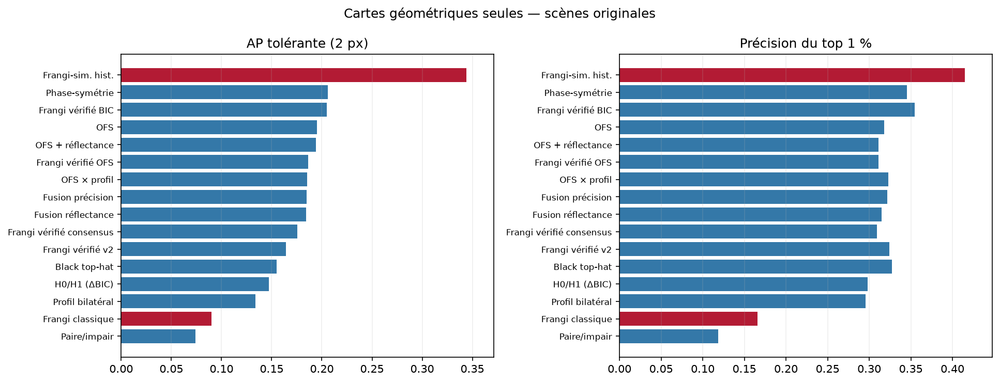
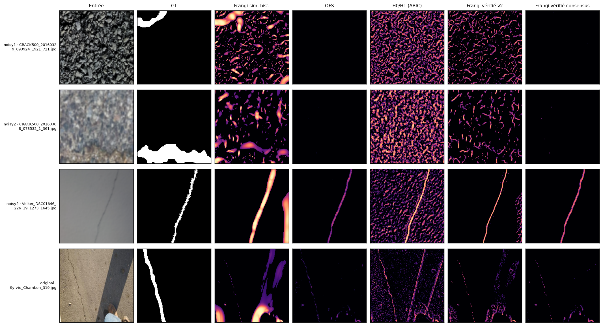
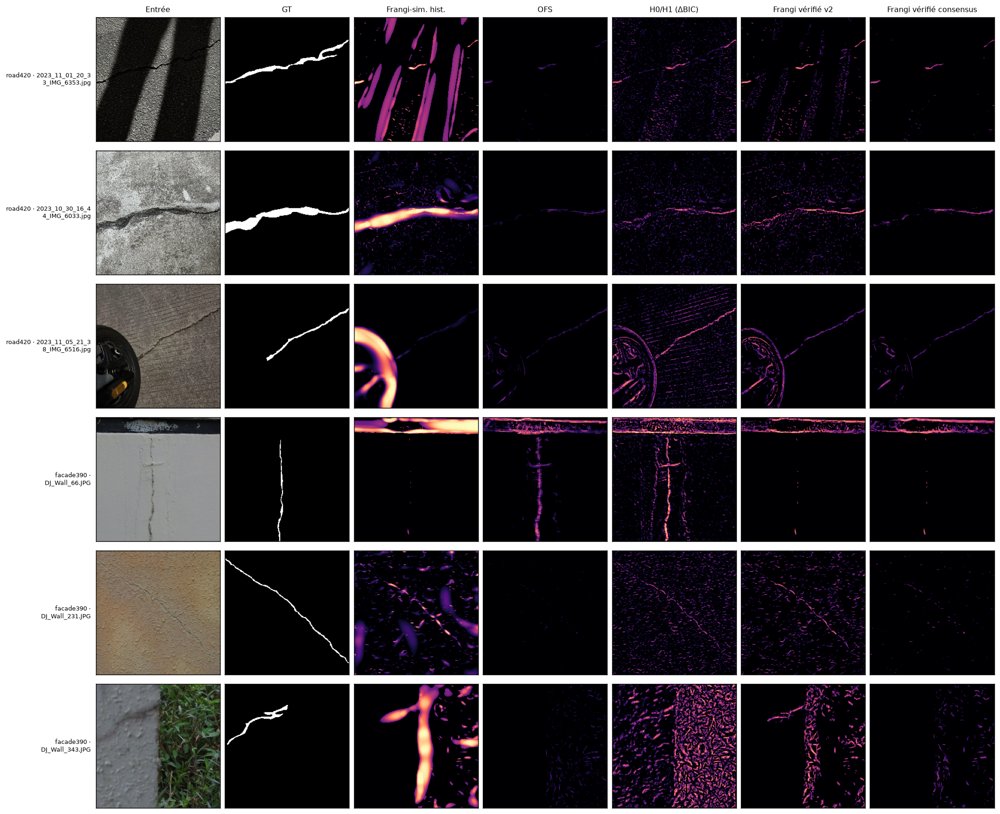
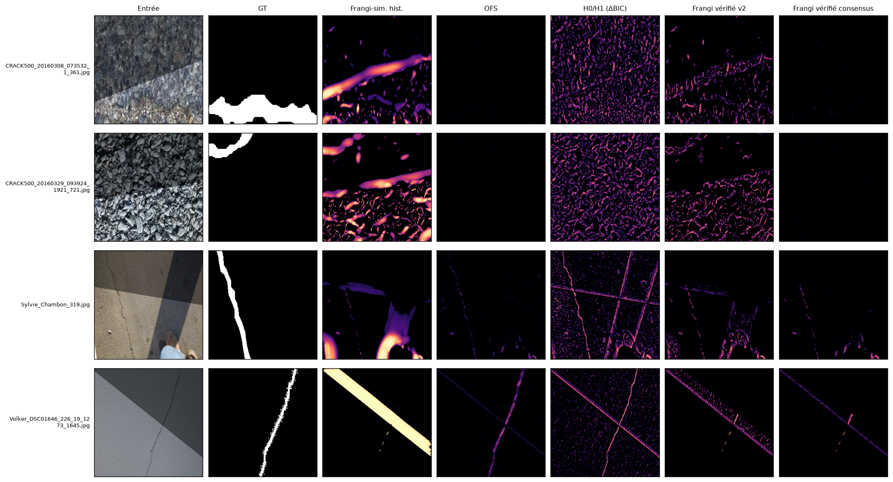
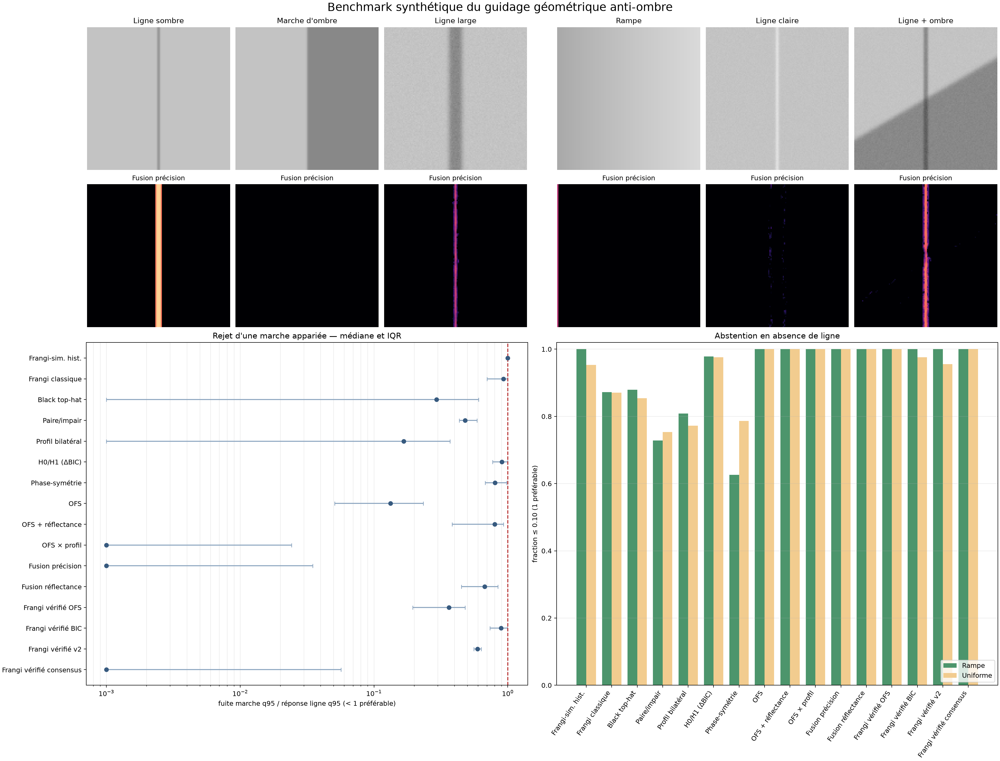

# Guidage géométrique anti-ombre pour les fissures fines

> **Date :** 8 août 2026
>
> **Statut :** étude filtre-seul exécutée et validée ; aucune intégration SAM 2
>
> **Question :** peut-on produire une carte géométrique de fissure fine qui s'abstient en l'absence d'évidence et confond moins les frontières d'ombre avec les fissures ?

Ce rapport documente l'étude qui précède toute nouvelle intégration à SAM 2. Il
est volontairement autonome, reproductible et prudent : les nombres historiques
sont séparés des résultats nouveaux, obtenus sur 78 observations réelles,
48 interventions d'ombre appariées et 752 mesures sur phantoms.

## TL;DR

- L'essai historique n'a pas réellement testé un graphe Frangi complet. La
  carte injectée dans SAM 2 était `node_sim_max`, c'est-à-dire le maximum local
  d'affinité des arêtes retenues ; le MST, les composantes et la centralité
  n'intervenaient pas.
- Les normalisations relatives à chaque image et à chaque échelle, la sélection
  d'une fraction d'arêtes et l'absence d'un état « aucune évidence » peuvent
  fabriquer une structure dominante même dans une image pauvre en fissures.
- L'interface `mask_input` de SAM 2 a aggravé le problème : une affinité locale
  non calibrée a été transformée en pseudo-probabilité puis en pseudo-logit de
  masque. Les essais causaux archivés montrent que cette interface est nuisible,
  même si l'alignement spatial transporte bien de l'information.
- Les ombres sont un mécanisme plausible de faux positif, mais elles ne sont pas
  l'unique cause établie. Deux scènes très ombrées sont des gains historiques,
  tandis qu'un échec majeur possède une carte Frangi bien alignée et aucune
  ombre franche.
- La présente étude compare donc des **filtres seuls**, sans SAM 2, sans LoRA et
  sans entraînement : paire/impair à même échelle, profil bilatéral, modèle
  explicite `H0/H1`, symétrie de phase sombre, Oriented Flux Symmetry (OFS),
  black top-hat, réflectance simple et fusions conservatrices.
- Aucun nouveau filtre ne bat globalement le contrôle historique en AP ou en
  précision. Sur les 30 scènes originales agrégées, l'historique obtient
  `AP2=0,344` et `P@1%=0,415`; le meilleur nouveau compromis sur ces deux axes,
  `verified_frangi_bic`, atteint `0,205` et `0,355`, mais augmente le rappel du
  squelette de `0,256` à `0,400`.
- Le test mécanistique est en revanche concluant pour OFS : sur 24 paires
  ligne/marche, le ratio médian de fuite vaut `0,133`, contre `1,000` pour
  l'historique. Sous ombre dure réelle synthétique, OFS réduit de `96,7 %` la
  réponse de frontière et conserve `86,9 %` de la réponse fissure médiane.
- Le résultat le plus utile est négatif : multiplier la preuve anti-ombre par
  la Frangi-similarité transmet le défaut de Frangi quand la fissure passe sous
  l'ombre. Les cartes `verified_frangi_*` chutent à environ `10 %` de rétention
  sur le phantom de traversée, alors qu'OFS seul conserve `89,5 %` et la fusion
  anti-ombre sans Frangi `93,0 %`.
- Décision : **no-go pour une nouvelle carte scalaire autonome ou un nouveau
  `mask_input`**. La suite raisonnable est une représentation multi-canal où
  Frangi propose, OFS sert de veto/abstention, et la décision résiduelle reste
  révocable par SAM 2.

| Résultat principal de l'étude filtre-seul | Valeur |
|---|---:|
| Meilleure AP tolérante à 2 px, scènes originales groupées | historique `0,344` |
| Meilleure nouvelle AP / écart à l'historique | phase-symétrie `0,206` / `−0,138` |
| Réponse frontière, ombre dure : historique → OFS | `0,1343 → 0,0045` (`−96,7 %`) |
| Rétention fissure médiane, ombre dure : historique / OFS / fusion | `0,678 / 0,869 / 0,915` |
| Fraction active moyenne sur les quatre scènes sans fissure : historique → OFS | `13,37 % → 1,38 %` |
| Décision | réviser ; OFS comme canal, aucune carte autonome validée |

Sorties : [vue métrique](figures/generated/metric_overview.png),
[atlas Khánh Hà](figures/generated/atlas_presentation_khanhha.png),
[atlas externe](figures/generated/atlas_presentation_external.png),
[stress-test d'ombres](figures/generated/atlas_ombres_synthetiques.png),
[phantoms ligne/marche](figures/generated/phantom_benchmark.png),
[résumé quantitatif](tables/generated/summary_metrics.csv) et
[résumé anti-ombre](tables/generated/shadow_stress_summary.csv). Les agrégats
par cohorte et deltas appariés sont dans
[`cohort_summary.csv`](tables/generated/cohort_summary.csv) et
[`paired_deltas_vs_historical.csv`](tables/generated/paired_deltas_vs_historical.csv).

## 1. Périmètre : détecter d'abord, guider SAM 2 ensuite

L'objet évalué ici est une carte continue de **compatibilité géométrique avec
une fissure fine**, et non un masque final. Aucun checkpoint SAM 2 n'est chargé,
aucune LoRA n'est entraînée et aucun résultat de segmentation SAM nouveau ne
doit être attribué à cette étude.

Le pipeline étudié s'arrête à la première ligne :

```text
RGB + masque GT ──► filtres géométriques ──► cartes + métriques filtre-seul
                                                │
                                                └──► intégration SAM 2 ultérieure
```

Le masque vrai sert uniquement à évaluer les cartes. Il ne règle ni les seuils,
ni les paramètres d'une scène, ni une fusion apprise. Les objectifs sont :

1. localiser les fissures avec une tolérance compatible avec leur finesse ;
2. réduire la réponse aux marches d'illumination et textures larges ;
3. conserver les fissures qui passent dans une ombre ;
4. permettre une réponse exactement nulle ou très faible quand l'évidence
   absolue est insuffisante ;
5. produire orientation, largeur/échelle et confiance utilisables plus tard
   comme géométrie explicite.

Les recommandations d'architecture SAM 2 de la section 10 sont donc des
conséquences possibles, pas des expériences déjà exécutées.

## 2. Diagnostic de l'échec historique

### 2.1 Une affinité raster, pas un graphe exploité

Le [papier EUVIP](../../../../EUVIP/EUVIP_2026_Generalized_Frangi_Multimodality_camera-ready.pdf)
décrit le Generalized Frangi sur FIND comme une construction multimodale puis
un raisonnement par similarités et graphe. L'adaptation CrackSAM 2 n'en est pas
une reproduction paramétrique stricte : le papier utilise notamment
`σ={1,3,5,7}`, `R=3`, `σs=2`, `σi=0,25`, `σa=0,125`, `τ=0,25`, tandis que le
prompt historique utilise `σ={1,3,5,9,15}`, `R=3`, `σs=1`, `σi=0,25`,
`σa=0,3`, `τ=0,18`. Cette différence est légitime pour une adaptation, mais elle
interdit d'attribuer directement son échec à la méthode EUVIP complète.

La présentation de juillet et le pipeline CrackSAM 2 ont utilisé la carte
`node_sim_max`. Pour chaque pixel candidat, cette carte conserve la meilleure
similarité d'une arête locale incidente après sélection relative. Lorsque
`compute_centrality=False`, l'extracteur retourne cette carte avant les étapes
topologiques.

L'expérience historique n'exploitait donc pas :

- le minimum spanning tree (MST) ;
- les composantes connexes du graphe ;
- la centralité calculée sur le MST ;
- les identifiants de nœuds et les arêtes comme objets persistants ;
- les extrémités, jonctions ou cycles ;
- la persistance des chemins à travers les échelles.

Il existait bien un voisinage et des affinités par paires, mais pas de décision
fondée sur la topologie complète. Décrire ce résultat comme « le graphe Frangi
ne marche pas » serait donc trop fort : c'est la variante raster
`node_sim_max` et son interface dense qui ont été invalidées.

Autre point de reproductibilité : dans l'implémentation auditée, le terme de
distance sert à la pondération du MST, mais pas au `node_sim_max` retourné avant
ce calcul. Le prompt actif ne correspond donc pas à une carte de similarité
géodésique complète.

### 2.2 Normalisations relatives et impossibilité de s'abstenir

Le code historique cumule plusieurs décisions relatives :

1. chaque Hessienne modale et chaque échelle est normalisée par son propre
   maximum spatial de norme spectrale ;
2. les candidats sont retenus au-dessus de 1 % du maximum de courbure de
   l'image ;
3. une fraction supérieure des affinités est gardée ;
4. dès que des paires candidates existent, au moins une arête est conservée.

Ainsi, « le meilleur élément d'une mauvaise image » peut recevoir une valeur
forte. La densité et l'amplitude ne représentent plus une confiance comparable
entre scènes. Une frontière d'ombre, un joint, une texture ou un artefact JPEG
peut devenir la structure de référence simplement parce qu'il est localement le
plus marqué.

Le correctif nécessaire n'est pas seulement un nouveau seuil relatif. Il faut
conserver l'énergie en unités absolues, estimer un niveau de bruit robuste,
demander une persistance à des échelles voisines et autoriser explicitement la
carte nulle.

### 2.3 Une interface SAM 2 sémantiquement nuisible

`node_sim_max` est une affinité locale, pas une probabilité de fissure. Elle a
pourtant été bornée comme une probabilité, transformée par un logit puis injectée
dans `mask_input`, que SAM 2 interprète comme une estimation de masque à
raffiner. Les valeurs absentes devenaient proches de `-11,5129`, soit une
affirmation très forte de fond. De plus, le prompt encoder réduit spatialement
le masque dense, au risque d'effacer largeur, tangente et connexions de lignes
subcellulaires.

Les résultats archivés établissent ce diagnostic :

| Contrôle historique | Résultat archivé |
|---|---:|
| Baseline SAM 2-LoRA, IoU macro sur six jeux | `0,5675` |
| Meilleur checkpoint Frangi dense, IoU macro | `0,5563` |
| Meilleur système Frangi historique vs baseline | `-0,0122` |
| Prompt Frangi sur poids baseline vs `None` | `-0,0979` |
| Tenseur de logits nuls vs `None` | `-0,1641` |
| Prompt correctement aligné vs prompt permuté | `+0,2473` |
| Prompt correctement aligné vs prompt décalé | `+0,2700` |

Ces nombres viennent du [rapport des jalons](../frangi_milestone_report/RAPPORT_FRANGI_MILESTONES.md)
et de la [matrice causale](../causal_prompt_matrix_2026-07-20/RAPPORT_MATRICE_CAUSALE.md).
Ils ne sont pas des résultats de la présente étude. Ils montrent simultanément
que l'alignement est informatif et que l'interface choisie le rend nuisible.
Enfin, `None` n'est pas équivalent à un tenseur numériquement nul : toute future
ablation devra préserver une vraie voie sans prompt.

### 2.4 Ombres : mécanisme réel, explication non unique

Une ombre large peut avoir une frontière étroite, contrastée, allongée et
cohérente. Localement, une Hessienne voit cette transition, pas l'étendue de la
zone sombre. Le mécanisme de confusion est donc crédible. Les cas archivés ne
permettent toutefois pas d'en faire la cause unique des échecs :

| Cas archivé | Observation | Delta IoU historique |
|---|---|---:|
| Road420 `IMG_6353` | trois bandes d'ombre visibles ; meilleur gain Road Frangi | `+0,4954` |
| Khánh Hà `Sylvie_Chambon_319` | scène très ombrée ; Frangi gagne | `+0,3160` |
| Road420 `IMG_6033` | pas d'ombre franche ; carte luminance bien alignée (`AP2≈0,800`) | `-0,6803` |

Voir les panneaux archivés de
[`IMG_6353`](../frangi_chrominance_cpu_probe/figures/cases/road420__gain_frangi__2023_11_01_20_33_IMG_6353.jpg.png),
[`Sylvie_Chambon_319`](../frangi_chrominance_cpu_probe/figures/cases/khanhha_original__gain_frangi__Sylvie_Chambon_319.jpg.png)
et [`IMG_6033`](../frangi_chrominance_cpu_probe/figures/cases/road420__gain_baseline__2023_10_30_16_44_IMG_6033.jpg.png).

La sonde chrominance existante ne fournit pas de raccourci : sur les six reculs
sélectionnés, l'AP2 moyenne vaut `0,325` pour la luminance et `0,099` pour Lab
`C*`; la masse proche du GT vaut respectivement `0,258` et `0,129`. Cette petite
sélection conditionnée à des extrêmes ne mesure pas une prévalence, mais elle
justifie un **no-go pour remplacer directement la luminance par la
chrominance**. La chrominance reste au plus une feature auxiliaire. Détails dans
le [rapport CPU](../frangi_chrominance_cpu_probe/RAPPORT_TEST_CHROMINANCE_CPU.md).

## 3. Ce que la littérature suggère

La bibliographie ne fournit pas un filtre universel anti-ombre, mais elle
signale six idées que la Frangi-similarité historique ne combinait pas.

### 3.1 OOF et OFS : intégrer un voisinage et tester la symétrie

L'**Optimally Oriented Flux** (OOF) intègre le flux orienté sur la frontière
d'un disque ou d'une sphère et sélectionne la direction propre la plus
compatible avec une structure curviligne. Cette intégration est moins locale
qu'une Hessienne ponctuelle et fournit naturellement un rayon. Référence : Law
et Chung, *Three Dimensional Curvilinear Structure Detection Using Optimally
Oriented Flux*, ECCV 2008,
[DOI 10.1007/978-3-540-88693-8_27](https://doi.org/10.1007/978-3-540-88693-8_27).

L'**Oriented Flux Symmetry** (OFS) complète cette idée par la symétrie des
gradients au centre et leur antisymétrie aux bords. C'est précisément le test
manquant pour opposer une vallée sombre bilatérale à une marche d'ombre
unilatérale. Référence : Law et Chung, *An Oriented Flux Symmetry Based Active
Contour Model for Three Dimensional Vessel Segmentation*, ECCV 2010,
[DOI 10.1007/978-3-642-15558-1_52](https://doi.org/10.1007/978-3-642-15558-1_52).

### 3.2 Steger : modèle explicite de ligne, largeur et biais

Steger modélise le profil d'une ligne et son environnement, estime une position
et une largeur subpixel et corrige le biais dû à une asymétrie latérale. Pour
les fissures, cela motive un ajustement ligne-versus-marche et l'obligation de
comparer les deux côtés au même rayon. Référence : C. Steger, *An Unbiased
Detector of Curvilinear Structures*, IEEE TPAMI 20(2), 1998,
[DOI 10.1109/34.659930](https://doi.org/10.1109/34.659930).

### 3.3 Symétrie de phase : paire pour la ligne, impair pour le bord

Une paire de filtres en quadrature sépare l'énergie paire, maximale au centre
d'une ligne, de l'énergie impaire, forte sur une marche. La mesure de symétrie
locale de Kovesi est en outre moins dépendante du contraste brut. Référence :
P. Kovesi, *Symmetry and Asymmetry from Local Phase*, 1997
([manuscrit de l'auteur](https://www.peterkovesi.com/papers/ai97.pdf) ; aucun DOI
n'est indexé pour ces actes). La conséquence expérimentale est de conserver
aussi l'énergie absolue : une normalisation de phase seule pourrait attribuer
une forte symétrie à du bruit très faible.

### 3.4 RORPO : morphologie non locale et chemins orientés

RORPO classe les réponses d'ouvertures par chemins selon l'orientation. Il est
non local, préserve mieux les contours qu'un lissage gaussien et distingue une
structure fine présente dans peu d'orientations d'une structure surfacique.
C'est un comparateur pertinent si les filtres locaux restent trop sensibles aux
textures. Références : Merveille et al., version 2D reproductible,
[DOI 10.5201/ipol.2017.207](https://doi.org/10.5201/ipol.2017.207), et analyse
générale,
[DOI 10.1109/TPAMI.2017.2672972](https://doi.org/10.1109/TPAMI.2017.2672972).

### 3.5 CrackTree : enlever l'ombre, voter, puis construire le graphe

CrackTree associe compensation géodésique d'illumination, tensor voting,
échantillonnage de graines, MST et élagage. Il rappelle qu'un graphe ne devrait
être construit qu'après une preuve photométrique et un mécanisme de continuité,
et qu'un MST seul ne distingue pas une bonne courbe d'une longue frontière
d'ombre. Référence : Zou et al., *CrackTree: Automatic Crack Detection from
Pavement Images*, Pattern Recognition Letters 33(3), 2012,
[DOI 10.1016/j.patrec.2011.11.004](https://doi.org/10.1016/j.patrec.2011.11.004).

### 3.6 Shadow-Crack : le benchmark externe ciblé

Shadow-Crack a été conçu pour les fissures de chaussée couplées à des ombres et
propose une approche orientée suppression d'ombre. Il constitue un test externe
plus pertinent qu'un jeu généraliste une fois les paramètres gelés. Référence :
Fan et al., *Pavement Cracks Coupled With Shadows: A New Shadow-Crack Dataset
and a Shadow-Removal-Oriented Crack Detection Approach*, IEEE/CAA JAS 10(7),
2023,
[DOI 10.1109/JAS.2023.123447](https://doi.org/10.1109/JAS.2023.123447).

Ces travaux motivent des ablations, pas une addition aveugle de modules. En
particulier, une suppression d'ombre irréversible peut aussi supprimer une
fissure qui traverse l'ombre.

### 3.7 Guidage géométrique récent de SAM et SAM 2

Une recherche complémentaire arrêtée au 8 août 2026 trouve plusieurs travaux
récents beaucoup plus proches de notre objectif que les adaptations génériques
par LoRA. Aucun ne teste Frangi/OFS sur Khánh Hà et leurs performances ne sont
donc pas directement transposables. Ils convergent néanmoins vers une idée
forte : pour une structure curviligne, la géométrie est plus utile comme
**suite de prompts clairsemés, correction itérative ou feature auxiliaire
multi-échelle** que comme pseudo-masque dense supposé déjà juste.

| Travail | Interface géométrique | Leçon transposable |
|---|---|---|
| Wong et al., *ScribblePrompt*, ECCV 2024, [DOI 10.1007/978-3-031-73661-2_12](https://doi.org/10.1007/978-3-031-73661-2_12) | Entraîne notamment une variante SAM avec des scribbles de ligne centrale ou de contour, positifs et négatifs ; les corrections suivantes ciblent les faux négatifs et faux positifs de la prédiction précédente. | Représenter un fragment de fissure par son axe ordonné et apprendre des corrections signées, plutôt que rasteriser cet axe en masque certain. |
| Zhou et al., *SepSAM*, Advanced Engineering Informatics 2025, [DOI 10.1016/j.aei.2025.103626](https://doi.org/10.1016/j.aei.2025.103626) | Un petit détecteur de fissures guide un SAM gelé par des prompts placés **le long de l'axe** ; un dialogue cyclique et une analyse de conflit corrigent les deux modèles. | C'est le précédent le plus proche d'un arbitre révocable : le filtre propose une trajectoire, SAM répond, puis le désaccord génère une correction au lieu d'un produit logique dur. |
| Wu et al., *TPP-SAM*, IEEE JSTARS 2025, [DOI 10.1109/JSTARS.2025.3548688](https://doi.org/10.1109/JSTARS.2025.3548688) | Des points de trajectoire sont filtrés par une contrainte de ligne centrale puis sous-échantillonnés ; des centroïdes de toits servent de contraintes négatives pour extraire les routes sans affiner SAM. | Échantillonner les composantes par distance géodésique ou `k`-médoïdes, et non par top-K raster ; sélectionner aussi des points négatifs explicites sur les distracteurs d'ombre vérifiés. |
| Ye et al., *SAM4Tun*, Tunnelling and Underground Space Technology 2025, [DOI 10.1016/j.tust.2025.106401](https://doi.org/10.1016/j.tust.2025.106401) | Sans entraînement, combine des points positifs/négatifs et des logits de masque grossier construits à partir de gabarits polylignes pour segmenter des voussoirs de tunnel. Le [code est public](https://github.com/zxy239/SAM4Tun). | Fournit une ablation immédiate `points signés` / `corridor mince` / `les deux`. Sa géométrie de tunnel est connue a priori : elle ne prouve pas qu'un corridor Frangi incertain sera bénéfique. |
| Chen et al., *CaPro*, AAAI 2026, [DOI 10.1609/aaai.v40i5.37315](https://doi.org/10.1609/aaai.v40i5.37315) | Détecte des sous-courbes par boîtes orientées, filtre les détections peu fiables par appariement de représentations, puis les convertit en points pour un SAM non affiné. Le détecteur auxiliaire reste appris sur des courbes synthétiques adaptées au domaine. | Découper le graphe en courts fragments orientés et ne convertir en points que les fragments vérifiés, au lieu d'envoyer toute la carte. Le code est [public](https://github.com/xmed-lab/CaPro). |
| Yu et al., *Automated crack annotation with weakly-supervised prompt generator and SAM*, Structures 2026, [DOI 10.1016/j.istruc.2026.112475](https://doi.org/10.1016/j.istruc.2026.112475) | Une CAM de fissure est binarisée, squelettisée et filtrée spatialement pour produire plusieurs points SAM ; le générateur ne demande que des labels image au niveau du nouveau domaine. | La squelettisation et l'espacement des points constituent une interface publiée et directement testable avec nos graphes, sans prétendre que leur amplitude est une probabilité de masque. |
| Li et al., *TopoSAM*, Engineering Applications of Artificial Intelligence 2026, [DOI 10.1016/j.engappai.2025.113688](https://doi.org/10.1016/j.engappai.2025.113688) | Une branche de convolutions déformables « serpentine » extrait les détails topologiques puis fusionne ses features avec l'encodeur SAM. L'apprentissage par jumeaux conserve la même fissure tout en changeant fond, illumination, texture et taches. | Injecter la géométrie comme branche auxiliaire et entraîner une invariance propre/ombré est plus cohérent que supprimer l'ombre en prétraitement irréversible. |
| Chen et al., *SAM2-Adapter*, rapport technique 2024, [arXiv:2408.04579](https://doi.org/10.48550/arXiv.2408.04579) | Quatre adapters adaptés aux quatre résolutions hiérarchiques de SAM 2 reçoivent une information spécifique qui peut être fréquentielle, texturale, issue de règles manuelles ou composée de plusieurs sources. | C'est un point d'injection naturel pour garder séparés Frangi, OFS/OFA, phase, orientation et échelle. Cette publication reste un préprint et ne valide pas les fissures. |
| Xie et al., *PA-SAM*, ICME 2024, [arXiv:2401.13051](https://doi.org/10.48550/arXiv.2401.13051) | Un adapter **parallèle** encode image et gradient comme prompt dense, enrichit les prompts clairsemés, prédit raffinement et incertitude, puis extrait des points difficiles positifs/négatifs. Le [code est public](https://github.com/xzz2/pa-sam). | Architecture très proche du besoin futur : nos cartes alimentent un adapter séparé, et seules les zones d'erreur confiantes corrigent SAM ; elles ne sont jamais présentées comme ses logits de masque. |
| Podvin et al., *SAMUSA*, MICCAI 2025, [DOI 10.1007/978-3-032-05141-7_49](https://doi.org/10.1007/978-3-032-05141-7_49) | Étend SAM 2 avec un type d'embedding distinct pour les points de frontière et une perte d'adhérence au bord, au lieu de demander aux points régionaux ordinaires de porter cette sémantique. | Si SAM 2 ignore encore nos points d'axe ou de bord, distinguer leurs rôles dans le prompt encoder est une ablation plus propre que renforcer arbitrairement les logits. |
| Ping et al., *SCISSR*, préprint 2026, [arXiv:2603.18544](https://arxiv.org/abs/2603.18544) | Encode un raster à deux canaux de scribbles positifs/négatifs en prompt dense SAM 2, puis injecte la correction la plus récente dans la memory attention par une fusion spatiale dont le gain est initialisé à zéro. | C'est l'architecture la plus proche de notre correction signée et révocable ; elle reste toutefois non évaluée sur les fissures et sans code public vérifié à cette date. |
| Xie et al., *Learnable Morphological Skeleton with SAM*, IEEE TGRS 2025, [DOI 10.1109/TGRS.2025.3581458](https://doi.org/10.1109/TGRS.2025.3581458) | Rend un prior de squelette morphologique différentiable, ajoute son token au mask decoder et modifie la décision finale pour préserver la structure fine. | Un squelette peut devenir un objet/token explicite plutôt qu'un masque basse résolution ; cette option appartient à la phase entraînée, car elle modifie le décodeur. |
| Zhu et al., *SACM*, [CVPR 2026](https://openaccess.thecvf.com/content/CVPR2026/html/Zhu_Dual-level_Adapter_Boosting_Prompt-free_Curvilinear_Structure_Segmentation_CVPR_2026_paper.html), et Feng et al., *SAM2-RoadNet*, [DOI 10.3390/rs18060913](https://doi.org/10.3390/rs18060913) | SACM fusionne des adapters internes/externes et raffine deux fois la connectivité ; SAM2-RoadNet fusionne les niveaux de Hiera et ajoute une perte de squelette `soft-clDice`. Les deux deviennent des segmentateurs automatiques et n'utilisent plus l'interface interactive standard. | À l'étape entraînée seulement, superviser explicitement la continuité et réinjecter les hautes résolutions ; ces résultats ne justifient pas, à eux seuls, un prompt géométrique dense. |

Les prompts de frontière demandent une prudence particulière dans notre cas.
*COMPrompter* ([DOI 10.1007/s11432-024-4233-9](https://doi.org/10.1007/s11432-024-4233-9),
[code officiel](https://github.com/guobaoxiao/COMPrompter)) montre qu'un
encodeur de frontière peut aider SAM, mais distingue explicitement sa frontière
parfaite dérivée du GT de la frontière estimée, moins performante. Une carte de
gradient brute n'est donc pas une preuve : chez nous, elle réintroduirait
précisément les limites d'ombre. Tout gain devra survivre aux contrôles
frontière correcte, décalée et permutée.

Une étude contrôlée récente apporte aussi un avertissement utile : Zhang et al.,
*Quantifying the Limits of Segmentation Foundation Models*,
[WACV 2026](https://openaccess.thecvf.com/content/WACV2026/html/Zhang_Quantifying_the_Limits_of_Segmentation_Foundation_Models_Modeling_Challenges_in_WACV_2026_paper.html),
mesure sur SAM, SAM 2 et HQ-SAM une dégradation liée au caractère arborescent et
au faible contraste textural ; leurs essais indiquent que l'affinage ciblé ne
fait pas disparaître ce mode d'échec. Cela concorde avec nos contre-exemples
flous et granuleux et renforce l'intérêt d'une preuve géométrique explicite,
sans démontrer qu'une preuve particulière est suffisante.

La traduction la plus directe pour CrackSAM 2 est donc un protocole en trois
étapes. **Sans entraînement**, commencer par une ablation factorielle entre
points signés seuls, corridor faible seul et combinaison des deux, toujours face
à `None`; le corridor reste expérimental et ne doit pas redevenir le
pseudo-masque Frangi historique. Chaque composante vérifiée devient une polyligne
ordonnée ; on échantillonne géodésiquement ou par `k`-médoïdes des points
positifs le long de son axe, avec ses extrémités et jonctions, tandis que les
marches OFA/impaires non soutenues par OFS fournissent quelques points négatifs.
SAM 2 standard n'accepte pas un scribble natif : une polyligne doit d'abord
être représentée par une suite de points, ce qui permet une ablation honnête
sans modifier le réseau. **En
correction**, une ou deux itérations ajoutent un point positif là où une courbe
fortement soutenue manque à SAM, et un point négatif là où SAM suit une marche
sans symétrie de ligne ; la sortie `None` reste la baseline exacte. **Lors d'un
futur entraînement**, comparer un token/encodeur de squelette ou de scribble à
des canaux géométriques séparés injectés par adapters résiduels initialisés à
zéro aux quatre niveaux Hiera, avec cohérence propre/ombré et éventuellement
`soft-clDice`. Cette hiérarchie est testable causalement et évite précisément
le produit Frangi × veto qui échoue dans la présente étude.

## 4. Méthodes comparées dans l'étude filtre-seul

Toutes les cartes sont continues dans `[0, 1]`. À l'exception des deux contrôles
relatifs explicitement nommés, les nouvelles cartes n'utilisent pas le maximum
spatial d'une image pour fabriquer une confiance absolue ; le niveau de bruit
est estimé par MAD et une image uniforme doit pouvoir produire une carte nulle.

### 4.1 Contrôles

| Carte | Rôle expérimental |
|---|---|
| `frangi_similarity_historical` | Réimplémentation CPU de `node_sim_max`, avec échelles `(1,3,5,9,15)`, rayon 3 et fraction retenue 0,18 ; conserve volontairement les défauts relatifs historiques. |
| `frangi_relative` | Frangi classique multi-échelle de `scikit-image`, avec contraste adapté à l'image ; contrôle Hessien plus simple. |

Le contrôle historique n'inclut volontairement ni MST, ni centralité, ni terme
de distance : c'est la carte réellement injectée qu'il faut battre.
Sur un contrôle direct à `96×96` contre l'implémentation Torch d'origine, le
port CPU donne une corrélation de rang supérieure à `0,9999999999`, une erreur
absolue moyenne de `1,46×10⁻8` et les mêmes supports top 1/5/10 %. La différence
de moteur ne constitue donc pas ici un facteur expérimental mesurable.

### 4.2 Preuves ligne-versus-marche

| Carte | Principe et mécanisme anti-ombre |
|---|---|
| `derivative_pair` | À chaque même `σ`, oppose la dérivée seconde normale paire d'une vallée sombre à la dérivée première normale impaire d'un bord ; exige une persistance sur deux échelles adjacentes. |
| `paired_profile` | Échantillonne le centre et deux flancs à `±1,6σ` selon la normale Hessienne ; les deux flancs doivent être plus clairs au même rayon. |
| `line_step_bic` | Ajuste en log-luminance `H0 = polynôme quadratique + marche lissée`, puis `H1 = H0 + tranchée gaussienne sombre` avec profondeur positive ; utilise `BIC(H0)-BIC(H1)` et une persistance d'échelle. |
| `phase_symmetry` | Banque de Gabor paire/impaire, 12 orientations et quatre longueurs d'onde ; seule la polarité paire sombre contribue, tandis que `|impair|` pénalise une marche. |
| `ofs` | Approximation 2D de l'OFS : flux Hessien intégré sur disque, antisymétrie du gradient sur l'anneau, même rayon et même normale. |
| `black_tophat` | Fermeture morphologique sur log-luminance, limitée aux faibles rayons et persistante sur deux largeurs voisines. |

Le calcul à **même échelle** est essentiel. Le prototype antérieur pouvait
prendre le maximum de la profondeur, de la symétrie et du contraste à des
rayons différents et créer un descripteur qui ne correspondait à aucun profil
physique unique.

### 4.3 Réflectance et fusions conservatrices

`ofs_reflectance` applique OFS à un quotient log-photométrique obtenu après
fermeture morphologique et lissage de l'illumination. Cette branche est
auxiliaire : une mauvaise estimation d'illumination peut effacer une fissure
fine.

Les fusions sont des moyennes géométriques, donc des portes de type « ET » :

- `fusion_ofs_profile` : OFS × profil bilatéral ;
- `fusion_precision` : OFS × profil × symétrie de phase ;
- `fusion_reflectance` : OFS-réflectance × profil-réflectance × phase.

Quatre ablations testent explicitement « Frangi propose, une preuve vérifie » :

- `verified_frangi_ofs` : historique × OFS ;
- `verified_frangi_bic` : historique × modèle `H0/H1` ;
- `verified_frangi_v2` : historique × paire/impair × `H0/H1`, version la plus
  proche de la proposition du document 10 ;
- `verified_frangi_consensus` : historique × OFS × profil × phase.

Elles favorisent la précision au prix possible du rappel. Aucun poids n'est
appris sur le GT.

### 4.4 Méthodes bibliographiques non implémentées dans ce banc

Deux extensions restent scientifiquement pertinentes :

1. **RORPO 2D multi-échelle**, comparé à couverture et coût constants, pour
   déterminer si un opérateur de chemin non local supprime mieux les réponses
   surfaciques et texturales.
2. **Steger subpixel**, avec estimation explicite de largeur et de biais, pour
   vérifier si la discrétisation à `224×224` explique une partie des pertes.

Le modèle `H0/H1` est bien testé ici, mais sous la forme d'une grille compacte
de paramètres et d'un profil centré sur la normale Hessienne. Ce n'est pas un
ajustement continu complet de la position de la marche et de la fissure.

## 5. Protocole expérimental

### 5.1 Sélection des scènes

Le [manifeste des cas](tables/generated/cases_manifest.csv) est la source de
vérité. L'unité statistique est la scène physique, jamais le crop perturbé pris
isolément.

#### Bloc A — 16 ancres Khánh Hà × 3 conditions

Les 16 scènes Khánh Hà uniques déjà retenues dans le rapport de juillet sont
rejouées en `original`, `noisy1` et `noisy2`, soit 48 observations. Les
perturbations sont recréées par la fonction déterministe
`apply_noise_perturbation` et partagent le même masque.

<details>
<summary>Liste exacte des 16 ancres</summary>

1. `CRACK500_20160222_115828_641_1.jpg`
2. `CRACK500_20160222_115843_1281_361.jpg`
3. `CRACK500_20160222_115847_641_361.jpg`
4. `CRACK500_20160308_073532_1_361.jpg`
5. `CRACK500_20160316_143445_1281_361.jpg`
6. `CRACK500_20160326_142354_641_1081.jpg`
7. `CRACK500_20160328_154318_641_1.jpg`
8. `CRACK500_20160329_093924_1921_721.jpg`
9. `CRACK500_20160329_094010_1281_361.jpg`
10. `DeepCrack_11231-3.jpg`
11. `Sylvie_Chambon_319.jpg`
12. `Volker_DSC01646_226_19_1273_1645.jpg`
13. `cracktree200_6266.jpg`
14. `noncrack_noncrack_concrete_wall_28_0.jpg.jpg`
15. `noncrack_noncrack_concrete_wall_43_50.jpg.jpg`
16. `noncrack_noncrack_concrete_wall_81_4.jpg.jpg`

</details>

Les quatre conditions explicitement montrées dans la présentation restent
obligatoires : `Sylvie_Chambon_319` original,
`CRACK500_20160329_093924_1921_721` bruit 1,
`Volker_DSC01646_226_19_1273_1645` bruit 2 et
`CRACK500_20160308_073532_1_361` bruit 2.

#### Bloc B — 8 scènes supplémentaires choisies par hash

Huit noms sont pris dans le split test officiel après exclusion des ancres, en
triant le SHA-256 de `anti-shadow-v1\0<nom>`. Leur condition `original` constitue
le petit contrôle non choisi visuellement. Le runner énumère aussi leurs
versions `noisy1` et `noisy2` comme extension secondaire de robustesse ; ces 16
variantes supplémentaires ne doivent pas gonfler artificiellement l'effectif
confirmatoire.

Cette sélection est déterministe, mais huit scènes ne suffisent pas pour une
estimation représentative des 1 695 images Khánh Hà. Elle sert de garde-fou
contre une conclusion fondée uniquement sur des extrema connus.

#### Bloc C — 6 cas externes de la présentation

| Jeu | Cas | Rôle historique |
|---|---|---|
| Road420 | `2023_11_01_20_33_IMG_6353.jpg` | gain Frangi malgré les ombres |
| Road420 | `2023_10_30_16_44_IMG_6033.jpg` | forte perte Frangi |
| Road420 | `2023_11_05_21_38_IMG_6516.jpg` | deux modèles bons |
| Facade390 | `DJ_Wall_66.JPG` | gain Frangi |
| Facade390 | `DJ_Wall_231.JPG` | perte Frangi |
| Facade390 | `DJ_Wall_343.JPG` | deux modèles faibles |

Ces six cas ont été choisis pour expliquer des mécanismes, pas échantillonnés
aléatoirement. Ils restent donc qualitatifs/exploratoires et ne doivent pas être
agrégés comme un benchmark externe impartial.

#### Bloc D — ombres synthétiques appariées

Les 16 ancres originales reçoivent chacune trois interventions déterministes,
soit 48 paires propre/ombrée avec GT inchangé :

- ombre dure, atténuation forte et légère dominante froide ;
- pénombre à transition logistique ;
- ombre courbe elliptique et adoucie.

La graine dépend de la scène et du type d'ombre. Les filtres sont entièrement
recalculés sur l'image ombrée : réutiliser la carte propre annulerait le
mécanisme causal testé. La frontière d'ombre connue permet de mesurer les faux
signaux hors bande GT, tandis que le squelette GT mesure la conservation de la
fissure sous l'intervention.

Le protocole principal contient donc 62 observations réelles
(`16×3 + 8 + 6`), une extension de 16 perturbations sur les cas hashés et 48
interventions synthétiques appariées.

#### Bloc E — phantoms analytiques

Le [runner synthétique](run_phantom_benchmark.py) produit 752 mesures sans GT
manuel. Le bloc principal contient 24 couples partageant angle, largeur, flou,
contraste nominal et même réalisation de bruit : une bande sombre fine contre
une marche d'ombre. Il ajoute des rampes, images uniformes, lignes claires,
bandes sombres de 12/20 px et trois croisements fissure–ombre. Le ratio primaire
est le quantile 95 % autour de la marche divisé par celui au cœur de la ligne ;
une valeur inférieure à 1 est souhaitable.

### 5.2 Prétraitement et règles anti-fuite

- taille de calcul par défaut : `224×224`, identique pour toutes les cartes ;
- RGB converti en luminance sRGB linéarisée, puis log-luminance pour les
  modèles multiplicatifs d'illumination ;
- mêmes échelles, mêmes paramètres et mêmes seuils robustes sur toutes les
  scènes ;
- aucun paramètre optimisé sur les six cas externes ou sur leurs masques ;
- toutes les variantes d'une scène restent groupées dans les intervalles et
  comparaisons ;
- le choix final d'une méthode doit être confirmé à pleine résolution ou au
  moins à `448×448`, car `224×224` peut supprimer des fissures subpixel.

### 5.3 Exécution reproductible

Depuis la racine du dépôt, avec une racine de données préparée contenant les
paires image/masque :

```bash
python ISPRS/CrackSAM/results/2026-08-08_guidage_geometrique_anti_ombre/run_study.py \
  --data-root /chemin/vers/cracksam2-data \
  --output ISPRS/CrackSAM/results/2026-08-08_guidage_geometrique_anti_ombre \
  --image-size 224 \
  --random-cases 8 \
  --shadow-cases 16 \
  --bootstrap 2000 \
  --seed 20260808
```

Cette commande ne charge pas SAM 2 et ne lance aucun entraînement. Le
[manifeste d'exécution](study_manifest.json) enregistre les paramètres, cas
manquants, durée cumulée et nombres de lignes produits. Le runner écrit un
checkpoint atomique après chaque scène et chaque ombre ; `--resume` reprend par
clé sans recalculer les résultats déjà complets.

Les données ont été préparées dans `/tmp` avec le téléchargeur canonique. La G4
dédiée n'a pas été démarrée : une autre G4 du projet était active et les gardes
du dépôt interdisent deux sessions concurrentes. Le calcul filtre-seul a donc
été réalisé localement sur CPU, sans interrompre la ressource d'un autre
travail.

```bash
python ISPRS/CrackSAM/results/2026-08-08_guidage_geometrique_anti_ombre/run_phantom_benchmark.py \
  --output ISPRS/CrackSAM/results/2026-08-08_guidage_geometrique_anti_ombre

python ISPRS/CrackSAM/results/2026-08-08_guidage_geometrique_anti_ombre/analyze_results.py \
  --output ISPRS/CrackSAM/results/2026-08-08_guidage_geometrique_anti_ombre

python ISPRS/CrackSAM/results/2026-08-08_guidage_geometrique_anti_ombre/validate_outputs.py \
  --output ISPRS/CrackSAM/results/2026-08-08_guidage_geometrique_anti_ombre
```

## 6. Métriques et estimands

### 6.1 Localisation de fissure

Les métriques principales ne seuillent pas arbitrairement la carte :

- **AP exacte** pixel à pixel ;
- **AP tolérante à 2 px** sur le GT dilaté, métrique primaire à `224×224` ;
- **précision du top 0,5 %, 1 %, 2 % et 5 %** de la carte ;
- **rappel du squelette** atteint à 2 px pour ces mêmes couvertures ;
- **masse de réponse proche du GT** ;
- réponse moyenne, quantile 99 %, maximum et fraction active au-dessus de 0,10.

Les masques vides n'ont pas d'AP définie. Ils sont évalués par la masse, le
quantile élevé, le maximum et la fraction active : c'est le test direct de
l'abstention.

### 6.2 Robustesse appariée aux ombres

Pour chaque scène, méthode et intervention :

- réponse moyenne sur le squelette propre et ombré ;
- **rétention fissure** = réponse ombrée / réponse propre sur le squelette ;
- réponse sur la frontière d'ombre, hors bande GT ;
- augmentation de cette réponse par rapport à l'image propre.

Une méthode anti-ombre utile doit réduire le faux signal de frontière sans
obtenir ce résultat en supprimant toute réponse, fissure comprise.

Cette version ne recalcule pas l'AP complète ni le taux top-K sur chaque image
intervenue. Ces deux métriques restent un complément souhaitable ; les
estimands appariés effectivement rapportés sont la rétention et la réponse
absolue/incrémentale de frontière.

### 6.3 Géométrie et abstention

Les compléments à produire avant une décision confirmatoire à grande échelle sont :

- courbe précision-rappel et aire sous courbe par famille de scènes ;
- courbe risque-couverture quand le seuil de confiance absolue varie ;
- calibration inter-image des quantiles de réponse ;
- longueur de squelette couverte, nombre de composantes et taille de la plus
  grande composante ;
- nombre d'extrémités et continuité le long du GT ;
- coût CPU, mémoire maximale et temps par mégapixel.

Ces métriques évitent de retenir une carte visuellement fine mais fragmentée,
ou une carte précise uniquement parce qu'elle est presque toujours vide.

### 6.4 Agrégation et incertitude

L'agrégation primaire est une moyenne par scène physique. Les triplets
`original/noisy1/noisy2` et les trois ombres synthétiques ne sont jamais traités
comme des scènes indépendantes. Les deltas sont appariés à
`frangi_similarity_historical`. Les IC95 sont obtenus par bootstrap groupé par
scène, avec graine fixe ; les médianes appariées sont également rapportées pour
les ratios instables.

Les 16 ancres et les six externes sont une cohorte d'analyse de mécanismes. Les
huit scènes hashées fournissent seulement un contrôle de direction d'effet. Une
affirmation populationnelle exigera le split Khánh Hà complet et, pour les
ombres naturelles, un jeu externe gelé tel que Shadow-Crack.

## 7. Résultats filtre-seul

### 7.1 Résumé quantitatif

Le tableau suivant agrège les 30 observations `original` : 24 Khánh Hà et les
six cas externes. L'AP porte sur les 26 masques non vides ; la précision top 1 %
inclut les quatre contrôles vides. Il s'agit d'une cohorte d'analyse de
mécanismes, pas d'une estimation populationnelle.



| Méthode | AP tol. 2 px | Précision top 1 % | Rappel squelette top 1 % | Masse près GT | Fraction active |
|---|---:|---:|---:|---:|---:|
| `frangi_similarity_historical` | 0,344 | 0,415 | 0,256 | 0,228 | 0,191 |
| `frangi_relative` | 0,090 | 0,166 | 0,297 | 0,083 | 0,081 |
| `black_tophat` | 0,155 | 0,327 | 0,466 | 0,091 | 0,341 |
| `derivative_pair` | 0,074 | 0,118 | 0,368 | 0,068 | 0,399 |
| `paired_profile` | 0,134 | 0,295 | 0,473 | 0,071 | 0,444 |
| `line_step_bic` | 0,147 | 0,298 | 0,458 | 0,121 | 0,217 |
| `phase_symmetry` | 0,206 | 0,345 | **0,535** | 0,101 | 0,340 |
| `ofs` | 0,195 | 0,318 | 0,405 | **0,463** | **0,011** |
| `ofs_reflectance` | 0,194 | 0,311 | 0,389 | 0,455 | 0,012 |
| `fusion_ofs_profile` | 0,186 | 0,323 | 0,428 | 0,447 | 0,015 |
| `fusion_precision` | 0,185 | 0,322 | 0,434 | 0,437 | 0,016 |
| `fusion_reflectance` | 0,184 | 0,315 | 0,428 | 0,426 | 0,018 |
| `verified_frangi_ofs` | 0,186 | 0,311 | 0,375 | 0,442 | 0,013 |
| `verified_frangi_bic` | **0,205** | **0,355** | 0,400 | 0,233 | 0,104 |
| `verified_frangi_v2` | 0,164 | 0,324 | **0,453** | 0,217 | 0,091 |
| `verified_frangi_consensus` | 0,176 | 0,309 | 0,391 | 0,431 | 0,014 |

Le gras parmi les nouvelles méthodes indique un compromis, pas un vainqueur
global. L'historique reste nettement premier en AP et précision. Phase atteint
le meilleur rappel mais reste dense. OFS est extrêmement parcimonieux et place
une grande part de sa masse près du GT, mais perd des cas entiers. Verified BIC
est la vérification la plus conservatrice ; v2 échange encore de la précision
contre du rappel.

Sur les 16 ancres Khánh Hà, après moyenne des trois conditions par scène, les
deltas appariés aux contrôles historiques sont :

| Carte | Δ AP2 moyen [IC95] | Δ précision top 1 % [IC95] | Δ rappel squelette [IC95] |
|---|---:|---:|---:|
| verified BIC | −0,121 `[−0,204 ; −0,044]` | −0,069 `[−0,173 ; +0,025]` | +0,123 `[+0,060 ; +0,194]` |
| verified v2 | −0,196 `[−0,304 ; −0,090]` | −0,121 `[−0,238 ; −0,010]` | +0,171 `[+0,103 ; +0,246]` |
| verified OFS | −0,201 `[−0,327 ; −0,089]` | −0,155 `[−0,289 ; −0,034]` | +0,074 `[−0,013 ; +0,149]` |
| verified consensus | −0,213 `[−0,339 ; −0,099]` | −0,161 `[−0,295 ; −0,041]` | +0,078 `[−0,008 ; +0,155]` |

La perte d'AP est donc statistiquement établie sur cet échantillon. Pour
verified BIC, le gain de rappel est net tandis que la perte de précision n'est
pas tranchée avec 16 scènes. Les résultats par condition et par cohorte sont dans
[`cohort_summary.csv`](tables/generated/cohort_summary.csv).

Les valeurs par scène doivent rester consultables dans
[`per_case_metrics.csv`](tables/generated/per_case_metrics.csv), afin qu'une
moyenne ne masque pas les contrôles vides ou les échecs de texture.

### 7.2 Analyse qualitative Khánh Hà



Les quatre lignes correspondent exactement aux conditions de la présentation,
pas seulement aux mêmes scènes remises en original.

- **`Sylvie_Chambon_319`, original.** La fissure est la ligne sinueuse à
  gauche ; la grande bande sombre oblique est une ombre. L'historique obtient
  `P@1%=0` et allume surtout le premier plan sombre. OFS suit la fissure et
  rejette largement l'ombre (`AP2=0,134`, rappel squelette `0,766`). Le BIC
  retrouve aussi la fissure, mais répond aux bords d'ombre et à la texture. Le
  consensus nettoie davantage tout en réduisant la fissure (`AP2=0,074`, rappel
  `0,515`) : il ne faut donc pas le déclarer meilleur sur la seule apparence.
- **`CRACK500_20160329_093924_1921_721`, noisy1.** Le GT est un fragment au
  bord supérieur gauche d'un granulat très texturé, sans ombre franche. Frangi
  touche la cible mais active de nombreux cailloux (`P@1%=0,586`). OFS et le
  consensus s'abstiennent presque complètement et manquent aussi le GT
  (`P@1%=0,002`, rappel `0,010`). Le problème est texture/flou, pas ombre.
- **`Volker_DSC01646_226_19_1273_1645`, noisy2.** La fissure fine oblique est
  idéale pour OFS. L'historique la suit mais crée une large bande parasite à
  droite. OFS et le consensus isolent la ligne ; le consensus atteint
  `P@1%=1,000`, rappel `0,657`, contre `0,984` et `0,411` pour l'historique.
- **`CRACK500_20160308_073532_1_361`, noisy2.** La cible est une bande
  irrégulière en bas d'une image floue et granuleuse. OFS et le consensus sont
  presque nuls et la manquent ; phase-symmetry est le meilleur des filtres
  testés sur ce cas (`P@1%=0,408`), devant l'historique (`0,165`). Là encore,
  aucun mécanisme d'ombre n'explique l'échec.

Les quatre scènes sans fissure confirment l'intérêt d'une vraie abstention, mais
pas sa perfection. La fraction active moyenne passe de `13,37 %` pour
l'historique à `1,38 %` pour OFS et `1,71 %` pour le consensus. Néanmoins, sur
`noncrack_*81_4`, ces cartes conservent encore environ `5,7–6,1 %` de pixels
actifs et des pics proches de `0,9`. Les détails sont dans
[`empty_mask_summary.csv`](tables/generated/empty_mask_summary.csv).

Les 48 panneaux individuels sont disponibles sous
[`figures/generated/cases/khanhha/`](figures/generated/cases/khanhha/).

<details>
<summary>Ouvrir l'index des 48 panneaux Khánh Hà (16 scènes × 3 conditions)</summary>

| Scène | Original | Noisy1 | Noisy2 |
|---|---|---|---|
| `CRACK500_20160222_115828_641_1` | [panneau](figures/generated/cases/khanhha/original/CRACK500_20160222_115828_641_1.jpg.png) | [panneau](figures/generated/cases/khanhha/noisy1/CRACK500_20160222_115828_641_1.jpg.png) | [panneau](figures/generated/cases/khanhha/noisy2/CRACK500_20160222_115828_641_1.jpg.png) |
| `CRACK500_20160222_115843_1281_361` | [panneau](figures/generated/cases/khanhha/original/CRACK500_20160222_115843_1281_361.jpg.png) | [panneau](figures/generated/cases/khanhha/noisy1/CRACK500_20160222_115843_1281_361.jpg.png) | [panneau](figures/generated/cases/khanhha/noisy2/CRACK500_20160222_115843_1281_361.jpg.png) |
| `CRACK500_20160222_115847_641_361` | [panneau](figures/generated/cases/khanhha/original/CRACK500_20160222_115847_641_361.jpg.png) | [panneau](figures/generated/cases/khanhha/noisy1/CRACK500_20160222_115847_641_361.jpg.png) | [panneau](figures/generated/cases/khanhha/noisy2/CRACK500_20160222_115847_641_361.jpg.png) |
| `CRACK500_20160308_073532_1_361` | [panneau](figures/generated/cases/khanhha/original/CRACK500_20160308_073532_1_361.jpg.png) | [panneau](figures/generated/cases/khanhha/noisy1/CRACK500_20160308_073532_1_361.jpg.png) | [panneau](figures/generated/cases/khanhha/noisy2/CRACK500_20160308_073532_1_361.jpg.png) |
| `CRACK500_20160316_143445_1281_361` | [panneau](figures/generated/cases/khanhha/original/CRACK500_20160316_143445_1281_361.jpg.png) | [panneau](figures/generated/cases/khanhha/noisy1/CRACK500_20160316_143445_1281_361.jpg.png) | [panneau](figures/generated/cases/khanhha/noisy2/CRACK500_20160316_143445_1281_361.jpg.png) |
| `CRACK500_20160326_142354_641_1081` | [panneau](figures/generated/cases/khanhha/original/CRACK500_20160326_142354_641_1081.jpg.png) | [panneau](figures/generated/cases/khanhha/noisy1/CRACK500_20160326_142354_641_1081.jpg.png) | [panneau](figures/generated/cases/khanhha/noisy2/CRACK500_20160326_142354_641_1081.jpg.png) |
| `CRACK500_20160328_154318_641_1` | [panneau](figures/generated/cases/khanhha/original/CRACK500_20160328_154318_641_1.jpg.png) | [panneau](figures/generated/cases/khanhha/noisy1/CRACK500_20160328_154318_641_1.jpg.png) | [panneau](figures/generated/cases/khanhha/noisy2/CRACK500_20160328_154318_641_1.jpg.png) |
| `CRACK500_20160329_093924_1921_721` | [panneau](figures/generated/cases/khanhha/original/CRACK500_20160329_093924_1921_721.jpg.png) | [panneau](figures/generated/cases/khanhha/noisy1/CRACK500_20160329_093924_1921_721.jpg.png) | [panneau](figures/generated/cases/khanhha/noisy2/CRACK500_20160329_093924_1921_721.jpg.png) |
| `CRACK500_20160329_094010_1281_361` | [panneau](figures/generated/cases/khanhha/original/CRACK500_20160329_094010_1281_361.jpg.png) | [panneau](figures/generated/cases/khanhha/noisy1/CRACK500_20160329_094010_1281_361.jpg.png) | [panneau](figures/generated/cases/khanhha/noisy2/CRACK500_20160329_094010_1281_361.jpg.png) |
| `DeepCrack_11231-3` | [panneau](figures/generated/cases/khanhha/original/DeepCrack_11231-3.jpg.png) | [panneau](figures/generated/cases/khanhha/noisy1/DeepCrack_11231-3.jpg.png) | [panneau](figures/generated/cases/khanhha/noisy2/DeepCrack_11231-3.jpg.png) |
| `Sylvie_Chambon_319` | [panneau](figures/generated/cases/khanhha/original/Sylvie_Chambon_319.jpg.png) | [panneau](figures/generated/cases/khanhha/noisy1/Sylvie_Chambon_319.jpg.png) | [panneau](figures/generated/cases/khanhha/noisy2/Sylvie_Chambon_319.jpg.png) |
| `Volker_DSC01646_226_19_1273_1645` | [panneau](figures/generated/cases/khanhha/original/Volker_DSC01646_226_19_1273_1645.jpg.png) | [panneau](figures/generated/cases/khanhha/noisy1/Volker_DSC01646_226_19_1273_1645.jpg.png) | [panneau](figures/generated/cases/khanhha/noisy2/Volker_DSC01646_226_19_1273_1645.jpg.png) |
| `cracktree200_6266` | [panneau](figures/generated/cases/khanhha/original/cracktree200_6266.jpg.png) | [panneau](figures/generated/cases/khanhha/noisy1/cracktree200_6266.jpg.png) | [panneau](figures/generated/cases/khanhha/noisy2/cracktree200_6266.jpg.png) |
| `noncrack_*28_0` | [panneau](figures/generated/cases/khanhha/original/noncrack_noncrack_concrete_wall_28_0.jpg.jpg.png) | [panneau](figures/generated/cases/khanhha/noisy1/noncrack_noncrack_concrete_wall_28_0.jpg.jpg.png) | [panneau](figures/generated/cases/khanhha/noisy2/noncrack_noncrack_concrete_wall_28_0.jpg.jpg.png) |
| `noncrack_*43_50` | [panneau](figures/generated/cases/khanhha/original/noncrack_noncrack_concrete_wall_43_50.jpg.jpg.png) | [panneau](figures/generated/cases/khanhha/noisy1/noncrack_noncrack_concrete_wall_43_50.jpg.jpg.png) | [panneau](figures/generated/cases/khanhha/noisy2/noncrack_noncrack_concrete_wall_43_50.jpg.jpg.png) |
| `noncrack_*81_4` | [panneau](figures/generated/cases/khanhha/original/noncrack_noncrack_concrete_wall_81_4.jpg.jpg.png) | [panneau](figures/generated/cases/khanhha/noisy1/noncrack_noncrack_concrete_wall_81_4.jpg.jpg.png) | [panneau](figures/generated/cases/khanhha/noisy2/noncrack_noncrack_concrete_wall_81_4.jpg.jpg.png) |

</details>

### 7.3 Cas externes historiques



Les six cas montrent pourquoi une moyenne seule serait trompeuse.

- **Road `IMG_6353`**, avec plusieurs bandes d'ombre : OFS et la fusion
  précision réduisent visuellement les bandes tout en améliorant la précision
  top 1 % de `0,325` à `0,534/0,526`. L'AP reste modeste (`0,146/0,135`).
- **Road `IMG_6033`**, sans ombre franche : la carte historique est déjà
  remarquablement alignée (`AP2=0,876`, `P@1%=0,972`). OFS produit une ligne
  plus maigre mais une AP plus faible (`0,229`). La forte perte SAM archivée
  venait donc surtout de l'interface aval, pas d'une mauvaise carte ni d'une
  ombre.
- **Road `IMG_6516`** : l'historique est dominé par la roue et manque la fissure
  (`P@1%=0`). OFS et BIC retrouvent la diagonale ; la fusion précision atteint
  `AP2=0,140`, `P@1%=0,388`, rappel `0,895`.
- **Facade `DJ_Wall_66`** : l'historique est dominé par le linteau sombre et
  manque la fissure. La fusion sans Frangi fonctionne (`AP2=0,198`, rappel
  `0,868`), mais v2 et le consensus, multipliés par l'historique, gardent
  surtout le linteau (`AP2≈0,018`, rappel `0,099`). C'est une preuve directe que
  « Frangi propose obligatoirement » est trop restrictif.
- **Facade `DJ_Wall_231`** : texture granuleuse et faible contraste, sans ombre
  nette. BIC/v2 fragmentent fissure et texture ; aucun filtre ne résout le cas.
- **Facade `DJ_Wall_343`** : la séparation mur/végétation domine et la fissure
  est presque entièrement manquée. Même v2 ne dépasse que `AP2=0,051`. Une
  longue frontière de scène reste un contre-exemple au seul raisonnement
  ligne-versus-marche local.

Ces observations répondent aux deux contre-exemples historiques : une méthode
anti-ombre peut aider `IMG_6353`, mais elle ne doit pas dégrader `IMG_6033`, où
le guidage géométrique était déjà bon.

Panneaux individuels :
[`IMG_6353`](figures/generated/cases/road420/original/2023_11_01_20_33_IMG_6353.jpg.png),
[`IMG_6033`](figures/generated/cases/road420/original/2023_10_30_16_44_IMG_6033.jpg.png),
[`IMG_6516`](figures/generated/cases/road420/original/2023_11_05_21_38_IMG_6516.jpg.png),
[`DJ_Wall_66`](figures/generated/cases/facade390/original/DJ_Wall_66.JPG.png),
[`DJ_Wall_231`](figures/generated/cases/facade390/original/DJ_Wall_231.JPG.png) et
[`DJ_Wall_343`](figures/generated/cases/facade390/original/DJ_Wall_343.JPG.png).

### 7.4 Stress-test d'ombres synthétiques



Le tableau porte sur l'ombre dure. La réduction est calculée sur la réponse
absolue de frontière par rapport au contrôle historique ; une simple diminution
par rapport à l'image propre serait trompeuse si la carte répond déjà fortement
à la texture locale.

| Méthode | Rétention fissure médiane | Réponse frontière | Incrément vs propre | Réduction vs historique |
|---|---:|---:|---:|---:|
| `frangi_similarity_historical` | 0,678 | 0,1343 | +0,0588 | — |
| `derivative_pair` | 0,988 | 0,1040 | −0,0567 | 22,6 % |
| `paired_profile` | 0,990 | 0,0996 | −0,0480 | 25,8 % |
| `line_step_bic` | 0,996 | 0,1312 | +0,0603 | 2,3 % |
| `phase_symmetry` | 0,985 | 0,1342 | +0,0552 | 0,1 % |
| `ofs` | **0,869** | **0,0045** | +0,0028 | **96,7 %** |
| `fusion_precision` | **0,915** | **0,0062** | +0,0036 | **95,4 %** |
| `verified_frangi_bic` | 0,743 | 0,0738 | +0,0359 | 45,0 % |
| `verified_frangi_v2` | 0,792 | 0,0486 | +0,0139 | 63,8 % |
| `verified_frangi_ofs` | 0,525 | 0,0127 | +0,0097 | 90,6 % |
| `verified_frangi_consensus` | 0,582 | 0,0085 | +0,0057 | 93,7 % |

Le même ordre se retrouve sur les ombres douce et courbe. OFS obtient une
réponse frontière `0,0013/0,0016` et une rétention médiane `0,973/0,966`; la
fusion précision atteint `0,0023/0,0028` et `0,979/0,971`. L'historique reste à
`0,0972/0,1065` de réponse frontière.

Ce résultat ne signifie pas qu'OFS détecte toutes les fissures. Sur trois
ancres, dont deux cas obligatoires, OFS/consensus avaient déjà une réponse
propre presque nulle : la bonne rétention des autres scènes ne répare pas une
abstention erronée. Réciproquement, les fusions `verified` héritent de la baisse
de Frangi dans la zone ombrée ; elles peuvent donc supprimer la fissure en même
temps que l'ombre.

Les statistiques détaillées doivent provenir de
[`shadow_stress_per_case.csv`](tables/generated/shadow_stress_per_case.csv) et
[`shadow_stress_summary.csv`](tables/generated/shadow_stress_summary.csv). Le
tableau dérivé avec réductions relatives est
[`shadow_tradeoffs.csv`](tables/generated/shadow_tradeoffs.csv).

### 7.5 Phantoms : le mécanisme ligne-versus-marche



Sur les 24 paires ligne/marche, l'historique répond presque identiquement aux
deux structures. OFS et le profil bilatéral apportent la séparation attendue.
Le modèle BIC, en revanche, est beaucoup moins décisif que prévu : sa grille
compacte laisse quatre marches répondre autant ou plus que leur ligne appariée.

| Carte | Ratio marche/ligne médian | Pire ratio | Rétention fissure sous ombre | Fuite frontière / ligne propre |
|---|---:|---:|---:|---:|
| historique | 1,000 | 1,000 | 0,098 | 0,963 |
| paire/impair | 0,479 | 0,720 | 0,967 | 0,567 |
| profil bilatéral | 0,167 | 0,398 | 0,952 | 0,304 |
| `H0/H1` BIC | 0,904 | 1,035 | 0,963 | 0,743 |
| phase-symétrie | 0,801 | 1,016 | 0,956 | 0,929 |
| OFS | **0,133** | **0,498** | **0,895** | **0,000** |
| fusion précision | **0,000** | **0,221** | **0,930** | **0,000** |
| verified OFS | 0,363 | 0,706 | 0,098 | 0,000 |
| verified BIC | 0,893 | 1,017 | 0,100 | 0,393 |
| verified v2 | 0,594 | 0,686 | 0,101 | 0,381 |
| verified consensus | 0,000 | 0,322 | 0,099 | 0,000 |

La chute de toutes les cartes `verified_frangi_*` à environ `10 %` est le
résultat causal le plus important du banc : elles multiplient par un Frangi
historique qui s'effondre dans la partie ombrée de la fissure. L'image flatteuse
de la figure montre `fusion_precision`, qui ne contient pas Frangi.

OFS et les fusions associées s'abstiennent totalement sur la rampe et sur
l'uniforme bruité au seuil `0,10`; le BIC et v2 gardent quelques pics. Toutes les
cartes sauf phase rejettent la ligne claire au centre. Aucun filtre ne rejette
toutes les bandes larges : OFS annule les trois bandes de 20 px, mais répond
encore aux bandes de 12 px. Le critère « fin » dépend donc toujours de la gamme
de rayons testée.

Les chiffres complets, avec limites des estimands, sont dans
[`phantom_metrics.csv`](tables/generated/phantom_metrics.csv) et
[`phantom_summary.csv`](tables/generated/phantom_summary.csv).

### 7.6 Décision expérimentale

Les critères initiaux exigeaient qu'une carte unique améliore simultanément AP,
rappel, rejet d'ombre et abstention. Aucune des 16 cartes ne les satisfait :

1. l'historique garde la meilleure AP/précision mais confond ligne et marche ;
2. OFS/fusion précision rejettent l'ombre et s'abstiennent, mais ratent des
   fissures floues ou texturées et perdent l'AP globale ;
3. verified BIC est le compromis conservateur, mais son veto BIC est faible sur
   les phantoms et sa réponse de frontière dure reste `0,0738` ;
4. verified v2 gagne davantage de rappel et de rejet d'ombre, au prix d'une
   perte d'AP/précision plus forte ;
5. toute fusion multiplicative obligatoire avec Frangi casse la traversée
   d'ombre sur le phantom.

**Décision : réviser / no-go comme prompt autonome.** Conserver pour la suite
au moins deux canaux distincts — proposition Frangi à rappel/précision élevés et
preuve OFS/fusion comme veto ou confiance d'abstention — sans les multiplier
avant que SAM 2 ou un petit vérificateur révocable ne puisse arbitrer. Le BIC,
la phase, l'énergie et l'échelle restent des features, pas des décisions.

## 8. Limites

- Les 16 ancres et les six externes sont sélectionnés à partir de résultats
  antérieurs : ils sont excellents pour comprendre les mécanismes, pas pour
  estimer une performance populationnelle.
- Les huit scènes hashées constituent un contrôle trop petit pour conclure sur
  les 1 695 scènes du test Khánh Hà.
- Les ombres synthétiques isolent une cause, mais ne reproduisent ni toutes les
  pénombres, ni les interréflexions, ni la réponse automatique de la caméra.
- Le GT fissure ne contient pas de masque d'ombre naturel. Les métriques de
  frontière d'ombre sont exactes seulement pour les interventions synthétiques.
- Les métriques de carte ne prédisent pas automatiquement un gain de SAM 2.
  `IMG_6033` montre précisément qu'une bonne carte peut être mal utilisée par
  l'interface aval.
- Le calcul à `224×224` peut faire disparaître des fissures fines ; une
  confirmation à résolution supérieure est obligatoire.
- OFS, phase-symétrie et réflectance ont des approximations discrètes et des
  paramètres fixes. Une meilleure performance ne prouverait pas que la
  formulation bibliographique complète est optimale.
- RORPO, Steger subpixel et un vrai graphe persistant ne sont pas inclus. Le
  test `H0/H1` l'est, mais sa grille discrète n'est pas l'ajustement continu
  complet proposé dans le document 10.
- Les 24 couples ligne/marche forment un demi-factoriel ; les contrôles largeur,
  polarité et traversée d'ombre n'ont respectivement que six, six et trois
  configurations. Ils isolent un mécanisme, pas la diversité photométrique du
  terrain.
- Le ratio de traversée compare le segment ombré à la moyenne de la ligne
  propre, pas exactement aux mêmes coordonnées ; il doit être lu comme une
  sonde de mécanisme.
- Une fissure peut être large, remplie, claire ou bordée d'efflorescence ; la
  priorité donnée aux vallées sombres fines ne couvre pas tous les défauts.

## 9. Recommandations pour SAM 2 après validation du filtre

Si — et seulement si — la carte filtre-seul passe les critères précédents, la
future expérience SAM 2 devrait respecter les garanties suivantes.

### 9.1 Ne plus utiliser `mask_input` comme pseudo-masque Frangi

Conserver une voie baseline exacte `z0` sans prompt. La géométrie doit être une
feature auxiliaire incertaine, jamais convertie directement en masque antérieur
quasi certain. Les contrôles obligatoires sont `None`, carte nulle, carte
permutée, carte décalée et support aléatoire à couverture identique.

### 9.2 Distinguer proposition, vérification et correction

Pipeline recommandé :

```text
Frangi historique ──► candidats précis mais sensibles à l'ombre ─┐
phase/BIC ──────────► candidats complémentaires à haut rappel ───┼─► arbitre local
OFS/OFA ────────────► symétrie, veto de marche et abstention ─────┘       │
                                                                        ▼
                                              correction résiduelle signée,
                                              bornée et initialisée à zéro
```

Les canaux ne doivent pas être multipliés avant l'arbitre : le phantom de
traversée montre que cela transmet l'effondrement de Frangi à toutes les cartes
verified. Conserver au minimum similarité historique, flux OFS, antisymétrie
OFA, paire/impair, `ΔBIC`, phase, énergie absolue, orientation double-angle et
échelle. La sortie doit vérifier `z == z0` bit à bit hors support accepté et
quand la porte s'abstient. Une branche positive peut retrouver une fissure
manquée ; une branche négative peut retirer un faux positif d'ombre. Les deux
doivent être testées séparément.

### 9.3 Rétablir un vrai objet graphe seulement après preuve du raster

Sérialiser nœuds, arêtes, composantes, endpoints, jonctions, échelle,
orientation et persistance. Comparer les vraies arêtes à des arêtes mélangées.
Un classifieur par nœud doit être le contrôle d'un éventuel GNN : si les arêtes
n'ajoutent rien, la complexité topologique n'est pas justifiée.

La variante la plus sûre est le **raccordement doublement ancré** : autoriser un
chemin géométrique seulement s'il relie deux fragments SAM déjà fiables, avec
tangentes compatibles, et s'il bat le segment droit entre les mêmes ancrages.
Elle peut réparer une coupure courte, mais ni retrouver une fissure entièrement
manquée, ni supprimer un faux positif déjà présent.

### 9.4 LoRA vient après la preuve causale

Une LoRA statique adapte SAM 2 au domaine fissure ; elle ne transporte pas à
elle seule la géométrie propre à chaque image. L'ordre recommandé est :

1. geler une baseline SAM 2-LoRA forte ;
2. démontrer que la bonne carte filtre-seul bat ses permutations ;
3. tester un petit adapter résiduel initialisé à zéro ;
4. entraîner toute porte en OOF par scène physique ;
5. ne débloquer une fusion pyramidale ou un GNN qu'après un gain causal et
   reproductible.

## 10. Conclusion

Le résultat historique ne condamne ni Frangi comme générateur de candidats, ni
les graphes pour raccorder des fragments. Il condamne surtout une chaîne
précise : **affinité relative `node_sim_max` → pseudo-probabilité → pseudo-logit
→ `mask_input`**.

La question immédiate était plus simple et mesurable : peut-on distinguer une
ligne sombre fine d'une marche d'illumination, conserver une fissure sous ombre
et s'abstenir sans structure ? **Oui pour le mécanisme local OFS ; non pour une
carte unique suffisamment robuste sur tous les cas réels.**

OFS et `fusion_precision` résolvent nettement le phantom ligne/marche, réduisent
de plus de 95 % la réponse aux frontières d'ombre dure et conservent environ
87–92 % de la réponse fissure. Mais leur abstention devient un faux négatif sur
des fissures floues/texturées. L'historique conserve la meilleure AP et la
meilleure précision globale. Le BIC explicite augmente le rappel lorsqu'il
vérifie Frangi, mais ne rejette presque pas la marche idéale à lui seul. Enfin,
les fusions `verified_frangi_*` prouvent qu'un « ET » dur est la mauvaise
interface : elles héritent du défaut du candidat qu'elles devaient corriger.

Le prochain essai SAM 2 ne doit donc pas recevoir un nouveau pseudo-masque. Il
doit recevoir des preuves séparées, avec une baseline exacte, un arbitre local
révocable et des ablations causales. Avant tout entraînement, la priorité
expérimentale est de confirmer ces compromis sur le split Khánh Hà complet à
448 px, puis sur des ombres naturelles annotées ou Shadow-Crack.

## Références internes

- [Papier EUVIP — Generalized Frangi](../../../../EUVIP/EUVIP_2026_Generalized_Frangi_Multimodality_camera-ready.pdf)
- [Guidage géométrique anti-ombre](../../docs/10_GUIDAGE_GEOMETRIQUE_ANTI_OMBRE_CRACKSAM2.md)
- [Audit CrackSAM 2 / FrangiGraph / LoRA](../../docs/08_AUDIT_CRACKSAM2_FRANGIGRAPH_LORA.md)
- [Raccordement Frangi doublement ancré](../../docs/09_REPONSE_CONCLUSION_FRANGI_SAM2.md)
- [Rapport SafeFrangi](../frangi_safe_recommendation/RAPPORT_RECOMMANDATION_SAFE_FRANGI.md)
- [Rapport des jalons Frangi](../frangi_milestone_report/RAPPORT_FRANGI_MILESTONES.md)
- [Matrice causale du prompt](../causal_prompt_matrix_2026-07-20/RAPPORT_MATRICE_CAUSALE.md)
- [Sonde chrominance CPU](../frangi_chrominance_cpu_probe/RAPPORT_TEST_CHROMINANCE_CPU.md)
