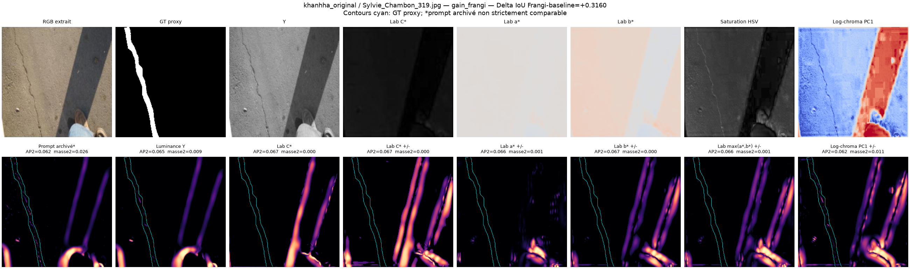
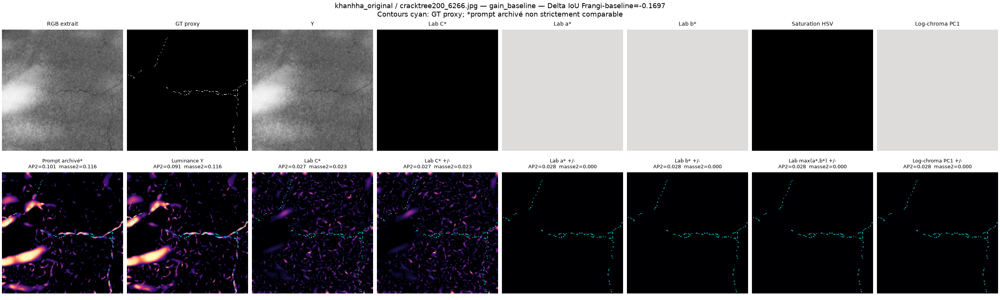
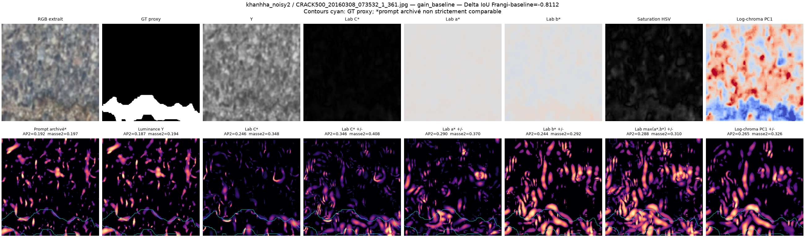

# Test CPU exploratoire — Frangi-similarité sur chrominance sans luminance

## Verdict

Sur cette sonde locale, **remplacer la luminance par un gris de chrominance
n'améliore pas visuellement Frangi-similarité de façon générale**. La réponse
Lab `C*` est moins bien alignée que la luminance dans cinq des six reculs
Frangi étudiés. Elle ne fait mieux, selon les deux diagnostics retenus, que sur
le cas bruité 2 `CRACK500_20160308_073532_1_361.jpg`, qui n'est pas un cas
d'ombre.

Sur les deux scènes présentant les ombres les plus franches (`IMG_6353` et
`Sylvie_Chambon_319`), la chrominance **ne supprime pas proprement les bandes
d'ombre** et affaiblit aussi la fissure. Elle ne constitue donc pas un bon
remplacement direct du prompt luminance.


## Exécution et périmètre

- Exécution locale uniquement, forcée sur **CPU** avec
  `CUDA_VISIBLE_DEVICES=''`; aucune opération VM ou cloud n'est présente dans
  le script.
- 12 cas : les six gains maximaux de la baseline et les six gains maximaux de
  Frangi déjà archivés dans le rapport principal.
- Même crop RGB pour toutes les variantes.
- Frangi maintenu avec `compute_centrality=False`, `tau=0.18`, `K=1` et les
  autres paramètres historiques.
- Les échelles historiques `(1,3,5,9,15)` à 448² ont été ramenées à
  `(0.5,1.5,2.5,4.5,7.25)` à 216²; `R=2`.
- Contrôle de sensibilité à 448² sur quatre cas, avec les échelles historiques
  et `R=3`: le classement luminance/chrominance reste le même.

Commande reproductible :

```bash
CUDA_VISIBLE_DEVICES='' OMP_NUM_THREADS=8 MKL_NUM_THREADS=8 \
  OPENBLAS_NUM_THREADS=8 \
  python ISPRS/CrackSAM/analyze_frangi_chrominance_cpu.py --threads 8
```

Le contrat complet se trouve dans [`run_manifest.json`](run_manifest.json),
les mesures dans [`metrics_per_case.csv`](metrics_per_case.csv), les agrégats
dans [`metrics_summary.csv`](metrics_summary.csv) et le contrôle 448² dans
[`resolution_sensitivity_448.csv`](resolution_sensitivity_448.csv).

## Limite majeure des données locales

Les RGB et masques originaux 448² ne sont pas présents dans le workspace. Les
tests utilisent les tuiles alignées 216² incorporées aux panneaux JPEG du
rapport. Ces JPEG ont subi une compression qualité 88 et un sous-échantillonnage
chromatique 4:2:0; l'information chromatique effective est donc plus pauvre que
sur les originaux.

La cible binaire est un proxy reconstruit en retenant le nombre attendu de
pixels les plus clairs dans la tuile GT. Les chiffres ci-dessous sont des
**diagnostics relatifs de carte**, pas des performances dataset ni une
prédiction de l'effet sur SAM.

Malgré cette limite, le recalcul luminance présente une corrélation de Pearson
moyenne de **0,957** et une corrélation de rang moyenne de **0,727** avec les
prompts archivés. La structure principale de la réponse est donc bien
reproduite.

## Définition de « gris de chrominance »

La chrominance est bidimensionnelle : il n'existe pas un unique gris de
chrominance. Mettre `Y` à une constante en YCbCr puis reconvertir simplement en
gris donnerait théoriquement une image presque constante. Plusieurs
interprétations sans luminance ont donc été testées :

- `C* = sqrt(a*²+b*²)` en CIELAB, interprétation scalaire principale;
- `C*` avec les deux polarités;
- `a*` et `b*` séparés, avec leurs deux polarités, puis maximum;
- saturation HSV avec les deux polarités;
- première composante PCA de `(log R-log G, log B-log G)`, avec les deux
  polarités.

Les deux polarités sont nécessaires car le code actuel ne conserve que les
vallées sombres (`lambda2 > 0`), tandis que le signe d'un axe chromatique est
arbitraire.

## Diagnostics

`AP2` est une précision moyenne tolérant deux pixels autour du GT proxy.
`masse2` est la fraction de la masse de similarité située dans cette même bande.
Une carte vide ne peut donc pas paraître bonne uniquement parce qu'elle ne fait
aucun faux positif; l'énergie et la fraction active sont également conservées
dans les CSV.

### Agrégat sur les six reculs Frangi

| Variante | AP2 moyenne | masse2 moyenne | distance pondérée (px) | fraction active |
|---|---:|---:|---:|---:|
| Luminance | **0,325** | **0,258** | **51,1** | 0,188 |
| Lab C* | 0,099 | 0,129 | 65,0 | 0,193 |
| Lab C* deux polarités | 0,119 | 0,118 | 67,3 | 0,288 |
| Lab a* deux polarités | 0,153 | 0,130 | 62,7 | 0,213 |
| Lab max(a*,b*) deux polarités | 0,117 | 0,106 | 67,4 | 0,353 |
| Saturation HSV deux polarités | 0,241 | 0,166 | 63,3 | 0,249 |
| Log-chroma PC1 deux polarités | 0,138 | 0,127 | 65,9 | 0,271 |

La réunion des deux polarités augmente fortement la densité et les structures
parasites sans récupérer suffisamment la fissure.

### Lab C* cas par cas

| Cas | ΔIoU modèle | AP2 Y | AP2 C* | masse2 Y | masse2 C* |
|---|---:|---:|---:|---:|---:|
| `cracktree200_6266` | -0,170 | **0,091** | 0,027 | **0,116** | 0,023 |
| `CRACK500_...115828...` bruit 1 | -0,585 | **0,376** | 0,058 | **0,222** | 0,084 |
| `CRACK500_...073532...` bruit 2 | -0,811 | 0,187 | **0,246** | 0,194 | **0,348** |
| `IMG_6033` | -0,680 | **0,800** | 0,170 | **0,736** | 0,227 |
| `DJ_Wall_231` | -0,456 | **0,113** | 0,087 | **0,134** | 0,086 |
| `128_23` | -0,867 | **0,382** | 0,007 | **0,145** | 0,009 |
| `Sylvie_Chambon_319` | +0,316 | 0,065 | 0,067 | **0,009** | 0,000 |
| `CRACK500_...093924...` bruit 1 | +0,754 | **0,092** | 0,075 | 0,090 | **0,100** |
| `Volker_DSC01646...` | +0,685 | **0,896** | 0,073 | **0,873** | 0,107 |
| `IMG_6353` | +0,495 | **0,126** | 0,097 | **0,112** | 0,104 |
| `DJ_Wall_66` | +0,539 | 0,024 | 0,025 | 0,004 | **0,023** |
| `224_37` | +0,916 | **0,675** | 0,029 | **0,359** | 0,026 |

## Lecture visuelle des cas importants

### Ombres franches

#### Road420 `IMG_6353`


`C*` réduit une partie de la texture de luminance, mais les trois bandes
d'ombre restent des structures dominantes et la fissure horizontale devient
moins nette. Le contrôle 448² donne également `AP2=0,101` pour `C*`, contre
`0,115` pour la luminance.

#### `Sylvie_Chambon_319`



Les canaux chromatiques continuent de souligner la limite de l'ombre, tandis
que la fissure à gauche est presque absente des réponses. La chrominance ne
résout donc pas ici la confusion ombre/fissure.

### Reculs Frangi

#### `cracktree200_6266`



La dynamique `C*` entre les percentiles 1 et 99 n'est que de **0,05 ΔE** dans
la copie locale. Il n'existe pratiquement aucune information chromatique sur la
fissure. Les rares réponses `C*` proviennent surtout du bruit chromatique JPEG;
les autres projections sont constantes et donnent une carte vide.

#### Road420 `IMG_6033`


La réponse luminance suit très bien la fissure (`AP2=0,800`), alors que le
modèle Frangi avait perdu 0,680 IoU. La chrominance détériore nettement la
géométrie. Ce cas confirme que certaines pertes viennent de l'encodage ou de
l'usage du prompt, pas d'une mauvaise détection Frangi liée aux ombres.

#### Bruit 2 `CRACK500_...073532...`



C'est la seule amélioration nette de `C*`. Les réponses chromatiques se
concentrent davantage dans la large zone annotée en bas. L'image est toutefois
fortement floutée/bruitée et ne présente pas une ombre franche : ce résultat
montre une complémentarité possible sur du bruit coloré, pas une solution au
problème des ombres.

### Signal auxiliaire ponctuellement intéressant

Sur `DJ_Wall_231`, le canal `a*` avec ses deux polarités suit mieux la fissure
que `C*` (`AP2=0,362`, `masse2=0,183`). L'ajout de `b*` réintroduit beaucoup de
parasites. Une projection chromatique choisie ou apprise pourrait donc aider
certains murs colorés, mais une union générique des canaux est trop bruyante.

## Pourquoi la piste échoue comme remplacement

1. Beaucoup de fissures et de supports sont quasi achromatiques : leur
   contraste utile se trouve presque entièrement dans la luminance.
2. Les ombres réelles ne préservent pas parfaitement la chrominance à cause de
   la couleur de l'éclairage, de la réponse de la caméra, des pixels sombres et
   de la compression; leurs frontières restent visibles en `C*`, saturation et
   log-chroma.
3. La normalisation de chaque Hessien par son maximum transforme une dynamique
   chromatique minuscule en réponse forte. Une carte chromatique presque vide
   devient donc une carte de bruit très contrastée.
4. Les variantes bipolaires prennent un maximum de plusieurs cartes déjà
   normalisées relativement; elles accumulent mécaniquement les faux motifs.

## Recommandation

Ne pas remplacer le prompt luminance par Frangi sur `C*` ou sur une projection
chromatique. Si la chrominance est poursuivie, l'utiliser seulement comme
**caractéristique auxiliaire de fiabilité**, avec :

- un gate de dynamique qui déclare la chrominance « non informative » lorsque
  son étendue est trop faible;
- des canaux `a*` et `b*` conservés séparément, sans maximum systématique;
- le test vallée sombre contre marche d'ombre sur la luminance comme critère
  principal;
- une porte apprenant à revenir exactement au chemin `no_mask` lorsque les
  indices se contredisent.

Cette sonde ne justifie donc pas un entraînement complet « chrominance seule ».
Elle justifie au mieux un petit test ultérieur de fusion/gating sur les RGB
originaux, si ceux-ci deviennent disponibles localement.
