# Rapport exhaustif — CrackSAM 2 baseline vs guidage Frangi-similarité

> Généré automatiquement le **2026-07-14T15:44:11+00:00**. Comparaison qualitative et appariée principale : **Frangi — époque 25 (best validation)**. Les cinq jalons Frangi restent tous évalués dans les tableaux et graphiques.

## Résumé exécutif

La baseline atteint un IoU macro de **0.5675** sur les six configurations, contre **0.5563** pour le jalon principal Frangi (Δ=-0.0112).

Sur les observations appariées, le delta moyen pondéré est **-0.0098** (IC bootstrap 95 % [-0.0120, -0.0078]), avec **3300 gains**, **925 égalités** et **4670 pertes** pour Frangi.

Le point essentiel d’interprétation est que **epoch25_best est sélectionné par le Dice de validation**, pas en recherchant le meilleur résultat sur les jeux de test. Les autres jalons servent à documenter la stabilité et une éventuelle dérive, sans modifier a posteriori le modèle principal.

## Protocole, sources et garanties

- Baseline : SAM 2 Hiera Large + LoRA q/v rang 4, meilleure époque selon la validation, sans `mask_input`.
- Variante : même architecture et même protocole, avec pseudo-logits Frangi-similarité statiques de forme 1×256×256 comme `mask_input`.
- Tests : Khanhha original, deux perturbations déterministes, puis Road420, Facade390 et Concrete3k en zero-shot.
- Métriques de segmentation : moyenne arithmétique des métriques calculées image par image, conformément aux CSV d’évaluation.
- Wasserstein : distance sur masque direct. Aucune valeur plafonnée à 2 000 points n’est présentée comme exacte ; seules les sorties de `wasserstein_exact/` sont intégrées.
- Incertitude : bootstrap percentile 95 % déterministe, 5,000 réplications, graine 20260714; bootstrap stratifié pour le macro.
- Égalité appariée : |amélioration| ≤ 1e-06.

### Racines utilisées

| Rôle | Chemin |
| --- | --- |
| Données | /home/codespace/cracksam2-data |
| Prompts | /home/codespace/cracksam2-prompts |
| Artefacts | /home/codespace/cracksam2-artifacts |
| Rapport | /home/codespace/Generalized-Frangi-for-Automatic-Crack-Extraction-on-FIND-dataset/ISPRS/CrackSAM/results/frangi_milestone_report |

### Inventaire des évaluations

| Run | Époque | Datasets | Cas | Wasserstein exact | Racine |
| --- | --- | --- | --- | --- | --- |
| baseline_best | best val | 6/6 | 8895 | scan seulement / calcul non publié | /home/codespace/cracksam2-artifacts/baseline_r4/final_evaluation |
| epoch20 | 20 | 6/6 | 8895 | scan seulement / calcul non publié | /home/codespace/cracksam2-artifacts/frangi_r4/milestone_comparison/epoch20 |
| epoch25_best | 25 | 6/6 | 8895 | scan seulement / calcul non publié | /home/codespace/cracksam2-artifacts/frangi_r4/milestone_comparison/epoch25_best |
| epoch30 | 30 | 6/6 | 8895 | scan seulement / calcul non publié | /home/codespace/cracksam2-artifacts/frangi_r4/milestone_comparison/epoch30 |
| epoch55 | 55 | 6/6 | 8895 | scan seulement / calcul non publié | /home/codespace/cracksam2-artifacts/frangi_r4/milestone_comparison/epoch55 |
| epoch70 | 70 | 6/6 | 8895 | scan seulement / calcul non publié | /home/codespace/cracksam2-artifacts/frangi_r4/milestone_comparison/epoch70 |

## Référence : CrackSAM originel publié

Ces nombres sont des valeurs publiées dans `CrackSAM.pdf`, et non des réévaluations locales. Le backbone (SAM 1 ViT-H) diffère du SAM 2 Hiera Large utilisé ici : la comparaison mesure un niveau de performance, pas une ablation architecturale strictement contrôlée.

| Modèle papier | Pr clean | Re clean | F1 clean | Original | Bruit 1 | Bruit 2 | Road420 | Facade390 | Concrete3k |
| --- | --- | --- | --- | --- | --- | --- | --- | --- | --- |
| CrackSAM originel — Adapter d=32 (SAM 1, ViT-H) | 0.7676 | 0.7965 | 0.7704 | 0.6495 | 0.5466 | 0.4763 | 0.6149 | 0.4718 | 0.6718 |
| CrackSAM originel — LoRA qv r=4 (SAM 1, ViT-H) | 0.7620 | 0.7918 | 0.7639 | 0.6416 | 0.5782 | 0.4915 | 0.6222 | 0.4544 | 0.6798 |

Sources : IoU des six configurations pour les deux modèles dans la Table 6 ; Pr/Re/F1 du LoRA qv rang 4 dans la Table 2 ; Pr/Re/F1 de l’Adapter d=32 dans la Table 1 (ablation du milieu de l’Adapter).

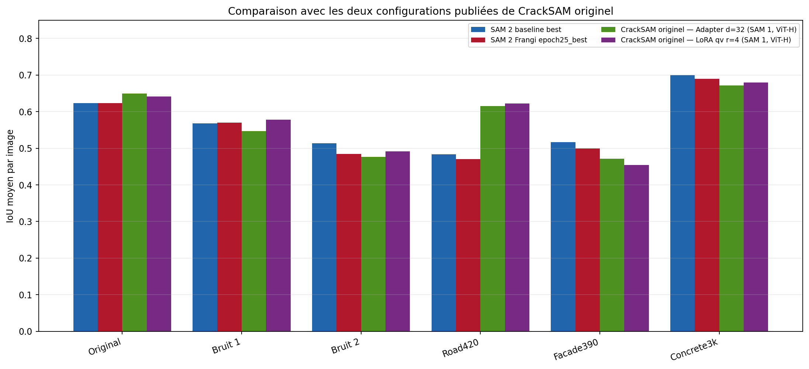

### Deltas exhaustifs face aux deux références publiées

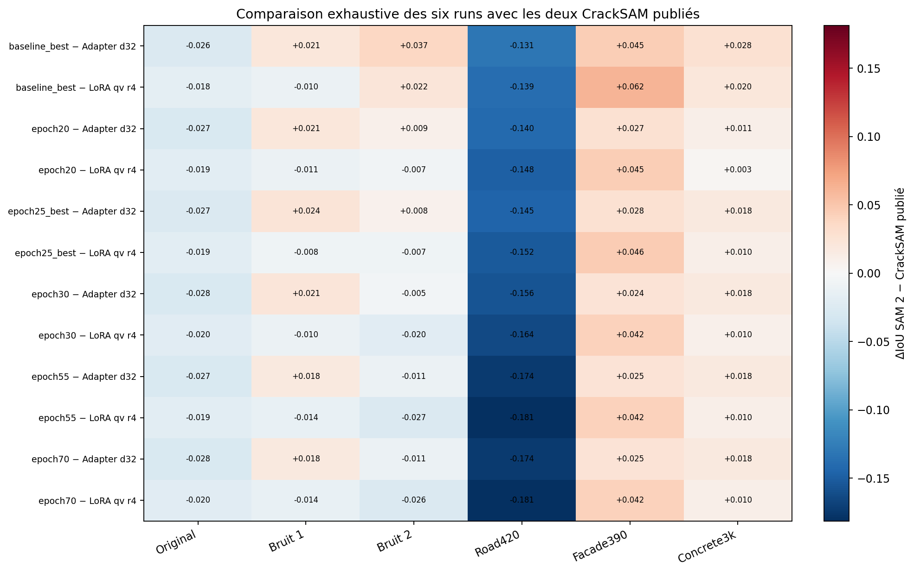

#### ΔIoU SAM 2 − CrackSAM originel Adapter d=32

| Run | Original | Bruit 1 | Bruit 2 | Road420 | Facade390 | Concrete3k | Macro | Pondéré |
| --- | --- | --- | --- | --- | --- | --- | --- | --- |
| baseline_best | -0.0257 | +0.0212 | +0.0370 | -0.1313 | +0.0446 | +0.0280 | -0.0044 | +0.0114 |
| epoch20 | -0.0274 | +0.0206 | +0.0085 | -0.1404 | +0.0271 | +0.0110 | -0.0168 | -0.0014 |
| epoch25_best | -0.0265 | +0.0239 | +0.0078 | -0.1448 | +0.0281 | +0.0183 | -0.0155 | +0.0016 |
| epoch30 | -0.0278 | +0.0214 | -0.0049 | -0.1563 | +0.0244 | +0.0178 | -0.0209 | -0.0025 |
| epoch55 | -0.0274 | +0.0178 | -0.0113 | -0.1738 | +0.0248 | +0.0184 | -0.0253 | -0.0049 |
| epoch70 | -0.0280 | +0.0179 | -0.0113 | -0.1740 | +0.0247 | +0.0184 | -0.0254 | -0.0050 |

#### ΔIoU SAM 2 − CrackSAM originel LoRA qv r=4

| Run | Original | Bruit 1 | Bruit 2 | Road420 | Facade390 | Concrete3k | Macro | Pondéré |
| --- | --- | --- | --- | --- | --- | --- | --- | --- |
| baseline_best | -0.0178 | -0.0104 | +0.0218 | -0.1386 | +0.0620 | +0.0200 | -0.0105 | +0.0017 |
| epoch20 | -0.0195 | -0.0110 | -0.0067 | -0.1477 | +0.0445 | +0.0030 | -0.0229 | -0.0111 |
| epoch25_best | -0.0186 | -0.0077 | -0.0074 | -0.1521 | +0.0455 | +0.0103 | -0.0217 | -0.0081 |
| epoch30 | -0.0199 | -0.0102 | -0.0201 | -0.1636 | +0.0418 | +0.0098 | -0.0270 | -0.0122 |
| epoch55 | -0.0195 | -0.0138 | -0.0265 | -0.1811 | +0.0422 | +0.0104 | -0.0314 | -0.0146 |
| epoch70 | -0.0201 | -0.0137 | -0.0265 | -0.1813 | +0.0421 | +0.0104 | -0.0315 | -0.0147 |

#### Métriques publiées sur Khanhha propre : valeurs et deltas

| Run | Référence papier | Pr SAM2/papier/Δ | Re SAM2/papier/Δ | F1 SAM2/papier/Δ | IoU SAM2/papier/Δ |
| --- | --- | --- | --- | --- | --- |
| baseline_best | paper_adapter_d32 | 0.7493 / 0.7676 / -0.0183 | 0.7711 / 0.7965 / -0.0254 | 0.7453 / 0.7704 / -0.0251 | 0.6238 / 0.6495 / -0.0257 |
| baseline_best | paper_lora_qv_r4 | 0.7493 / 0.7620 / -0.0127 | 0.7711 / 0.7918 / -0.0207 | 0.7453 / 0.7639 / -0.0186 | 0.6238 / 0.6416 / -0.0178 |
| epoch20 | paper_adapter_d32 | 0.7526 / 0.7676 / -0.0150 | 0.7646 / 0.7965 / -0.0319 | 0.7434 / 0.7704 / -0.0270 | 0.6221 / 0.6495 / -0.0274 |
| epoch20 | paper_lora_qv_r4 | 0.7526 / 0.7620 / -0.0094 | 0.7646 / 0.7918 / -0.0272 | 0.7434 / 0.7639 / -0.0205 | 0.6221 / 0.6416 / -0.0195 |
| epoch25_best | paper_adapter_d32 | 0.7527 / 0.7676 / -0.0149 | 0.7666 / 0.7965 / -0.0299 | 0.7446 / 0.7704 / -0.0258 | 0.6230 / 0.6495 / -0.0265 |
| epoch25_best | paper_lora_qv_r4 | 0.7527 / 0.7620 / -0.0093 | 0.7666 / 0.7918 / -0.0252 | 0.7446 / 0.7639 / -0.0193 | 0.6230 / 0.6416 / -0.0186 |
| epoch30 | paper_adapter_d32 | 0.7553 / 0.7676 / -0.0123 | 0.7605 / 0.7965 / -0.0360 | 0.7429 / 0.7704 / -0.0275 | 0.6217 / 0.6495 / -0.0278 |
| epoch30 | paper_lora_qv_r4 | 0.7553 / 0.7620 / -0.0067 | 0.7605 / 0.7918 / -0.0313 | 0.7429 / 0.7639 / -0.0210 | 0.6217 / 0.6416 / -0.0199 |
| epoch55 | paper_adapter_d32 | 0.7577 / 0.7676 / -0.0099 | 0.7588 / 0.7965 / -0.0377 | 0.7433 / 0.7704 / -0.0271 | 0.6221 / 0.6495 / -0.0274 |
| epoch55 | paper_lora_qv_r4 | 0.7577 / 0.7620 / -0.0043 | 0.7588 / 0.7918 / -0.0330 | 0.7433 / 0.7639 / -0.0206 | 0.6221 / 0.6416 / -0.0195 |
| epoch70 | paper_adapter_d32 | 0.7575 / 0.7676 / -0.0101 | 0.7582 / 0.7965 / -0.0383 | 0.7427 / 0.7704 / -0.0277 | 0.6215 / 0.6495 / -0.0280 |
| epoch70 | paper_lora_qv_r4 | 0.7575 / 0.7620 / -0.0045 | 0.7582 / 0.7918 / -0.0336 | 0.7427 / 0.7639 / -0.0212 | 0.6215 / 0.6416 / -0.0201 |

## Dynamique d’entraînement et choix des poids

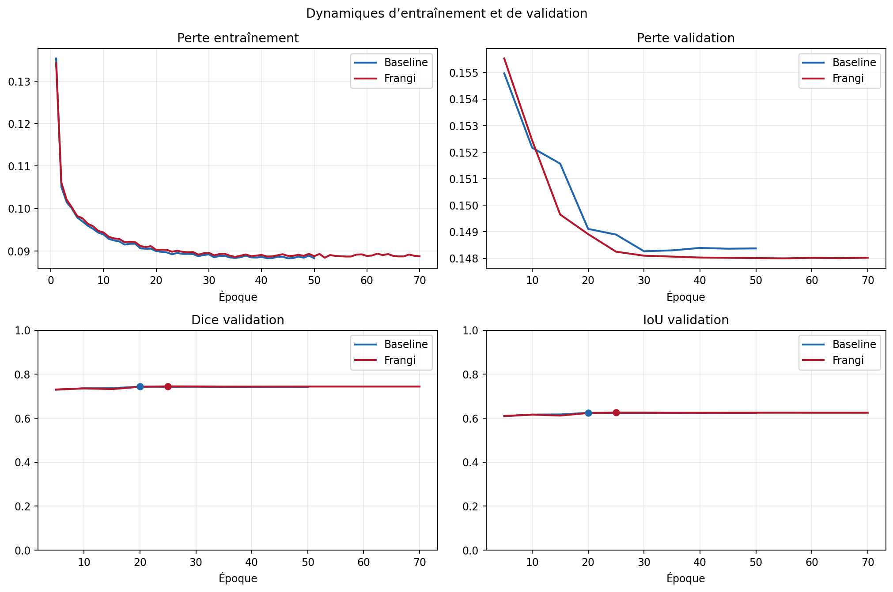

| Variante | Époque best | Dice val | IoU val | Pr val | Re val | Pas global |
| --- | --- | --- | --- | --- | --- | --- |
| baseline_r4 | 20 | 0.7439 | 0.6244 | 0.7577 | 0.7593 | 22820 |
| frangi_r4 | 25 | 0.7449 | 0.6254 | 0.7596 | 0.7577 | 28525 |

### Manifeste des poids conservés

Source versionnée : `/home/codespace/Generalized-Frangi-for-Automatic-Crack-Extraction-on-FIND-dataset/ISPRS/CrackSAM/results/2026-07-14_checkpoint_manifest.json` (format 1, vérifié le 2026-07-14T15:09:44Z).

| ID | Variante/rôle | Époque | Pas | Taille | SHA-256 | Chemin VM ici | Backup local ici | Audit manifeste |
| --- | --- | --- | --- | --- | --- | --- | --- | --- |
| sam2_hiera_large_base_dependency | foundation / base dependency (non versionnée) | — | — | 897,952,466 | 7442e4e9b732a508… | présent et vérifié | non monté ici | 2026-07-14T15:09:44Z |
| frangi_epoch20 | frangi / milestone | 20 | 22820 | 5,708,629 | c06db707bfdfeee7… | présent et vérifié | non monté ici | 2026-07-14T15:09:44Z |
| frangi_epoch25_best | frangi / best | 25 | 28525 | 5,708,629 | 2ff8938b3d08c0d5… | présent et vérifié | non monté ici | 2026-07-14T15:09:44Z |
| frangi_epoch30 | frangi / milestone | 30 | 34230 | 5,710,401 | e8d35bccc4458a88… | présent et vérifié | non monté ici | 2026-07-14T15:09:44Z |
| frangi_epoch55 | frangi / milestone | 55 | 62755 | 5,710,401 | b703f84347323a4d… | présent et vérifié | non monté ici | 2026-07-14T15:09:44Z |
| frangi_epoch70 | frangi / final | 70 | 79870 | 5,710,401 | f5cbaf22ea80d291… | présent et vérifié | non monté ici | 2026-07-14T15:09:44Z |
| baseline_epoch20_best | baseline / best | 20 | 22820 | 5,708,117 | d154d60a82ec2a0a… | présent et vérifié | non monté ici | 2026-07-14T15:09:44Z |

Les deux colonnes « ici » décrivent uniquement le système de fichiers visible pendant cette génération. `non monté ici` ne signifie donc pas que la sauvegarde a disparu : les chemins VM et backups locaux ont été contrôlés séparément à la date `verified_at_utc=2026-07-14T15:09:44Z` du manifeste versionné. Lorsqu’un fichier est visible ici, sa taille et son SHA-256 sont recalculés.

Le checkpoint de fondation SAM 2 (~898 Mo) est une dépendance identifiée par SHA-256 et n’est pas destiné à Git. Les poids adaptateurs conservés font environ 5,7 Mo chacun. Les alias `best.pt`/époque 25 et `latest.pt`/époque 70 sont documentés dans le manifeste sans dupliquer leur contenu.

## Comparaison exhaustive des jalons

### IoU par dataset et par jalon

| Run | Original | Bruit 1 | Bruit 2 | Road420 | Facade390 | Concrete3k | Macro | Pondéré |
| --- | --- | --- | --- | --- | --- | --- | --- | --- |
| baseline_best | 0.6238 | 0.5678 | 0.5133 | 0.4836 | 0.5164 | 0.6998 | 0.5675 | 0.6064 |
| epoch20 | 0.6221 | 0.5672 | 0.4848 | 0.4745 | 0.4989 | 0.6828 | 0.5551 | 0.5936 |
| epoch25_best | 0.6230 | 0.5705 | 0.4841 | 0.4701 | 0.4999 | 0.6901 | 0.5563 | 0.5965 |
| epoch30 | 0.6217 | 0.5680 | 0.4714 | 0.4586 | 0.4962 | 0.6896 | 0.5509 | 0.5925 |
| epoch55 | 0.6221 | 0.5644 | 0.4650 | 0.4411 | 0.4966 | 0.6902 | 0.5466 | 0.5901 |
| epoch70 | 0.6215 | 0.5645 | 0.4650 | 0.4409 | 0.4965 | 0.6902 | 0.5464 | 0.5900 |

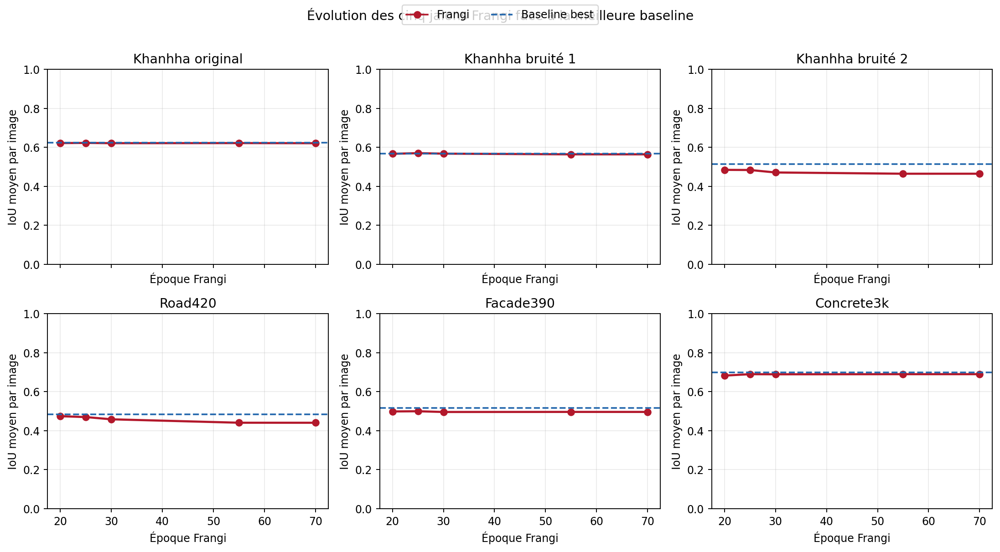

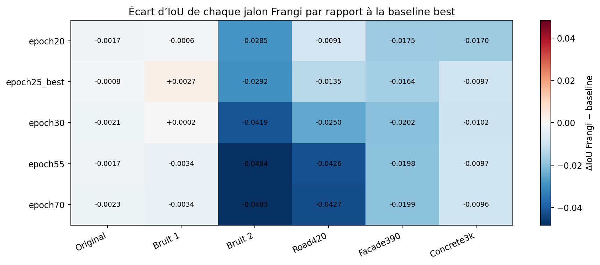

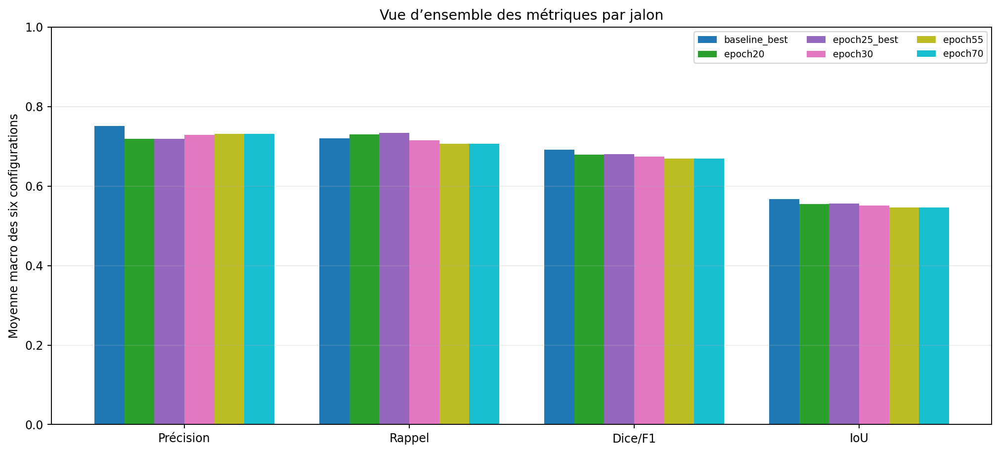

### Métriques complètes pour chaque évaluation

#### Baseline SAM 2 + LoRA r=4 — meilleure époque validation

| Dataset | n | Pr | Re | Dice | IoU | W exact | Couverture W |
| --- | --- | --- | --- | --- | --- | --- | --- |
| Khanhha original | 1695 | 0.7493 | 0.7711 | 0.7453 | 0.6238 | n.d. | 0/1695 |
| Khanhha bruité 1 | 1695 | 0.7302 | 0.7189 | 0.6907 | 0.5678 | n.d. | 0/1695 |
| Khanhha bruité 2 | 1695 | 0.6397 | 0.6748 | 0.6243 | 0.5133 | n.d. | 0/1695 |
| Road420 | 420 | 0.8612 | 0.5638 | 0.6252 | 0.4836 | n.d. | 0/420 |
| Facade390 | 390 | 0.6407 | 0.8254 | 0.6656 | 0.5164 | n.d. | 0/390 |
| Concrete3k | 3000 | 0.8836 | 0.7678 | 0.7989 | 0.6998 | n.d. | 0/3000 |
| Macro six datasets | 8895 | 0.7508 | 0.7203 | 0.6917 | 0.5675 | n.d. | 0/8895 |
| Pondéré images | 8895 | 0.7706 | 0.7343 | 0.7208 | 0.6064 | n.d. | 0/8895 |

#### Frangi — époque 20

| Dataset | n | Pr | Re | Dice | IoU | W exact | Couverture W |
| --- | --- | --- | --- | --- | --- | --- | --- |
| Khanhha original | 1695 | 0.7526 | 0.7646 | 0.7434 | 0.6221 | n.d. | 0/1695 |
| Khanhha bruité 1 | 1695 | 0.7151 | 0.7227 | 0.6877 | 0.5672 | n.d. | 0/1695 |
| Khanhha bruité 2 | 1695 | 0.6247 | 0.6087 | 0.5837 | 0.4848 | n.d. | 0/1695 |
| Road420 | 420 | 0.7517 | 0.6541 | 0.6169 | 0.4745 | n.d. | 0/420 |
| Facade390 | 390 | 0.5506 | 0.9096 | 0.6539 | 0.4989 | n.d. | 0/390 |
| Concrete3k | 3000 | 0.9175 | 0.7200 | 0.7889 | 0.6828 | n.d. | 0/3000 |
| Macro six datasets | 8895 | 0.7187 | 0.7299 | 0.6791 | 0.5551 | n.d. | 0/8895 |
| Pondéré images | 8895 | 0.7678 | 0.7130 | 0.7078 | 0.5936 | n.d. | 0/8895 |

#### Frangi — époque 25 (best validation)

| Dataset | n | Pr | Re | Dice | IoU | W exact | Couverture W |
| --- | --- | --- | --- | --- | --- | --- | --- |
| Khanhha original | 1695 | 0.7527 | 0.7666 | 0.7446 | 0.6230 | n.d. | 0/1695 |
| Khanhha bruité 1 | 1695 | 0.7111 | 0.7358 | 0.6915 | 0.5705 | n.d. | 0/1695 |
| Khanhha bruité 2 | 1695 | 0.6228 | 0.6109 | 0.5832 | 0.4841 | n.d. | 0/1695 |
| Road420 | 420 | 0.7656 | 0.6392 | 0.6130 | 0.4701 | n.d. | 0/420 |
| Facade390 | 390 | 0.5518 | 0.9110 | 0.6551 | 0.4999 | n.d. | 0/390 |
| Concrete3k | 3000 | 0.9051 | 0.7392 | 0.7934 | 0.6901 | n.d. | 0/3000 |
| Macro six datasets | 8895 | 0.7182 | 0.7338 | 0.6801 | 0.5563 | n.d. | 0/8895 |
| Pondéré images | 8895 | 0.7632 | 0.7221 | 0.7100 | 0.5965 | n.d. | 0/8895 |

#### Frangi — époque 30

| Dataset | n | Pr | Re | Dice | IoU | W exact | Couverture W |
| --- | --- | --- | --- | --- | --- | --- | --- |
| Khanhha original | 1695 | 0.7553 | 0.7605 | 0.7429 | 0.6217 | n.d. | 0/1695 |
| Khanhha bruité 1 | 1695 | 0.7165 | 0.7228 | 0.6887 | 0.5680 | n.d. | 0/1695 |
| Khanhha bruité 2 | 1695 | 0.6246 | 0.5848 | 0.5672 | 0.4714 | n.d. | 0/1695 |
| Road420 | 420 | 0.8117 | 0.5829 | 0.6014 | 0.4586 | n.d. | 0/420 |
| Facade390 | 390 | 0.5529 | 0.9045 | 0.6509 | 0.4962 | n.d. | 0/390 |
| Concrete3k | 3000 | 0.9104 | 0.7351 | 0.7937 | 0.6896 | n.d. | 0/3000 |
| Macro six datasets | 8895 | 0.7286 | 0.7151 | 0.6741 | 0.5509 | n.d. | 0/8895 |
| Pondéré images | 8895 | 0.7691 | 0.7092 | 0.7055 | 0.5925 | n.d. | 0/8895 |

#### Frangi — époque 55

| Dataset | n | Pr | Re | Dice | IoU | W exact | Couverture W |
| --- | --- | --- | --- | --- | --- | --- | --- |
| Khanhha original | 1695 | 0.7577 | 0.7588 | 0.7433 | 0.6221 | n.d. | 0/1695 |
| Khanhha bruité 1 | 1695 | 0.7158 | 0.7163 | 0.6846 | 0.5644 | n.d. | 0/1695 |
| Khanhha bruité 2 | 1695 | 0.6210 | 0.5732 | 0.5590 | 0.4650 | n.d. | 0/1695 |
| Road420 | 420 | 0.8196 | 0.5580 | 0.5839 | 0.4411 | n.d. | 0/420 |
| Facade390 | 390 | 0.5622 | 0.8949 | 0.6513 | 0.4966 | n.d. | 0/390 |
| Concrete3k | 3000 | 0.9077 | 0.7368 | 0.7939 | 0.6902 | n.d. | 0/3000 |
| Macro six datasets | 8895 | 0.7307 | 0.7063 | 0.6693 | 0.5466 | n.d. | 0/8895 |
| Pondéré images | 8895 | 0.7686 | 0.7044 | 0.7025 | 0.5901 | n.d. | 0/8895 |

#### Frangi — époque 70

| Dataset | n | Pr | Re | Dice | IoU | W exact | Couverture W |
| --- | --- | --- | --- | --- | --- | --- | --- |
| Khanhha original | 1695 | 0.7575 | 0.7582 | 0.7427 | 0.6215 | n.d. | 0/1695 |
| Khanhha bruité 1 | 1695 | 0.7159 | 0.7164 | 0.6846 | 0.5645 | n.d. | 0/1695 |
| Khanhha bruité 2 | 1695 | 0.6213 | 0.5733 | 0.5591 | 0.4650 | n.d. | 0/1695 |
| Road420 | 420 | 0.8199 | 0.5575 | 0.5837 | 0.4409 | n.d. | 0/420 |
| Facade390 | 390 | 0.5623 | 0.8950 | 0.6512 | 0.4965 | n.d. | 0/390 |
| Concrete3k | 3000 | 0.9081 | 0.7368 | 0.7940 | 0.6902 | n.d. | 0/3000 |
| Macro six datasets | 8895 | 0.7308 | 0.7062 | 0.6692 | 0.5464 | n.d. | 0/8895 |
| Pondéré images | 8895 | 0.7688 | 0.7043 | 0.7024 | 0.5900 | n.d. | 0/8895 |

### Deltas de chaque jalon face à la baseline best

#### epoch20

| Dataset | ΔPr | ΔRe | ΔDice | ΔIoU | Amélioration W | Couverture W commune |
| --- | --- | --- | --- | --- | --- | --- |
| Khanhha original | +0.0033 | -0.0066 | -0.0019 | -0.0017 | n.d. | 0/1695 · 0/1 ds |
| Khanhha bruité 1 | -0.0151 | +0.0038 | -0.0030 | -0.0006 | n.d. | 0/1695 · 0/1 ds |
| Khanhha bruité 2 | -0.0150 | -0.0661 | -0.0406 | -0.0285 | n.d. | 0/1695 · 0/1 ds |
| Road420 | -0.1094 | +0.0903 | -0.0083 | -0.0091 | n.d. | 0/420 · 0/1 ds |
| Facade390 | -0.0901 | +0.0842 | -0.0117 | -0.0175 | n.d. | 0/390 · 0/1 ds |
| Concrete3k | +0.0339 | -0.0478 | -0.0100 | -0.0170 | n.d. | 0/3000 · 0/1 ds |
| MACRO_6_DATASETS | -0.0321 | +0.0096 | -0.0126 | -0.0124 | n.d. | 0/8895 · 0/6 ds |
| PONDERE_IMAGES | -0.0028 | -0.0213 | -0.0130 | -0.0128 | n.d. | 0/8895 · 0/6 ds |

#### epoch25_best

| Dataset | ΔPr | ΔRe | ΔDice | ΔIoU | Amélioration W | Couverture W commune |
| --- | --- | --- | --- | --- | --- | --- |
| Khanhha original | +0.0034 | -0.0046 | -0.0008 | -0.0008 | n.d. | 0/1695 · 0/1 ds |
| Khanhha bruité 1 | -0.0191 | +0.0169 | +0.0008 | +0.0027 | n.d. | 0/1695 · 0/1 ds |
| Khanhha bruité 2 | -0.0169 | -0.0639 | -0.0411 | -0.0292 | n.d. | 0/1695 · 0/1 ds |
| Road420 | -0.0955 | +0.0754 | -0.0122 | -0.0135 | n.d. | 0/420 · 0/1 ds |
| Facade390 | -0.0889 | +0.0856 | -0.0104 | -0.0164 | n.d. | 0/390 · 0/1 ds |
| Concrete3k | +0.0215 | -0.0286 | -0.0056 | -0.0097 | n.d. | 0/3000 · 0/1 ds |
| MACRO_6_DATASETS | -0.0326 | +0.0135 | -0.0115 | -0.0112 | n.d. | 0/8895 · 0/6 ds |
| PONDERE_IMAGES | -0.0074 | -0.0122 | -0.0107 | -0.0098 | n.d. | 0/8895 · 0/6 ds |

#### epoch30

| Dataset | ΔPr | ΔRe | ΔDice | ΔIoU | Amélioration W | Couverture W commune |
| --- | --- | --- | --- | --- | --- | --- |
| Khanhha original | +0.0060 | -0.0107 | -0.0024 | -0.0021 | n.d. | 0/1695 · 0/1 ds |
| Khanhha bruité 1 | -0.0137 | +0.0038 | -0.0020 | +0.0002 | n.d. | 0/1695 · 0/1 ds |
| Khanhha bruité 2 | -0.0151 | -0.0900 | -0.0572 | -0.0419 | n.d. | 0/1695 · 0/1 ds |
| Road420 | -0.0495 | +0.0191 | -0.0237 | -0.0250 | n.d. | 0/420 · 0/1 ds |
| Facade390 | -0.0878 | +0.0791 | -0.0146 | -0.0202 | n.d. | 0/390 · 0/1 ds |
| Concrete3k | +0.0268 | -0.0327 | -0.0052 | -0.0102 | n.d. | 0/3000 · 0/1 ds |
| MACRO_6_DATASETS | -0.0222 | -0.0052 | -0.0175 | -0.0166 | n.d. | 0/8895 · 0/6 ds |
| PONDERE_IMAGES | -0.0015 | -0.0251 | -0.0153 | -0.0139 | n.d. | 0/8895 · 0/6 ds |

#### epoch55

| Dataset | ΔPr | ΔRe | ΔDice | ΔIoU | Amélioration W | Couverture W commune |
| --- | --- | --- | --- | --- | --- | --- |
| Khanhha original | +0.0083 | -0.0123 | -0.0020 | -0.0017 | n.d. | 0/1695 · 0/1 ds |
| Khanhha bruité 1 | -0.0143 | -0.0026 | -0.0061 | -0.0034 | n.d. | 0/1695 · 0/1 ds |
| Khanhha bruité 2 | -0.0187 | -0.1016 | -0.0653 | -0.0484 | n.d. | 0/1695 · 0/1 ds |
| Road420 | -0.0415 | -0.0058 | -0.0412 | -0.0426 | n.d. | 0/420 · 0/1 ds |
| Facade390 | -0.0785 | +0.0696 | -0.0143 | -0.0198 | n.d. | 0/390 · 0/1 ds |
| Concrete3k | +0.0241 | -0.0310 | -0.0050 | -0.0097 | n.d. | 0/3000 · 0/1 ds |
| MACRO_6_DATASETS | -0.0201 | -0.0140 | -0.0223 | -0.0209 | n.d. | 0/8895 · 0/6 ds |
| PONDERE_IMAGES | -0.0020 | -0.0299 | -0.0182 | -0.0163 | n.d. | 0/8895 · 0/6 ds |

#### epoch70

| Dataset | ΔPr | ΔRe | ΔDice | ΔIoU | Amélioration W | Couverture W commune |
| --- | --- | --- | --- | --- | --- | --- |
| Khanhha original | +0.0081 | -0.0130 | -0.0026 | -0.0023 | n.d. | 0/1695 · 0/1 ds |
| Khanhha bruité 1 | -0.0143 | -0.0026 | -0.0061 | -0.0034 | n.d. | 0/1695 · 0/1 ds |
| Khanhha bruité 2 | -0.0183 | -0.1015 | -0.0653 | -0.0483 | n.d. | 0/1695 · 0/1 ds |
| Road420 | -0.0413 | -0.0063 | -0.0415 | -0.0427 | n.d. | 0/420 · 0/1 ds |
| Facade390 | -0.0784 | +0.0696 | -0.0144 | -0.0199 | n.d. | 0/390 · 0/1 ds |
| Concrete3k | +0.0245 | -0.0310 | -0.0050 | -0.0096 | n.d. | 0/3000 · 0/1 ds |
| MACRO_6_DATASETS | -0.0199 | -0.0141 | -0.0225 | -0.0210 | n.d. | 0/8895 · 0/6 ds |
| PONDERE_IMAGES | -0.0018 | -0.0300 | -0.0184 | -0.0164 | n.d. | 0/8895 · 0/6 ds |

## Statistiques appariées du jalon principal

Les cas sont joints par `(dataset, case_name)`. Pour l’IoU, Δ = Frangi − baseline. Pour Wasserstein, la colonne delta garde aussi Frangi − baseline, donc une valeur négative est favorable ; la colonne d’amélioration remet le signe dans le sens « positif = meilleur ». Les wins/ties/losses utilisent ce sens favorable.

### IOU

| Dataset/agrégation | Datasets couverts | n commun | Couverture | Δ moyen [IC95] | Δ médian [IC95] | G/E/P Frangi |
| --- | --- | --- | --- | --- | --- | --- |
| Khanhha original | 1/1 | 1695 | 100.0 % | -0.0008 [-0.0032, +0.0015] | +0.0000 [+0.0000, +0.0000] | 730/226/739 |
| Khanhha bruité 1 | 1/1 | 1695 | 100.0 % | +0.0027 [-0.0015, +0.0067] | +0.0000 [+0.0000, +0.0000] | 672/243/780 |
| Khanhha bruité 2 | 1/1 | 1695 | 100.0 % | -0.0292 [-0.0352, -0.0232] | +0.0000 [+0.0000, +0.0000] | 527/363/805 |
| Road420 | 1/1 | 420 | 100.0 % | -0.0135 [-0.0312, +0.0032] | -0.0061 [-0.0172, +0.0029] | 196/0/224 |
| Facade390 | 1/1 | 390 | 100.0 % | -0.0164 [-0.0297, -0.0031] | -0.0158 [-0.0302, -0.0042] | 161/2/227 |
| Concrete3k | 1/1 | 3000 | 100.0 % | -0.0097 [-0.0131, -0.0063] | -0.0091 [-0.0100, -0.0078] | 1014/91/1895 |
| PONDERE_IMAGES | 6/6 | 8895 | 100.0 % | -0.0098 [-0.0120, -0.0078] | -0.0013 [-0.0020, -0.0007] | 3300/925/4670 |
| MACRO_6_DATASETS | 6/6 | 8895 | 100.0 % | -0.0112 [-0.0149, -0.0074] | -0.0031 [-0.0048, +0.0000] | 3300/925/4670 |

### WASSERSTEIN

| Dataset/agrégation | Datasets couverts | n commun | Couverture | Δ moyen [IC95] | Δ médian [IC95] | G/E/P Frangi |
| --- | --- | --- | --- | --- | --- | --- |
| Khanhha original | 0/1 | 0 | 0.0 % | n.d. [n.d., n.d.] | n.d. [n.d., n.d.] | 0/0/0 |
| Khanhha bruité 1 | 0/1 | 0 | 0.0 % | n.d. [n.d., n.d.] | n.d. [n.d., n.d.] | 0/0/0 |
| Khanhha bruité 2 | 0/1 | 0 | 0.0 % | n.d. [n.d., n.d.] | n.d. [n.d., n.d.] | 0/0/0 |
| Road420 | 0/1 | 0 | 0.0 % | n.d. [n.d., n.d.] | n.d. [n.d., n.d.] | 0/0/0 |
| Facade390 | 0/1 | 0 | 0.0 % | n.d. [n.d., n.d.] | n.d. [n.d., n.d.] | 0/0/0 |
| Concrete3k | 0/1 | 0 | 0.0 % | n.d. [n.d., n.d.] | n.d. [n.d., n.d.] | 0/0/0 |
| PONDERE_IMAGES | 0/6 | 0 | 0.0 % | n.d. [n.d., n.d.] | n.d. [n.d., n.d.] | 0/0/0 |
| MACRO_6_DATASETS | 0/6 | 0 | 0.0 % | n.d. [n.d., n.d.] | n.d. [n.d., n.d.] | 0/0/0 |

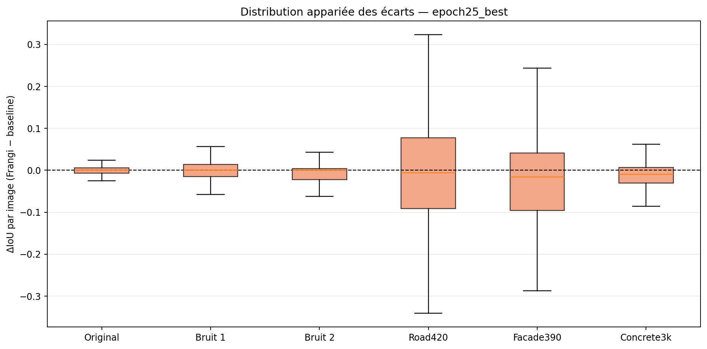

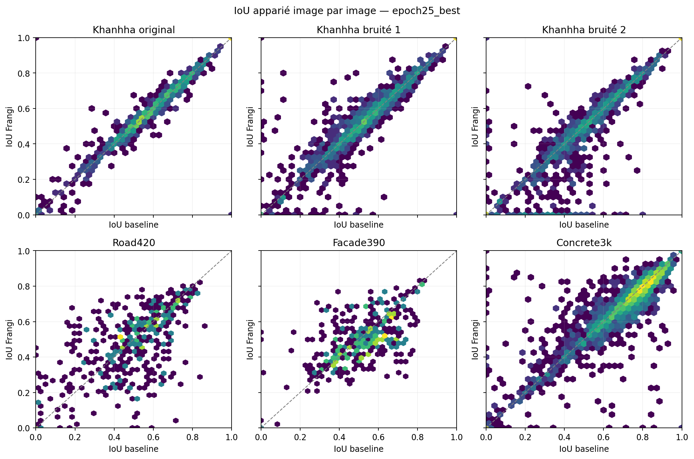

### Quantiles des deltas IoU par image

| Dataset | n | Min | P05 | P25 | Médiane | P75 | P95 | Max |
| --- | --- | --- | --- | --- | --- | --- | --- | --- |
| Khanhha original | 1695 | -1.0000 | -0.0350 | -0.0065 | +0.0000 | +0.0059 | +0.0314 | +1.0000 |
| Khanhha bruité 1 | 1695 | -1.0000 | -0.0661 | -0.0147 | +0.0000 | +0.0139 | +0.0954 | +1.0000 |
| Khanhha bruité 2 | 1695 | -0.8112 | -0.3047 | -0.0226 | +0.0000 | +0.0039 | +0.0615 | +1.0000 |
| Road420 | 420 | -0.6803 | -0.3374 | -0.0915 | -0.0061 | +0.0777 | +0.2848 | +0.4954 |
| Facade390 | 390 | -0.4564 | -0.2179 | -0.0957 | -0.0158 | +0.0410 | +0.2317 | +0.5395 |
| Concrete3k | 3000 | -1.0000 | -0.1044 | -0.0303 | -0.0091 | +0.0065 | +0.0863 | +1.0000 |

## Robustesse aux perturbations et généralisation zero-shot

| Run | IoU clean | IoU bruit 1 | Δ bruit 1 | IoU bruit 2 | Δ bruit 2 | IoU zero-shot macro |
| --- | --- | --- | --- | --- | --- | --- |
| baseline_best | 0.6238 | 0.5678 | -0.0560 | 0.5133 | -0.1105 | 0.5666 |
| epoch20 | 0.6221 | 0.5672 | -0.0549 | 0.4848 | -0.1373 | 0.5521 |
| epoch25_best | 0.6230 | 0.5705 | -0.0525 | 0.4841 | -0.1389 | 0.5534 |
| epoch30 | 0.6217 | 0.5680 | -0.0537 | 0.4714 | -0.1502 | 0.5481 |
| epoch55 | 0.6221 | 0.5644 | -0.0577 | 0.4650 | -0.1571 | 0.5426 |
| epoch70 | 0.6215 | 0.5645 | -0.0571 | 0.4650 | -0.1565 | 0.5425 |
| paper_adapter_d32 | 0.6495 | 0.5466 | -0.1029 | 0.4763 | -0.1732 | 0.5862 |
| paper_lora_qv_r4 | 0.6416 | 0.5782 | -0.0634 | 0.4915 | -0.1501 | 0.5855 |

Les deltas de bruit sont calculés à l’intérieur d’un même modèle. Ils quantifient la dégradation par rapport au test propre ; ils ne doivent pas être confondus avec les deltas Frangi − baseline.

## Analyse qualitative : gains, échecs et cas typiques

Pour chacun des six datasets, cinq cas réels à vérité terrain substantielle (**plus de 32 pixels positifs après redimensionnement 448×448**) sont sélectionnés sans jugement manuel : plus grand gain Frangi, plus grand gain baseline, meilleur cas où les deux réussissent, plus faible cas où les deux échouent, et cas le plus proche du delta médian. Lorsqu’il existe, un sixième cas à GT vide ou clairsemée (≤32 pixels) maximisant |ΔIoU| est ajouté. Cette règle expose volontairement les succès comme les contre-exemples sans laisser les masques vides monopoliser les extrema.

Dans chaque panneau, la tuile « prompt baseline » représente fidèlement l’absence de tenseur (`mask_input=None`) ; ce n’est pas un prompt nul réellement injecté. La carte Frangi est la sigmoid des pseudo-logits réellement chargés. Vert = vrai positif, rouge = faux positif, cyan = faux négatif.

### Khanhha original

#### Gain Frangi maximal — `Sylvie_Chambon_319.jpg`

IoU baseline 0.2756, IoU Frangi 0.5916, ΔIoU +0.3160 ; GT = 9235 pixels.

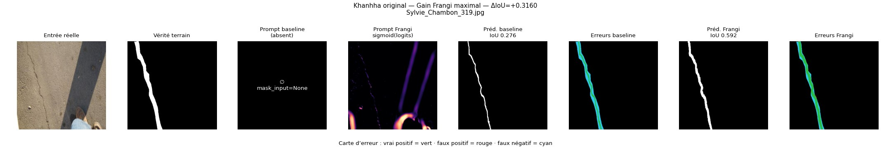

#### Gain baseline maximal — `cracktree200_6266.jpg`

IoU baseline 0.1968, IoU Frangi 0.0272, ΔIoU -0.1697 ; GT = 547 pixels.

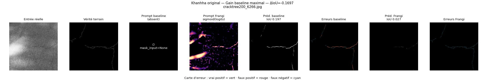

#### Les deux bons — `DeepCrack_11231-3.jpg`

IoU baseline 0.9514, IoU Frangi 0.9435, ΔIoU -0.0079 ; GT = 38643 pixels.

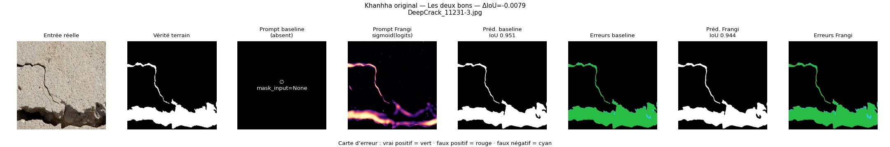

#### Les deux faibles — `CRACK500_20160326_142354_641_1081.jpg`

IoU baseline 0.0000, IoU Frangi 0.0000, ΔIoU +0.0000 ; GT = 2057 pixels.

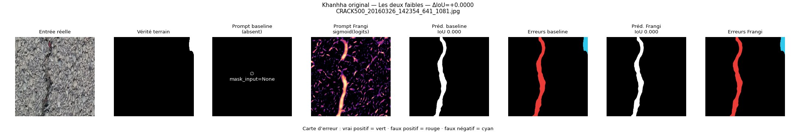

#### Cas médian — `CRACK500_20160329_094010_1281_361.jpg`

IoU baseline 0.8318, IoU Frangi 0.8318, ΔIoU -0.0000 ; GT = 13723 pixels.

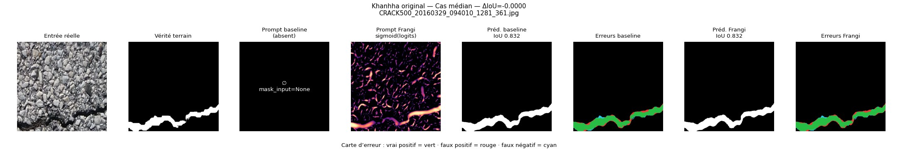

#### GT vide/clairsemée divergente — `noncrack_noncrack_concrete_wall_43_50.jpg.jpg`

IoU baseline 1.0000, IoU Frangi 0.0000, ΔIoU -1.0000 ; GT = 0 pixels.

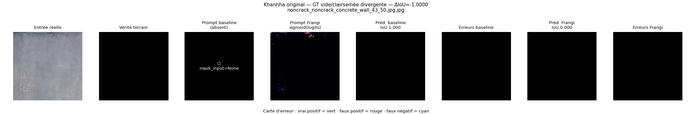

### Khanhha bruité 1

#### Gain Frangi maximal — `CRACK500_20160329_093924_1921_721.jpg`

IoU baseline 0.0003, IoU Frangi 0.7541, ΔIoU +0.7538 ; GT = 7122 pixels.

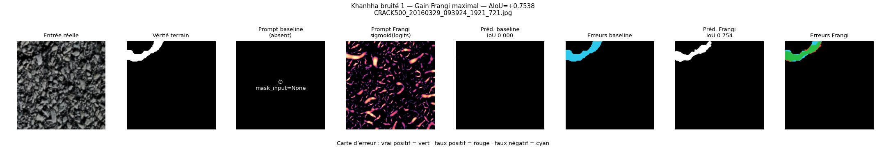

#### Gain baseline maximal — `CRACK500_20160222_115828_641_1.jpg`

IoU baseline 0.5848, IoU Frangi 0.0000, ΔIoU -0.5848 ; GT = 2779 pixels.

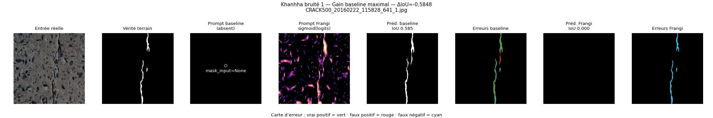

#### Les deux bons — `DeepCrack_11231-3.jpg`

IoU baseline 0.9551, IoU Frangi 0.9554, ΔIoU +0.0002 ; GT = 38643 pixels.

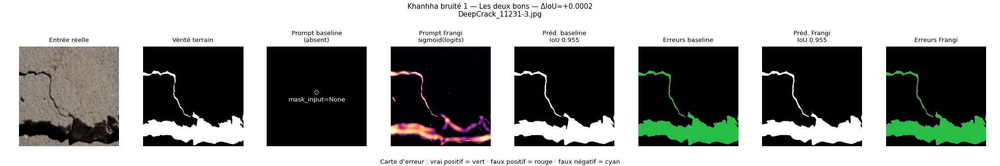

#### Les deux faibles — `CRACK500_20160222_115847_641_361.jpg`

IoU baseline 0.0000, IoU Frangi 0.0000, ΔIoU +0.0000 ; GT = 1203 pixels.

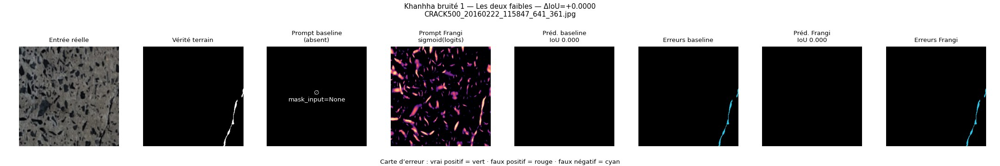

#### Cas médian — `CRACK500_20160316_143445_1281_361.jpg`

IoU baseline 0.7893, IoU Frangi 0.7878, ΔIoU -0.0015 ; GT = 10826 pixels.

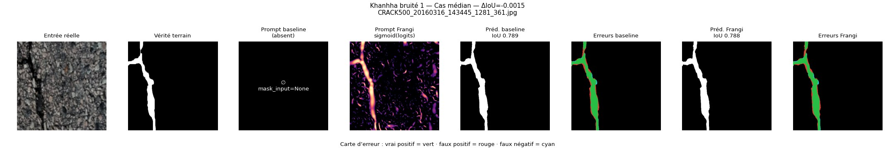

#### GT vide/clairsemée divergente — `noncrack_noncrack_concrete_wall_81_4.jpg.jpg`

IoU baseline 1.0000, IoU Frangi 0.0000, ΔIoU -1.0000 ; GT = 0 pixels.

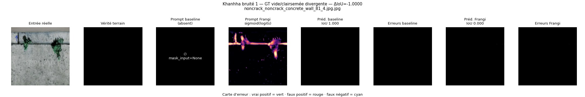

### Khanhha bruité 2

#### Gain Frangi maximal — `Volker_DSC01646_226_19_1273_1645.jpg`

IoU baseline 0.0000, IoU Frangi 0.6845, ΔIoU +0.6845 ; GT = 6166 pixels.

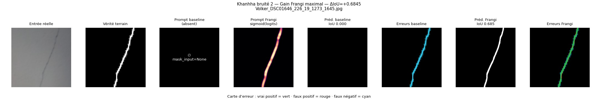

#### Gain baseline maximal — `CRACK500_20160308_073532_1_361.jpg`

IoU baseline 0.8112, IoU Frangi 0.0000, ΔIoU -0.8112 ; GT = 33888 pixels.

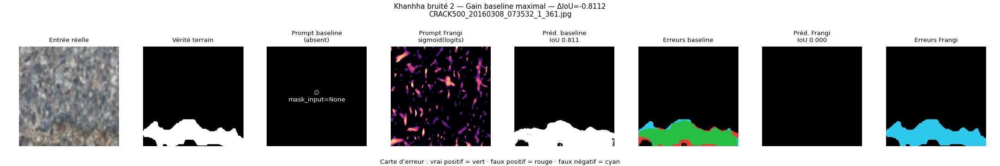

#### Les deux bons — `DeepCrack_11231-3.jpg`

IoU baseline 0.9355, IoU Frangi 0.9323, ΔIoU -0.0032 ; GT = 38643 pixels.

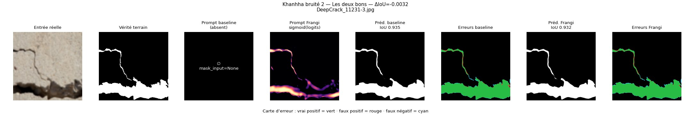

#### Les deux faibles — `CRACK500_20160222_115843_1281_361.jpg`

IoU baseline 0.0000, IoU Frangi 0.0000, ΔIoU +0.0000 ; GT = 2085 pixels.

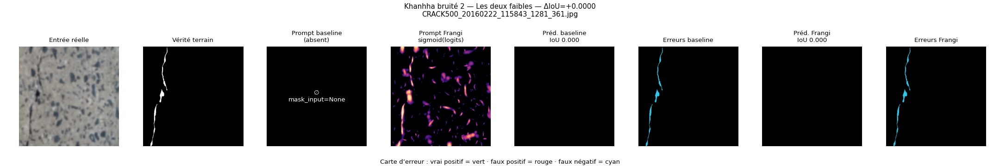

#### Cas médian — `CRACK500_20160328_154318_641_1.jpg`

IoU baseline 0.7403, IoU Frangi 0.7380, ΔIoU -0.0024 ; GT = 17089 pixels.

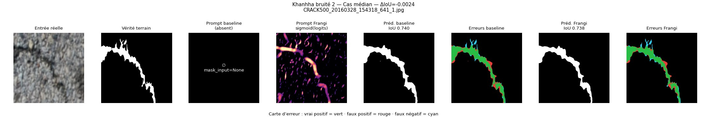

#### GT vide/clairsemée divergente — `noncrack_noncrack_concrete_wall_28_0.jpg.jpg`

IoU baseline 0.0000, IoU Frangi 1.0000, ΔIoU +1.0000 ; GT = 0 pixels.

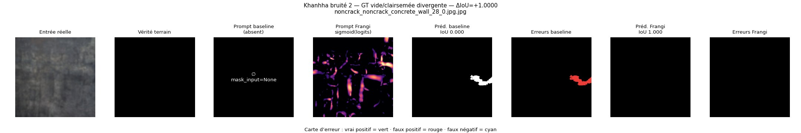

### Road420

#### Gain Frangi maximal — `2023_11_01_20_33_IMG_6353.jpg`

IoU baseline 0.1898, IoU Frangi 0.6852, ΔIoU +0.4954 ; GT = 5310 pixels.

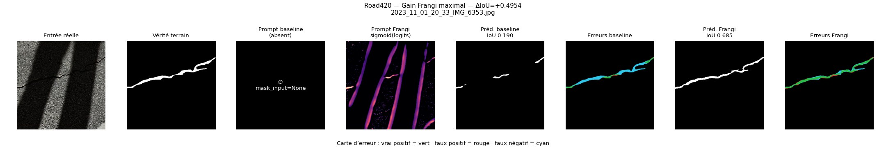

#### Gain baseline maximal — `2023_10_30_16_44_IMG_6033.jpg`

IoU baseline 0.7203, IoU Frangi 0.0400, ΔIoU -0.6803 ; GT = 9845 pixels.

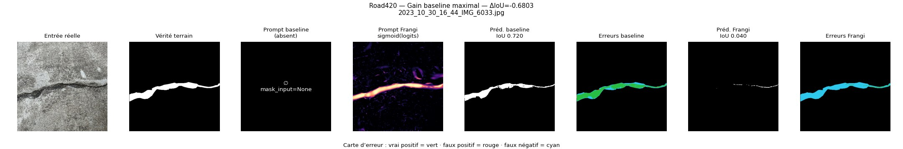

#### Les deux bons — `2023_11_05_21_38_IMG_6516.jpg`

IoU baseline 0.8292, IoU Frangi 0.8212, ΔIoU -0.0080 ; GT = 2451 pixels.

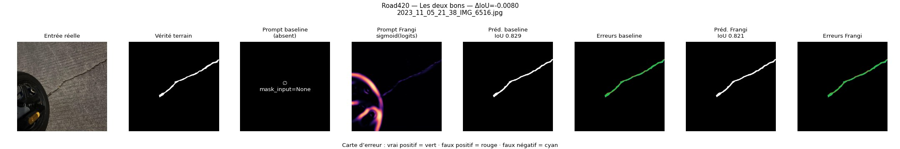

#### Les deux faibles — `2023_10_30_17_30_IMG_6167.jpg`

IoU baseline 0.0000, IoU Frangi 0.0003, ΔIoU +0.0003 ; GT = 3981 pixels.

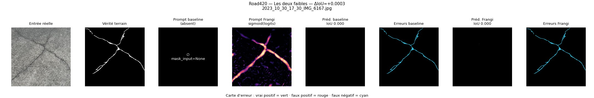

#### Cas médian — `2023_10_30_16_00_IMG_5928.jpg`

IoU baseline 0.5695, IoU Frangi 0.5634, ΔIoU -0.0062 ; GT = 3518 pixels.

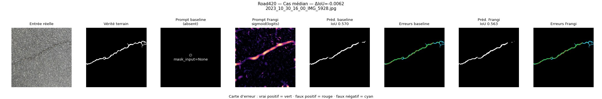

### Facade390

#### Gain Frangi maximal — `DJ_Wall_66.JPG`

IoU baseline 0.0000, IoU Frangi 0.5395, ΔIoU +0.5395 ; GT = 1608 pixels.

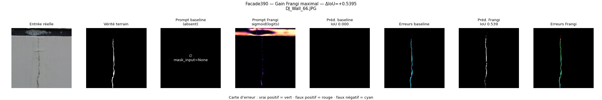

#### Gain baseline maximal — `DJ_Wall_231.JPG`

IoU baseline 0.7500, IoU Frangi 0.2936, ΔIoU -0.4564 ; GT = 2569 pixels.

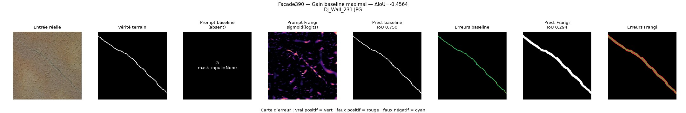

#### Les deux bons — `DJ_Wall_380.JPG`

IoU baseline 0.8260, IoU Frangi 0.8311, ΔIoU +0.0051 ; GT = 5840 pixels.

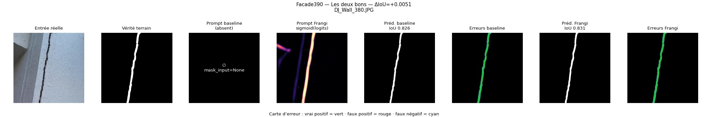

#### Les deux faibles — `DJ_Wall_343.JPG`

IoU baseline 0.0000, IoU Frangi 0.0000, ΔIoU +0.0000 ; GT = 2673 pixels.

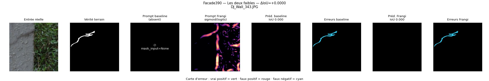

#### Cas médian — `DJ_Wall_368.JPG`

IoU baseline 0.7963, IoU Frangi 0.7807, ΔIoU -0.0156 ; GT = 2627 pixels.

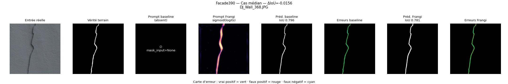

### Concrete3k

#### Gain Frangi maximal — `224_37.jpg`

IoU baseline 0.0000, IoU Frangi 0.9161, ΔIoU +0.9161 ; GT = 720 pixels.

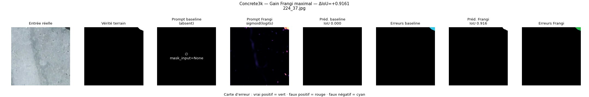

#### Gain baseline maximal — `128_23.jpg`

IoU baseline 0.8670, IoU Frangi 0.0000, ΔIoU -0.8670 ; GT = 397 pixels.

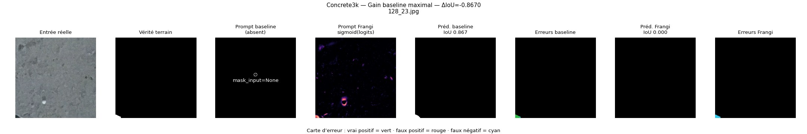

#### Les deux bons — `184_23.jpg`

IoU baseline 0.9663, IoU Frangi 0.9665, ΔIoU +0.0002 ; GT = 13570 pixels.

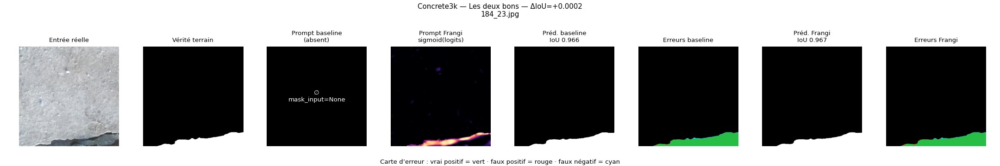

#### Les deux faibles — `026_8.jpg`

IoU baseline 0.0000, IoU Frangi 0.0000, ΔIoU +0.0000 ; GT = 238 pixels.

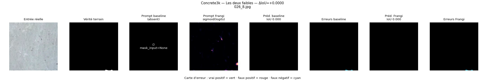

#### Cas médian — `064_36.jpg`

IoU baseline 0.2571, IoU Frangi 0.2477, ΔIoU -0.0094 ; GT = 48561 pixels.

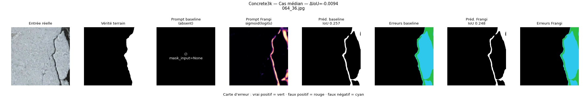

#### GT vide/clairsemée divergente — `504_2.jpg`

IoU baseline 1.0000, IoU Frangi 0.0000, ΔIoU -1.0000 ; GT = 0 pixels.

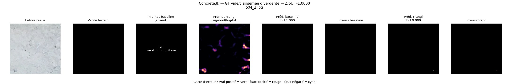

## Galerie et archivage des prompts Frangi-similarité

**12 prompts `.npy`** sont copiés sans modification dans `prompts_npy/`. Le SHA-256, la forme, le type et les statistiques en espace logit/probabilité sont enregistrés dans `prompts_npy/manifest.json` et `tables/prompt_manifest.csv`. Cela permet d’auditer exactement ce qui a été ajouté à la variante Frangi par rapport à la baseline sans prompt.

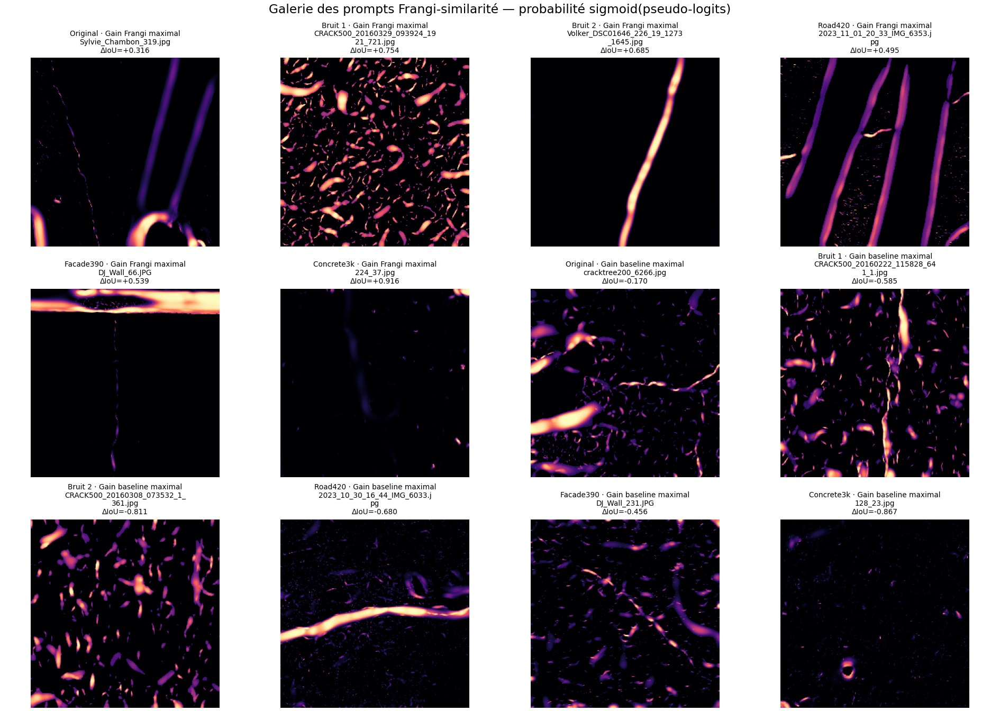

| Dataset | Cas | Catégorie | ΔIoU | Fichier | SHA-256 (12 car.) |
| --- | --- | --- | --- | --- | --- |
| Original | Sylvie_Chambon_319.jpg | Gain Frangi maximal | +0.3160 | prompts_npy/khanhha_original/gain_frangi__Sylvie_Chambon_319.jpg.npy | da7524f4a0ff |
| Bruit 1 | CRACK500_20160329_093924_1921_721.jpg | Gain Frangi maximal | +0.7538 | prompts_npy/khanhha_noisy1/gain_frangi__CRACK500_20160329_093924_1921_721.jpg.npy | 6d122a516f28 |
| Bruit 2 | Volker_DSC01646_226_19_1273_1645.jpg | Gain Frangi maximal | +0.6845 | prompts_npy/khanhha_noisy2/gain_frangi__Volker_DSC01646_226_19_1273_1645.jpg.npy | 42cdb6b1ac6e |
| Road420 | 2023_11_01_20_33_IMG_6353.jpg | Gain Frangi maximal | +0.4954 | prompts_npy/road420/gain_frangi__2023_11_01_20_33_IMG_6353.jpg.npy | 22869e177e19 |
| Facade390 | DJ_Wall_66.JPG | Gain Frangi maximal | +0.5395 | prompts_npy/facade390/gain_frangi__DJ_Wall_66.JPG.npy | ae27fac4e261 |
| Concrete3k | 224_37.jpg | Gain Frangi maximal | +0.9161 | prompts_npy/concrete3k/gain_frangi__224_37.jpg.npy | 1904ed60143a |
| Original | cracktree200_6266.jpg | Gain baseline maximal | -0.1697 | prompts_npy/khanhha_original/gain_baseline__cracktree200_6266.jpg.npy | 22042e10f05d |
| Bruit 1 | CRACK500_20160222_115828_641_1.jpg | Gain baseline maximal | -0.5848 | prompts_npy/khanhha_noisy1/gain_baseline__CRACK500_20160222_115828_641_1.jpg.npy | ffc5ec6988a8 |
| Bruit 2 | CRACK500_20160308_073532_1_361.jpg | Gain baseline maximal | -0.8112 | prompts_npy/khanhha_noisy2/gain_baseline__CRACK500_20160308_073532_1_361.jpg.npy | a1a63caf8fe6 |
| Road420 | 2023_10_30_16_44_IMG_6033.jpg | Gain baseline maximal | -0.6803 | prompts_npy/road420/gain_baseline__2023_10_30_16_44_IMG_6033.jpg.npy | 0c6b1a292db7 |
| Facade390 | DJ_Wall_231.JPG | Gain baseline maximal | -0.4564 | prompts_npy/facade390/gain_baseline__DJ_Wall_231.JPG.npy | a1d8af8a6403 |
| Concrete3k | 128_23.jpg | Gain baseline maximal | -0.8670 | prompts_npy/concrete3k/gain_baseline__128_23.jpg.npy | 39b1653cda7a |

## Wasserstein : couverture et limites de calcul

### Faisabilité transversale du transport dense exact

Source versionnée : `/home/codespace/Generalized-Frangi-for-Automatic-Crack-Extraction-on-FIND-dataset/ISPRS/CrackSAM/results/2026-07-14_wasserstein_feasibility.json` (format 1, générée le 2026-07-14T15:19:00Z). Métrique planifiée : `POT ot.emd2 exact dense Euclidean direct-mask`.

Le tableau suivant applique le **même seuil d’admissibilité mémoire par cas** aux six runs. Les six colonnes de runs donnent le nombre de cas exécutables individuellement ; « commun » impose l’intersection stricte des cas admissibles dans les six runs. Les ETA idéales supposent huit workers parfaitement remplis et ne constituent pas des mesures de durée.

| Seuil/cas | baseline_best | epoch25_best | epoch20 | epoch30 | epoch55 | epoch70 | Commun | Couverture | Union exclue | ETA idéale (8 workers) | ETA réelle estimée |
| --- | --- | --- | --- | --- | --- | --- | --- | --- | --- | --- | --- |
| 0.25 GiB | 2022 | 2083 | 2130 | 2159 | 2209 | 2209 | 1853/8895 | 20.832 % | 7042 | 0.1–0.4 h | n.d. |
| 0.50 GiB | 2763 | 2796 | 2817 | 2900 | 2942 | 2943 | 2531/8895 | 28.454 % | 6364 | 0.5–1.4 h | n.d. |
| 1.00 GiB | 4018 | 4086 | 4100 | 4208 | 4235 | 4234 | 3812/8895 | 42.855 % | 5083 | 2.3–5.0 h | n.d. |
| 2.00 GiB | 5301 | 5389 | 5414 | 5440 | 5458 | 5458 | 5191/8895 | 58.359 % | 3704 | 7.0–13.0 h | n.d. |
| 4.00 GiB | 6688 | 6723 | 6755 | 6748 | 6757 | 6758 | 6618/8895 | 74.401 % | 2277 | 20.0–30.0 h | n.d. |
| 8.00 GiB | 7732 | 7765 | 7783 | 7770 | 7777 | 7777 | 7697/8895 | 86.532 % | 1198 | 45.0–57.0 h | n.d. |
| 16.00 GiB | 8409 | 8411 | 8425 | 8418 | 8422 | 8422 | 8381/8895 | 94.222 % | 514 | 80.0–90.0 h | n.d. |
| 32.00 GiB | 8725 | 8714 | 8719 | 8723 | 8722 | 8722 | 8709/8895 | 97.909 % | 186 | 117.0–122.0 h | n.d. |
| 140.00 GiB | 8890 | 8889 | 8889 | 8889 | 8889 | 8890 | 8888/8895 | 99.921 % | 7 | 163.0–172.0 h | 200.0–300.0 h |

Intersection stricte détaillée par dataset lorsque le scan versionné la fournit :

| Seuil/cas | Original | Bruit 1 | Bruit 2 | Road420 | Facade390 | Concrete3k |
| --- | --- | --- | --- | --- | --- | --- |
| 4.00 GiB | 1311 | 1338 | 1341 | 410 | 389 | 1829 |
| 8.00 GiB | 1467 | 1492 | 1490 | 418 | 390 | 2440 |
| 16.00 GiB | 1580 | 1586 | 1593 | 420 | 390 | 2812 |
| 32.00 GiB | 1650 | 1644 | 1648 | 420 | 390 | 2957 |
| 140.00 GiB | 1694 | 1694 | 1693 | 420 | 390 | 2997 |

Le compromis **8 GiB/cas** conserve **7697/8895 cas communs** (86.532 %) pour une ETA idéale de 45.0–57.0 h. À **140 GiB/cas**, le support commun atteint **8888/8895** (99.921 %), mais l’ETA réelle est 200.0–300.0 h.

### Tentative réelle à 140 GiB : état durable, non publiable comme moyenne

| Run | Exécutables | Terminés durables | Échecs | Journal reprenable | Résumé publié | Cas actif max | RSS observée |
| --- | --- | --- | --- | --- | --- | --- | --- |
| baseline_best | 8890 | 1182 | 0 | oui | non | 136.56 GiB; ≥990 s; incomplet à l’arrêt | 94.47 GiB |

Motif d’arrêt consigné : The six-run exact calculation cannot complete inside the Spot window; partial means are scientifically non-comparable and are not published. Le journal baseline reste auditable et reprenable, mais **les 1 182 distances déjà terminées ne sont jamais moyennées ni présentées comme résultat final**, car elles forment un sous-échantillon déterminé par le coût de calcul et ne sont pas comparables aux cinq jalons encore non calculés.

### Faisabilité et progression observées dans chaque répertoire de run

| Run | Tâches | Mémoire p50/p99/max | Budget | Exclues | Progrès durable | Fenêtre écoulée | Résumé exact publié | Contrat lié |
| --- | --- | --- | --- | --- | --- | --- | --- | --- |
| baseline_best | 8895 | 1.26 / 48.14 / 244.31 GiB | 140.0 GiB | 5 | 1182/8890 (13.3 %) | 0.25 h | non | oui |
| epoch20 | 8895 | 1.18 / 45.83 / 243.15 GiB | 140.0 GiB | 6 | 0/8889 (0.0 %) | n.d. | non | oui |
| epoch25_best | 8895 | 1.19 / 46.88 / 243.95 GiB | 140.0 GiB | 6 | 0/8889 (0.0 %) | n.d. | non | oui |
| epoch30 | 8895 | 1.13 / 46.81 / 243.42 GiB | 140.0 GiB | 6 | 0/8889 (0.0 %) | n.d. | non | oui |
| epoch55 | 8895 | 1.12 / 46.29 / 242.86 GiB | 140.0 GiB | 6 | 0/8889 (0.0 %) | n.d. | non | oui |
| epoch70 | 8895 | 1.12 / 46.10 / 242.84 GiB | 140.0 GiB | 5 | 0/8890 (0.0 %) | n.d. | non | oui |

Les quantiles mémoire proviennent du scan de support complet avant calcul. Le progrès est le nombre de clés `(dataset, case_name)` complètes et durables dans `progress.jsonl`, rapporté aux tâches exécutables après exclusions. La fenêtre écoulée est mesurée entre la création du contrat exact et la dernière écriture du journal ; la somme des temps CPU/tâche reste disponible dans le CSV. **Aucune moyenne des distances du journal partiel n’est calculée ni publiée comme résultat.**

### Artefacts d’audit recopiés avec empreintes

Les scans de support, listes d’exclusions et contrats exacts disponibles sont recopiés sous `wasserstein_audit/<run>/`. Le journal `progress.jsonl` de la baseline est également conservé comme preuve de progression durable ; sa présence n’autorise aucune statistique partielle. Les SHA-256 source et copie doivent coïncider.

| Run | Artefact | Disponible | Copie | Taille | SHA-256 | Vérifiée |
| --- | --- | --- | --- | --- | --- | --- |
| baseline_best | support_scan.json | oui | wasserstein_audit/baseline_best/support_scan.json | 842 | 1a1efc56b3c9196a… | oui |
| baseline_best | oversized.json | oui | wasserstein_audit/baseline_best/oversized.json | 3,496 | dbce8ef15ac9658f… | oui |
| baseline_best | exact_wasserstein_contract.json | oui | wasserstein_audit/baseline_best/exact_wasserstein_contract.json | 1,278 | af3c1a9240560550… | oui |
| baseline_best | progress.jsonl | oui | wasserstein_audit/baseline_best/progress.jsonl | 504,387 | 6d44e74e6542fa4d… | oui |
| epoch20 | support_scan.json | oui | wasserstein_audit/epoch20/support_scan.json | 847 | 6301aa955bb9445d… | oui |
| epoch20 | oversized.json | oui | wasserstein_audit/epoch20/oversized.json | 4,074 | 13521a09ad2acb17… | oui |
| epoch20 | exact_wasserstein_contract.json | oui | wasserstein_audit/epoch20/exact_wasserstein_contract.json | 1,288 | 7fa6c4ce5e437eb8… | oui |
| epoch25_best | support_scan.json | oui | wasserstein_audit/epoch25_best/support_scan.json | 846 | 4d93ff8f7e7a277c… | oui |
| epoch25_best | oversized.json | oui | wasserstein_audit/epoch25_best/oversized.json | 4,104 | f2c8015ae59aaa50… | oui |
| epoch25_best | exact_wasserstein_contract.json | oui | wasserstein_audit/epoch25_best/exact_wasserstein_contract.json | 1,293 | 40846cf889cbb730… | oui |
| epoch30 | support_scan.json | oui | wasserstein_audit/epoch30/support_scan.json | 826 | 130b54714001a48f… | oui |
| epoch30 | oversized.json | oui | wasserstein_audit/epoch30/oversized.json | 4,074 | 781bcebb2b8e00f9… | oui |
| epoch30 | exact_wasserstein_contract.json | oui | wasserstein_audit/epoch30/exact_wasserstein_contract.json | 1,288 | f3912b2737656d27… | oui |
| epoch55 | support_scan.json | oui | wasserstein_audit/epoch55/support_scan.json | 836 | d6a84362acee8dbd… | oui |
| epoch55 | oversized.json | oui | wasserstein_audit/epoch55/oversized.json | 4,074 | a5e4bc639d5a3539… | oui |
| epoch55 | exact_wasserstein_contract.json | oui | wasserstein_audit/epoch55/exact_wasserstein_contract.json | 1,288 | 36d3b9d93bc15fe7… | oui |
| epoch70 | support_scan.json | oui | wasserstein_audit/epoch70/support_scan.json | 845 | ba1125786fdef363… | oui |
| epoch70 | oversized.json | oui | wasserstein_audit/epoch70/oversized.json | 3,455 | 030d514107243a33… | oui |
| epoch70 | exact_wasserstein_contract.json | oui | wasserstein_audit/epoch70/exact_wasserstein_contract.json | 1,288 | d2d56577a3533da4… | oui |

La distance exacte est potentiellement très coûteuse car le transport dense croît avec le produit du nombre de pixels actifs des deux masques. Les résultats ne sont comparés **que sur l’intersection des cas possédant une valeur finie dans les deux modèles**. Les colonnes `baseline_finite`, `frangi_finite`, `common_finite` et `common_coverage` de `tables/paired_statistics.csv` rendent toute incomplétude visible. Une absence de valeur n’est ni remplacée par zéro ni par la distance plafonnée utilisée pendant certains diagnostics rapides.

## Limites d’interprétation

- Les moyennes par image donnent le même poids à chaque image, quelle que soit la surface annotée. Les agrégats macro donnent ensuite le même poids à chaque configuration, tandis que les agrégats pondérés donnent le même poids à chaque image/configuration.
- Les trois variantes Khanhha (propre et deux bruits) partagent les mêmes scènes. Le total pondéré les considère comme trois conditions expérimentales, pas comme trois images indépendantes du point de vue sémantique.
- Les IC bootstrap sont descriptifs de cet échantillon de test ; ils ne corrigent ni les comparaisons multiples entre jalons, ni les décalages de domaine.
- Les comparaisons avec le papier ne sont pas parfaitement contrôlées : SAM 1 ViT-H, SAM 2 Hiera Large, code, poids de fondation et entraînements diffèrent.
- Les illustrations sont sélectionnées par une règle sur l’IoU. Elles sont informatives mais ne remplacent pas l’inspection de toutes les prédictions, disponible dans les artefacts d’évaluation.
- Un IoU faible peut provenir d’une erreur de classe, d’une épaisseur de masque différente ou d’une annotation discutable ; les cartes FP/FN aident à distinguer ces situations sans prétendre trancher automatiquement la qualité de l’annotation.

## Fichiers tabulaires et reproductibilité

- `tables/metric_summary.csv` : métriques, écarts-types et couvertures pour les six datasets et les deux agrégations.
- `tables/milestone_deltas_vs_baseline.csv` : deltas de chaque jalon contre la baseline best.
- `tables/per_image_all_milestones.csv` : jointure exhaustive image par image pour les cinq jalons.
- `tables/paired_statistics.csv` : statistiques appariées, IC bootstrap et couverture Wasserstein du jalon principal.
- `tables/wasserstein_feasibility.csv` : scan mémoire dense, exclusions et progression durable, sans moyenne partielle.
- `tables/wasserstein_threshold_feasibility.csv` : neuf seuils mémoire communs aux six runs, support strict et ETA de planification.
- `tables/wasserstein_audit_files.csv` et `wasserstein_audit/<run>/` : inventaire, copies et empreintes des preuves de faisabilité exactes.
- `tables/delta_iou_quantiles.csv` : quantiles des deltas du jalon principal.
- `tables/training_history.csv` et `tables/best_validation.csv` : historiques et sélection validation.
- `tables/paper_reference_values.csv` : transcription traçable des Tables 1, 2 et 6 du papier.
- `tables/paper_comparison_all_runs.csv` : valeurs et deltas de chacun des six runs contre les deux modèles publiés.
- `tables/checkpoint_manifest.csv` : vue tabulaire du manifeste versionné des poids et vérification locale.
- `tables/selected_cases.csv` et `tables/prompt_manifest.csv` : provenance des illustrations et prompts.
- `report_manifest.json` : arguments, runs trouvés, manifeste des checkpoints, avertissements et SHA-256 de toutes les sorties (hors manifeste lui-même).

## Avertissements de complétude

Aucun avertissement.
