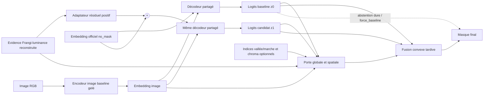
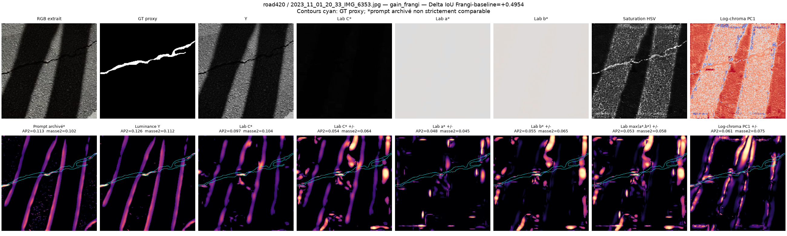
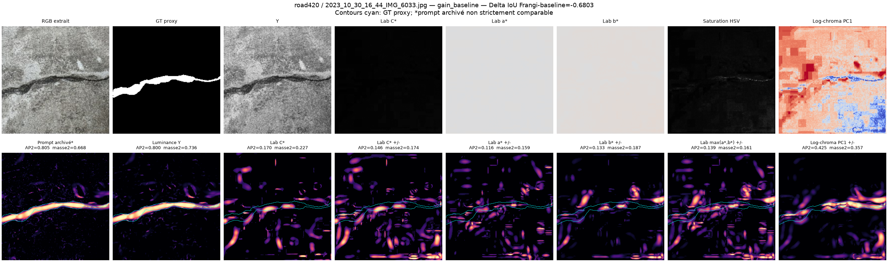

# Recommandation après recul expérimental — **SafeFrangi**

> **Date :** 14 juillet 2026
> **Statut :** décision d'architecture et protocole proposé, sans nouvel entraînement
> **Exécution pour ce rapport :** analyses locales et CPU uniquement ; aucune VM
> n'a été démarrée ni contactée.

## Décision en une phrase

La piste la plus pertinente n'est **ni de remplacer la luminance par la
chrominance, ni de fournir deux cartes Frangi comme deux prompts équivalents à
SAM 2**. Il faut repartir de la meilleure baseline gelée, partager son
encodage image, calculer **deux sorties** — `no_mask` et Frangi résiduelle —,
puis les fusionner tardivement avec une porte d'abstention qui peut sélectionner
exactement la sortie baseline.

Cette proposition est appelée **SafeFrangi** dans la suite.

Le choix important est sémantique : **une absence de réponse Frangi doit
signifier « aucune information » et non « preuve certaine de fond »**.

## Résumé exécutif

Les résultats disponibles racontent trois choses différentes qu'il ne faut pas
confondre :

1. Le modèle Frangi toujours conditionné est globalement moins bon que la
   baseline : `−0,011177` IoU macro au meilleur jalon.
2. Il existe néanmoins des cas où le modèle entraîné avec Frangi dépasse la
   baseline, parfois très fortement. Un
   oracle qui sélectionnerait après coup la meilleure des deux sorties par
   image disposerait de `+0,025791` IoU macro par rapport à la baseline. Cet
   oracle n'est pas réalisable — il utilise le GT — mais il quantifie un
   potentiel de sélection entre les deux checkpoints observés.
3. Le test CPU ne soutient pas la chrominance comme remplacement : sur les six
   reculs sélectionnés, Lab `C*` est moins bon que la luminance dans cinq cas
   sur six et ne nettoie pas correctement les deux scènes les plus ombrées.

Le défaut le plus actionnable se situe donc dans le **régime de confiance et
d'injection du prompt**, pas dans le choix d'un second canal à injecter de la
même manière :

- la carte Frangi est une mesure relative, non une probabilité calibrée ;
- son absence est actuellement convertie en logit `−11,5129` ;
- ce logit dense est présenté au prompt encoder gelé comme s'il s'agissait
  d'un masque de segmentation grossier ;
- le modèle Frangi n'apprend jamais à fonctionner sans ce prompt ;
- un tenseur nul n'est pas équivalent à l'embedding officiel `no_mask`.

SafeFrangi adresse ces cinq mécanismes plausibles tout en conservant un mode
baseline vérifiable :

- checkpoint initial : baseline époque 20 ;
- SAM 2 et LoRA baseline gelés ;
- réponse Frangi reconvertie en évidence positive bornée ;
- petit adaptateur vers l'espace d'embedding dense et deuxième décodage avec
  le même image embedding ;
- dernière projection initialisée à zéro, donc les deux sorties sont
  initialement identiques à la baseline ;
- porte globale d'abstention, puis porte spatiale seulement si elle apporte un
  gain validé ;
- fusion tardive des logits : une porte nulle sélectionne réellement `z0` et
  empêche les effets globaux du décodeur candidat de contaminer la sortie ;
- chrominance et test vallée/marche utilisés au mieux comme **indices de
  fiabilité**, jamais comme prompt principal au premier essai.

Ce mécanisme ne garantit pas que la porte prendra la bonne décision sur une
image inconnue. Il garantit seulement que la baseline reste une sortie
explicitement représentable et testable.

## 1. Ce que disent réellement les résultats

### 1.1 Résultat global : le guidage actuel ne passe pas le test

Le [rapport exhaustif des
jalons](../frangi_milestone_report/RAPPORT_FRANGI_MILESTONES.md) compare le
meilleur checkpoint baseline à cinq jalons Frangi sur les 8 895 conditions
image/jeu.

| Modèle | Époque | IoU macro, six jeux | IoU pondéré images | Δ macro vs baseline |
|---|---:|---:|---:|---:|
| Baseline SAM 2 + LoRA q/v | 20 | **0,567465** | **0,606396** | — |
| Frangi-similarité, best validation | 25 | 0,556288 | 0,596546 | **−0,011177** |
| Frangi-similarité, final | 70 | 0,546430 | 0,589975 | −0,021035 |

Pour l'époque 25, la comparaison appariée donne :

- delta IoU pondéré : `−0,009849`, IC bootstrap 95 %
  `[−0,011984 ; −0,007789]` ;
- 3 300 gains, 925 égalités, 4 670 pertes ;
- 792 gains supérieurs à `+0,05` IoU ;
- 1 188 pertes inférieures à `−0,05` IoU.

La dérive des jalons tardifs confirme qu'il ne suffit pas d'entraîner plus
longtemps la configuration actuelle.

### 1.2 L'oracle révèle du potentiel, pas une solution déjà acquise

Le tableau suivant prend, **pour chaque image et à l'aide de son GT**, le
maximum entre l'IoU baseline et l'IoU Frangi époque 25. C'est une borne
diagnostique et non une performance annoncée.

| Dataset | Baseline | Frangi | Oracle par image | Oracle − baseline |
|---|---:|---:|---:|---:|
| Khanhha original | 0,623804 | 0,622972 | 0,630988 | +0,007183 |
| Khanhha bruité 1 | 0,567812 | 0,570486 | 0,587252 | +0,019440 |
| Khanhha bruité 2 | 0,513344 | 0,484103 | 0,528015 | +0,014671 |
| Road420 | 0,483639 | 0,470093 | 0,539142 | **+0,055503** |
| Facade390 | 0,516369 | 0,499940 | 0,557131 | **+0,040762** |
| Concrete3k | 0,699823 | 0,690132 | 0,717009 | +0,017186 |
| **Macro six jeux** | **0,567465** | 0,556288 | **0,593256** | **+0,025791** |
| **Pondéré images** | **0,606396** | 0,596546 | **0,624469** | **+0,018073** |

Lecture correcte : les deux sorties sont complémentaires **après observation
du GT**. Rien ne prouve encore qu'une porte puisse reconnaître ces cas à partir
de l'image seule, ni qu'elle généralise hors Khanhha. La prochaine méthode doit
donc être construite comme une expérience de *sélection fiable*, sans jamais
entraîner la porte sur ces six jeux de test.

Restriction supplémentaire : cet oracle compare deux checkpoints entraînés
séparément, dont les LoRA diffèrent dans Hiera **et** dans le mask decoder. Il
borne seulement un sélecteur qui choisirait entre ces deux sorties déjà
observées. Il ne borne pas SafeFrangi et ne démontre ni que Frangi cause toute
la complémentarité, ni qu'un candidat construit sur la baseline gelée saura
reproduire ces gains. SafeFrangi teste précisément si une partie de ce potentiel
est transférable avec un image embedding partagé.

### 1.3 L'hypothèse « les ombres causent les échecs » n'est pas établie

L'intuition est plausible, car une frontière d'ombre longue et alignée ressemble
à une structure tubulaire pour le Hessien et pour le graphe. Les observations
locales ne démontrent toutefois pas la chaîne causale complète
« ombre → mauvais prompt → mauvaise sortie » :

- Road420 `IMG_6353`, avec trois bandes d'ombre très visibles, est le meilleur
  gain Road Frangi : `+0,4954` IoU ;
- `Sylvie_Chambon_319`, également très ombrée, gagne `+0,3160` ;
- Road420 `IMG_6033` perd `−0,6803` alors que la réponse Frangi-luminance suit
  remarquablement bien la fissure (`AP2≈0,800`) et qu'aucune ombre franche
  n'explique l'effondrement du masque ;
- plusieurs reculs extrêmes relèvent plutôt de texture, flou, support
  chromatique ou conditionnement du modèle.

Conséquence : un filtre anti-ombre peut devenir une excellente **feature de
confiance**, mais il serait trop risqué d'en faire un veto irréversible ou la
seule correction.

### 1.4 Verdict du test CPU chrominance

Le [rapport de la sonde
CPU](../frangi_chrominance_cpu_probe/RAPPORT_TEST_CHROMINANCE_CPU.md) est
reproductible par
[`analyze_frangi_chrominance_cpu.py`](../../analyze_frangi_chrominance_cpu.py).
Il compare les cartes recalculées à partir des mêmes crops RGB.

Sur les six reculs Frangi sélectionnés :

| Variante | AP2 | Masse près du GT | Précision top-K | Couverture cible | Distance pondérée |
|---|---:|---:|---:|---:|---:|
| Luminance | **0,325** | **0,258** | **0,417** | **0,560** | **51,1 px** |
| Lab `C*` | 0,099 | 0,129 | 0,115 | 0,166 | 65,0 px |

La fraction active est comparable (`0,188` en luminance, `0,193` pour `C*`) :
la chrominance n'échoue pas seulement en produisant une carte vide, elle
déplace le signal vers de mauvaises structures. `C*` ne gagne selon AP2 et la
masse proche que dans un cas sur six, le cas bruité 2 sans ombre franche.

Verdict défendable : **no-go pour un entraînement chrominance seule comme
remplacement direct**. Ce test ne permet pas d'affirmer que la chrominance est
inutile en population :

- les cas ont été sélectionnés conditionnellement à des extrema de ΔIoU ;
- les RGB originaux 448² ne sont pas présents localement ;
- les crops proviennent de JPEG 4:2:0, donc la chrominance effective est
  sous-échantillonnée ;
- le contrôle 448² réagrandit ces mêmes données, il ne recrée pas l'information
  source ;
- les métriques de carte ne sont pas un surrogate validé de l'IoU SAM.

La découverte ponctuelle sur le canal `a*` de `DJ_Wall_231` reste une piste
exploratoire, soumise à un effet de multiplicité parmi plusieurs variantes.

### 1.5 Le problème d'injection est plus fondamental que le choix du canal

Le pipeline actuel :

1. convertit le RGB en un gris fixe dans
   [`frangi.py`](../../cracksam2/frangi.py#L75-L105) ;
2. normalise chaque Hessien par le maximum spatial de sa norme spectrale,
   séparément pour chaque image/modalité/échelle, dans
   [`graph_extraction.py`](../../../src/graph_extraction.py#L31-L43) ;
3. accepte les lobes `λ2>0`, ce qui ne distingue pas une vallée sombre
   bilatérale d'une marche d'ombre dans
   [`graph_extraction.py`](../../../src/graph_extraction.py#L45-L59) ;
4. conserve une fraction relative des arêtes ; lorsqu'au moins une paire
   candidate existe, le top relatif en conserve au minimum une, sinon la
   fonction retourne une carte nulle, dans
   [`graph_extraction.py`](../../../src/graph_extraction.py#L69-L101) et
   [`graph_extraction.py`](../../../src/graph_extraction.py#L149-L167) ;
5. traite `node_sim_max` comme une probabilité, puis applique `logit(P)` dans
   [`frangi.py`](../../cracksam2/frangi.py#L285-L304) ;
6. injecte le résultat comme unique masque dense dans
   [`model.py`](../../cracksam2/model.py#L246-L305).

Deux conséquences se cumulent.

#### Une dynamique minuscule est rendue artificiellement forte

La normalisation par maximum est relative à chaque image et à chaque modalité.
Un canal chromatique presque constant, ou un bruit JPEG, peut ainsi atteindre
une amplitude normalisée comparable à une vraie fissure. Le top relatif force
ensuite la conservation d'une partie du graphe, même lorsque l'évidence
absolue est faible.

#### L'absence d'évidence devient une preuve négative extrême

Avec `ε=10⁻⁵` :

\[
\operatorname{logit}(\epsilon)
=\log\frac{10^{-5}}{1-10^{-5}}
\simeq -11{,}5129.
\]

Dans les douze prompts archivés :

- entre **58,8 % et 88,0 %** des pixels ont une probabilité inférieure à
  `10⁻⁴` ;
- le logit moyen varie environ de `−8,39` à `−10,33` ;
- seulement `0,35 %` à `12,63 %` des pixels dépassent `P=0,5`.

La carte n'exprime donc pas seulement « voici quelques indices de fissure ».
Elle présente la majorité de l'image comme un masque de fond extrêmement
certain. Or SAM 2 réserve un embedding appris distinct à l'absence de masque.
Une carte de zéros, et a fortiori une carte remplie de `−11,5`, ne reproduit
pas `masks=None`.

Le contre-exemple `IMG_6033` devient alors central : la géométrie du prompt est
bonne, mais son **sémantisme dense** et le modèle toujours conditionné peuvent
quand même supprimer la fissure.

### 1.6 Pourquoi « plusieurs prompts SAM 2 » ne résout pas ce problème

L'API officielle accepte plusieurs points, éventuellement une boîte, et un
masque dense. Son argument `mask_input` a la forme `1×H×W`, tandis que
`multimask_output=True` demande plusieurs hypothèses **de sortie** et non
plusieurs masques d'entrée. Voir le
[`SAM2ImagePredictor` officiel](https://github.com/facebookresearch/sam2/blob/2b90b9f5ceec907a1c18123530e92e794ad901a4/sam2/sam2_image_predictor.py)
et le
[`PromptEncoder` officiel](https://github.com/facebookresearch/sam2/blob/2b90b9f5ceec907a1c18123530e92e794ad901a4/sam2/modeling/sam/prompt_encoder.py).
Le SHA officiel consulté, `2b90b9f5ceec907a1c18123530e92e794ad901a4`,
doit être enregistré dans le contrat logiciel au lieu de dépendre de `main`.

Le wrapper local est encore plus explicite : il impose `(B,1,H,W)` et passe
`points=None`, `boxes=None`. Concaténer luminance et chrominance en
`(B,2,H,W)` n'est donc ni supporté ni sémantiquement justifié.

Une fusion fixe avant SAM détruirait en outre l'identité des sources :

- union/max : accumule les faux motifs ;
- intersection/produit : efface les fissures achromatiques ;
- moyenne : donne le même poids à un canal utile et à un canal sans dynamique ;
- deux polarités chromatiques : augmente encore la densité de parasites.

## 2. Diagnostic causal retenu

| Hypothèse | Évidence en sa faveur | Évidence contraire / limite | Traitement proposé |
|---|---|---|---|
| Frontières d'ombre prises pour des fissures | Le Hessien et l'alignement du graphe favorisent des structures longues ; l'algorithme ne teste pas la symétrie transverse | Les deux ombres les plus franches de la sélection sont des gains ; pas d'annotation systématique | Score vallée/marche comme feature de fiabilité, jamais veto initial |
| Mauvaise géométrie du prompt | Plusieurs échecs ont une carte parasite ou décorrélée | `IMG_6033` a une AP2 de 0,800 mais perd 0,680 IoU | Adaptateur appris et gate, pas seulement nettoyage de carte |
| Mauvaise sémantique de l'absence | `P≈0` devient `−11,5` sur la majorité du masque | Effet causal à confirmer par ablation neutralisée | Reconvertir en évidence positive puis résidu autour de `no_mask` |
| Conditionnement obligatoire | Entraînement Frangi toujours avec un masque, baseline jamais accessible | Aucun essai de prompt dropout à ce jour | Baseline gelée, fallback explicite, prompt dropout/corruption |
| Chrominance comme solution | Peut aider un mur coloré et un cas bruité | Pire dans 5/6 reculs ; ombres non supprimées ; JPEG 4:2:0 | Seulement feature auxiliaire et ablation tardive |
| Simple manque d'entraînement | Le meilleur val est à l'époque 25 | Les performances se dégradent jusqu'à l'époque 70 | Ne pas prolonger l'architecture actuelle |

Conclusion : le facteur commun le plus plausible et le plus facilement
falsifiable est **l'injection non neutralisable d'un signal non calibré**.

## 3. Choix entre les pistes possibles

| Piste | Sécurité baseline | Soutien empirique | Coût | Verdict |
|---|---|---|---|---|
| Remplacer Y par Lab `C*` | Faible | Défavorable sur la sonde | Faible | **Abandon** comme méthode principale |
| Fusion fixe Y/chroma | Aucune vraie abstention | Aucun résultat SAM ; cartes chroma faibles | Faible | Seulement contrôle négatif |
| Corriger Frangi contre les ombres puis réentraîner comme avant | Faible | Traite un mécanisme réel mais partiel | Moyen | Ablation utile, insuffisante seule |
| Deux modèles actuels complets puis gate sur leurs logits | Bonne si gate ferme | Oracle calculé exactement sur ces sorties | Deux encodeurs Hiera car LoRA actuels différents | Teacher/pilote diagnostique, coûteux en production |
| **Hiera baseline partagé + deux décodages `None/Y` + gate de logits** | **Sélection exacte de `z0`** | Le principe de sélection est motivé par l'oracle, sans garantie de transférer ses gains | Un Hiera + deux mask decoders | **Piste retenue** |
| Résidu fusionné dans l'embedding avant un seul décodage | Fallback global possible | Traite le problème sémantique mais n'est pas directement soutenu par l'oracle | Un Hiera + un decoder | Optimisation/distillation ultérieure |
| Trois décodages `None/Y/chroma` | Bonne si gate ferme | Aucun oracle pour chroma | Un encodeur + trois décodeurs dans un nouvel entraînement | Prématuré |

La chrominance ne mérite donc pas une troisième branche SAM au MVP. Si elle
apporte ultérieurement une valeur mesurable, ce sera d'abord en aidant la porte
à dire « je ne sais pas ».

Le compromis retenu est volontaire : l'adaptateur rend le prompt Frangi
neutralisable, puis la fusion **après deux décodages** empêche une modification
globale du candidat de contaminer les pixels où la porte choisit la baseline.
La variante à un seul décodage restera une ablation de compression si la
version à deux sorties fonctionne.

## 4. Architecture SafeFrangi proposée

### 4.1 Invariants de conception

1. Le chemin baseline doit rester disponible et inchangé.
2. Une évidence Frangi nulle doit donner `ΔE=0`, puis `z1=z0`.
3. La fusion tardive doit pouvoir sélectionner exactement `z0` globalement et
   pixel par pixel ; la localisation du résidu latent ne suffit pas à cette
   garantie, car les attentions du decoder propagent l'information.
4. La porte globale doit prendre une décision dure pour constituer une vraie
   abstention.
5. Aucun poids baseline ne doit bouger pendant le MVP.
6. Le test ne doit servir ni à entraîner la porte ni à choisir son seuil.

### 4.2 Point de départ

- Charger la baseline époque 20 identifiée dans
  [`2026-07-14_checkpoint_manifest.json`](../2026-07-14_checkpoint_manifest.json).
- Charger ses LoRA q/v avant de modifier `requires_grad`.
- Geler SAM 2, le prompt encoder, le mask decoder et tous les LoRA baseline.
- Maintenir explicitement ces modules en mode `.eval()` même lorsque les
  nouveaux modules sont entraînés ; geler les poids ne désactive pas à lui seul
  dropout ou drop-path.
- Calculer l'image embedding une seule fois avec `_encode_images`.

Le prompt encoder appelé avec `masks=None` fournit :

\[
E_0\in\mathbb{R}^{B\times C\times H_e\times W_e},
\]

l'embedding officiel `no_mask`. Dans SAM 2 Large actuel, on s'attend en
pratique à `C=256`, `H_e=W_e=64`, mais le code doit dériver ces dimensions du
tenseur et ne rien hardcoder.

Les deux décodages réutilisent le même positional encoding et les mêmes
embeddings clairsemés vides ; seule la partie dense passe de `E0` à `E1`.

L'encodeur image gelé peut être exécuté sous `torch.no_grad`. Le decoder reste
gelé mais le décodage candidat ne doit pas être placé sous `no_grad`, car son
gradient doit remonter jusqu'à l'adaptateur de prompt.

### 4.3 Décoder l'ancien cache sans réutiliser ses pseudo-logits

Le cache actuel contient en réalité :

\[
L_{256}=\operatorname{Bilinear}
\left(\operatorname{logit}(\operatorname{clip}(P_{448},\epsilon,1-\epsilon))\right).
\]

Comme sigmoid et interpolation bilinéaire ne commutent pas,
`sigmoid(L256)` ne restitue ni `P448` ni son redimensionnement exact. Pour le
MVP, on ne récupère qu'une évidence monotone dérivée :

\[
\widetilde S=\operatorname{clip}
\left(\frac{\sigma(L_{256})-\epsilon}{1-2\epsilon},0,1\right).
\]

Dans le code et les contrats, cette quantité doit être nommée
`S_proxy`/`Stilde`, jamais `similarity_raw`.

Les valeurs proches du plancher doivent être mises à zéro avec une tolérance
définie dans le contrat, pas par une égalité flottante fragile. Un cache version
2 est nécessaire pour stocker la similarité exacte **avant** logit/interpolation,
le support brut, la dynamique Hessienne absolue avant normalisation, les
paramètres du graphe et leurs SHA-256. Les expériences utilisant la dynamique
absolue ne peuvent pas être menées honnêtement avec le cache v1.

### 4.4 Adaptateur résiduel positif

Un petit module `PositiveFrangiPromptAdapter` calcule :

\[
\Delta E=A_\theta(\widetilde S).
\]

MVP conseillé :

1. convolution `kernel=2`, `stride=2`, GroupNorm, GELU : 256² → 128² ;
2. convolution `kernel=2`, `stride=2`, GroupNorm, GELU : 128² → 64² ;
3. projection `1×1` vers `C` canaux ;
4. poids et biais de la dernière projection initialisés à zéro.

On forme aussi `S_e` et les cartes auxiliaires `h_e` par pooling/redimensionnement
explicite vers `(He,We)` avant toute concaténation avec une projection de
`Eimg`. Pour annuler l'injection lorsqu'un bloc ne contient aucune évidence,
un support doux peut être défini par :

\[
M=\operatorname{threshold}
\left(\operatorname{AdaptiveAvgPool}_{H_e\times W_e}(\widetilde S)\right),
\]

contraint :

\[
\Delta E\leftarrow M\odot\Delta E.
\]

Le seuil est fixé sur validation et sa couverture est systématiquement
rapportée. Un max-pooling 4×4 serait presque partout actif avec environ 18 %
de pixels actifs et l'interpolation du cache v1 ; il ne constituerait pas un
support parcimonieux. Le support brut du cache v2 est préférable.

« Positif » décrit la localisation de l'évidence autorisant l'adaptateur, pas
la direction de son effet : les composantes de `ΔE` sont signées et peuvent
augmenter **ou supprimer** une prédiction. `M*ΔE=0` hors support ne garantit
pas que `z1` y égale `z0`, car le decoder mélange spatialement les embeddings.
La fusion tardive fournit la sécurité locale réelle.

La projection nulle donne `ΔE=0` pour toute image à l'initialisation. On pose :

\[
E_1=E_0+\Delta E.
\]

Les deux branches sont donc initialement identiques. Un adaptateur libre peut
toutefois produire un embedding hors de la distribution du PromptEncoder. Il
faut le comparer à une ablation contrainte :

\[
E_F=\operatorname{PromptEncoder}(\operatorname{masks}=B(\widetilde S)),
\qquad E_1=E_0+\alpha M\odot(E_F-E_0),
\]

où `B` est un bornage explicite et `α` est petit. Norme, cosinus et distance de
`E1` aux embeddings officiels doivent être journalisés.

### 4.5 Porte d'abstention

Le même image embedding et le même mask decoder baseline gelé produisent :

\[
z_0=D(E_{img},E_0),\qquad z_1=D(E_{img},E_1).
\]

Les logits sont redimensionnés à la taille de sortie avant la fusion. La porte
possède alors deux niveaux :

\[
G_{soft,e}=\sigma\bigl(g_s(\widetilde S_e,h_e,
\operatorname{proj}(E_{img}),z_{0,e},z_{1,e},z_{1,e}-z_{0,e})\bigr),
\qquad G_{soft}=\operatorname{resize}(G_{soft,e},H,W),
\]

et :

\[
q=\sigma\bigl(g_i(\operatorname{concat}(
\operatorname{pool}(\widetilde S),\operatorname{pool}(h),
\operatorname{pool}(E_{img}),\operatorname{pool}(z_0),
\operatorname{pool}(z_1)))\bigr)
\in[0,1]^{B\times1\times1\times1}.
\]

où `z0,e` et `z1,e` sont explicitement ramenés à `(He,We)`. Chaque famille est
mise à la bonne résolution puis poolée séparément avant concaténation. `h`
représente les indices de fiabilité optionnels décrits plus bas.

À l'inférence, des seuils `t` et `ts` fixés sur un sous-split de calibration
donnent :

\[
a=\mathbf 1[q\ge t],\qquad
b=\mathbf 1[G_{soft}\ge t_s],\qquad
G_{out}=b\,G_{soft},
\]

et la sortie :

\[
z_g=\operatorname{where}
\left(a,\ z_0+q\,G_{out}\odot(z_1-z_0),\ z_0\right).
\]

- `q` faible mais au-dessus du seuil : atténuation, pas abstention exacte ;
- `a=0` : sélection exacte de `z0` pour l'image ;
- `Gout=0` : sélection exacte de `z0` au pixel correspondant ;
- `ΔE=0` : `z1=z0` à l'initialisation, quelle que soit la porte ;
- `force_baseline=True` : appel direct du forward A0.

Une porte globale pré-décode pourrait plus tard éviter le second décodage sur
les images fermées. Ce n'est pas le MVP, car la porte principale exploite le
désaccord `z0/z1`.

Au train, `a` et `b` utilisent soit les versions douces, soit un estimateur
straight-through pré-enregistré. Les décisions dures ci-dessus sont le contrat
d'inférence, pas une promesse que la sigmoid atteindra spontanément zéro.

### 4.6 Coût de calcul et variante comprimée

En inférence normale :

1. un passage Hiera ;
2. calcul de `E0` et `E1` ;
3. deux passages du même mask decoder ;
4. une porte et une fusion de logits.

L'entraînement utilise également deux décodages ; `zg` est une fusion
algébrique et n'en demande pas un troisième. Le coût doit inclure séparément :

- latence SAM avec prompt déjà en cache ;
- extraction Frangi ;
- calcul vallée/marche ;
- éventuelles features chromatiques ;
- latence end-to-end sur une image nouvelle.

Si A6 fonctionne, une version `E=E0+q*Gembed*DeltaE` à un seul décodage peut être
entraînée par distillation. Elle devra démontrer qu'elle conserve les gains et
accepter qu'une fermeture spatiale dans l'embedding ne garantit pas une sortie
baseline locale.

### 4.7 Rôle exact des indices anti-ombre

À une position candidate `x`, à une échelle `σ`, on utilise la direction
normale `n` du Hessien et deux échantillons de part et d'autre :

\[
d_+=Y(x+r n)-Y(x),\qquad d_-=Y(x-r n)-Y(x).
\]

Une fissure sombre idéale est une vallée : `d+>0` et `d−>0`. Une marche
d'ombre donne généralement un côté positif et l'autre faible ou négatif.

On peut fournir à la porte :

\[
v=\max(0,\min(d_+,d_-))
\]

et une asymétrie :

\[
u=\frac{|d_+-d_-|}{|d_+|+|d_-|+\epsilon}.
\]

Le bon signal de fiabilité croît avec `v` et décroît avec `u`. Il faut le
calculer sur plusieurs distances liées à `σ` et garder les valeurs par échelle
ou un consensus, plutôt qu'un maximum aveugle.

La normale doit provenir de l'eigenvecteur correspondant **réellement à
`lambda2`**. Si les valeurs propres sont permutées selon leur magnitude dans
l'implémentation, l'orientation courante peut devoir être tournée de `pi/2`.
Des images synthétiques de ridge sombre et de marche doivent tester le signe,
l'orientation et la permutation avant toute expérience.

Ce score ne doit pas supprimer directement la carte : une fissure peut
traverser une ombre et devenir asymétrique. La porte apprend à pondérer le
contexte.

### 4.8 Rôle exact de la chrominance

La chrominance est bidimensionnelle. Si elle est réintroduite, conserver
séparément `a*` et `b*` et fournir des statistiques de fiabilité :

- dynamique robuste `p99−p1` de `a*`, `b*` ou `C*` ;
- gradients chromatiques normalisés par le gradient de luminance ;
- accord/désaccord des profils transversaux Y, `a*`, `b*` ;
- masque de pixels très sombres où la chromaticité est instable ;
- information de dynamique **avant** normalisation Frangi.

Une chrominance plate doit signifier « signal manquant », jamais « preuve de
fond ». Il ne faut ni appliquer un maximum entre `a*` et `b*`, ni normaliser
chaque canal quasi constant jusqu'à l'amplitude maximale.

## 5. Entraînement prudent

### 5.1 Loss par image

La Dice actuelle agrège batch et espace. Pour superviser une porte globale, il
faut une version par image :

\[
\ell_i(z,y)=0{,}2\,BCE_i(z,y)+0{,}8\,Dice_i(z,y).
\]

Avec :

- `z0` : logits baseline gelés ;
- `z1` : candidat résiduel, porte forcée ouverte ;
- `zg` : sortie réellement gated.

La pénalité douce de dégradation :

\[
L_{safe}=\frac{1}{B}\sum_i
T\,\operatorname{softplus}\left(
\frac{\ell_i(z_g,y)-\operatorname{stopgrad}\ell_i(z_0,y)}{T}
\right)
\]

rend coûteux un écart défavorable face à la baseline sans prétendre garantir
mathématiquement la non-dégradation sur une image inconnue. C'est un hinge
lisse : à l'égalité sa valeur vaut `T*log(2)` et son gradient continue à pousser
vers une amélioration. Il faut l'ablater face à un `ReLU` one-sided avec marge,
et comparer les pondérations par image.

Une cible de porte globale, calculée **sur le train seulement**, peut être :

\[
t_i=\operatorname{stopgrad}\left[\sigma\left(
\frac{\ell_i(z_0,y)-\ell_i(z_1,y)-m}{T_g}
\right)\right].
\]

Cette cible est détachée du graphe. En phase porte, le
candidat est gelé et les cibles proviennent d'un split interne distinct ou de
prédictions out-of-fold. Sinon l'adaptateur peut déplacer ses propres cibles et
la porte apprendre des succès d'entraînement non généralisables.

On pose alors `Lfinal=mean(ell_i(zg,y))`,
`Lopen=mean(ell_i(z1,y))` et `Lgate=BCEWithLogits(a,t)`, où `a` est le logit
de la porte globale.

Point de départ à ablater, pas hyperparamètres décrétés :

\[
L=L_{final}
+0{,}5L_{open}
+2L_{safe}
+0{,}2L_{gate}
+0{,}01\mathbb{E}[q]
+0{,}01TV(G_{out})
+\lambda_E\|\Delta E\|_2^2.
\]

La pénalité `E[q]` encourage l'abstention. Le seuil dur de `q` est calibré sur
`calibration-val` et figé avant de produire les résultats SafeFrangi sur les
benchmarks déjà consultés.

### 5.2 Curriculum

1. **Adaptateur seul**, portes ouvertes, baseline gelée.
2. **Porte globale**, adaptateur temporairement gelé.
3. Ajustement conjoint à LR plus faible avec `Lsafe`.
4. **Porte spatiale** seulement après succès de la porte globale.
5. Ajout du score vallée/marche.
6. Ajout éventuel des statistiques chromatiques comme dernière ablation.

Ce curriculum empêche un module spatial très flexible de masquer d'emblée un
adaptateur mal conçu.

À l'initialisation `DeltaE=0`, la porte a nécessairement un gradient nul. Le
premier backward peut entraîner la projection finale de l'adaptateur, tandis
que ses couches précédentes peuvent également rester sans gradient au premier
pas. La porte n'est donc activée qu'après obtention d'un résidu non nul.

### 5.3 Prompt dropout et corruption

Le modèle doit rencontrer pendant le train :

- `Stilde=0` par échantillon ;
- amplitude atténuée ;
- segments supprimés ;
- faux segments ajoutés ;
- décalage léger ;
- ombres synthétiques de largeur, pénombre et dominante variables.

Pour un dropout, utiliser `Stilde=0`, donc `DeltaE=0` et `z1=z0`. Ne jamais
simuler l'absence par un
masque rempli de `−11,5`.

### 5.4 Test causal CPU préalable sur les ombres

Lorsque des RGB originaux seront disponibles localement, avant tout réglage
anti-ombre :

1. tirer des images aléatoirement, sans regarder leur ΔIoU ;
2. garder une version contrôle ;
3. ajouter une ombre synthétique dont la frontière est connue ;
4. varier intensité, pénombre, teinte et position ;
5. faire passer certaines ombres loin de la fissure et d'autres à travers ;
6. comparer la densité Frangi dans la bande d'ombre et la conservation de la
   fissure.

L'ombre est appliquée au RGB, puis Frangi et toutes les features de fiabilité
sont **recalculés**. Conserver le prompt de l'image non ombrée ne reproduirait
pas le mécanisme « ombre → faux signal Frangi ».

L'unité statistique reste l'image : moyenner les perturbations par image, puis
bootstrap/permutation appariés et stratifiés par famille. Les pixels et les
perturbations ne sont pas des réplications indépendantes.

## 6. Programme expérimental par étapes

### Étape 0 — neutralisation déterministe, validation seulement

Avant un entraînement long, comparer :

\[
E=E_0+\alpha M(E_F-E_0),
\quad \alpha\in\{0,0{,}05,0{,}1,0{,}25,0{,}5,1\}.
\]

Ici `EF` est l'embedding dense produit par le PromptEncoder officiel à partir
d'une transformation bornée `B(Stilde)` ; les embeddings clairsemés restent
les mêmes que dans A0 et le dtype est identique. L'usage de `L256` historique
est conservé séparément dans A1, car il réintroduirait le fond à `−11,5` dans
ce contrôle de neutralisation.

`α=0` doit reproduire exactement la baseline. Cette grille teste directement
si rendre les zones sans Frangi neutres améliore le comportement. Elle ne doit
pas être réglée sur les six jeux de test.

### Étape 1 — adaptateur résiduel sans gate

- baseline époque 20 gelée ;
- projection finale nulle ;
- branche candidate ouverte et fusion finale forcée sur `z1` ;
- entraînement de `Aθ` seulement ;
- validation contre `z0` à chaque jalon.

Un candidat inférieur en moyenne peut néanmoins être complémentaire. Ne pas
arrêter sur sa seule moyenne : mesurer sur validation l'oracle A0/A4, la masse
de gains conditionnels et leur prédictibilité out-of-fold. Arrêter si cet
oracle n'a pas de headroom utile **ou** si A5 ne produit aucun bénéfice net par
rapport à A0.

### Étape 2 — porte globale

Apprendre un score par image et son seuil d'abstention avec cross-fitting ou
split interne. C'est le test le plus
robuste de la « sélection apprenable » suggérée par l'oracle par image.

Comparer :

- porte sans image, utilisant seulement les statistiques Frangi ;
- + embedding image ;
- + incertitude/distribution des logits ;
- + dynamique absolue du Hessien, uniquement après création du cache v2.

### Étape 3 — porte spatiale

Ajouter `Gout`, calculé à basse résolution puis redimensionné pour fusionner les
logits finaux, avec lissage/TV, et garder la porte globale. Cette étape est
justifiée si les erreurs sont localisées, en particulier si fissure et ombre
coexistent dans la même image.

### Étape 4 — fiabilité géométrique, puis chromatique

Ablations dans cet ordre :

1. vallée/marche ;
2. consensus multi-échelle ;
3. seuil absolu avant normalisation relative ;
4. statistiques `a*`/`b*` ;
5. jamais de branche chroma dense tant que l'ablation 4 ne produit pas un gain
   reproductible.

### Étape 5 — verrouillage et évaluation de suivi

- séparer `dev-val` pour architecture/early stopping et `calibration-val` pour
  le seuil ; à défaut, employer une procédure nested/cross-fit explicite ;
- figer le contrat et les SHA-256 ;
- exécuter une évaluation verrouillée sur Original, Bruit 1, Bruit 2,
  Road420, Facade390, Concrete3k ;
- comparer de façon appariée à baseline époque 20, Frangi époque 25 et
  CrackSAM originel pour les valeurs publiées disponibles, ces dernières étant
  seulement contextuelles et non appariées.

Ces six jeux, leurs deltas et plusieurs cas ont déjà servi au diagnostic et au
choix de SafeFrangi. Ils restent zero-shot vis-à-vis des **poids**, mais ne sont
plus un holdout intact vis-à-vis de l'architecture. Leur future évaluation est
donc un suivi post-hoc. Une affirmation confirmatoire exige un nouveau split ou
dataset externe jamais consulté, idéalement avec annotation d'ombres fixée à
l'avance.

## 7. Ablations obligatoires

| ID | Variante | Question isolée |
|---|---|---|
| A0 | Baseline `masks=None` | Référence immuable |
| R1 | Frangi époque 25 avec ses propres LoRA et prompts | Référence historique, **pas** une ablation contrôlée de A0 |
| A1 | Poids A0 + pseudo-logits historiques | Effet du prompt historique sur la baseline gelée |
| A2 | Poids A0 + prompt amplitude/température bornée | Les extrêmes contribuent-ils aux pertes ? |
| A3 | Interpolation neutralisée fixe | Le fond neutre suffit-il ? |
| A4 | Adaptateur résiduel, pas de gate | Une injection apprise aide-t-elle ? |
| A5 | A4 + gate globale | Le bénéfice est-il sélectionnable par image ? |
| A6 | A5 + gate spatiale tardive | Le rejet local améliore-t-il la sécurité ? |
| A7 | A6 + vallée/marche | Le score réduit-il les erreurs sur l'intervention synthétique/les ombres annotées ? |
| A8 | A7 + chroma auxiliaire | La chrominance ajoute-t-elle quelque chose au-delà de Y ? |

La fusion fixe Y/chroma peut être conservée comme contrôle négatif, mais elle
ne doit pas consommer un entraînement long si les diagnostics de carte restent
défavorables.

Toutes les variantes A1–A8 gardent exactement les poids baseline A0 gelés. R1
reste contextuel, car changer simultanément les LoRA Hiera/decoder et le prompt
empêcherait d'attribuer un delta à l'injection.

## 8. Métriques et critères de décision à pré-enregistrer

### 8.1 Métriques

- IoU, Dice, précision et rappel macro sur les six jeux ;
- macro sur quatre familles indépendantes de pondération : Khanhha agrégé,
  Road420, Facade390, Concrete3k ; le macro six jeux donne à la famille
  Khanhha trois parts sur six ;
- moyennes pondérées par image ;
- deltas appariés et IC bootstrap 95 %, avec cluster par image physique pour
  Khanhha original/bruit 1/bruit 2, puis stratification par famille ;
- wins/ties/losses ;
- quantiles P05, médiane, P95 des ΔIoU ;
- taux de pertes `<−0,05`, `<−0,10`, `<−0,20` ;
- taux d'ouverture `q`, aire moyenne de `Gout` ;
- AUPRC des cas où le candidat est bénéfique, score de Brier, calibration de
  `q`, courbe risque-couverture et gain net en fonction du taux d'ouverture ;
- regret par rapport à l'oracle **de validation A0/A4**, clairement étiqueté ;
- coût mémoire, temps image, temps encodeur/décodeur/gate ;
- métriques séparées images ombrées, mais seulement avec une annotation
  indépendante de l'outcome ;
- strates GT vide, GT très clairsemé et GT substantiel, avec `target_pixels`
  dans le contrat : les deltas `+/-1` sur masques vides peuvent gonfler
  l'oracle et les queues ;
- pour les ombres : naturel/synthétique, frontière hors fissure/à travers la
  fissure, rapportés séparément.

La cible différentiable de gate repose sur la loss, tandis que la décision
finale repose sur l'IoU et le risque. Il faut mesurer leur corrélation et
calibrer le seuil sur l'utilité IoU/risque de `calibration-val`, pas supposer
leur équivalence.

Le Frangi actuel a notamment un P05 ΔIoU de `−0,305` sur Bruit 2, `−0,337` sur
Road420 et `−0,218` sur Facade390. SafeFrangi doit être jugé autant sur la
réduction de ces risques que sur sa moyenne.

### 8.2 Critères proposés avant de voir les résultats SafeFrangi

Les benchmarks historiques ont déjà été consultés. Ces critères rendent le
suivi moins flexible, mais ne recréent pas un test confirmatoire indépendant.
Ils doivent être finalisés sur validation/calibration, puis figés :

1. dans le même forward, mode `eval`, device et dtype, `force_baseline` appelle
   directement A0 et passe un test `torch.equal`; entre exécutions distinctes,
   tester `allclose` sans promettre l'identité bit-à-bit inter-GPU/AMP ;
2. sortie d'initialisation avec tout prompt fini égale à A0 sous ce même
   contrat ;
3. effet minimal pratique `Delta IoU macro >= +0,005` et borne basse de l'IC
   apparié clusterisé strictement positive pour déclarer un gain principal ;
4. marge de non-infériorité par dataset fixée à `−0,005` IoU, évaluée avec des
   bornes unilatérales simultanées pré-enregistrées ; un échec arrête
   l'itération sur ces benchmarks, sans exception explicative post-hoc ;
5. après satisfaction du critère 3, objectif secondaire d'au plus
   `594/8 895` pertes `<−0,05` (division par deux des 1 188 actuelles), avec IC
   clusterisé et comparaison appariée ; une porte toujours fermée ne peut pas
   réussir sur ce seul critère ;
6. porte non dégénérée : rapporter explicitement si elle est toujours fermée
   ou toujours ouverte ;
7. ajout chromatique retenu seulement s'il dépasse A7 sur validation et sur un
   sous-ensemble d'ombres train/calibration tenu à part, sans perte de rappel
   des fissures achromatiques ; la confirmation demande ensuite un nouveau
   holdout indépendant ;
8. pour A7/A8 sur les ombres, réduction d'au moins 20 % de la densité de faux
   signal dans la bande connue et perte de couverture du squelette d'au plus
   5 points ;
9. budget proposé à figer avant mesure : latence SAM cache-hit au plus `1,35x`
   A0 et pic VRAM au plus `1,25x` A0 ; publier séparément le coût Frangi live
   et réviser ces budgets seulement dans une nouvelle étude, jamais après
   lecture du benchmark courant.

Si SafeFrangi ne bat pas la baseline, la conclusion correcte est de garder la
baseline. Le fallback n'est pas un argument permettant de déclarer un modèle
meilleur ; c'est une protection architecturale.

## 9. Intégration prévue dans le dépôt

### [`cracksam2/model.py`](../../cracksam2/model.py)

- factoriser `_encode_prompt` et `_decode` ;
- ajouter `PositiveFrangiPromptAdapter` ;
- ajouter `FrangiReliabilityGate` ;
- ajouter `SafeFrangiCrackSAM2` ;
- appeler `_encode_images` une fois ;
- décoder `E0` et `E1` avec le même mask decoder ;
- fusionner `z0/z1` après redimensionnement ;
- exposer `force_baseline` ;
- maintenir les modules baseline gelés en `.eval()` ;
- vérifier l'expansion batch de `E0`.

### [`cracksam2/losses.py`](../../cracksam2/losses.py)

- Dice et loss CrackSAM par image ;
- `safe_degradation_loss` ;
- loss de porte avec marge ;
- TV spatiale et pénalité de norme du résidu.

### [`train_sam2.py`](../../train_sam2.py)

- variante `frangi_safe` ;
- argument explicite `--baseline-adapter-checkpoint` ;
- ordre de chargement fondation → LoRA baseline → gel → modules SafeFrangi ;
- optimizer limité aux nouveaux modules ;
- curriculum et reprise par phase ;
- splits/cross-fitting explicites pour candidat, gate, dev-val et calibration ;
- sélection de checkpoint sous contrainte de non-dégradation validation.

### [`evaluate_sam2.py`](../../evaluate_sam2.py)

- accepter le format SafeFrangi ;
- conserver baseline, candidat et final lors des audits ;
- journaliser `q`, taux ouvert et moyenne de `Gout` par image ;
- journaliser `target_pixels` et les strates vide/clairsemé/substantiel ;
- versionner le format de progression au lieu d'ajouter silencieusement des
  colonnes à un contrat existant.

### [`cracksam2/data.py`](../../cracksam2/data.py) et pré-calcul

- le MVP peut décoder les caches actuels uniquement comme `Stilde` dérivé ;
- cache v2 obligatoire avant toute ablation utilisant similarité brute,
  support exact ou dynamique absolue ;
- cache v2 : similarité avant logit/interpolation, support, dynamique absolue,
  cartes de fiabilité et provenance complète ;
- appliquer exactement les mêmes augmentations géométriques à image, masque,
  `Stilde`/similarité v2 et cartes auxiliaires.

### Tests

Ajouter dans [`tests/test_model.py`](../../tests/test_model.py) :

- égalité sous contrat à l'initialisation ;
- égalité `force_baseline` après entraînement simulé, mêmes
  mode/device/dtype ;
- neutralité de `Stilde=0` ;
- gradient nul dans SAM/LoRA baseline ;
- à `t0`, gradient non nul sur la projection finale de l'adaptateur, sans
  exiger un gradient de gate puisque `DeltaE=0` ;
- après chargement d'un résidu non nul, gradient non nul dans la gate ;
- formes pour `B>1` ;
- nullité de l'injection `DeltaE` hors support et sélection locale de `z0` par
  `Gout=0`, sans prétendre que le decoder candidat reste local ;
- round-trip du checkpoint ;
- compatibilité AMP et CPU.

## 10. Checkpoints et reproductibilité

Le format de checkpoint doit passer explicitement à une version 2 et inclure :

- identité et SHA-256 du checkpoint SAM 2 de fondation ;
- état LoRA baseline époque 20, ou copie embarquée avec son SHA-256
  (environ 5,7 Mo) ;
- état de l'adaptateur SafeFrangi ;
- état des portes ;
- seuil dur calibré et dataset de calibration ;
- identités/hash des splits train interne, dev-val, calibration-val et
  éventuels folds ;
- contrat du cache de prompts ;
- phase de curriculum ;
- historique validation et critère de sélection ;
- RNG, versions logicielles et identité du code.
- SHA officiel SAM 2 épinglé et non une branche mobile.

Politique de jalons recommandée :

- conserver un poids à la fin de chaque phase ;
- conserver `best_safe_val.pt` et `latest.pt` ;
- pendant une phase longue, conserver au moins les époques 5, 10, 20, 30,
  puis tous les 10 epochs ;
- ne jamais remplacer un jalon déjà cité dans un rapport ;
- comparer tous les jalons retenus à la même baseline et sous le même contrat
  d'évaluation ;
- sélectionner le modèle principal sur validation, jamais sur les six tests.

## 11. Risques et parades

| Risque | Parade |
|---|---|
| Gate entraînée à reproduire un oracle de test ou des succès in-sample | Candidat gelé et cibles out-of-fold/split interne ; seuil sur sous-split de calibration |
| Gate toujours fermée | Rapporter le taux d'ouverture ; imposer que tout gain annoncé dépasse réellement A0 |
| Gate toujours ouverte | Pénalité d'ouverture, marge et fallback favorisé |
| Surapprentissage spatial | Gate globale d'abord, résolution 64², TV, comparaison A5/A6 |
| Prompt adapter contourne le support | Pool/seuil contractuel, couverture rapportée, test de `DeltaE`; la sécurité de sortie vient de `Gout` |
| Embedding candidat hors distribution | Ablation contrainte dans la base `EF−E0`, suivi norme/cosinus, résidu régularisé |
| Baseline dérive | Paramètres gelés, modules maintenus en `.eval()`, test de hash/égalité |
| Chroma amplifie le bruit | Dynamique absolue, axes séparés, masque sombre, ablation tardive |
| Une fissure traverse une ombre | Score vallée/marche comme feature, pas suppression dure |
| Coût d'inférence excessif | Un Hiera partagé, deux décodages mesurés ; cache-hit et calcul Frangi live publiés ; distillation un-décodeur seulement après succès |
| Rapport optimiste par sélection de cas | Échantillon aléatoire/annotation indépendante, statistiques par image et nouveau holdout pour confirmation |

## 12. Ce que je ferais concrètement ensuite

Sans lancer d'entraînement long immédiatement :

1. implémenter l'ablation A3 et les tests d'identité baseline ;
2. vérifier sur validation que la neutralisation corrige le cas de fond
   extrêmement négatif ;
3. implémenter l'adaptateur résiduel nul et démontrer par test qu'il est
   neutre sous le contrat mode/device/dtype ;
4. entraîner A4, puis A5 ;
5. ne poursuivre vers A6 que si la porte globale est réellement prédictive ;
6. tester vallée/marche avant la chrominance ;
7. n'ajouter la chrominance qu'en dernière ablation de fiabilité ;
8. verrouiller le protocole, sauvegarder les jalons, puis effectuer le suivi
   sur les six jeux déjà consultés et, pour confirmer, sur un nouveau holdout.

## Conclusion

Le recul principal est le suivant : **Frangi ne doit pas être considéré comme
un second masque de vérité imparfait, mais comme une évidence géométrique
partielle dont le modèle doit pouvoir s'abstenir**.

La chrominance ne résout pas les ombres dans la sonde disponible et détruit
souvent le signal de fissure. Une correction anti-ombre seule ne résout pas non
plus le cas où le prompt est bien placé mais où SAM s'effondre. À l'inverse,
SafeFrangi :

- conserve le meilleur modèle existant comme chemin exact ;
- transforme l'absence Frangi en neutralité ;
- laisse apprendre la traduction entre similarité géométrique et espace de
  prompt SAM ;
- permet une abstention globale et locale ;
- accepte ensuite vallée/marche et chrominance comme indices auxiliaires ;
- fournit une suite d'ablations qui peut invalider proprement l'hypothèse.

C'est donc la piste priorisée : non parce que sa supériorité serait déjà
démontrée, mais parce qu'elle impose un fallback exact au niveau des logits et
une progression d'ablations falsifiable.

## Sources versionnées

- [Rapport exhaustif baseline, jalons Frangi et CrackSAM
  originel](../frangi_milestone_report/RAPPORT_FRANGI_MILESTONES.md)
- [Table appariée des 8 895
  conditions](../frangi_milestone_report/tables/per_image_all_milestones.csv)
- [Statistiques appariées et
  IC](../frangi_milestone_report/tables/paired_statistics.csv)
- [Quantiles des deltas
  IoU](../frangi_milestone_report/tables/delta_iou_quantiles.csv)
- [Galerie et manifeste des prompts
  archivés](../frangi_milestone_report/tables/prompt_manifest.csv)
- [Rapport CPU luminance/chrominance](../frangi_chrominance_cpu_probe/RAPPORT_TEST_CHROMINANCE_CPU.md)
- [Mesures CPU par
  cas](../frangi_chrominance_cpu_probe/metrics_per_case.csv)
- [Manifeste de l'exécution
  CPU](../frangi_chrominance_cpu_probe/run_manifest.json)
- [Code officiel SAM 2 épinglé au SHA
  `2b90b9f5`](https://github.com/facebookresearch/sam2/tree/2b90b9f5ceec907a1c18123530e92e794ad901a4)
